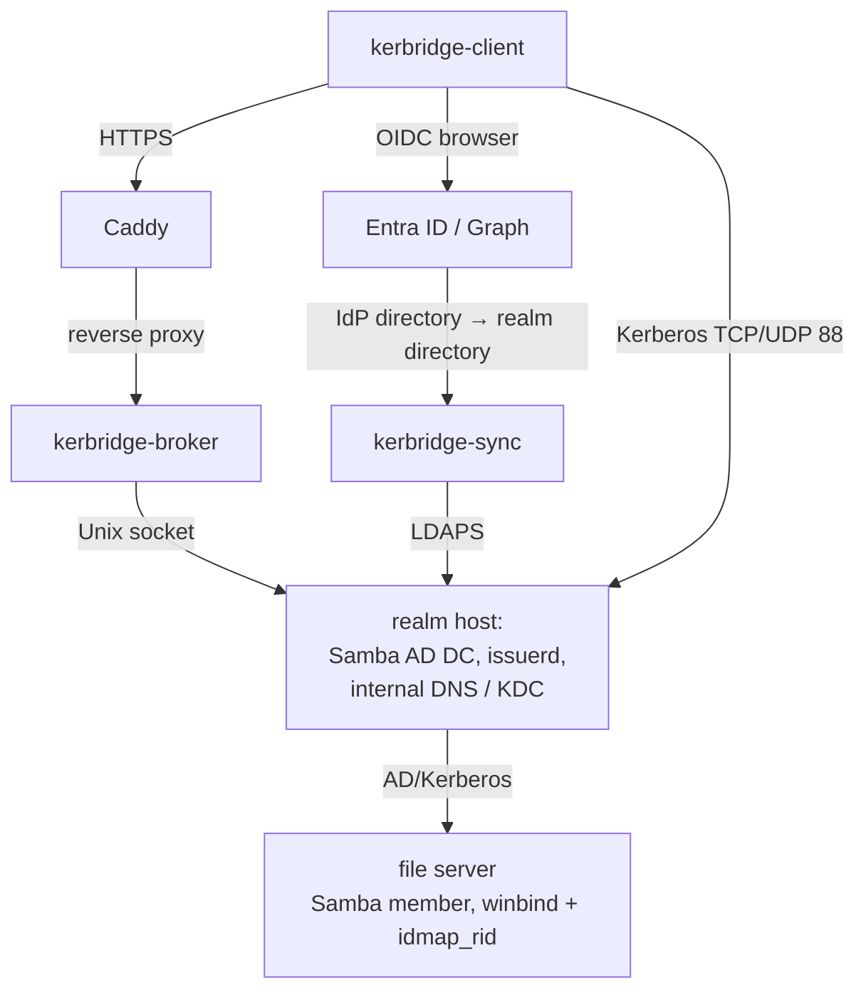

# KerBridge design

The design of the KerBridge server, authoritative for architecture.
Research-validated — each spike's evidence is reconciled into it, and each
measured claim cites its research spike. The workstation software has its own —
[`client/DESIGN.md`](client/DESIGN.md).

Everything that this document describes is built and running, unless the text
says otherwise.

This page holds the goal, the assumptions, the architecture and the security
boundaries. The topic pages under [`docs/design/`](docs/design/) hold the rest.

## Design topics

| Page | What it answers |
|---|---|
| [Components](docs/design/components.md) | What each container is, and what it is denied |
| [Identity and directories](docs/design/identity-and-directory.md) | What a cloud identity is, how a token becomes one, and who owns which object in the realm directory |
| [Tickets](docs/design/tickets.md) | How one sign-in becomes a TGT, who holds KDC authority, what bounds a ticket, and how a machine gets one without a browser |
| [API and network](docs/design/api-and-network.md) | The wire contract, and the ports, resolvers and firewall zones that carry it |
| [Operations](docs/design/operations.md) | What configures a deployment, what must survive it, what it tells an operator, and what the tests cover |

## Name

**KerBridge** — the name states the boundary that the product provides, which is
cloud identity into a local Kerberos realm. It does not tie the name to Entra,
Samba, SMB or one identity provider.

| Component | Executable or service |
|---|---|
| Public ticket API | `kerbridge-broker` |
| Cloud IdP synchronization | `kerbridge-sync` |
| Local privileged ticket issuer | `issuerd` |
| Operator CLI | `kbmanage` (crate `kerbridge-manage`) |
| Compose project | `kerbridge` |

## Goal

- Identities that a cloud IdP manages authenticate to services in a local Samba
  AD Kerberos realm. Entra ID is supported first.
- Windows helper: browser OIDC login, then an exchange of that proof for a
  renewable TGT, then injection into the current Windows logon session.
- Joined Samba file servers then use normal Kerberos, winbind, SIDs, nested
  groups and ACLs.
- The cloud IdP stays authoritative for the synchronized users and groups.
- Samba AD is authoritative for the local realm representation. It can also hold
  local authorization objects (resource groups) that do not exist in Entra.

## Non-goals

KerBridge does not:

- Give multi-DC replication or application-level HA.
- Operate the file server, or need it on the KerBridge VM.
- Support brownfield UID/GID migration. Joined file servers use `idmap_rid`, and
  operators with existing numeric identity requirements must design their own
  migration.
- Schedule backups, retain them or send them off-site. It can collect its own
  non-regenerable state into one tarball
  (`deploy/scripts/compose/backup.sh`) and put it back (`restore.sh`). When that
  runs, where the tarball is kept and how long it is held stay the operator's
  concern, together with whatever protects the VM itself — Proxmox Backup Server,
  for example.
- Synchronize local Samba objects back to Entra.
- Make the Windows helper aware of Samba-specific or Entra-specific server
  details.

## Deployment assumptions

- One dedicated Linux VM runs the Docker Compose stack.
- VM availability, restart and migration are the operator's concern.
- The stack owns the host's DNS, LDAP, Kerberos, SMB, RPC, HTTP and HTTPS ports.
  The VM must run no conflicting listener. The shipped Compose file publishes
  those ports from a bridge network, and host networking is the production shape
  — see
  [Host networking and DNS](docs/design/api-and-network.md#host-networking-and-dns).
- The VM has a stable LAN address and stable DNS names.
- The operator owns a real DNS domain. Documented example: realm `EXAMPLE.SITE`,
  DNS domain `example.site`, DC `kerbridge.example.site`. That is also the
  broker's name, because they share a host. Never `.local`.
- The realm must be the uppercased DNS domain of the services that it protects.
  It must **not** be a dedicated AD subdomain. Keep workstations on the site
  resolver, and point only the realm container and the file servers at Samba.
- Samba internal DNS is authoritative for the AD DNS domain.
- Clients and file servers resolve the AD zone through the Samba DC, directly or
  by delegation from the organization's resolvers.
- The operator applies a host firewall or an upstream firewall. Samba DC ports
  must never be exposed indiscriminately to the Internet.
- Pinned realm baseline: `debian:trixie-slim` by digest, Samba and MIT krb5 from
  that image's Debian packages, domain functional level 2008 R2, and Samba
  internal DNS (research spike `samba-tgt-issuance`). The base image is pinned,
  and the Samba and krb5 package versions are not. Thus a rebuild after a Debian
  point release moves them. Functional level 2008 R2 is the Samba maximum, and
  not a choice.

Why the realm inverts the usual AD advice

- An unjoined or Entra-joined client has no domain of its own to fall back to,
  when a host's suffix maps to no known realm. Thus it must select the realm from
  the hostname alone.
- If the suffix matches, this is automatic. If it does not match, each client
  needs a boot-cached `ksetup /addhosttorealmmap`, per service.
- Cost: Samba DNS becomes an authoritative partial view of an existing zone.

## System architecture

The file server is a separate system. KerBridge gives the normal Samba AD DC
services that these tasks need:

- member join
- DNS
- LDAP
- Kerberos
- secure-channel operation
- administration

## Security boundaries

| Component | Sensitive authority |
|---|---|
| Caddy | Public TLS private key and DNS update credential |
| Broker | Ability to validate users and request TGTs; read-only realm directory access |
| Sync | Cloud IdP read authority and delegated writes to IdP-managed Samba OUs |
| Realm and `issuerd` | Complete Samba domain and KDC authority |

Additional rules:

- Only Caddy accepts public HTTPS traffic.
- The broker accepts traffic on host loopback only.
- The issuer has no TCP listener.
- The broker never sees a user's long-term Kerberos account key, only TGT and its session key.
- The sync identity cannot modify the local resource OUs.
- The broker LDAP identity cannot write realm directory data.
- The `svc-kerbridge-manage` credential is impersonation-grade, and not a
  low-privilege management tool. Its per-attribute `extensionName` write in the
  IdP parent OU was granted for the name pin, and it can also hand-write a
  `kbkey1|` device grant. That lets the holder get tickets as any member of the
  device-grant group. The same two gates bound it as a real grant
  (`device_grant_days` in `configs/main.toml` non-zero, and the target already in
  the group). The risk pre-exists, and delegated grants do not widen it. Protect
  the credential accordingly.
- Containers run with `no-new-privileges`, read-only root filesystems, the
  default seccomp profile, `cap_drop: ALL` and explicit writable mounts. Measured
  minimum capability adds (research spike `container-runtime-boundaries`):
  - broker and sync — none. This was measured on scratch images. The Debian base
    that was taken for refreshable CA roots (see
    [`kerbridge-broker`](docs/design/components.md#kerbridge-broker)) adds no
    capability, because the binary is still the only thing that runs.
  - realm — {NET_BIND_SERVICE, SETUID, SETGID, CHOWN, SYS_ADMIN}. SYS_ADMIN is
    necessary for provisioning and for NTACL writes such as `sysvolreset` only.
    The steady-state issuer flow runs under {NET_BIND_SERVICE, SETUID, SETGID}.
  - Caddy — NET_BIND_SERVICE. Its file capability breaks under `cap_drop: ALL`
    with `no-new-privileges`.
- Images and the Samba version are pinned. They are not floating latest tags. The
  production broker, sync and Caddy binaries are built for the deployment
  architecture. The spike binaries were arm64, and deployment targets
  x86_64-musl.
- The host firewall is part of the required deployment, though Compose does not
  manage it.
