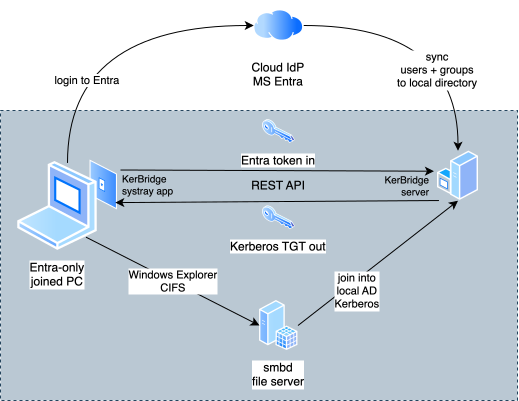
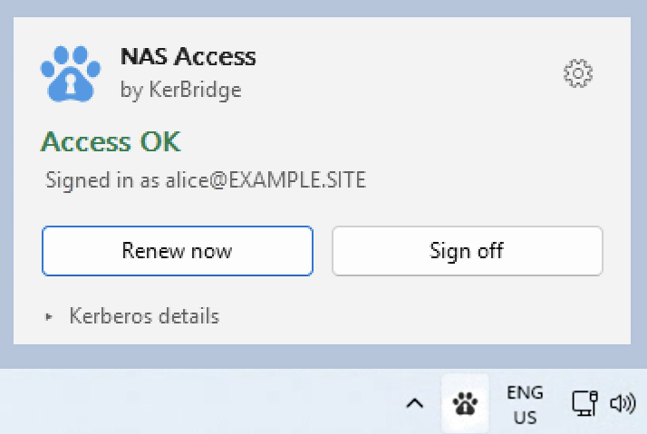
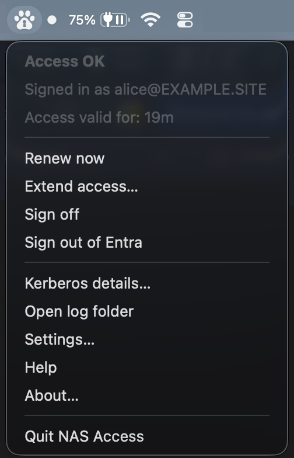
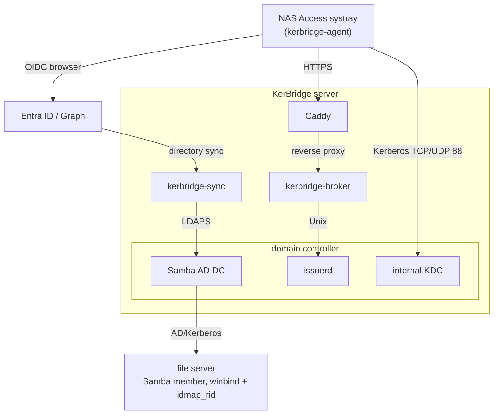

# KerBridge – passwordless Samba for Entra ID users

Self-hosted. Works with Samba and with other Kerberos-authenticated services. Doesn't use NTLM.<br>
Experimental.

## What?

You get passwordless access to a local file server with your [cloud identity](GLOSSARY.md#cloud-identity).

You manage the users in a **[cloud IdP](GLOSSARY.md#cloud-idp)** (MS Entra ID). They authenticate, without
password, to your **on-prem Kerberos services** — a Samba file server, an
SPNEGO HTTP app, and so on. A local Samba AD DC syncs the users **from** cloud:
the sync process is read-only and one-way. Your IdP directory is not modified.

### [Sign-in](GLOSSARY.md#sign-in)

On an Entra-joined workstation, an [agent](GLOSSARY.md#agent) (systray app) uses the user's Entra session, without
prompts. On non-joined workstations, it opens the browser for an OIDC sign-in.

[**Device grants**](docs/setup/device-grants.md) are optional and off by default: with a TPM-held key, a machine can
continue to get Kerberos [tickets](GLOSSARY.md#ticket) with no sign-in — for example, an unattended build server.

## How?



### On the KerBridge server:

- A **[sync](GLOSSARY.md#sync) daemon** mirrors the selected Entra users into a **Samba AD
  server**. Workstations **do not join** this AD — only your file server(s)
  join it.
- A **[broker](GLOSSARY.md#broker) daemon** exchanges an
  [identity proof](GLOSSARY.md#identity-proof) for a real, KDC-signed Kerberos
  [TGT](GLOSSARY.md#tgt).

### On workstation (Windows / Mac):

- An **[agent](GLOSSARY.md#agent)** (KerBridge NAS Access) talks REST over HTTPS
  with the [broker](GLOSSARY.md#broker). It:
  - opens OIDC login screen in browser when necessary, and
  - installs received Kerberos [tickets](GLOSSARY.md#ticket) into the logon session.
- **Windows Explorer** / **Finder** (and other Kerberos clients) then work
  unmodified. They authenticate to your file server using Kerberos, with no password.

<p>&nbsp;</p>

### On Entra:

You register these [Entra apps](GLOSSARY.md#entra-app):

- `kerbridge-broker`: supplies authentication for the KerBridge [broker](GLOSSARY.md#broker) server component
- `kerbridge-client`: supplies authentication for the systray [agent](GLOSSARY.md#agent) on workstation
- `kerbridge-sync`: supplies read-only access to the user and group [sync](GLOSSARY.md#sync) server component

Only `kerbridge-sync` holds an app credential.


<details>
<summary>All components, in one diagram</summary>



</details>

Sequence diagram: [**Authentication and ticket flow**](docs/design/tickets.md#authentication-and-ticket-flow)


## Why?

The conventional method to combine Entra with on-prem Kerberos SSO is to operate
an Active Directory DC as the identity authority, and to sync it *up* to the cloud
(Entra Connect / AD Connect). Then the on-prem DC is the source of truth, and
the cloud is a downstream mirror. For an organization that already manages its
users in the cloud, this is backwards. It also has costs:

- You operate a full AD DC — licensing, patches, replication, DNS/SYSVOL/GPO,
  hardening — only so that a file server can know who you are.
- You operate a fragile, mostly one-directional directory sync: schema, sync
  cycles, immutableID anchors, conflicts, writeback limits.
- Your cloud IdP then depends on on-prem infrastructure.

KerBridge inverts this. The cloud IdP stays authoritative. The on-prem
services use those identities on demand:

- The [realm](GLOSSARY.md#realm) is a **Samba AD DC used as a downstream
  consumer** of [cloud identity](GLOSSARY.md#cloud-identity). Users and groups
  sync Entra → Samba, never the reverse, and Entra never depends on it. This gives
  you standard Kerberos, winbind, [SIDs](GLOSSARY.md#sid), nested
  groups, and file ACLs on joined file servers. Thus stock clients (Windows
  Explorer) need no changes.
- Windows **[workstations](GLOSSARY.md#workstation) stay unjoined** or Entra-only-joined, **never on-prem
  AD joined**.

## Setup

If you can administer an Entra [tenant](GLOSSARY.md#tenant), Linux servers, and a local DNS, read
[`SETUP.md`](SETUP.md).

Read [`SECURITY.md`](SECURITY.md) before you deploy. It states what can go
wrong, what limits each risk, and what the worst case is.

## Repository

Some highlights from the repository:

| Path | What |
|---|---|
| [`SETUP.md`](SETUP.md) | **Deploy it** — Entra, DNS, the server, a file server, the clients |
| [`DESIGN.md`](DESIGN.md) | The design, authoritative for architecture |
| [`SECURITY.md`](SECURITY.md) | **Read before you deploy** — the risks, what limits each one, and the worst case |
| [`STRUCTURE.md`](STRUCTURE.md) | More details on what lives where, and why |
| [`crates/`](crates/) | Server components |
| [`deploy/`](deploy/) | Docker Compose project that runs them |
| [`client/`](client/) | Workstation clients: the core library, its CLI, and agent crates per platform |

<details><summary>Run the unit and integration tests</summary>

```sh
make test         # tests, clippy, shellcheck, doc links -- seconds, no Docker
make test-win     # the Windows client: cross-build + clippy
make test-build   # every shipping artifact still builds
make test-stack   # a realm from nothing -> a ticket -> a file read over SMB
make test-all
```

`make test-stack` is the interesting one. It provisions a Samba AD
[realm](GLOSSARY.md#realm) into an empty Docker volume and bootstraps the
[directory (realm)](GLOSSARY.md#directory-realm). It issues an OIDC token against a throwaway
key, and exchanges the token at the [broker](GLOSSARY.md#broker) for a real
KDC-signed [TGT](GLOSSARY.md#tgt). With that [ticket](GLOSSARY.md#ticket), it
reads a file from the [file server's](GLOSSARY.md#file-server)
Kerberos-only share — the full passwordless roundtrip. It runs in a disposable
copy of the tree, with its own compose project and ports. Thus it is safe to
run adjacent to a live deployment, and it removes everything that it created.

No automated test here reaches: the live Entra tenant, the ACME TLS
strategies, and what the Windows client does with a ticket after it holds one.
</details>

## Status and disclaimers

KerBridge works for me. The UX is fairly polished, and most of the design uses
well-known standards. But the solution is experimental and non-standard. A
seasoned sysadmin/programmer developed it, but with heavy [LLM assistance](SECURITY.md#software-design-and-llm-written-code) in
all phases from research to hardening. There are no warranties or guarantees of any
kind. This is Open Source Software: use it at your own risk, do security audits, and post
reports and fixes if you find that something is broken.
[`SECURITY.md`](SECURITY.md) lists the known risks and the gaps in the tests.

## License

[**GPL-3.0-or-later**](LICENSE), with one exception:
[`kerbridge-core`](crates/kerbridge-core/) is `MIT OR Apache-2.0`. This makes
it easier for alternative implementations of the other modules to
interoperate.

The Docker images carry Debian's Samba binaries (GPL-3.0) and MIT Kerberos
binaries (MIT license). Nothing here links them: `issuerd` drives `samba-tool`
as a subprocess. When you redistribute the images, you also pass on Samba's
source offer. `apt-get source` against the base image of
[`deploy/realm/Dockerfile`](deploy/realm/Dockerfile) reproduces that source.
