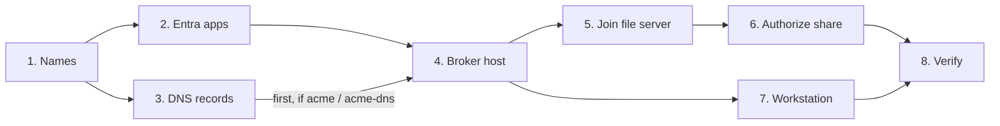
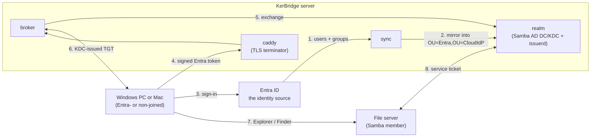
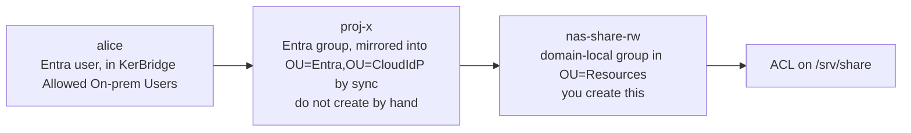

# Deploying KerBridge

> **TIP**: Consult [GLOSSARY.md](GLOSSARY.md) if you don't understand some terminology.

| Step | What | Where | Details |
|---|---|---|---|
| [1](#1-decide-the-names) | Decide the names | on paper | [names-and-decisions.md](docs/setup/names-and-decisions.md) |
| [2](#2-register-three-applications-in-entra) | Register three applications in Entra | Entra admin center | [entra.md](docs/setup/entra.md) |
| [3](#3-publish-the-dns-records) | Publish the DNS records | your DNS zone | [dns-and-firewall.md](docs/setup/dns-and-firewall.md) |
| [4](#4-stand-up-the-broker-host) | Stand up the broker host | the Linux host | [broker-host.md](docs/setup/broker-host.md) |
| [5](#5-join-your-file-server) | Join your file server | the file server | [file-server.md](docs/setup/file-server.md) |
| [6](#6-authorize-cloud-identities-on-smb-share) | Authorize cloud identities on a share | DC + file server | [Authorize a cloud identity (file-server.md)](docs/setup/file-server.md#6-authorize-a-cloud-identity) |
| [7](#7-set-up-a-workstation) | Set up a workstation | the client | [windows-client.md](docs/setup/windows-client.md) · [macos-client.md](docs/setup/macos-client.md) |
| [8](#8-verify-end-to-end) | Verify end to end | the client | [troubleshooting.md](docs/setup/troubleshooting.md) |
| [9](#9-uninstall) | Uninstall — optional; the steps above, in reverse | everywhere | [`deploy/README.md`](deploy/README.md) |



For the current limits and known problems, see [known rough edges](docs/setup/rough-edges.md).

For how the config files work, and how to carry them to a new version, see
[config-management.md](docs/setup/config-management.md).

---

## What you are building

You install the KerBridge server on one Linux host (`kerbridge.example.site` in
the examples), either as a [Docker Compose
deployment](GLOSSARY.md#docker-compose-deployment) or as a [Debian
deployment](GLOSSARY.md#debian-deployment) of `.deb` packages under systemd.
Either way it copies users from Entra, and gives Kerberos tickets to Windows and
macOS workstations through the NAS Access agent. You choose in step 4; nothing
before it differs.




Notes:

- Entra is your identity source. The Samba DC (domain controller) is **not**.
  - The `sync` container copies the Entra users and groups that you select
    into the directory `OU=Entra,OU=CloudIdP,<base DN>`. Only sync creates objects
    there — do not add any by hand.
- The `broker` container accepts connections from the NAS Access agent. The
  connections come through HTTPS, which `caddy` terminates. The broker exchanges
  a signed Entra token for a real Kerberos TGT that the KDC (`realm`) issues.
  - The agent puts that ticket into the user's own login session. The standard
    SMB client of the OS — Explorer on Windows, Finder on macOS — does the
    remaining work.
  - Your file server sees a standard Kerberos client.

> **CAUTION: Do not join your workstations to this domain.** Keep them unjoined,
> or Entra-joined. The domain issues tickets. It does not own machines.

> **CAUTION: Ensure NTP is enabled on all machines before all other steps** — the broker
> host, the file server, and the workstations. Kerberos
> rejects a clock difference of more than **300 seconds**. On the broker host,
> NTP is mandatory: Samba supplies no NTP of its own, and a DC clock that
> drifts breaks every login at the same time. A container or a virtual machine
> usually takes its time from the machine below it. There `timedatectl` shows
> `NTP service: inactive` with `System clock synchronized: yes`, and that is
> correct. Run NTP on the machine that supplies the clock.

<details>
<summary>What you need — make sure that you have these before step 1</summary>

- **An Entra ID tenant** in which you can register applications and give admin
  consent. You must be a Global Administrator, or an Application Administrator
  plus a Privileged Role Administrator.
- **A DNS zone that you control.** You must be able to add records to the
  resolver that your LAN clients use. Changes to `hosts` files are not
  sufficient — Kerberos service principal names come from DNS.
- **A Linux host** for the broker stack, with **root on it** — rootless Docker
  is not tested and not supported, and the TLS key you place by hand has to be
  root's (step 4 tells you why):
  - Docker Compose v2.24+, Docker Buildx, GNU make, bash, curl, git
  - A filesystem with extended attributes that operate correctly
    (ext4/xfs/btrfs/…)
  - **Debian 13 (*trixie*) or Ubuntu 24.04 (*noble*), or newer, for the
    [Debian deployment](GLOSSARY.md#debian-deployment)** — that host is the
    domain controller, and an older Samba cannot lay down the schema KerBridge
    stores its identities in. `kerbridge-issuerd` refuses to install below it.
    The [Docker Compose deployment](GLOSSARY.md#docker-compose-deployment)
    brings its own Samba in a container, so there the host distribution is
    yours to choose.
  - We did not measure the resource requirements. The stack is a few small
    containers and a Samba AD DC. A VM with 2 vCPU and 4 GB was sufficient.
- **Outbound internet access** from that host to
  `login.microsoftonline.com:443`, `graph.microsoft.com:443`, and to your
  ACME/DNS provider if you use one.
- **A file server** with a currently maintained Samba, on which you have root —
  see the [note on NAS appliances](docs/setup/file-server.md).
- **A workstation for tests**: Windows 10 / 11, or a Mac with macOS 13 or
  later.

</details>

<details>
<summary>List of Docker Compose containers <em>(Docker Compose deployment)</em></summary>

All containers are in [`deploy/compose.yaml`](deploy/compose.yaml). `make up`
builds them from this repository. Every base image is pinned by digest.

| Service | What it does | Published |
|---|---|---|
| `realm` | The domain: Samba AD DC, KDC, and Samba DNS. | 88 tcp+udp (KDC, all interfaces), 389 + 445 (the ports through which a member does a services join), 636 LDAPS and 53 DNS (not exposed by default) |
| `issuer` | The custom `issuerd` — the only component that makes TGTs. It runs from the `realm` image and shares that container's directory volumes and network namespace, because `issuerd` needs local access to the AD databases and is a KDC administrator. A Debian deployment runs the same two programs as two systemd units. | none |
| `broker` | Makes sure that the Entra token is valid, finds the identity under `OU=Entra,OU=CloudIdP,<base DN>` through LDAPS, and asks `issuerd` for the ticket through a unix socket. It holds no KDC authority. It runs unprivileged with a read-only rootfs, and it executes nothing. | 443, on behalf of `caddy` |
| `caddy` | The TLS terminator in front of the broker; the only component that clients connect to. It shares the broker's network namespace. Thus their loopback is the same one that host networking gives them in production. | — (uses the broker's) |
| `sync` | Reads the users and groups of every configured source with MS Graph over public TLS, one source after another over its own LDAP connection. Writes them to the `realm` AD directory (`OU=Entra,OU=CloudIdP,<base DN>` for the Entra source) over LDAPS, as the AD user `svc-kerbridge-sync-entra`. A source stays idle until its `secrets/idp/<name>/credential` has content. | none |
| `nas1` | **Optional.** A fixture and demonstration, not a product. A joined Samba member, so that the full path operates on one machine. It lives in [`compose.nas.yaml`](deploy/compose.nas.yaml) and starts only with `make up NAS=1`. When it starts, it takes the DC's port `:445` and uses it for the smbd file share. Then no other Kerberos service can join the AD. Recommendation: join your own file server on a different IP address — step 5. | 445 |

`realm` and `broker` run with `cap_drop: ALL` and `no-new-privileges`. `realm`
gets back only the capabilities that measurements showed necessary. The
permanent state is in these Docker volumes:

- `samba` (domain SID, KDC keys, directory, SYSVOL)
- `etc-samba`
- `caddy-data`

The [backup script](docs/setup/broker-host.md#backup-before-you-change-anything)
can make a backup of these volumes. All other data is tmpfs, or the stack can
make it again.

**→ [`deploy/README.md`](deploy/README.md)** — compose internal structure: the
development and production shapes, certificates, secrets. This guide does not
need it. Read it when you leave the path that this guide describes, or when you
debug below it.

</details>

---

## 1. Decide the names

Go to **→ [names-and-decisions.md](docs/setup/names-and-decisions.md)**

It helps you make these decisions:

| Decision | Example | Notes |
|---|---|---|
| DNS domain | `example.site` | The zone that contains the realm |
| Kerberos realm | `EXAMPLE.SITE` | **The DNS domain, in uppercase letters** |
| NetBIOS/short name | `EXAMPLE` | The name that Explorer shows, as in `EXAMPLE\alice` |
| TLS strategy | `acme-dns` | How connections from workstations to the broker get an HTTPS certificate. |

The defaults that follow are correct as they are. Change them only if it is
really necessary:

| Decision               | Example                                            | Notes                                                        |
| ---------------------- | -------------------------------------------------- | ------------------------------------------------------------ |
| DC hostname            | `kerbridge`                                        | Also the broker's name. One host, one A record.              |
| Entra realm group name | `KerBridge Allowed On-prem Users`                  | The Entra group that admits users to the Kerberos realm.     |
| Idmap ranges           | 100000-199999 (tdb), and<br/>1000000-1999999 (rid) | The smbd user ID mappings. You cannot change them later — each uid on disk comes from them. |

---

## 2. Register three applications in Entra

You make these registrations and one security group, all in your one tenant.
**The apps are read-only in Entra.** No app is an administrator:

1. **Broker API app** — makes sure that tokens addressed to it are valid. It
   holds no credential.
2. **Public client app** — the app with which the Windows tray signs users in
   over OIDC. A native app with no secret. It operates only as the signed-in
   user.
3. **Sync app** — the only app with a credential (on the Linux host). Its full
   grant is `User.Read.All` + `Group.Read.All`: list users, groups, and
   memberships. It can change nothing.

These steps do not change the sign-in policy, conditional access, MFA, or
password state. Entra alone decides *whether* a user can sign in. KerBridge
only learns *who* signed in, and the groups of that user. Authority flows in
one direction: Entra → KerBridge.

Select one path. The two paths give the same result:

| | |
| --- | --- |
| **[Terraform](docs/setup/entra-terraform.md)** — recommended | `terraform apply && ./print-provider-config.sh` creates all of it, and prints a `[provider_config]` block to paste into `deploy/configs/idp_entra.toml`. It needs `az login` to your tenant. |
| **[By hand](docs/setup/entra-manual.md)** | The steps in the portal, plus an `az` script that prints the same values. Use this path if the Azure CLI cannot connect to your tenant, or if you want to see each step. |

On both paths, you must also put the **sync credential** in place as a file
secret. No path does this for you —
[The sync credential (entra-manual.md)](docs/setup/entra-manual.md#the-sync-credential).

Go to **→ [entra.md](docs/setup/entra.md)** — the `[provider_config]` values
that the apps supply, and **the Entra defaults that are wrong for
KerBridge**.
These defaults break a deployment with no error message. Read it if you used
the manual path, or if a sign-in is rejected later.

---

## 3. Publish the DNS records

Publish these records in the DNS zone that your **workstations** use.
Do not publish them in Samba's internal DNS. The DC operates its own DNS for
its own use. Its records can contain addresses to which your clients have no
route — this split is intentional.

```
kerbridge.example.site            A     <broker host LAN IP>

_kerbridge._tcp.example.site      SRV   0 100 443 kerbridge.example.site.

_kerberos._udp.example.site       SRV   0 100 88  kerbridge.example.site.
_kerberos._tcp.example.site       SRV   0 100 88  kerbridge.example.site.

_ldap._tcp.example.site           SRV   0 100 389 kerbridge.example.site.
_ldap._tcp.dc._msdcs.example.site SRV   0 100 389 kerbridge.example.site.
```

- Do you use `acme` or `acme-dns`? Then publish the records **before** step 4.
  Without them, the certificate cannot be issued, and `make up` fails while it
  waits for the certificate.
- `_kerbridge._tcp` is KerBridge's own record. Through it, a Windows agent
  with no configuration finds the broker. Without it, users must type the
  address during the installation.
- Your file server needs an A record but **no SRV record**. The list above
  does not include the file server, and this is intentional: it is your
  machine, with your own name, and it probably has an A record already.

> **CAUTION: Publish no AAAA records for these names.** Samba binds only to
> IPv4. A dual-stack answer causes the Windows client to stop and wait — a
> measured result. The symptom is a hang, not an error.

Go to **→ [dns-and-firewall.md](docs/setup/dns-and-firewall.md)** — records
that you can copy for Route 53, dnsmasq, BIND, and Windows DNS; how to give
the file server the realm zone and keep DNSSEC validation; and the inbound
firewall table (with the reason that port 88 must never be open to the
internet).

---

## 4. Stand up the broker host

Two ways to run the server, and this is the one step that differs. Neither is
the default — pick the one that fits how you run everything else.

- **[Docker Compose deployment](GLOSSARY.md#docker-compose-deployment)** —
  containers built from this repository, with their own Caddy and
  Samba AD DC.
- **[Debian deployment](GLOSSARY.md#debian-deployment)** — `.deb` packages,
  daemons under systemd, on the distro's own `samba-ad-dc`.

Both need the same two decisions written down: the realm identity, which is
baked into the database on first provision and **cannot be changed afterwards**,
and the `[provider_config]` block from step 2.

> **CAUTION: Do not put the realm in an unprivileged container.** When Samba
> provisions the realm, it sets the group of its sysvol directory to gid
> 3000000. An unprivileged container has only 65536 ids, so it cannot use that
> gid. The provision then fails. Samba reports the failure as a panic, and the
> message does not give the cause.
>
> Before you start, run `cat /proc/self/gid_map`. If no line covers gid 3000000,
> use a privileged container or a virtual machine instead. No configuration
> setting changes this. For more data, refer to
> [`debian-deployment.md`](docs/setup/debian-deployment.md#provision-the-realm).

### Docker Compose

```sh
git clone <this repo> kerbridge
cd kerbridge/deploy
cp .env.example .env
for f in configs/*.toml.example; do cp "$f" "${f%.example}"; done
$EDITOR .env configs/*.toml   # both are heavily commented; read as you go
make up
```

Two files to edit, because they answer different questions. `.env` is the
deployment shape — what Compose interpolates and what the scripts source as
shell. `configs/*.toml` is the config set, which is what the services themselves
read. `make up` refuses to start until the two agree where they overlap.

1. In `.env`, set `AD_REALM`, `AD_DNS_DOMAIN`, `AD_NETBIOS_DOMAIN`,
   `AD_DC_HOSTNAME` and `BROKER_FQDN`.
2. In `configs/realm.toml`, set `realm` to the same value as `AD_REALM`, and
   `ldap_url` to `ldaps://<AD_DC_HOSTNAME>.<AD_DNS_DOMAIN>:636`. Every DN is
   derived from the realm unless you state it.
3. In `configs/idp_entra.toml`, paste the `[provider_config]` block from step 2.
4. Set `TLS_STRATEGY` in `.env`. `external` also needs
   `deploy/secrets/tls/broker.{crt,key}` in place first — without them,
   `make up` refuses to provision a domain.

A good result looks like this:

```
Waiting for the stack to settle (up to 300s; READY_TIMEOUT overrides).
  realm     ok
  broker    ok
  endpoint  ok      https://kerbridge.example.site:443/config answered 200
  sync      idle
Stack is up.
```

Run the report again at any time with `make ready`. Every target is idempotent —
run one again after a failure and it continues where it stopped.

> **CAUTION: rootless Docker is not tested and not supported.** `make up` itself
> needs no privilege of yours — the files that must be root's are written by root
> inside containers — but the TLS key you place by hand does.
> [`compose-deployment.md`](docs/setup/compose-deployment.md) has the reasons.

### Debian packages

```sh
sudo apt install --no-install-recommends ./kerbridge*.deb   # answers the install questions, writes /etc/kerbridge
sudo kbsetup realm                                          # provisions the domain, its CA and certificate
sudo kbsetup directory                                      # the OUs, the service accounts, the delegation
sudo $EDITOR /etc/kerbridge/*.toml                          # only if you left a question unanswered
```

The first line installs files you already have. To take them from the signed apt
repository instead, and get `apt upgrade` with them, add the source first —
[`debian-deployment.md`](docs/setup/debian-deployment.md#from-the-apt-repository).

The install-time questions are the realm, the LDAPS URL, and the
Entra values from step 2; answer them and the config set is written for you. The
packages install files and start daemons — they never provision a domain, which
is what `kbsetup realm` is for, and never edit a configuration file you already
have.

You supply the TLS terminator. The broker binds loopback only and refuses any
other address in code, so it runs on **this same host**; Caddy and nginx
examples ship in `/usr/share/doc/kerbridge-broker/examples/`.

A good result is `kbmanage doctor` with nothing failed:

```sh
kbmanage doctor
kbmanage doctor --endpoint https://kerbridge.example.site
```

It walks the chain and names the first broken link — config set, name
resolution, the port, the realm CA, the bind — and exits non-zero if any of them
failed. `--endpoint` adds the public URL a workstation will enroll against.

### Either way

`sync idle` is the normal state: sync runs from the start and stays idle until
its credential exists. Writing that credential is
[Enable synchronization (`broker-host.md`)](docs/setup/broker-host.md#enable-synchronization),
and it is worth doing now.

> **CAUTION: Do not run `make seed`.** It is the fixture for the development
> bench — a false user, groups, and a share ACL. In production, these come
> from Entra through sync.

For more detail: **→ [compose-deployment.md](docs/setup/compose-deployment.md)**
or **→ [debian-deployment.md](docs/setup/debian-deployment.md)** for the method
you chose, and **→ [broker-host.md](docs/setup/broker-host.md)** for what is
true either way — enabling sync, operator notification, and backup.

---

## 5. Join your file server

Install the Samba file server (smbd) on a Linux machine on which you have
root. Then join that machine to KerBridge's AD.

Go to **→ [file-server.md](docs/setup/file-server.md)** — the full procedure,
with each configuration file in full, and the reasons for each. Read it, not
only the summary below. It also tells you why the included `nas1` container is
a fixture and not a product, and what we know about consumer NAS appliances
(Synology, QNAP, TrueNAS).

In summary:

1. **`/etc/krb5.conf`** — `default_realm`, `dns_lookup_kdc = true`, no
   hardcoded KDC.
2. **`/etc/samba/smb.conf`** — `security = ADS`, your realm and workgroup,
   `kerberos method = secrets and keytab`, and the idmap ranges.
3. **`/etc/nsswitch.conf`** — add `winbind` at the **end** of `passwd:` and
   `group:`, by hand.
4. **NTP** client, to synchronize the time.
5. **`net ads join -U Administrator`**
   The password is in `deploy/secrets/generated/realm_admin_password`. You
   need it one time. Make sure that the join is good, with `net ads testjoin`
   and `wbinfo -t`.

> **CAUTION: You cannot change the idmap range later.** Keep it byte-identical
> on every file server. Do not let it overlap 0–65533. Do not change it
> after the deployment — the uid that owns a file is computed from it.

> **CAUTION: Never do step 3 above on the DC host itself before §4
> (*Stand up the broker host*) has provisioned the realm there.** Winbind has
> no domain to answer with until the realm exists, so a lookup against it
> blocks rather than fails — on the DC that can lock every login on the host,
> console included. `kbsetup realm` already refuses to provision while
> `winbind` is in `/etc/nsswitch.conf`, for this reason.

> **CAUTION: Never restart `winbindd` during a DC outage.** It comes up
> permanently degraded, and it does not repair itself.

---

## 6. Authorize cloud identities on SMB share

There are **two independent chains**. Confusion between them is the most
common misconfiguration.

| Chain | Grants | Owned by |
|---|---|---|
| Membership of `KerBridge Allowed On-prem Users` in Entra | A Kerberos ticket. Nothing else. | You, in Entra |
| Entra group → resource group → filesystem ACL | Access to files | You, on the DC and the file server |

A user who is in the admission group, but in no resource group, signs in
correctly and can open nothing. That is the design. An example, with
fictional names:



Do this on the broker host, in the repository, **as the same user that ran
`make up`** — on Linux, that user is root. `make up` wrote this tool's
configuration under that user's `$HOME` — `~/.config/kerbridge/configs`, a link
to the deployment's `deploy/configs/`, which is how the tool finds a deployment
with no argument. A different account has no such link, and reports that the
domain is missing:

```sh
make kbmanage                                  # builds dist/kbmanage, once
dist/kbmanage doctor                           # finds its own config; check this first
dist/kbmanage doctor --endpoint https://kerbridge.example.site   # and the path a client uses
dist/kbmanage group new nas-share-rw                # domain-local, in OU=Resources
dist/kbmanage group member add nas-share-rw proj-x  # proj-x must already be synced
dist/kbmanage doctor --user alice                   # walks the chain, names the break
```

On the file server:

```sh
net cache flush     # clears the negative lookup cached before the group existed
install -d -m 0770 -o root -g root /srv/share
setfacl -m  g:'EXAMPLE\nas-share-rw':rwx \
        -m d:g:'EXAMPLE\nas-share-rw':rwx /srv/share
id 'EXAMPLE\alice'  # must list the domain-local group
```

Then add the share to `smb.conf`, with
`valid users = @"EXAMPLE\nas-share-rw"`. `valid users` is **a second layer of
defense, not the control** — it compares only the name. The filesystem ACL
comes from the SID, and it is the permanent control.

Go to **→ [Authorize a cloud identity (file-server.md)](docs/setup/file-server.md#6-authorize-a-cloud-identity)** —
the reason that the domain-local step is your only revocation control that is
faster than the ticket lifetime; the `samba-tool` equivalents; and **when a
membership change becomes effective** (several layers can each hide a
revocation).

---

## 7. Set up a workstation

Windows and macOS both run the same agent, **NAS Access**, on the same core.
Only this step is different between them. The difference is that a Mac needs
less: no realm registration, no administrator prompt, no restart. Go to
[the Mac](#mac) if that is your client.

> **Note: Private PKI.** If you used `TLS_STRATEGY=external` with your own
> certificates: install your CA root certificate on the workstation OS, and
> set it as trusted. Without it, the agent cannot connect to the broker.

### Windows

Download the agent, or build it yourself on a machine with Docker:

```sh
make installer   # -> dist/kerbridge-nas-access.msi
```

Install it on the workstation. Then start **NAS Access** from the Start menu.

> **Note: The MSI is unsigned.** SmartScreen shows a warning at the first
> installation, and each UAC prompt says "unknown publisher". To sign it is a
> release-time act by the publisher. There is also no ADMX template. See
> [Known rough edges](docs/setup/rough-edges.md).

After the installation:

1. **The first run says *Setup needed*.** If `_kerbridge._tcp` is published,
   the agent finds the broker itself. If not, enter
   `https://kerbridge.example.site` in Settings.
2. **Register the realm with Windows.** The tray offers *Set up now*: it asks
   for elevation, shows the literal commands, and runs them. The commands it runs are
   approximately these:

   ```
   ksetup /addkdc EXAMPLE.SITE
   ksetup /setrealmflags EXAMPLE.SITE tcpsupported
   ```

   If you run these commands manually: `tcpsupported` is **mandatory**. A
   ticket that contains a PAC is larger than the UDP reply limit, and Windows
   does not retry over TCP without this flag. The first time, a restart of the
   computer is necessary.
3. **Set *Start at login*** in Settings. Autostart must be per-user: a ticket
   injected from an elevated or service context goes into the wrong logon
   session, and the SMB redirector does not see it.

The agent then signs in, injects a TGT, and injects again at half of the
remaining ticket lifetime. On an Entra-joined machine, it signs in through the
Windows broker, with no browser and no prompts.

Go to **→ [windows-client.md](docs/setup/windows-client.md)** — the two
executables that the MSI installs, and when to use the CLI; silent and fleet
installations (`AUTOSTART=1`); the two HKLM policy values that preconfigure a
fleet; the sequence in which the broker URL is resolved; and the locations of
the configuration and the logs.

### Mac

Build it on the Mac — an `.app` cannot be cross-compiled, and the OS supplies
every framework that it needs:

```sh
make macos       # -> dist/NAS Access.app
```

Copy it to `/Applications` and open it. Then:

1. **The first run says *Setup needed*.** If `_kerbridge._tcp` is published,
   the agent finds the broker itself. If not, enter
   `https://kerbridge.example.site` in Settings.
2. **Sign in.** The browser opens. Complete the sign-in there.
3. **Set *Start at login*** in Settings — after you move the app to
   `/Applications`, because the registration records the location of the app.

There is no step for the realm. Heimdal finds the realm from the DNS records
that step 3 published. In a test, a Mac with no knowledge of the realm
received a `cifs/` ticket, with no configuration file at all. The product does
not ask for administrator rights on this platform.

> **Note: The bundle has an ad-hoc signature and no notarization.** Thus Login
> Items lists it under "unidentified developer", and a copy that arrives from
> a different machine stays in quarantine until you approve it. See
> [Known rough edges](docs/setup/rough-edges.md).

Go to **→ [macos-client.md](docs/setup/macos-client.md)** — the meanings of
the icon states in the menu bar; the managed preference that
preconfigures a fleet; the locations of the configuration and the logs; and
the parts that are not built yet.

---

## 8. Verify end to end

Use a **non-elevated** command prompt on the workstation. An elevated shell is
a different logon session, with a different ticket cache, and it shows you
nothing:

```
kerbridge.exe --verify \\your-fileserver.example.site\share
```

On a Mac, mount the share first (Finder ▸ Go ▸ Connect to Server,
`smb://your-fileserver.example.site`). Then point the same flag at the mount:

```
kerbridge --verify /Volumes/share
```

This command signs in, injects a ticket, reads a file from the share, and
writes one back. It prints `klist` before and after. In that output, you must
see two entries:

```
#0>  Client: alice @ EXAMPLE.SITE
     Server: krbtgt/EXAMPLE.SITE @ EXAMPLE.SITE
     Ticket Flags 0xe10000 -> renewable initial pre_authent
     Kdc Called:                          <- empty: this was injected, not fetched

#1>  Server: cifs/your-fileserver.example.site @ EXAMPLE.SITE
     Kdc Called: kerbridge.example.site   <- a real TGS-REQ, not an NTLM fallback
```

- Entry #0, with an empty `Kdc Called`, shows that the broker made the ticket.
- Entry #1, with a named KDC, shows that the file server accepted Kerberos and
  did not fall back to NTLM.

Last, open `\\your-fileserver.example.site\share` in Explorer. It must open
with no password prompt.

> **CAUTION: Address shares by hostname, never by IP address.** An IP address
> gives no `cifs/` SPN. The connection then falls back to NTLM, with no error
> message. That looks like success, and it is not what you deployed.

One more task, on the broker host. Some conditions — for example, the Graph
credential expires, or the admission group is deleted — can only be repaired
by a person, and they appear only in a log. Two steps put them in a chat
channel. Write the webhook URL into `deploy/secrets/notify_url`. Then, in the
`[notify]` table of `deploy/configs/main.toml`, remove the `#` from `url_file`
and point it at that file:

```toml
url_file = "/etc/kerbridge.secrets/notify_url"
```

Restart `broker` and `sync`, then test it:

```sh
make test-notification       # from deploy/. Then look in the channel.
```

If you leave `url_file` commented out, those events stay log lines. That is
also a supported deployment — but decide which deployment you operate.
[`broker-host.md`](docs/setup/broker-host.md#operator-notification) has the
options, which include a connection to your own monitoring (for example,
Zabbix) in place of a chat channel. Details here: [operator notifications](deploy/README.md#operator-notification).

**→ [troubleshooting.md](docs/setup/troubleshooting.md)** — read this *before*
you debug. Some `klist` commands destroy a working ticket, and then you look
for a fault that you caused. The page also tells you about the NTLM fallback
after a ticket expires, and it has a symptom-to-cause table for each step.

---

## 9. Uninstall

1. **Windows clients** — in the tray agent, select **Settings → Advanced →
   Unregister *realm* from Windows** (elevated; a restart completes it). Then
   remove the MSI. This removes the realm registration and nothing else. The
   user's cloud account does not change.
2. **File server** — run `net ads leave -U Administrator`. Remove `winbind`
   from `/etc/nsswitch.conf`. Undo the `smb.conf` changes from step 5.
3. **DNS** — remove the records from step 3.
4. **The server itself** — whichever way you brought it up.

   **Docker Compose deployment**, from `deploy/` on the broker host:

   ```sh
   make down                    # stop and remove the containers
   make clean                   # host build output; reports what Docker still holds
   make clean-docker-images     # the built images
   make clean-docker-volumes    # the data. Irreversible.
   ```

   **Debian deployment:**

   ```sh
   sudo apt purge kerbridge kerbridge-issuerd kerbridge-broker \
                  kerbridge-sync kerbridge-manage kerbridge-config
   ```

   Purge takes `/etc/kerbridge/*.toml`, the `*.toml.bak` files `kbconfig
   upgrade` left, the published realm CA, and the Kerberos drop-in with the
   `includedir` line that named it. Every directory it made goes only if it is
   empty, so nothing you put there is removed with it: **the contents of
   `/etc/kerbridge.secrets/` stay**, and so do the audit logs under
   `/var/log/kerbridge/`. The `_kerbridge` group and the two system users stay
   as well — `deluser` is not available to a postrm, and a uid reallocated
   later would inherit whatever files still carry it. Remove them by hand
   if you are certain nothing else does.

> **CAUTION: `make clean-docker-volumes` destroys the domain SID**, and with
> it, the meaning of every filesystem ACL on every member that carries it. A
> new provision gives you a *different* realm with the same name, and the
> existing ACLs on the file server do not resolve against it. If it is
> possible that you want this realm again,
> [make a backup first](docs/setup/broker-host.md#backup-before-you-change-anything).

> **CAUTION: purging the packages does not remove the domain.**
> `/var/lib/samba` belongs to the distro's `samba-ad-dc`, so a Debian
> deployment that has been purged still has a working domain controller, its
> domain SID, and every ACL riding on that SID. `apt purge samba-ad-dc` and
> the state directory are what remove the realm — and
> [make a backup first](docs/setup/broker-host.md#backup-before-you-change-anything)
> applies with just as much force.

---

## After it works

| Interested in | Read |
|---|---|
| The unfinished parts, before you pilot this | [Known rough edges](docs/setup/rough-edges.md) |
| Make a backup — one tarball of all data that cannot be made again | [`broker-host.md`](docs/setup/broker-host.md#backup-before-you-change-anything) |
| Remove the browser sign-in — for an unattended machine (for example, a build machine), or for a user who does not want it | [Device grants](docs/setup/device-grants.md) |
| Directory management (for example, resource groups) — `kbmanage`, and ADUC over RSAT | [`docs/rsat-and-kerbridge-management.md`](docs/rsat-and-kerbridge-management.md) |
| Docker Compose internals, certificates, secrets | [`deploy/README.md`](deploy/README.md) |
| Why any of this has the shape that it has | [`DESIGN.md`](DESIGN.md) |

`docs/research/` indexes the compressed measurements behind all of the above.
You do not need them to deploy KerBridge, and nothing in this guide asks you to
read them. They are there for a person who replicates the work, or who debugs it.
