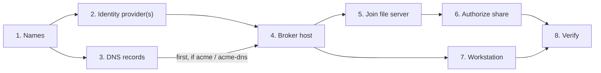
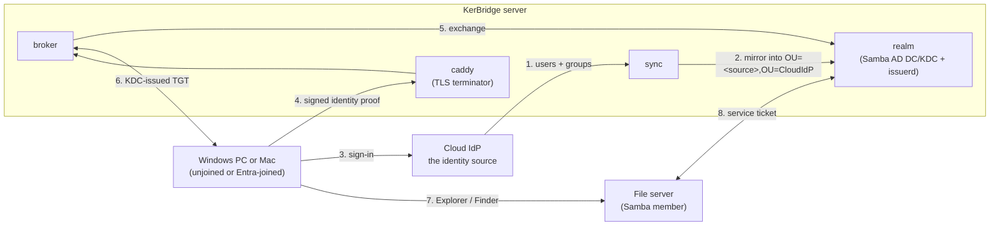

# Deploying KerBridge

> **TIP**: A superscript <sup>?</sup> after a term links to its
> [glossary](GLOSSARY.md) entry. Every other link takes you onward in the
> procedure.

| Step | What | Where | Read this first |
|---|---|---|---|
| [1](#1-decide-the-names) | Decide the names | on paper | [names-and-decisions.md](docs/setup/names-and-decisions.md) |
| [2](#2-set-up-your-cloud-identity-providers) | Set up your cloud identity provider(s) | your IdP's admin UI | Choose yours: [entra.md](docs/setup/entra.md) · [authentik.md](docs/setup/authentik.md) |
| [3](#3-publish-the-dns-records) | Publish the DNS records | your DNS zone | [dns-and-firewall.md](docs/setup/dns-and-firewall.md) |
| [4](#4-stand-up-the-broker-host) | Stand up the broker host | the Linux host | [broker-host.md](docs/setup/broker-host.md) |
| [5](#5-join-your-file-server) | Join your file server | the file server | [file-server.md](docs/setup/file-server.md) |
| [6](#6-authorize-cloud-identities-on-smb-share) | Authorize cloud identities on a share | DC + file server | [file-server.md §6](docs/setup/file-server.md#6-authorize-a-cloud-identity) |
| [7](#7-set-up-a-workstation) | Set up a workstation | the client | [windows-client.md](docs/setup/windows-client.md) · [macos-client.md](docs/setup/macos-client.md) |
| [8](#8-verify-end-to-end) | Verify end to end | the client | [troubleshooting.md](docs/setup/troubleshooting.md) |
| [9](#9-uninstall) | Uninstall — optional | everywhere | [`deploy/README.md`](deploy/README.md) |



Two pages apply throughout:

- [Known rough edges](docs/setup/rough-edges.md) — the limits and the unfinished
  parts. Read this before you pilot KerBridge.
- [config-management.md](docs/setup/config-management.md) — how the
  configuration files work, and how to carry them to a new version.

If you deploy the Windows agent through Microsoft Intune, use
[mdm-intune.md](docs/setup/mdm-intune.md).

---

## What you are building

You install the KerBridge server on one Linux host. The examples call it
`kerbridge.example.site`. The server copies selected users and groups from each
configured cloud IdP, and it gives Kerberos tickets to Windows and macOS
workstations through the NAS Access agent.

There are two ways to run the server. You select one in step 4. No step before
step 4 is different:

- a Docker Compose deployment<sup>[?](GLOSSARY.md#docker-compose-deployment)</sup>
  — containers built from this repository, with their own Caddy and Samba
  AD DC;
- a Debian deployment<sup>[?](GLOSSARY.md#debian-deployment)</sup> — `.deb`
  packages and systemd units, on the distribution's own `samba-ad-dc`.



- Each configured cloud IdP is the identity source. The Samba DC is not. Only
  `sync` creates objects in that source's IdP-specific OU beneath
  `OU=CloudIdP,<base DN>`. Do not add an object there by hand.
- The `broker` accepts HTTPS connections from the agent, and `caddy` terminates
  TLS. The broker exchanges a signed identity proof for a Kerberos TGT that the
  KDC issues.
- The agent puts that ticket into the user's own login session. Explorer and
  Finder then do the remaining work. Your file server sees a standard Kerberos
  client.

For the containers, their capabilities and their volumes, see
[Topology (`deploy/README.md`)](deploy/README.md#topology).

> **CAUTION: Do not join your workstations to this domain.** Keep them
> unjoined. An existing Entra-only join is also supported. The domain issues
> tickets. It does not own machines.

> **CAUTION: Enable NTP on every machine before step 1** — the broker host, the
> file server and the workstations. Kerberos refuses a clock difference of more
> than 300 seconds. On the broker host, NTP is mandatory, because Samba
> supplies none of its own. For the failure that a clock difference causes, see
> [Prerequisites (`file-server.md`)](docs/setup/file-server.md#prerequisites).

<details>
<summary>What you need — get these before step 1</summary>

- **Administrative access to every cloud IdP that you will configure:**
  - **Microsoft Entra ID:** a tenant in which you can register applications and
    grant admin consent. The Entra setup page lists the required roles.
  - **authentik:** an existing HTTPS instance whose certificate the server and
    workstations trust, with permission to create and apply an internal blueprint
    and create its API token.
- **A DNS zone that you control.** You must be able to add records to the
  resolver that your LAN clients use. A `hosts` file is not sufficient, because
  Kerberos service principal names come from DNS.
- **A Linux host** for the server, with root on it:
  - a filesystem with extended attributes that operate correctly
    (ext4/xfs/btrfs/…);
  - for a **Docker Compose deployment**: Docker Compose v2.24+, Docker Buildx,
    GNU make, bash, curl and git;
  - for a **Debian deployment**: Debian 13 (*trixie*) or Ubuntu 24.04
    (*noble*), or newer. For the Samba versions and the reason, see
    [`debian-deployment.md`](docs/setup/debian-deployment.md).
  - We did not measure the resource requirements. A virtual machine with 2 vCPU
    and 4 GB was sufficient.
- **HTTPS reachability to each selected cloud IdP.** The server and workstations
  must reach it. For Entra, the server must reach
  `login.microsoftonline.com:443` and `graph.microsoft.com:443`. For authentik,
  they must reach the configured instance URL. The server must also reach the
  ACME or DNS provider when the selected TLS strategy uses one.
- **A file server** with a currently maintained Samba, on which you have root.
- **A workstation for tests**: Windows 10 or 11, or a Mac with macOS 13 or
  later.

</details>

---

## 1. Decide the names

Go to **→ [names-and-decisions.md](docs/setup/names-and-decisions.md)**. It
gives the cost of each decision, and the decisions that you cannot change
later.

Decide these four realm-wide:

| Decision | Example | Notes |
|---|---|---|
| DNS domain | `example.site` | The zone that contains the realm |
| Kerberos realm | `EXAMPLE.SITE` | **The DNS domain, in upper case** |
| NetBIOS/short name | `EXAMPLE` | The name that Explorer shows, as in `EXAMPLE\alice` |
| TLS strategy | `acme-dns` | How the broker gets its HTTPS certificate |

For each source, decide these before the first sync cycle:

| Decision | Example | Notes |
|---|---|---|
| Source name | `entra` or `authentik` | The frozen storage key for one configured cloud IdP. |
| Group suffix | `-entra`, `-authentik`, or `none` | Separates group login names from those of another source. |

Keep these three defaults. Change one only if it is necessary:

| Decision | Default | Notes |
|---|---|---|
| DC hostname | `kerbridge` | Also the broker's name. One host, one A record. |
| Admission group, per source | `KerBridge Allowed On-prem Users` | The group in that cloud IdP whose members are admitted to the realm. |
| Idmap ranges | 100000-199999 (tdb)<br/>1000000-1999999 (rid) | The file server's user ID mappings. You cannot change them later. |

---

<!-- Keep the fragment shipped before KerBridge supported more than Entra. -->
<a id="2-register-three-applications-in-entra"></a>

## 2. Set up your cloud identity provider(s)

KerBridge asks two things of a cloud identity provider, and nothing more:

1. **It signs a person in to the agent.** The workstation agent authenticates a
   user against the provider over OIDC and receives a signed token. The broker
   validates that token, and that is the only thing that admits a user.
2. **It lets KerBridge read users and groups, one direction only.** Sync reads
   the directory (IdP) on a read-only credential and mirrors the members of one
   admission group into the realm. KerBridge writes nothing back to the
   provider.

Both faces are read-only in the provider, and neither is an administrator. One
group — the admission group — is what admits a user to the realm; nothing
KerBridge does changes *whether* a person may sign in, only *who* is mirrored.

Each provider spells these two faces differently and calls its objects by
different names. Follow the page for the provider, and assign each source the
source name decided in step 1:

| Provider | Read this first |
|---|---|
| **Microsoft Entra ID** — the reference provider | **→ [entra.md](docs/setup/entra.md)** |
| **authentik** — self-hosted; the one you can stand up yourself | **→ [authentik.md](docs/setup/authentik.md)** |

Each page gives the values its provider produces for that source's
`[provider_config]`, and the provider defaults that break a deployment and show
no error message. A realm can carry more than one source: repeat this step per
source.

---

## 3. Publish the DNS records

Publish one A record and five SRV records in the zone that your **workstations**
use. Do not publish them in Samba's internal DNS.

Go to **→ [dns-and-firewall.md](docs/setup/dns-and-firewall.md)** for the
records themselves, for recipes for Route 53, dnsmasq, BIND and Windows DNS,
and for the inbound firewall table.

- If your TLS strategy is `acme` or `acme-dns`, publish the records **before**
  step 4. Without them the certificate cannot be issued, and step 4 stops while
  it waits for the certificate.
- If it is not, you can do this step at the same time as step 4. But you must
  complete it before a client can work.

> **CAUTION: Publish no AAAA record for these names.** Samba binds to IPv4
> only. A dual-stack answer makes the Windows client stop and wait, and it
> shows no error message.

---

## 4. Stand up the broker host

Select one of the two methods. Neither is the default. Select the one that fits
how you run your other services.

Both methods need the same two things: the realm identity from step 1, and the
provider-specific values from step 2. The realm identity goes into the
database at the first provision, and **you cannot change it afterwards**.

### Option 1: Docker Compose

Go to **→ [compose-deployment.md](docs/setup/compose-deployment.md)** for the
settings, the TLS material and the rules about file ownership.

```sh
git clone <this repo> kerbridge
cd kerbridge/deploy
cp .env.example .env
for f in configs/*.toml.example; do cp "$f" "${f%.example}"; done
$EDITOR .env configs/*.toml   # both layers have many comments; read them as you go
make check-config             # lists every line still to complete, all at once
make up
```

Every copied file arrives with each required option written as a **line to
complete**: a commented `#key =` under a `# REQUIRED.` note and an example.
Remove the `#` and write your own value in each file the set loads. Nothing
starts until those required lines are complete, and `make check-config` names
all that are left.

You edit two configuration layers because they answer different questions. `.env` is the
shape of the deployment, and Compose and the scripts read it. `configs/*.toml`
is the config set<sup>[?](deploy/GLOSSARY.md#config-set)</sup>, and the
services read it. `make up` refuses to start until the two agree.

A good result looks like this:

```
Waiting for the stack to settle (up to 300s; READY_TIMEOUT overrides).
  realm     ok
  broker    ok
  endpoint  ok      https://kerbridge.example.site:443/config answered 200
  sync      idle
Stack is up.
```

Run the report again at any time with `make ready`.

### Option 2: Debian packages

Go to **→ [debian-deployment.md](docs/setup/debian-deployment.md)** for the
packages, the install questions, the TLS terminator and the systemd units.

```sh
sudo apt install --no-install-recommends ./kerbridge*.deb   # asks the install questions
sudo $EDITOR /etc/kerbridge/*.toml                          # complete every required line
sudo kbconfig check                                         # validate before provisioning
sudo kbsetup realm                                          # provisions the domain and its certificate
sudo kbsetup directory                                      # the OUs, service accounts, and delegation
```

To install from the signed apt repository instead, and to get `apt upgrade`
with it, add the source first —
[From the apt repository](docs/setup/debian-deployment.md#option-1-from-the-apt-repository).

You supply the TLS terminator. The broker binds to loopback only, so the
terminator runs on this same host.

A good result is `kbmanage doctor` with no failed link:

```sh
kbmanage doctor
kbmanage doctor --endpoint https://kerbridge.example.site
```

> **CAUTION: Do not put the realm in an unprivileged container.** The provision
> fails, and Samba reports the failure as a panic. Run `cat /proc/self/gid_map`
> first. If no line covers gid 3000000, use a privileged container or a virtual
> machine. For the cause, see
> [Provision the realm (`debian-deployment.md`)](docs/setup/debian-deployment.md#provision-the-realm).

### Either way

Two tasks stay after the server is up. Do them now:

1. **Enable synchronization.** `sync idle` is the normal state until its
   credential exists —
   [Enable synchronization (`broker-host.md`)](docs/setup/broker-host.md#enable-synchronization).
2. **Enable operator notification.** Some conditions can be repaired by a
   person only, and they appear in a log until you give KerBridge a webhook —
   [Operator notification (`broker-host.md`)](docs/setup/broker-host.md#operator-notification).

---

## 5. Join your file server

Install Samba on a Linux machine on which you have root. Then join that machine
to KerBridge's AD as a domain member.

Go to **→ [file-server.md](docs/setup/file-server.md)**. That page is the full
procedure, with each configuration file and the reason for it. Follow that
page, not the summary here. It also tells you what we know about consumer NAS
appliances.

The procedure has six parts:

1. Install `samba`, `krb5-user`, `winbind`, `libnss-winbind` and
   `libpam-winbind`.
2. Write `/etc/krb5.conf`: the default realm, and KDC lookup through DNS.
3. Write `/etc/samba/smb.conf`: `security = ADS`, your realm and workgroup, and
   the idmap ranges from step 1.
4. Add `winbind` to the end of the `passwd:` and `group:` lines in
   `/etc/nsswitch.conf`.
5. Enable NTP.
6. Run `net ads join -U Administrator`, then check the join with
   `net ads testjoin` and `wbinfo -t`.

The `Administrator` password is on the broker host, in
`deploy/secrets/generated/realm_admin_password` (Docker Compose) or
`/etc/kerbridge.secrets/generated/realm_admin_password` (Debian). You need it
one time.

> **CAUTION: Do not put `winbind` in `/etc/nsswitch.conf` on the DC host before
> `kbsetup realm` has finished.** On that host a lookup then blocks instead of
> fails, and it can lock every login, the console included. `kbsetup realm`
> takes it back out before it provisions, and never puts it back.

> **CAUTION: Do not restart `winbindd` during a DC outage.** It comes up
> permanently degraded, and it does not repair itself.

---

## 6. Authorize cloud identities on SMB share

There are **two independent chains**. To confuse them is the most common
misconfiguration:

| Chain | Grants | Owned by |
|---|---|---|
| Membership of a source's admission group | A Kerberos ticket. Nothing else. | You, in that cloud IdP |
| Synced cloud IdP group → resource group → filesystem ACL | Access to files | You, in the cloud IdP, directory (realm), and file server |

A user who is in the admission group, but in no resource group, signs in
correctly and can open nothing. That is the design.

Go to **→ [file-server.md §6](docs/setup/file-server.md#6-authorize-a-cloud-identity)**
for the procedure: the resource group on the DC, the ACL on the share, the
`valid users` line, and how to check each one. That page also tells you why the
resource group is your only revocation control that is faster than the ticket
lifetime, and when a membership change becomes effective.

You do the DC half of that procedure with `kbmanage`, on the broker host. Check
the deployment before you start, and check the chain after:

```sh
kbmanage doctor                # check this first
kbmanage doctor --user alice   # after: walks the chain, names the break
```

In a Docker Compose deployment, build the tool one time with `make kbmanage`
from the repository root, then run it as `dist/kbmanage`. Run it as the same
user that ran `make up`, because that is the user whose configuration `make up`
wrote. In a Debian deployment, `kbmanage` is on the `PATH`.

---

## 7. Set up a workstation

Windows and macOS run the same agent, **NAS Access**, on the same core. This is
the one step that is different between them. A Mac needs less: no realm
registration, no administrator prompt and no restart.

These facts apply to both platforms:

- **A private CA needs one action.** If your TLS strategy is `external`,
  install your CA root certificate in the OS trust store first, and mark it
  trusted. Without it the agent cannot connect to the broker.
- **The agent finds the broker itself** if you published `_kerbridge._tcp` in
  step 3. If you did not, type `kerbridge.example.site` in Settings. The agent
  adds `https://` for you, and it refuses `http://`. The agent takes the first
  address that it finds, in this order: the `--broker` flag, the platform
  policy value, `config.toml`, the `_kerbridge._tcp` record, the first-run
  prompt. **If you publish the record, you push nothing at all.** This is the
  intended deployment.
- **A realm with more than one source must say which one.** The address then
  ends with the source name from step 1: `kerbridge.example.site/<source>`, for
  example `/entra` or `/authentik`. A bare host name is sufficient for a
  single-source realm.
- **Set *Start at login* in Settings.** Autostart must be per-user. A ticket
  that an elevated or service context injects goes into the wrong logon
  session, and the SMB client does not see it.
- **The configuration and the log are per-user**, and the configuration holds
  no secret. Send the rotated log files together with the log when you report a
  fault.

The agent then signs in, injects a TGT, and injects again at half of the
remaining ticket lifetime.

### Windows

Go to **→ [windows-client.md](docs/setup/windows-client.md)** for the two
executables, the silent and fleet installation, the policy values and the Group
Policy template, and the locations of the configuration and the logs. To
deploy it from Intune, go to
**→ [mdm-intune.md](docs/setup/mdm-intune.md)**.

Download the agent, or build it on a machine with Docker:

```sh
make installer   # -> dist/windows-kerbridge-nas-access-gui-amd64.msi
```

Install it on the workstation. Then start **NAS Access** from the Start menu
and do these three steps:

1. **Give the agent the broker address**, if it did not find one.
2. **Register the realm with Windows.** The tray offers *Set up now*. It asks
   for elevation, shows the commands and runs them:

   ```
   ksetup /addkdc EXAMPLE.SITE
   ksetup /setrealmflags EXAMPLE.SITE tcpsupported
   ```

   If you run the commands yourself, `tcpsupported` is mandatory. Restart the
   computer after the first registration.
3. **Set *Start at login*.**

With an Entra source on an Entra-joined machine, the agent can use Windows
sign-in with no browser. With authentik, complete browser sign-in.

### Mac

Go to **→ [macos-client.md](docs/setup/macos-client.md)** for the menu-bar icon
states, the managed preference that configures a fleet, the locations of the
configuration and the logs, and the parts that are not built yet.

Build the agent on the Mac. An `.app` cannot be cross-compiled:

```sh
make macos       # -> dist/NAS Access.app
```

Copy it to `/Applications`, open it, and do these three steps:

1. **Give the agent the broker address**, if it did not find one.
2. **Sign in.** The browser opens. Complete the sign-in there.
3. **Set *Start at login*.** Do this after you move the app to
   `/Applications`, because the registration records the location of the app.

There is no realm step on this platform. Heimdal finds the realm from the DNS
records of step 3.

---

## 8. Verify end to end

Use a **non-elevated** command prompt on the workstation. An elevated shell is
a different logon session, with a different ticket cache, and it shows you
nothing:

```
kerbridge.exe --verify \\your-fileserver.example.site\share
```

On a Mac, mount the share first (Finder ▸ Go ▸ Connect to Server,
`smb://your-fileserver.example.site`). Then point the same flag at the mount:

```
kerbridge --verify /Volumes/share
```

The command signs in, injects a ticket, reads a file from the share and writes
one back. It prints `klist` before and after. You must see two entries:

```
#0>  Client: alice @ EXAMPLE.SITE
     Server: krbtgt/EXAMPLE.SITE @ EXAMPLE.SITE
     Ticket Flags 0xe10000 -> renewable initial pre_authent
     Kdc Called:                          <- empty: this was injected, not fetched

#1>  Server: cifs/your-fileserver.example.site @ EXAMPLE.SITE
     Kdc Called: kerbridge.example.site   <- a real TGS-REQ, not an NTLM fallback
```

- Entry #0 has an empty `Kdc Called`. This shows that the broker made the
  ticket.
- Entry #1 names a KDC. This shows that the file server accepted Kerberos, and
  that it did not fall back to NTLM.

Last, open `\\your-fileserver.example.site\share` in Explorer. It must open
with no password prompt.

> **CAUTION: Address a share by its host name, never by its IP address.** An IP
> address gives no `cifs/` SPN. The connection then falls back to NTLM and
> shows no error message. That looks like success, and it is not what you
> deployed.

**→ [troubleshooting.md](docs/setup/troubleshooting.md)** — read this *before*
you debug. Some `klist` commands destroy a correct ticket, and then you look
for a fault that you caused. The page also has a symptom-to-cause table for
each step.

---

## 9. Uninstall

The steps above, in reverse.

1. **Windows clients** — in the agent, select **Settings → Advanced →
   Unregister *realm* from Windows**. This is elevated, and a restart completes
   it. Then remove the MSI. The user's cloud account does not change.
2. **File server** — run `net ads leave -U Administrator`. Remove `winbind`
   from `/etc/nsswitch.conf`. Undo the `smb.conf` changes from step 5.
3. **DNS** — remove the records from step 3.
4. **The server** — use the method that you brought it up with.

   **Docker Compose deployment**, from `deploy/`:

   ```sh
   make down                    # stop and remove the containers
   make clean                   # host build output
   make clean-docker-images     # the built images
   make clean-docker-volumes    # the data. Irreversible.
   ```

   **Debian deployment:**

   ```sh
   sudo apt purge kerbridge kerbridge-issuerd kerbridge-broker \
                  kerbridge-sync kerbridge-manage kerbridge-config
   ```

   A purge is not a decommission: it keeps your secrets, your audit logs and
   the domain itself. For the full list of what stays, see
   [The packages (`debian-deployment.md`)](docs/setup/debian-deployment.md#the-packages).

> **CAUTION: Make a backup before you destroy the domain.** A new provision of
> the same realm gives you a *different* domain SID, and the existing
> filesystem ACLs on your file server do not resolve against it.
> `make clean-docker-volumes` destroys the SID. So does `apt purge samba-ad-dc`
> with its state directory, which is what a Debian deployment needs — a purge
> of the KerBridge packages alone leaves a working domain controller. See
> [Backup (`broker-host.md`)](docs/setup/broker-host.md#backup-before-you-change-anything).

---

## After it works

| Interested in | Read |
|---|---|
| The unfinished parts, before you pilot this | [Known rough edges](docs/setup/rough-edges.md) |
| Backup — one tarball of the data that you cannot make again | [`broker-host.md`](docs/setup/broker-host.md#backup-before-you-change-anything) |
| Operator notification — the conditions that only a person can repair | [`broker-host.md`](docs/setup/broker-host.md#operator-notification) |
| Removing the browser sign-in, for an unattended machine | [Device grants](docs/setup/device-grants.md) |
| Directory management — `kbmanage`, and ADUC over RSAT | [`docs/rsat-and-kerbridge-management.md`](docs/rsat-and-kerbridge-management.md) |
| Docker Compose internals, certificates, secrets | [`deploy/README.md`](deploy/README.md) |
| Why any of this has the shape that it has | [`DESIGN.md`](DESIGN.md) |

`docs/research/` indexes the compressed measurements behind all of the above.
You do not need them to deploy KerBridge, and no step here asks you to read
them.
