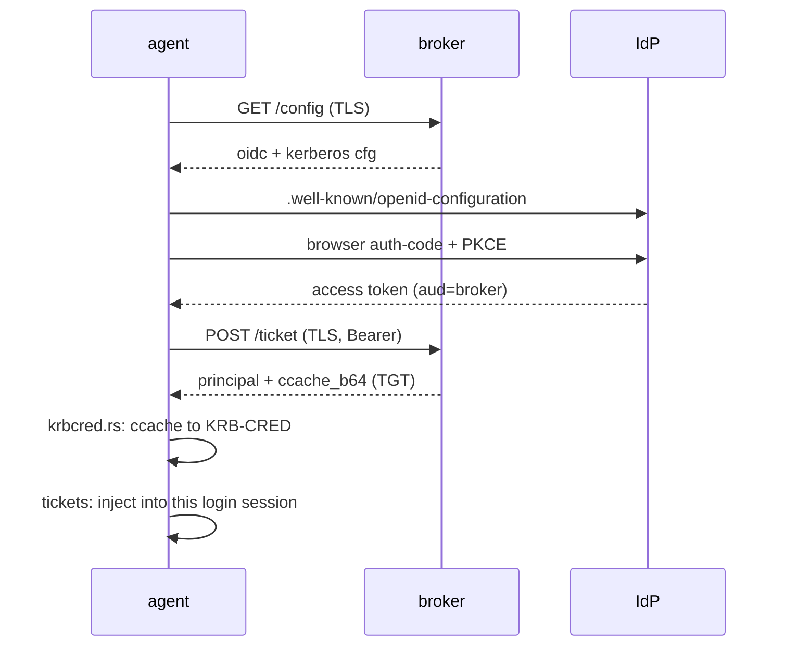
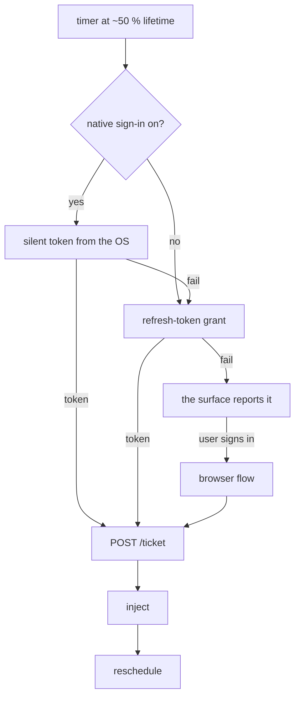
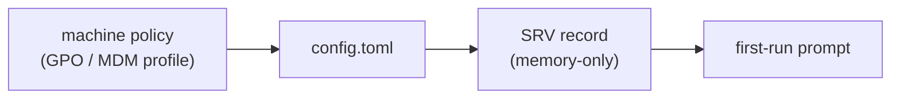

# KerBridge client design

This is the design of the KerBridge client, and it is authoritative for all
workstation software: the `kerbridge-client` library, its `kerbridge` CLI, and the
two agents that link that library.

The client is a per-user background agent. It signs the user in to the cloud IdP
in the system browser, it exchanges the token with the broker for a real
KDC-signed TGT, and it puts that TGT where the operating system's own Kerberos
stack finds it. The stock SMB client then reaches the realm's shares. Users know
the product as **NAS Access by KerBridge**.

This document holds what the platforms share. What one platform does alone is in
that agent's own document, next to the code that does it:

- [`kerbridge-agent-windows/DESIGN.md`](kerbridge-agent-windows/DESIGN.md) — the
  Win32 surfaces, realm enrollment, the WAM token source, and the repair of the
  NTLM fallback.
- [`kerbridge-agent-macos/README.md`](kerbridge-agent-macos/README.md) — the
  AppKit surface and the Heimdal ticket cache.

## Two design drivers

**The agent is agnostic to the server.** The broker URL is the only input. The
agent gets the OIDC parameters, the realm, the KDCs and the service list from the
broker.

**No platform installs a renewed TGT.** Windows asks the KDC to renew at
T−15 minutes, the KDC grants it, and Windows never installs the result. A TGT
that expires while an SMB session is open then puts the Windows redirector into a
stuck NTLM fallback that only an elevated `LanmanWorkstation` restart clears —
and that fallback can never succeed, because the realm holds no password for a
cloud identity. So the lifecycle is **timed re-injection that must land before
the End Time**. It is not a convenience. It is what prevents the worst measured
failure.

## Scope

**In scope**

- A background agent with a status surface: sign in, sign out, renew, repair,
  settings, quit.
- Browser auth-code sign-in with PKCE, through the system browser and a loopback
  redirect.
- All configuration pulled from the broker over TLS. The client holds no static
  OIDC or realm configuration.
- Silent re-injection at approximately 50 % of the ticket lifetime, with a
  fallback to the browser when no token can be had silently.
- Sign-out as a realm-scoped ticket purge plus the release of the in-memory
  refresh token. The agent owns the ticket cache. It does not own live SMB
  sessions.
- A recovery path for the measured NTLM fallback, entered by detection and
  completed only with the user's consent. Windows only.
- **Device grants**, off unless the deployment enables them. A device grant is a
  non-exportable ECDSA P-256 key in this machine's TPM, and it stands in for a
  browser sign-in for a number of days that the deployment sets. The key is
  measured on real hardware (research spike `device-grant-tpm-key`).
  Two rules travel with it. **The release deletes the key locally *before* it
  tells the broker**, so it works offline. **The key is reused, not replaced.**
  If the client created a new key for each authorization, the server would add a
  new directory row instead of replacing the existing one. Result: the old grant
  (with a destroyed key) would still occupy a `device_grant_max_per_user` slot.
  The server replaces by thumbprint, so only a stable key updates the existing
  row.
- **Delegated grants**: a machine can work as a target account that nobody is
  signed in as. See [Delegation](#delegation-to-a-different-account).

**Deliberately not done**

- More than one broker, realm or account at a time.
- A LocalSystem service that injects into a different user's LUID, which needs
  `SeTcbPrivilege`.
- SMB-specific verification or stamp-write scaffolding. Services are generic.
- Teardown of live SMB sessions. To force a session closed risks the loss of
  unsaved data in open handles, and revocation is enforced at ticket granularity.

## Principles

- **Server-agnostic.** The broker URL is the only bootstrap input.
- **No secret at rest.** The agent discards the access token after the ticket
  exchange. The refresh token stays in process memory and dies with the process.
  Only the broker URL, a cached copy of the discovered configuration, and the
  enrollment state are written to disk.
- **Two privilege tiers.** Sign in, inject and sign out need no privilege. The
  rare one-shots (`--enroll`, `--repair`) need elevation. Injection and every
  other ticket-cache operation must run in the user's non-elevated interactive
  session: an elevated process is a different LUID with a different ticket cache,
  and a ticket that lands there is invisible to the SMB redirector.
- **The LSA APIs directly, never `klist`.** `KerbRetrieveTicket` (`klist get`) is
  prohibited, because a failed acquisition **destroys** the injected TGT.
  `klist purge` has no realm filter and would destroy the user's own cloud TGT on
  a cloud-trust tenant.
- **A purge is always scoped to the realm**, never blanket, for the same reason.
- **DNS is a deployment requirement.** The client never edits a `hosts` file.
- **The core decides, the surface describes.** `agent/` decides what the machine
  does; `describe.rs` and `present.rs` decide what it says. A surface that can
  also decide is a second place where the lifecycle is settled, and that
  disagreement stays invisible until a machine writes files under the wrong name.

## The flow



The operating system's Kerberos stack then gets service tickets over TCP/88 from
the injected TGT.

## The broker contract

This is the reference for the server work. The client depends on exactly this.

### `GET {broker}/config` — discovery

TLS is required. The client refuses a plaintext URL.

```jsonc
{
  "base_url": "/{source}",                   // source routing for multi-tenant, e.g., "/entra"
  "oidc": {
    "authority": "<issuer URL>",            // e.g. https://login.microsoftonline.com/<tenant>/v2.0
    "client_id": "<public client app id>",  // native/public client, loopback redirect
    "scopes":    ["api://<broker-app-id>/access_as_user", "openid", "profile",
                  "offline_access"],         // refresh token wanted: silent re-injection
    "display_name": "Entra ID",             // UI label for IdP name
    "extra_auth_params": {}                 // optional query params for non-Entra IdPs; omitted when empty
  },
  "kerberos": {
    "realm": "EXAMPLE.SITE",
    "kdcs":  ["kdc.example.site"],           // MAY be empty when _kerberos._udp SRV is
                                             // published (the default deployment)
    "services": []                           // escape hatch — host/suffix strings for services
                                             // OUTSIDE the realm's DNS zone. Empty in the common
                                             // layout. ".corp.local" = a whole suffix;
                                             // "nas.corp.local" = one host.
  },
  "ticket_format": "mit-ccache-v4",          // pinned by name; the broker emits it whatever the KDC is
  "device_grant": {                          // optional; present when grants enabled
    "days": 30,
    "max_per_user": 5,
    "audience": "<broker app id>"
  },
  "help_url": ""                             // optional; the client uses its own when empty
}
```

Whichever help page is in force, the client opens it with `?lang=<tag>&os=win|mac`
appended — the OS display language it is already drawing itself in, and the
platform it is running on. Query parameters and nothing else, so a deployment
publishing its own page gets something it can read or ignore; an appended path
would 404. `help.kerbridge.org` reads both.

The client then runs standard OIDC discovery against `authority`.

### `POST {broker}/ticket` — issue a TGT

TLS is required.

```
Authorization: Bearer <oidc access token, aud = broker>
200 { "principal": "alice@EXAMPLE.SITE", "ccache_b64": "<MIT ccache v4, renewable TGT>" }
```

The client discriminates on the **status code and the body**, never on
reachability. The measured shapes are:

| What the client sees | What it means |
|---|---|
| 4xx from a live broker | an identity or authorization problem |
| 5xx from a live broker | a server-side outage, for example the issuer is down |
| a transport error | the broker is unreachable |

### What the server must supply

- **TLS** on `/config` and `/ticket`.
- **Validation of the access token**: the signature against the JWKS, `iss`,
  `aud` equal to the broker, and `exp`. The full contract is in
  [`../DESIGN.md`](../DESIGN.md).
- **A map from an OIDC claim to a realm principal.** To provision that principal
  is the sync's job.
- **A renewable TGT.** `renew-till` is decorative on Windows, but it is free, and
  it is real for Linux clients.
- **Entra app registrations**: a public client app with a loopback redirect, and
  a broker API app that exposes the `access_as_user` scope, so that the access
  token's `aud` is the broker.
- **A KDC reachable over TCP/88**, and a published `_kerberos._udp.<realm>` SRV
  record.

## Code layout

| Crate | What it owns |
|---|---|
| `kerbridge-client` | The core: every protocol decision, the state machine, the schedule, the words, and the `kerbridge` CLI. |
| `kerbridge-agent-windows` | The Win32 user interface, and the WAM token source. |
| `kerbridge-agent-macos` | The AppKit user interface. |

Inside the core, the parts group by subject:

| Where | What it owns |
|---|---|
| `discovery.rs`, `oidc.rs`, `broker.rs`, `http.rs`, `tls.rs` | The network legs: `/config`, the browser sign-in, `/ticket`, and the one outbound HTTP agent. |
| `krbcred.rs`, `tickets.rs`, `session.rs` | The ticket: the wire format, the injection and the purge, and the one "token in, TGT out" path that both binaries call. |
| `srv.rs`, `config.rs`, `log.rs`, `time.rs`, `sys.rs` | How the agent finds the broker, what it stores, and the small calls into the OS. |
| `enroll.rs`, `device.rs`, `repair.rs`, `elevate.rs` | Realm registration, the device-grant key, the NTLM-fallback repair, and elevation. Each is a Windows subject that macOS answers with a refusal. |
| `agent/` | The state machine, the schedule, the workers and the notifications. The seam inside it is the UI thread: `commands` is what the host calls, `status` is what it reads, `worker` is what blocks, and `failure` names what went wrong. |
| `describe.rs`, `present.rs`, `icon.rs`, `strings/` | What the state means, the words it means it in, and what the state icon is made of. `strings/` holds every user-visible string in eleven languages. |
| `main.rs`, `cli/` | The CLI. |

**Each module's header comment says what it does and why it is shaped that way.**
`src/lib.rs` names them all. Read those headers before the source; this document
does not repeat them, and a file list here would go stale.

**A platform seam is one file per subject, not one `platform.rs`.** The file
holds the subject and everything both platforms agree on, then names its two arms
with a single `#[cfg_attr(path)]`. The reason a thing differs is written next to
the thing. The arms live in `src/windows/` and `src/macos/`, one file per
subject, so a reader who asks what the client does on one platform has one place
to look. Neither folder is a Rust module: each file is reached by `#[path]` from
the subject that owns it, so the grouping costs the module tree nothing.

**An agent crate owns its platform's windows and nothing else.** It supplies the
methods of `agent::Host` — wake the UI thread, notify, report an outcome,
say that an elevation has started, name the primary action, raise the status
surface, open a path, and ask the OS for a token — and the core knows nothing
else about it.

## Ticket lifecycle

**Startup.** The agent adopts a ticket that is already in the login session. It
re-injects instead when this machine holds a device grant and the ticket is not
one that the grant obtained; the evidence is the principal that the grant's last
exchange returned, which `config.toml` records. Without this rule a `--no-grant`
run leaves an engineer's ticket in place, the agent reports that session for up
to half a lifetime, and every file written carries the engineer's name.

With autostart on, a native sign-in enabled and the realm registered, the agent
then tries one silent sign-in, because the logon and the network start at the
same time. It can only succeed from a credential the OS already holds, so there
is no window, and a failure is a log line and not a notification: nobody asked
for it. Non-network failures retry three times at 20 s intervals. Network
failures retry with exponential backoff starting at 5 s, doubling to a 10-minute
ceiling, until the network returns.

**Sign in.** OIDC discovery, then a native silent token if the platform has one
and the toggle is on, then the browser auth-code flow with PKCE, `state` and
S256. The result is an access token, and a refresh token that stays in memory.
Then `POST /ticket`, the injection, and the access token is discarded. The agent
keeps the principal and the End Time, and schedules the re-injection at
`now + (endtime − now) / 2`.

**Re-injection.** At the midpoint the agent tries the native silent token, then
the refresh-token grant, then it reports; what the surface announces is in
[Notifications](#notifications). The re-injection **must land before the End
Time**. Failed renewals retry with progressive backoff starting at 60 s, doubling
to a 10-minute ceiling, clamped to never exceed the ordinary midpoint schedule.
If the End Time comes near with nothing landed, the agent escalates at
T−20 minutes, and at the End Time the condition becomes `Stopped`.



**Status.** The agent polls the ticket cache read-only for the End Time, for
display only. The schedule runs from the agent's own record of what it injected,
because **the presence of a ticket is not liveness**: expired tickets stay in the
cache, and local failures evict valid ones. A ticket that *disappears* implies a
local failure or an eviction, and never a KDC refusal.

**Sign off.** The agent purges the tickets whose realm is the broker's realm.
Tickets for other realms stay, which is what makes this safe on a cloud-trust
tenant. The in-memory refresh token is *not* dropped — that belongs to the cloud
sign-out. This is a **ticket-cache operation only**: an SMB session already open keeps serving files until the OS drops it on
idle, or the user disconnects, or the machine reboots. So sign-out and revocation
are enforced at ticket granularity and not at session granularity. To tear a
session down is a server-side lever ([`../DESIGN.md`](../DESIGN.md)) or,
machine-wide, the elevated restart in the Windows repair path.

**Sign-out never releases the device grant.**

Reason: sign-out means the person at the keyboard is leaving. The grant is the
account the machine works as. Somebody authorized the grant for that account —
possibly a different person.

To release the grant:
1. User asks for it by name (*Remove authorization…*)
2. Agent deletes TPM key first
3. Agent revokes at broker second

Exception: retargeting the agent to a different broker releases the grant (grant
belonged to old broker).

That holds in the CLI too, which is why `--sign-off` is spelled as the tray's
label and gives up nothing. **Give up** (the holder relinquishes) and **revoke**
(the authority withdraws) are separate verbs, not synonyms:

| Situation | Realm tickets | Device grant | IdP browser session | Refresh token |
|---|---|---|---|---|
| Tray → **Sign off** | purged | kept | untouched | kept |
| Tray → **Remove authorization…** | untouched | given up | untouched | kept |
| Tray → **Sign out of Entra** | untouched | untouched | ended | dropped |
| Settings → change broker URL | purged | given up (at the *old* broker) | untouched | dropped |
| CLI `--sign-off` | purged | kept | untouched | n/a |
| CLI `--grant-give-up` | untouched | given up, offline | untouched | n/a |
| CLI `--grant-revoke <other id>` | untouched | revoked (signs in first) | untouched | n/a |
| Operator `kbmanage device revoke` | untouched | revoked | untouched | n/a |

*n/a* on the CLI rows because that process holds its refresh token for the length
of one run and writes it nowhere — there is nothing for a flag to keep or drop.

### The re-probe of a broker that went away

The re-injection schedule runs only while a ticket is held, and the startup
retries stop after three. Without a third clock, a machine that booted ahead of
its network keeps reporting *Can't reach …* about a server that has come back.

`probe_at` is that third clock. The **first** transport failure arms it, anything
that is not a transport failure disarms it, and it asks for `/config` — never for
a sign-in.

- **`/config` needs no credential**, so this is the one useful thing a machine
  with nothing to be silent with can do. On macOS that is every machine.
- **It is armed once, not on every failure.** `Agent::record` runs on every
  failure, and to re-arm would hold the interval at its floor for ever. It starts
  at 30 s and doubles to a ceiling of 10 minutes.
- **A landed `/config` clears the transport fault**, which is what replaces the
  stale sentence with the truth — usually *a browser sign-in is needed*, a
  different and actionable thing.

The probe does not take the busy slot, and it is skipped while a worker holds
one, because that worker already asks the same endpoint the same question.

## Delegation to a different account

A machine can be delegated to a **target** account that it is not signed in as: a
build box publishes as `svc-builder`, and a build engineer standing at it
authorizes the machine without ever learning that account's credentials.

The target is a login name or a literal `kb1|` identity, and never a UPN, because
a UPN is a second mutable spelling that arrives as end-user input. The agent reads
it from the machine-wide policy first and from `grant_for` in `config.toml`
after, so an installer can set what an unattended machine works as. Neither
location is a security control: the broker checks the target's delegate group
whatever the client asks for.

The word is **delegated user**, not *pinned*. The registry key and the config
field keep their names, but *pin* collides with `kbmanage`'s
`kbstate1|namepinned|` and is already overloaded.

These things follow, and the first is the whole point:

- **A delegated sign-in authorizes, and it never injects.** The browser proves
  the person at the keyboard, and not the account that the machine works as. So
  on a delegated machine the agent reaches `/ticket` with a device-grant
  assertion or not at all. To inject the engineer's TGT instead would have the
  build publish under the engineer's name for up to a ticket lifetime, with no
  error anywhere and a share ACL that probably permits it.
- **The target is an authorization-time input, not runtime state.** It selects
  whom a grant is created for, and nothing else. A machine that holds a grant
  for one account keeps getting tickets as that account whatever the field says,
  and it migrates by itself at its next authorization, when a human is at the
  keyboard anyway. Nothing fails closed on a disagreement: on an unattended box
  nothing is listening, so a loud failure would be a failed SMB write hours
  later. Settings shows both values, and `kerbridge --grant-status` prints them
  side by side.
- **`--no-grant` still signs in as the caller**, and says so. It stays because it
  is the documented way to tell a refused grant from a broken broker.

The delegated grant's default label carries who authorized it, so
`kbmanage device list <target>` and the broker's grant log read the same. This is
cosmetic and best-effort: the label comes from the client, the broker sanitizes
it, and the durable record is that log.

## Failure classes

Each class was measured on unjoined and on Entra-joined clients. The agent maps
each one to a different message and a different action.

| Signal | Class | What the agent does |
|---|---|---|
| `Access is denied` on a service host | authorization (group or ACL) | Say so. Re-injection does not help. Do not attempt one. |
| `Account restrictions…`, or broker 401/403 | account state (disabled, revoked, not synced) | Say so, then back off and retry. A KDC-refused TGT is undamaged: when the account is enabled again it works with no client action. |
| `Cannot contact a domain controller` | transport (the realm or the KDC is unreachable) | Check the enrollment state. A KDC outage does not break access from cached tickets. Report it, do not thrash. |
| Broker 5xx from a live broker | a server-side outage | Retry with backoff, with a message distinct from the unreachable one. |
| Transport error to the broker | the broker is unreachable | Retry with backoff. |
| The injected TGT is gone before its End Time | the NTLM fallback | See below. |

**The detection of the NTLM fallback needs no SMB knowledge.** The discriminator
that identifies the fallback on the wire has no client-side proxy, and the
`services` list is empty in the common layout, so frequently there is no host to
probe. The agent uses a local signal instead: an access that falls back evicts the
injected TGT immediately, before its End Time
(research spike `windows-tgt-followup-entra-joined`
§ 787-792). So a TGT that is simply gone, while the agent still believes in one,
is a positive signal, read through the LSA query the agent already runs. There is
no `\\host\IPC$` probe, and none is wanted.

The check is skipped while a worker holds the busy slot, because a re-injection
purges the realm before it submits and that window looks exactly like a fallback.

**One raised status window per episode.** An episode opens on the signal above
and closes only when a ticket exchange lands, or an elevated repair succeeds, or
the agent restarts. Without that rate limit a broker outage would have the agent
raise the surface in a loop.

**The agent never restarts `LanmanWorkstation` by itself.** That restart drops
every SMB session on the machine and not only the realm's, and nothing in the
agent can tell whether that is safe. The mechanics are in
[`kerbridge-agent-windows/DESIGN.md`](kerbridge-agent-windows/DESIGN.md).

`ntlm_fallback_recovery` gates all of this machinery — the detector, the episode,
`--repair` and the menu item. It defaults to `cfg!(windows)`, which switches the
whole thing off on macOS in one line and keeps `#[cfg]` out of the agent.

## The status model

The core reports several independent values, and **there is no precedence
anywhere**. A single ordered enum can only report the loudest of several
concurrently true facts. The fault this model prevents is a surface that reports
one true fact and hides another.

| Value | What it says |
|---|---|
| `condition` | what the machine can do about the realm now |
| `blockers` | what is missing now |
| `actions` | what the user may start |
| `in_flight` | what is running |
| `next_attempt_at_earliest` | the soonest time at which the agent tries again |

These things must **not** become states. Each has been one, and each cost the
model an axis:

- **Delegation is not a state.** It changes `actions` and the verb in the
  identity line, and never `condition`.
- **A view is not a state.** A repair view or a sign-out view belongs to the
  host. Encoded as precedence, it masks the condition underneath it.
- **Activity is not a state.** A machine that signs in while it holds a good
  ticket is `Working`, and the surface must keep saying so. Running work is
  `in_flight`.
- **The ticket clock is not a state.** An `Expiring` state conflates a normal
  clock near the End Time with a renewal that has failed. The clock is a number;
  the fault it hides is `WillStop`.

### `Condition`

| Value | Meaning |
|---|---|
| `Working` | a usable ticket, and the supply behind it is intact |
| `NotStarted` | no ticket, and none is expected on this machine |
| `Flaky` | a usable ticket, an intact supply, and transport that has failed for some time |
| `WillStop` | a usable ticket, but the supply is gone, so access stops at a known time |
| `Stopped` | no ticket, and this machine is supposed to be working |

### The facts

`condition` is a pure function of local facts.

**T — the machine holds a *usable* ticket, not merely a ticket.**

Why the distinction? If the realm is absent from the OS registration:
1. Broker exchange succeeds
2. Injection succeeds
3. TGT sits in cache: **valid but unusable**
4. Service ticket request fails locally (no KDC packet sent)

Evidence: [`../docs/windows-kerberos-findings.md`](../docs/windows-kerberos-findings.md)
§ 578, § 866.

Formulas:
```
usable = a realm is known ∧ the OS is registered for it   (enroll::state)
T      = a live ticket is held ∧ usable
```

Invariant: **`Working`, `Flaky` and `WillStop` are unreachable while the
`RealmNotRegistered` blocker is present.** This is the only place where the
platform separates *holds a credential* from *can use it*.

**H — this machine is supposed to be working here.**

`expected_working_as` holds a *scope* (not a boolean): `realm|effective-delegated-user`.

When set:
- First landed exchange, or
- Agent adopts an existing ticket at startup

When cleared:
- Grant released, or
- Ticket dropped

Why a scope and not a flag? Two reasons:
1. The machine-wide target is read once at load. Its *change* is not an observable event.
2. Retargeting the broker voids the expectation the same way.

H is expectation, not history. This makes `Stopped` read as *no ticket, and there
was supposed to be one*.

**S — a silent renewal can land.** Possession, not prediction. On a **delegated**
machine, S is *a valid grant is held*, because nothing else can get one and a
refresh token in memory is worth nothing there. Otherwise S is *a valid grant, or
a refresh token in memory, or a native sign-in that is enabled*.

The native term is the only unknowable one, because a silent success **is** the
test for a usable OS credential. The machine finds out when it tries, and
`Stopped` catches it when the try fails. `Supply` names which one stands
behind the next renewal, in the order the worker tries them: `Grant`,
`WindowsSignIn`, `BrowserSignIn` or `None`.

**`Flaky` is time-since-first-failure, not time-until-next-attempt.**

Rules:
- Transport has failed since the first failure
- Nothing has landed after that failure
- `now − T0 > FLAKY_QUIET_SECS`

Why not "the next attempt is far away"? The schedule re-arms from the ticket
midpoint. A distance-based rule would suppress `Flaky` exactly when the machine
approaches the lapse — the worst time to go quiet.

### How the condition is derived

| Facts | `condition` |
|---|---|
| T ∧ ¬S ∧ late rule | `WillStop` |
| T ∧ S ∧ flaky rule | `Flaky` |
| T | `Working` |
| ¬T ∧ H | `Stopped` |
| ¬T ∧ ¬H | `NotStarted` |

**The late rule** is `now − start ≥ LATE_ELAPSED × (end − start)`, with
`LATE_ELAPSED` at 0.8.

¬S is a certainty about the *end* of this ticket, not a statement about the
present.

Why not raise `WillStop` immediately when the supply disappears? Two reasons:
- On a machine with perfect access, raising `WillStop` immediately would waste
  the warning color hours before the user must act (a single browser click).
- On a deployment where ¬S is the steady state (grants disabled), every boot
  would land in `WillStop`. The warning color would mean nothing.

A fraction, not a duration: the ticket lifetime is the deployment's choice.

Because the condition is a pure function, there is no separate state machine to
keep in step. Each event moves a fact:

| Event | What it moves | Resulting condition |
|---|---|---|
| an exchange lands | T ← true, H ← set, flaky cleared | `Working`. A ticket that has just landed is never late, whatever the supply did. |
| a ticket is adopted at startup | T ← true, H ← set | `Working`, or `WillStop` when the adopted ticket is already late. This is the one way to enter `WillStop` at startup. |
| the End Time passes | T ← false | `Stopped` or `NotStarted` |
| the user drops the ticket | T ← false, H cleared | `NotStarted` |
| the user releases the grant | S ← false when delegated, H cleared | unchanged while the ticket is early, then `WillStop`, then `NotStarted` |
| the grant expires or is revoked | S ← false when it was the only supply | `WillStop` once the ticket is late |
| the user signs out of the cloud session | the refresh token is dropped, so S ← false when it was the only supply | `Working`, then `WillStop` once late |
| the realm registration is removed | usable ← false, so T ← false | `Stopped` |
| the realm registration is applied, then the machine reboots | usable ← true | unchanged until a ticket lands |
| the machine-wide target changes, or the broker is retargeted | H ← false at load, by scope comparison | `Stopped` → `NotStarted` |
| the first transport failure | T0 recorded | unchanged |
| transport still failing past `FLAKY_QUIET_SECS` | flaky | `Working` → `Flaky` |
| the native sign-in is turned off with no other supply | S ← false | `Working`, then `WillStop` once late |

**No network fact enters the derivation.** A broker outage never moves the
condition. It appears as the `NetworkError` blocker and, if it persists, as
`Flaky`.

### `blockers` — immediate and unentailed

A list, because several can be true at once. Unordered, because an order is not a
fact.

| `Blocker` | Meaning |
|---|---|
| `NoBrokerUrl` | first run; nothing is configured |
| `NetworkError` | unreachable, TLS refused, rate-limited, or 5xx |
| `RealmUnknown` | no discovery has landed here, so there is no realm |
| `RealmNotRegistered` | the OS does not know the realm |
| `NoSupply` | nothing to exchange with, and a browser sign-in is allowed |
| `NoGrant` | delegated, so only a grant can get a ticket, and there is none |
| `GrantRefused` | policy refused this grant; to authorize again cannot help |
| `Refused` | the broker or the IdP said no to this identity |
| `NtlmFallback` | the ticket is good, the drives are not |

**Only unentailed blockers are emitted.** `NoBrokerUrl` entails every blocker
downstream of it, and `RealmNotRegistered` never appears without a known realm,
so a first-run machine emits exactly `{NoBrokerUrl}` and not that entry with its
consequences. Without that rule every surface invents its own
precedence, and the model then has two unwritten precedence chains instead of
none.
`RealmNotRegistered` together with `NoSupply` is **not** entailment: both are
true and both immediate, and that a sign-in before enrollment injects an unusable
ticket is carried by `actions`.

**Blockers explain, and actions resolve.** They are not parallel lists, nothing
lines up between them, and `message` is the detail channel that a blocker never
restates.

`NetworkError` merges *unreachable*, *TLS refused*, *rate-limited* and *5xx*,
because those class by **how they clear** and not by what caused them: all of them
clear on a retry, and the distinct sentences stay in `message`. This merges what
[Failure classes](#failure-classes) separates, consciously, on the
recoverability reading.

`NtlmFallback` is the agent's diagnosis and appears only when the fallback is
confirmed. The `RestartWorkstation` action can be offered with no blocker
present, for a user who suspects the fault without the agent seeing it. Keep the
diagnosis and the offer separate.

### `actions` — flat, and two blockers imply none

`actions` is a function of the blockers, the condition, the delegation, whether
grants are enabled, whether the NTLM recovery is enabled, whether a cloud session
exists, and the platform. The surface decides what is primary, what is secondary
and what it does not draw at all.

**Each action is its own variant and carries its own label.** That is what makes
one class of fault unreachable: when several controls dispatch to one `sign_in()`
and share one label, *Retry* can wear *Authorize this PC for svc-builder*. So
**`Retry` is not an action**; it is `SignIn` under a third name.

- **The core keeps the authorize-versus-sign-in dispatch.** `sign_in()` routes to
  `create_grant()` when the machine is delegated and holds no grant, and the
  guard in `run_sign_in` enforces it. `Action::CreateGrant` *labels* that
  dispatch, and must never become a second place that decides it.
- **The cloud sign-out is offered whenever a cloud session exists.** It is the
  one offer that is not about the realm: it ends a session at the authority and
  spends no ticket, so neither the `usable` rule nor a missing broker URL gates
  it. *Whether it may be offered* is the model's; *whether it leads* is the
  surface's. It has to be in `actions` for that split to hold, because a surface
  that reads the session flag directly is a second place where the offer is
  decided.
- **`Cancel` is offered only while a browser leg runs.** The cancel flag is read
  in exactly one place, the accept loop in `oidc.rs` — not during a blocking
  native token call, discovery, a service restart, or a wait on an elevated
  child. Anywhere else it is a dead button.
- **Two blockers imply no action at all**, which is the honest answer:
  `GrantRefused`, where to authorize again is the one thing that cannot help, and
  `RealmUnknown`, which waits.
- **Nothing that gets or spends a ticket is offered while `usable` is false** —
  not `SignIn`, not `ReinjectTicket`, not `CreateGrant`. The measured reasons:
  the ticket cannot work; enrollment from cold needs a restart, which discards
  any ticket obtained first; and this is the one state measured to *destroy* a
  ticket, where a failed `klist get` evicted a still-valid TGT.

### `in_flight` — no activity axis

A list of actions, named in the vocabulary the surface already has. An action
that is available *and* running stays in `actions` and also appears here, so the
surface disables the control instead of hiding it. A list and not an option,
because the cloud logout runs on its own thread, outside the busy slot, and can
overlap a sign-in.

This subsumes what an activity enum could not: `create_grant` runs a whole
browser sign-in inside itself, and an elevated one-shot holds the slot for as
long as the UAC prompt is up, and an activity enum reports both as idle. It also
makes no distinction between user-started and silent work — a scheduled renewal
and a clicked *Renew now* are both `[ReinjectTicket]`, because the button must be
visible and disabled either way.

### Views belong to the host, and absence is typed

`Status` has no view field. What the core keeps is a **raise request with a
target** — the status surface, or the repair explanation — because without the
target a machine whose drives have just broken gets an unexplained window. **The
raise must never open a modal dialog**, which is a step of the escalation ladder
that no machine-initiated event has earned.

The ticket's time-dependent values are one `Option<TicketClock>`: `None` when no
ticket is held, and `Some` with `remaining: 0` when the ticket has lapsed.
`next_attempt_at_earliest` and `grant_expiry` are `Option<i64>` for the same
reason. `TicketClock` carries no methods — it is worked out once in `status()`
against one reading of the clock, and a surface that can recompute it is a second
place where the lifecycle is settled.

## What the surface decides

The core says what is true. Each surface decides how much of it fits and what
leads. These rules apply to every surface.

**Order: *is there anything for me to do?* first, then the identity, then the
clocks, then the explanation.** One amendment: **the ticket clock is promoted to
the front page exactly when it is a deadline and not a countdown to an automatic
renewal**, which means on `Flaky` and `WillStop`. On `Working` the supply is
intact and the End Time is a number nobody waits on.

**The two clocks cannot contradict each other, and that is a theorem.**
`WillStop` entails ¬S, and ¬S entails that no valid grant is held, so *access is
expiring* never renders beside *authorization expires in…*. They coexist only on
`Flaky`, where both are true about different subjects, and there the ticket clock
leads because it is the nearer deadline.

**The identity line follows rules, not a state table.**

- **Delegated → the grant target, always.** It is the only identity available
  before a ticket exists, and on a delegated machine the principal is the
  target's anyway, so the two cannot disagree.
- **Otherwise → the principal, while a ticket or a grant is held.**
- **Otherwise there is no identity line.** A `Stopped` laptop that shows *signed
  in as…* asserts a session that the lapsed ticket is the evidence against.

**`NotStarted` renders no headline, with one exception.** A delegated box that
was stood down holds a valid grant and no ticket, so the surface would render
*Working as svc-builder* as its only line and assert work that is not happening.
So `NotStarted` takes the headline *Off* when an identity line would otherwise
stand alone, and nothing when there is no identity.

**The explanation is a marked block, and it comes after the facts.** Who this
machine is, and until when, is one group; why something is wrong is another. To
interleave them lets a TLS refusal sit unread between an identity line and a
deadline. **The block carries the severity so that the lines inside it do not**:
danger once access has stopped, neutral on a machine that has never worked, and
warning otherwise. A fresh install must not look like a breakage.

**A message is not a fault.** Both the block's ink and the log button key on
whether something is *wrong* — a blocker other than `NoSupply`, or a recorded
failure — and never on whether `message` is merely non-empty, because a
deliberate sign-off sets a message with no fault behind it.

**`ReinjectTicket` outranks `SignIn`, and is offered only when S holds.** A
*Renew now* that provably cannot get a ticket is worse than a false futility
clause, because the user pays for it with a click; and whenever both are ranked,
the user believes the cheap one works, while the expensive one runs the whole
IdP flow to reach the same ticket. Over the reachable space the two appear
together in exactly one state — just signed off — and `SignIn` never leads.

**When no action survives the gates, the surface says so**: *No action — nothing
this machine can do about it*. That is the honest rendering of a delegated
machine in a grants-off deployment, and it is better than an invented offer.

## Words

Sentence case throughout, and no trailing punctuation. The English copy is the
source and the other tables are generated from it. All of it is in
`strings/`; `present.rs` chooses which string a state gets.

| `Condition` | Headline |
|---|---|
| `Working` | Access OK |
| `Flaky` | Renewal uncertain |
| `WillStop` | Access expiring |
| `Stopped` | No access |
| `NotStarted` | *(nothing)*, or *Off* where an identity line would stand alone |

**"Connected" is dead** — Microsoft's style guide forbids it as a synonym for
*signed in*. **`WillStop` describes, it does not command**: *Needs attention* was
rejected, because a user who no longer wants the access and has simply not signed
out is not at fault. `Flaky` against `WillStop` is *uncertain* against *certainly
will not*, which is the real difference between them.

| `Action` | Label | The rule that decides it |
|---|---|---|
| `SignIn` | Sign in… / Extend access… | The second form while a ticket is held. One mechanism, two consequences: with no ticket the IdP loop *gets* access, with one it *prolongs* it. Nothing is concealed, because `oidc.rs` sends no `prompt`, so this path always lands the browser's existing session. |
| `CreateGrant` | Authorize access… / Authorize again… | The second form while a grant is held. *Change authorization…* was rejected: to press it unchanged creates a fresh grant for the same account, which is a renewal. |
| `ReinjectTicket` | Renew now | Bare. Nothing more is asked of the user. |
| `Cancel` | Cancel | |
| `DropKrbTicket` | Sign off | See below. |
| `SignOutEntra` | Sign out of Entra | The browser session only. Never offered where there is none. |
| `GiveUpGrant` | Remove authorization… | |
| `Enroll` | Set up Windows… | Windows only. |
| `Reenroll` | Set up Windows again… | *…again* is the mirror device: the same operation, a second time. |
| `Unenroll` | Forget {realm}… | Keeps `{realm}` deliberately: name the casualties before an irreversible click. |
| `RestartWorkstation` | Repair network drives… | Names the outcome and not the service. `LanmanWorkstation` stays in the confirmation. |

**The ellipsis carries a meaning, and it costs no copy.** Windows uses it for a
command that needs more from the user before it can finish, which is exactly the
difference between a silent re-injection and a browser round trip. So *Sign in…*
takes one and *Renew now* does not, and that is the only difference the user
pays between *Extend access…* and *Renew now*, which promise the same thing. **A
confirmation earns an ellipsis; elevation never does**, because elevation is
permission and not information, and the shield already says it.

**`DropKrbTicket` is *Sign off*, deliberately not the sanctioned *Sign out*.** A
purge takes the TGT **and** the service tickets, and an SMB session that is
already open keeps serving files off an empty cache with no Kerberos traffic
([`../docs/windows-kerberos-findings.md`](../docs/windows-kerberos-findings.md)
§ 934). *Sign out* reads as *this ends now*, and it does not; *Disconnect* and
*Drop access* are simply false. No ticket-scoped verb can promise anything about
connections that are already open, so the label stops short and the confirmation
carries the rest: drives already open **may** keep working, *may* because which
clients hold a session open is theirs to decide.

**The cloud sign-out ends a browser session and nothing else.** It ends the SSO
session this agent left at the authority and drops the in-memory refresh token;
the Kerberos tickets stay. **The OS's own account is deliberately out of scope**:
an application cannot sign an OS account out, because the account-removal API
drops app-only accounts and never OS-wide ones
([MSAL WAM](https://github.com/AzureAD/microsoft-authentication-library-for-dotnet/wiki/WAM/c0ab8837695d6830b045a855db4da1404eeb21e7)).

**The marker for that session is persisted, because the cookie is.**
`config.toml` carries `browser_session`; an in-memory flag would clear on restart
and stop offering the cleanup in exactly the walk-away case the action exists
for. Only two things clear it: the sign-out itself, on the *asked* result rather
than at the click, because discovery can fail and a machine that never reached
the authority still has the session; and a retarget to another broker, where the
session belonged to the old authority. A stale `true` costs one no-op page load,
and a stale `false` is the leak this action exists to close.

**Warn about loss, recommend about hygiene.** To name the casualties before the
click is scoped to *destruction*. To sign out of a browser destroys nothing, so
that note recommends. Never spend a warning on the cost of the safer option.

**Blocker lines are fragments** — sentence case, no trailing period. Two carry a
decision and not only a wording: `NoSupply` renders nothing on the front
page, and `NtlmFallback` keeps its *(NTLM)* tag, because nothing else nearby
names the mechanism and that keyword is what has to reach the support request.

**A failure message takes one form**, across the whole `err_*` block:

> **`<mechanism state>: <what it means for you>`**

The tag is the sysadmin's handle and the sentence is the end user's consequence:
two audiences, one line, no conditional, and the tag must not restate the
sentence. These rules produce them:

1. **Say what happened, in the real term** — TLS, WAM, Kerberos, NTLM,
   `LanmanWorkstation`, the hostname, the realm. The user quotes these terms to
   their sysadmin. To remove one costs a support round trip and saves four
   characters.
2. **Name who must act, only when it is not the user.**
3. **Never predict that an action will fail.** *Untrusted*, *NotAdmitted* and
   *GrantDisabled* all clear on a retry once the cause is fixed.
4. **Never promise a fix you cannot guarantee.** Rules 3 and 4 are the same error
   in opposite directions.

**There is no per-failure headline.** `condition`, `blockers` and `message` leave
no slot for one, and there is one failure title per *operation*.

**The nouns, ruled once**

- **"this device"** everywhere. It is Microsoft's own term in this sense, and
  both agents share the table. The scope is stated exactly once, where it can
  bite: the grant key is **user scope**, so the grant confirmation says "…for
  your account on this device".
- **"ticket"** is confined to the Kerberos details block, under a heading that
  already says *Kerberos*. What the user gets is access to their network drives.
- **"device grant"** is a technical handle and not a control. It stays in the
  `err_grant_disabled` tag, in the Settings prose and in the docs. The
  user-visible noun is **authorization**.
- **"delegated user"** is the account a machine works as when it is not the
  signer's own. It joins [`../DESIGN.md`](../DESIGN.md) § Delegating the
  authorization, where the *delegate* is the person allowed to set it up. **"Pin"
  and "pinned" are retired from prose for this concept**; the registry key
  `GrantFor` and the config field `grant_for` keep their names.

## Notifications

**A notification is an interruption, never a record.** `condition` and `blockers`
are standing facts that do not decay, so an unread toast costs nothing and the
surface itself tells the monthly visitor. There is no persistent row, no unread
badge and no "while you were out" list.

Two gates, in order.

**Gate 1 — is it worth an announcement at all?** Do not announce a successful
operation, with these exemptions: the condition improved from a fault; a lengthy
user-started operation finished and its outcome has nowhere else to land; or it
is a fault or the grant deadline.

**Gate 2 — announce by the visible surface; notify when no surface is visible.**

The rule is *surface visibility*, not *who started it*.

Examples:
- Browser sign-in fails → notify (browser dismissed the status surface)
- *Renew now* fails with surface open → do not notify (surface already shows
  blocker + message)

Implementation: suppression logic lives in the host, never in the core. Core
emits and logs unconditionally. Each platform judges its own surface.

| Event | Notify | Why |
|---|---|---|
| any fault → `Working` | yes | gate 1.1 |
| a lengthy user-started operation finished | yes | gate 1.2 — covers a first sign-in, whose surface the browser took |
| a routine midpoint renewal | no | the condition does not move |
| `Working` → `Flaky` | no | self-correcting by construction; the duration rule already means *wait, it may fix itself* |
| `Working` → `WillStop` | no | a configuration and not an event, and with the late rule it is no longer entered at boot |
| the End Time is within `ESCALATE_SECS` on `Flaky` or `WillStop` | yes, once per ticket | 30 seconds now beats an interruption mid-task |
| → `Stopped` | yes | an action failed |
| → `NotStarted` | no | not a fault; a healthy autonomous box must not be reported as one |
| an elevated one-shot finished | gate 2 only | detached → notification, attached → the dialog |
| the grant deadline is inside the window | yes, presence-gated | below |
| a grant was created or failed | gate 2 only | the dialog reports it |

The escalation and the expiry can both fire twenty minutes apart, deliberately:
the first is preventable, the second is *done*, and the second lands at the
moment a save actually fails.

**The deadline is the only notification with slack, so it is the only one that
waits for a human.** It fires on recent user input, once a day per session,
instead of at 03:00, when nobody is present. This does not reopen the
no-unattended-mode rule: to time one toast on recent input infers nothing about
the machine's purpose, and it fails safe, because a wrong signal makes the toast
late and never absent. `GRANT_DUE_SOON_SECS` is 7 days, matching the shipped
operator default, for both the status row and the toast.

**Delegation changes nothing about whether the agent speaks.** A delegated
machine works as someone else, which never means that nobody is there, and to
suppress on it would silence exactly the machine whose breakage is least likely
to be noticed by other means.

**No string names the app**, because the attribution header already carries the
product name. **None claims drives**: the agent knows about a ticket and cannot
know whether any share is mapped, so the subject is *access* everywhere except in
the repair notification, where SMB sessions genuinely are the subject.

## The icon

Fewer looks than conditions, and both axes are the model's own facts.
`kerbridge_client::icon` holds the mapping, the geometry, the halo and the glyph
threshold, and both agents render from it.

| `Condition` | Weight | Overlay |
|---|---|---|
| `Working` | full | — |
| `Flaky` | faded | ⚠ warning |
| `WillStop` | faded | ⚠ warning |
| `Stopped` | faded | ✖ danger |
| `NotStarted` | faded | — |

- **Weight says "nothing to see here".** Full strength is `Working` alone; every
  condition with something to say is faded, so that what it says has the contrast
  to be read. Fading does not say *not working*: the overlay says what is wrong,
  and the weight says only whether anything is.
- **The overlay is the fault**, at the two strengths the failure taxonomy already
  distinguishes. A blocker never reaches the icon; the tooltip carries the
  sentence.
- **`Flaky` and `WillStop` share a look deliberately.** To someone glancing at a
  taskbar both say *works now, will need you before a deadline*. Whether it may
  correct itself is a clause, not a silhouette.
- **The icon has no busy state.** A sign-in opens a browser and the status
  surface closes, so an icon that flickered through it would announce a state
  nobody watches.
- **The badge survives a small icon as a silhouette, and only as a silhouette.**
  A glyph inside it is unreadable below 24 px and legible above it, so the
  glyph is drawn at ≥ 24 px and the shape goes bare below; nobody sees two sizes
  side by side. A triangle and a disc stay distinguishable at 8 px, which keeps
  ⚠ and ✖ separable for a viewer who cannot tell amber from red. Color is the
  fast channel; shape is the one that works without it.

**Color is licensed on the badge, and on Windows only.** Monochrome cannot
separate `Working` from `Flaky` at 16 px, because a full-ink badge on a full-ink
mark keeps no contrast between the two. The macOS menu bar draws at 36 device px,
where the halo separates the badges by itself, so macOS keeps a pure template
image. **The two platforms therefore differ in exactly one thing**, and they
share the mapping, the geometry, the halo and the threshold.

## Configuration and storage

Both platforms store per-user configuration and one log. The paths and the policy
mechanism are per-platform and are in each agent's document.

| File | Contents |
|---|---|
| `config.toml` | `broker_url`; `grant_for`; `windows_sign_in` (default `true`) and `ntlm_fallback_recovery` (default `true` on Windows, `false` on macOS); `browser_session`; `expected_working_as`; `[cache]`, the last discovered configuration; and `[grant]`, this machine's device grant with the principal it last obtained. |
| `kerbridge.log` | The log. It rotates at start once past 10 MB, into three gzipped generations. |

**Broker URL precedence:**



- A policy value makes the Settings field read-only and shows a managed cue. The
  client prepends `https://` when the scheme is missing; TLS is mandatory either
  way.
- **The SRV lookup is `_kerbridge._tcp.<dns domain>`**, through
  `kerbridge_client::srv`, and the answer is held in memory only, so DNS stays the
  authority. An answer is accepted only when its target lives inside the domain
  that answered. The domains asked are the machine's own suffixes and then each
  of their parents down to two labels; the walk up is what lets one record in the
  broker's own zone serve clients in per-site subdomains, and a copy published in
  the subdomain is refused, because its target is then outside the domain that
  answered.
- **`ntlm_fallback_recovery`** gates the entire NTLM-fallback machinery, and a
  machine policy value overrides the file. When it is `false` the agent does no
  elevated restart: a stuck fallback is then recoverable only by a reboot or by
  IT, and the agent does not name it.
- **A change of broker URL purges the realm, releases the grant and drops the
  refresh token.** This is why the Settings field commits explicitly and never on
  focus loss.
- **No token or secret is persisted.** The refresh token is lost on quit, logoff
  or reboot; autostart then has nothing to renew with, and a sign-in is one click.

## Security model

- **TLS is mandatory** on `/config` and `/ticket`. The client refuses plaintext
  and verifies the certificate. On a validation failure — and only then — a
  second handshake reads back the certificate the host presented, so the message
  names evidence instead of restating that trust failed.
- **The trust floor for an elevated enrollment**: the elevated process fetches and
  validates the configuration itself, and gates on the user's confirmation of the
  realm and the KDCs before it writes anything. The broker, over TLS, is trusted
  to set the realm-to-KDC mapping, so that confirmation is the backstop against a
  rogue or spoofed KDC.
- **The loopback listener is hardened**: bound to `127.0.0.1`, a random ephemeral
  port, PKCE S256, a `state` nonce, one request, a short timeout, and an exact
  redirect match.
- **The refresh token** is memory-only, per process, never written to disk or to
  a log, and discarded on the cloud sign-out.
- **A purge is scoped to the realm**, never blanket.
- **Only realm registration and the repair elevate**, and neither touches a
  ticket.
- **Ticket work and cloud work are two separate actions, never one control.**
  *Sign off* purges this realm's tickets and touches nothing else; *Sign out of
  Entra* forgets the memory token and releases the cloud session and touches no
  ticket. Neither touches the device grant, which is *Remove authorization…*.

## What each platform does instead

| Subject | Windows | macOS |
|---|---|---|
| Ticket store | LSA, `KerbSubmitTicketMessage` into this LUID | Heimdal through Kerberos.framework, into the login session's `API:` cache |
| Wire format | the ccache is converted to KRB-CRED | the MIT ccache v4 is read natively; `krbcred.rs` supplies the times only |
| Realm registration | `ksetup`, elevated, one time | none; Heimdal resolves the realm from DNS |
| Elevation | `--enroll` and `--repair` | none anywhere in the product |
| NTLM fallback | detected, and repaired with the user's consent | none; the mount drops visibly and reconnects |
| Native token source | WAM, on by default | none; `native_token` is `Unavailable`, so every sign-in is a browser sign-in |
| Device grant | a TPM key through CNG | none; a Secure Enclave key needs an entitlement, which needs a signing identity |
| Status surface | a flyout window plus the tray menu | the menu, which is also the status window |
| Autostart | a per-user `Run` value | `SMAppService` |

Two consequences of that table are traps, and one accessor owns each of them:

- **`Settings::windows_sign_in` is the stored flag `&& cfg!(windows)`.** The flag
  defaults to on and travels with `config.toml`, so to read it raw made a Mac
  claim a supply that cannot exist, and several things downstream went wrong at once
  — including a *Renew now* that provably cannot get a ticket.
- **`device::AVAILABLE` is false on macOS**, so the offer is absent from the
  model and not filtered out of the surface.

## Known limits

- **Realm registration from a bare `ksetup /addkdc REALM`**, and the host-to-realm
  mapping strategy. See
  [`kerbridge-agent-windows/DESIGN.md`](kerbridge-agent-windows/DESIGN.md).
- **Whether a stuck NTLM fallback clears itself after about 20 minutes idle.**
  Not reached in the measurements, so the consented repair path stands.
- **Entra Cloud Kerberos (cloud-trust) tenants.** Coexistence and ticket
  selection are unproven, and the bench tenant has the feature disabled. Re-test
  before claiming support.

### Not built: a refresh on a membership change

The agent re-injects on a timer or on demand. Sync knows the instant a
principal's group membership changes, because it applies the edge, so access
could refresh in seconds instead of in up to half a lifetime.

- **A nudge carries no authority.** The agent reacts with its normal
  authenticated refresh against the *current* directory, so a forged nudge can
  only cause a wasteful refresh and never a change of privilege.
- **This is cooperative freshness, not enforcement.** A revoked user can ignore
  the nudge and keep a valid ticket until it expires. Real revocation stays on
  the ticket lifetime plus the server-side levers.
- **Poll first, push later.** A poll asks the broker "is my membership stale?" on
  the existing timer and needs no presence state. A push needs an outbound
  connection per agent and helps only online agents.
