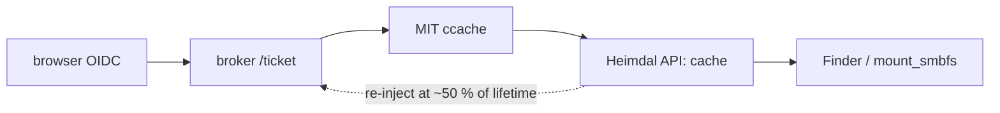

# kerbridge-agent-macos — NAS Access menu-bar agent for macOS

This crate does not implement the protocol. It links `kerbridge-client` library.
The CLI and Windows agent also link this library. This prevents protocol drift.
See [`../DESIGN.md`](../DESIGN.md).



## Differences from Windows agent

Research spike `macos-ticket-injection` measured all differences.

**No repackaging.** Heimdal reads the broker's MIT ccache v4 format. No KRB-CRED
conversion is needed. The agent still uses `krbcred` to read ticket times.

**No enrollment. No elevation.** A Mac resolves the realm from DNS. The KDC
issues a `cifs/` ticket without prior enrollment. macOS has no `ksetup` command.
This bundle contains no privileged helper. The agent never prompts for
administrator access.

**No NTLM-fallback repair.** When a ticket expires, the mount fails. The user
sees "server disconnected". The system clears the error after 10 minutes. A
reconnect then works. The agent disables the repair code:
`ntlm_fallback_recovery = cfg!(windows)`.

**No confirmation dialogs.** Windows needs dialogs for enrollment, repair, and
device grants. macOS has none of these. `Host::elevating` is empty.
`Host::finished` is unreachable. Three action labels name Windows. They are
unreachable. `RealmNotRegistered` cannot occur. `enroll::state` always returns
`Enrolled`.

**Badge is monochrome.** The agent draws the badge. It shares icon code with
Windows: `kerbridge_client::icon`. Windows colors the badge. macOS does not. The
menu bar renders at 36px. Windows renders at 16px. The badge glyph is
transparent, not colored. Template images have one color. Contrast comes from
alpha.

**Re-injection schedule unchanged.** macOS does not renew injected TGTs. A mount
can cross the ticket end time. This works only when a fresh TGT exists in the
cache. The agent re-injects at 50% of ticket lifetime. This matches Windows.

## File layout

- `main.rs` — menu-bar item, tick loop, and `MacHost` (this platform's
  `agent::Host`)
- `menu.rs` — the menu (also the status window on this platform)
- `icon.rs` — shared logo, composed for state, left as template
- `ui.rs` — AppKit: main-thread hand-off, alerts, Notification Center, sheets

The client core contains: state machine, schedule, state actions, all
user-visible text.

## Menu is the status window

Windows uses a flyout. Tray icons have no other surface. Menu-bar items do have
a surface. macOS agents use disabled menu items to show state. The agent uses
one surface. `Host::raise` opens the menu.

`menu::plan` is a pure function of `Status`. The menu is a pure function of that
plan. This makes change detection a comparison, not a guess.

Two consequences:

- The 1 Hz timer uses `NSRunLoopCommonModes`. Menu tracking would otherwise stop
  the re-injection schedule.
- The menu is not replaced during tracking. `menuDidClose:` redraws changes.
  `status_closed` runs here.

**Cloud sign-out follows the action list.** This platform never promotes it.
There is no Secure Enclave key. There is no grant. `just_authorized` is never
true.

## TGT location

The TGT goes to the login session's Heimdal `API:` cache. `gssd` uses this
cache. Finder uses `gssd`.

The agent writes the default cache. Exception: the default cache belongs to
another identity. The agent then reuses a cache that matches this principal. The
agent creates a new cache only as a last resort. It logs a warning.

The agent uses `krb5_cc_initialize` in its own cache. This evicts the stale
`cifs/` ticket. Group changes then take effect. This matches the realm-scoped
purge on Windows.

**The agent does not use `krb5_cc_copy_creds`.** It fails with `KRB5_CC_NOMEM`.
Heimdal's `klist` reads the same cache. Reproduced from C. The agent stores
credentials one at a time.

## Settings, notifications, autostart

**Settings uses `NSAlert`.** This is delayed-commit. Windows uses instant-apply.
That model does not cross. `settings_ok` and `settings_cancel` exist on this
platform. Windows OK and Cancel do not exist.

**Notification policy is unchanged. All mechanisms are from Windows.**

- `NIIF_*` severity maps to interruption levels. `Passive` for information.
  `Active` for other severities. The agent never uses `TimeSensitive`. This
  needs an entitlement. It is for urgent messages.
- Quiet time and attribution header come from the bundle.
- macOS has no `GetLastInputInfo`. The presence-gated grant deadline does not
  work.
- A click that opens the surface needs `UNUserNotificationCenter` delegate. This
  agent has none.
- Gate 2 checks: is a surface on screen? Answer: the menu is open.

**Autostart uses `SMAppService`.** The app registers as a login item. It does
not use a `RunAtLoad` plist in `~/Library/LaunchAgents`. macOS records that as a
launchd job. System Settings shows the executable name and generic icon. The app
registration puts the bundle name and icon there. Login starts the `.app`. This
requires `LSMinimumSystemVersion` 13.0.

**Configuration and logs are per-user.** Location:
`~/Library/Application Support/KerBridge/`. The policy layer is a forced managed
preference. Domain: `org.kerbridge.agent`. It must be forced.
`CFPreferencesCopyAppValue` would otherwise promote user's `defaults write` to
policy. This locks Settings against the user who set it.

## Build

```sh
make check   # build + clippy + core tests (real on this platform)
make app     # dist/NAS Access.app, ad-hoc signed
```

Native build only. The `.app` is assembled on a Mac. No container can substitute
(unlike Windows).

**The bundle is ad-hoc signed. It is not notarized.** Ad-hoc signature is enough
for Notification Center. It runs locally. Shipping to other users needs:
Developer ID signature, notarization. The publisher does this at release time.
See [`docs/setup/rough-edges.md`](../../docs/setup/rough-edges.md).

## Not implemented

**No native token source.** Windows agent uses WAM. WAM issues a broker token
from the machine's sign-in. macOS counterpart is Company Portal SSO extension.
This is a deployment dependency. It needs a spike. Until measured, `native_token`
reports `Unavailable`. Every sign-in uses the browser.

**`Settings::windows_sign_in` returns stored flag `&& cfg!(windows)`.** The flag
defaults to on. It travels with `config.toml`. Reading it raw would make this
platform claim a capability that does not exist. One accessor owns the flag. The
platform check cannot be forgotten at other call sites.

**No device grant.** Secure Enclave key is the macOS counterpart of Windows TPM
key. Enclave key needs keychain-access-group entitlement. This needs the signing
story first (see above). `device::AVAILABLE` is false. A grants-enabled
deployment does not offer authorization to this Mac. The Mac would refuse it.
*Remove authorization…* is unreachable. Nothing can create the grant to remove.
</content>
