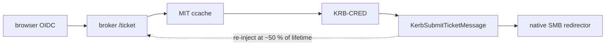
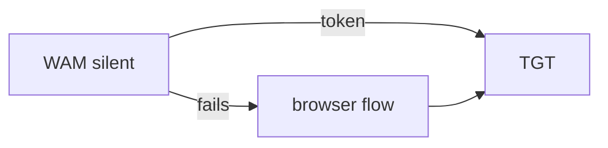

# kerbridge-agent-windows — the NAS Access systray agent

The KerBridge client as a **per-user background agent**: browser sign-in
to the cloud IdP → token exchanged with the broker for a real KDC-signed TGT →
injected into the current Windows logon session → re-injected so the ticket never
lapses. Stock Explorer and the stock SMB redirector then reach the realm's shares
with no password and no custom client.

[`../DESIGN.md`](../DESIGN.md) is the client design, and
[`DESIGN.md`](DESIGN.md) is what this platform does that the other does not. The
protocol is not implemented here — it links the `kerbridge-client` library, the same
code the CLI uses, so the two cannot drift.



## Why it re-injects rather than renews

Measured, not assumed:

- Windows *does* renew an injected TGT at T−15m and the KDC *does* grant it — but
  Windows never installs the result.
- A TGT that expires while an SMB session is open drops the redirector into an
  NTLM fallback it never leaves — and one that cannot succeed, since the realm has
  no password for a cloud identity. Only an elevated `LanmanWorkstation` restart
  clears it.

So the timer that re-injects at half of ticket lifetime is not a convenience
feature; it is what prevents the worst failure mode the research found.

## Layout

Two moving parts:

- the Win32 UI, and `WinHost` — the methods
  `kerbridge_client::agent::Host` asks for
- the administrator one-shots, which run as a separate elevated process

The rest is support — theming, Win32 plumbing, and the WAM token source. The
state machine, the re-injection schedule and every user-visible string are in the
core, not here: they are the product's and not this platform's, and a second agent
reimplementing them would be a second chance to get the schedule wrong. Which file
is which, and why each is shaped that way, is on the modules themselves;
`src/main.rs` names them, and [`DESIGN.md`](DESIGN.md) has the surfaces.

## States

There is no state enum. The surface is a **description layer** over the
independent values the core reports — `condition`, `blockers`, `actions`,
`in_flight` and `next_attempt_at_earliest` — none of which masks another, and
`condition` is a pure function of local facts: a *usable* ticket is held,
this machine is supposed to be working here, and a silent renewal can land.
[`../DESIGN.md`](../DESIGN.md) is authoritative and carries the conditions,
the derivation, the transition table, the words and the icon.

The icon is the logo in the taskbar's own ink, with weight carrying whether
anything needs attention and one bottom-right badge carrying the fault. The badge
is the one place color is spent, and only on Windows: 16 px leaves no contrast
to separate a full-ink overlay from a full-ink mark.

Sign-out is **ticket-cache only** — it purges this realm's tickets and drops the
in-memory refresh token. An SMB session already open keeps serving until Windows
drops it; forcing it closed risks open-handle data loss, and revocation is
enforced at ticket granularity by design.

## Skipping the browser when Windows can sign in silently

**On by default** (Settings → *Skip the browser when Windows can sign in
silently*). WAM goes in front of the browser: on an Entra-joined machine Windows
issues the broker token from the PRT that Windows Hello already unlocked, so
sign-in *and every re-injection* happen with no browser and no prompt — and this
process never holds a refresh token at all. Measured, not assumed:
research spike `windows-wam-whfb-silent-token`.

The call is **silent, and only silent**, on every ordinary path:



A silent success is the working test for "Windows holds a usable PRT". A silent
failure means it does not, and WAM's own dialog would then be the *Sign in to all
apps and websites on this device?* prompt — Workplace Join, not a sign-in.
Answering that *"No, this app only"* leaves an account that can never renew
silently, so the failure is not escalated into Windows; it goes to the browser,
which costs one tab and yields a refresh token that renews unattended.

The one exception is a sign-out, whose whole meaning is *re-authenticate me*: if
Windows is what signed you in, the next sign-in shows WAM's dialog deliberately.

Two things to know:

- The public client must have `ms-appx-web://microsoft.aad.brokerplugin/<client id>`
  registered as a redirect URI. Without it the interactive call fails on a
  redirect-URI mismatch, and the client cannot fix that itself.
- Conditional Access may want an MFA the PRT alone cannot satisfy. That shows up
  as a silent failure, and therefore as the browser flow.

Anything that goes wrong — not Entra-joined, no broker plugin, a WAM error — is
one log line and a fall-through to the browser flow, so the toggle is a
preference, never a dependency. Turning it off forces the browser.

## Skipping the sign-in entirely with a device grant

Off unless the deployment enables it. **Settings → Advanced options → *Skip
browser sign-in on this device*** puts a non-exportable key in this machine's
TPM that stands in for the user sign-in for a number of days the deployment
chooses. A machine holding a grant signs in by itself at startup, the same menu
entry then reads *Keep skipping browser sign-in — N days left* and re-authorizes
in place, and **Remove authorization…** gives the grant back — the key is deleted
first, so that half works offline. **Sign off** does not: it purges this realm's
tickets and the machine keeps its authorization. What the grant costs and how to
run it, including unattended machines:
[`docs/setup/device-grants.md`](../../docs/setup/device-grants.md).

## Order of operations: enrollment, then the Entra bind

They are separate, and enrollment comes first — it is what makes an injected
ticket mean anything.

1. **Broker URL**, then `GET /config` over TLS. **Unauthenticated**: the realm,
   KDCs and OIDC parameters are public, so no token exists yet and none is needed.

   ```mermaid
   flowchart LR
     h["HKLM policy"] --> c["config.toml"]
     c --> s["SRV record"]
     s --> g["GET /config (TLS)"]
   ```

   A `_kerbridge._tcp.<domain>` SRV record in the machine's own DNS domain is
   looked up at startup when the first two are silent, so an operator who already
   publishes `_kerberos._udp` need push nothing to the workstation.
2. **Enrollment** (`--enroll`, elevated one-shot, only when Windows does not
   already know the realm) — re-fetches `/config` itself and runs `ksetup`. Still
   no Entra involvement: nothing here talks to the IdP, and nothing here prompts
   for an identity. That matters, because the elevated process may be running as
   a *different* (administrator) account; a sign-in there would bind the wrong
   user. Reboot if Windows asks for one.
3. **Sign in** — the first Entra bind, and the only place a WAM or browser prompt
   can appear. This is where the one-time WAM interaction happens, if the tenant
   demands one. With *Start at login* on, every logon after that one signs in
   by itself: the tray tries WAM silently at startup (three goes, 20 s apart, to
   ride out a logon/network race) and stays quietly signed out if Windows has no
   credential to give — no window, no balloon.
4. **Re-injection** at ~50 % of ticket lifetime — silent from then on.

The one-time interaction is **not** part of enrollment. Enrollment is a machine
fact (an administrator's), the bind is a user fact (the signed-in user's), and
they are deliberately not made to depend on each other.

## Config and logs — `%APPDATA%\KerBridge\`

| File | Contents |
|---|---|
| `config.toml` | `broker_url`, `ntlm_fallback_recovery` and `windows_sign_in` (both default `true`), and a `[cache]` copy of the broker's Kerberos block. |
| `kerbridge.log` | One line per event; "Open log" in the menu points here. |
| `kerbridge.log.1.gz` … `.3.gz` | Earlier history. The log rotates at start when it has passed 10 MB; collect these too. |

**No secret is written anywhere.** The refresh token lives in process memory and
dies with the process; the access token is discarded as soon as the ticket comes
back.

Machine policy overrides the file and wins:

```
HKLM\Software\KerBridge\BrokerUrl             (REG_SZ)    -> Settings field goes read-only
HKLM\Software\KerBridge\NtlmFallbackRecovery  (REG_DWORD) -> 0 disables all NTLM-fallback machinery
```

Autostart is the per-user `Run` key (`HKCU\...\CurrentVersion\Run`), toggled from
Settings. Per-user is required, not merely convenient: injection has to happen in
the interactive user's own non-elevated logon session. It also does what the
checkbox says — *sign in* automatically, not merely start — whenever Windows can
serve the credential silently.

## Build

Cross-compiled to Windows from macOS, Linux, or CI — no Visual Studio:

```sh
brew install mingw-w64            # or: apt-get install mingw-w64
rustup target add x86_64-pc-windows-gnu

make build        # -> ../target/x86_64-pc-windows-gnu/release/kerbridge-agent.exe
make icon         # only when the logo changes; needs rsvg-convert + ImageMagick
make installer    # -> ../dist/windows-kerbridge-nas-access-gui-amd64.msi
                  #    needs Docker, nothing else
```

`make installer` is the odd one out: it builds inside Docker rather than on the
host, because packaging needs wixl and msitools and those are not dependencies
this repo asks a developer to install. The MSI installs both exes to
`%ProgramFiles%\KerBridge\` with a Start-menu shortcut, and writes a machine-wide
autostart entry only when asked (`msiexec /i
windows-kerbridge-nas-access-gui-amd64.msi AUTOSTART=1 /qn`, which is what a
fleet push does — an interactive install leaves autostart to the *Start at
login* checkbox in Settings). Uninstall keeps your settings
(`%APPDATA%\KerBridge\`) unless you say otherwise with `msiexec /x
windows-kerbridge-nas-access-gui-amd64.msi REMOVESETTINGS=1`. An interactive install ends on a completion dialog; `/qn` and `/qb` stay silent. It is **unsigned**: signing
is a release-time act by the publisher. Authoring is
[`installer/nas-access.wxs`](installer/nas-access.wxs), plus `installer/ui/*.idt` for
the completion dialog — wixl cannot author UI, so those tables are imported into
the built database (see the `msi` stage of [`Dockerfile`](Dockerfile)). What is
still rough about the installer is in
[`docs/setup/rough-edges.md`](../../docs/setup/rough-edges.md).

`x86_64` on purpose: the production client is an amd64 workstation, so this is
the shipping artifact, and the ARM64 dev VM runs these exact bytes under x64
emulation rather than a native build that would never ship.

## Running it the first time

1. Start `kerbridge-agent.exe`. With nothing configured it opens the
   flyout on **Setup needed**.
2. Settings → broker address (type `broker.example.site`; `https://` is prepended
   for you, and plaintext `http://` is still refused) → OK. Skip this if DNS
   publishes `_kerbridge._tcp.<your domain>`: the field is already filled in with
   what it found.
3. Sign in. The browser opens; finish there.
4. If Windows does not know the realm yet, the tray offers **Set up now** — an
   elevated one-shot that shows the literal `ksetup` commands, runs them, and
   asks to reboot when Windows needs one.

`kerbridge.exe` ships alongside and does the same things one shot at a time with
visible output — the tool to reach for when the tray itself is the suspect.
