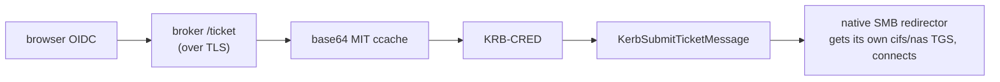

# kerbridge-client — the client core, and its CLI (Rust)

Signs in to the cloud IdP in the system browser, exchanges the access token with
the KerBridge broker for a real **TGT**, and puts that TGT in the current login
session's ticket cache — the LSA on Windows, Heimdal on macOS — so that the
platform's own SMB client reaches `\\nas1.example.site\share` transparently.

[`../DESIGN.md`](../DESIGN.md) is authoritative for everything below: the broker
contract, the ticket lifecycle, the status model and the words.

- `src/lib.rs` — the client core. Every protocol decision lives here.
- `src/main.rs` + `src/cli/` — thin console front end over the same library:
  `main.rs` is the flags and what they dispatch to, `cli/` is one module per
  subject behind them. Not part of the library. Ships **alongside** the tray,
  with the same capabilities minus the background lifecycle.
- `src/agent/` + `src/strings/` — what a background agent is *besides* its
  windows: the state machine, the re-injection schedule, and every user-visible
  string in eleven languages, one file per language. A platform's agent supplies
  the UI behind `agent::Host` and owns nothing else. Inside `agent/`, the seam is
  the UI thread: `commands` is what the host calls, `status` is what it reads,
  `worker` is what blocks and reports back, and `failure` names what went wrong.
- `src/{describe,present,icon}.rs` — what the machine's state *means*, the words a
  surface says it in, and what the state icon is made of. Here rather than in an
  agent crate for the reason `strings/` is: two agents wording one refusal
  differently, or badging one condition differently, is two answers of which one
  is wrong. What each surface still decides for itself is which offer is primary
  and how much of it fits.
- `src/{config,device,elevate,enroll,repair,srv,sys,tickets,time}.rs` — one file
  per subject that differs by platform: what both platforms agree on, and one
  `#[cfg_attr(path)]` naming its two arms.
- `src/windows/` + `src/macos/` — those arms, one file per subject, so "what does
  this do on Windows" has one place to look. Neither is a Rust module (no
  `mod.rs`, no `platform::` path); each file is reached by `#[path]` from the
  subject that owns it. `windows/reg.rs` and `macos/cf.rs` are that platform's
  toolbox rather than an arm, and sit there for the same reason.
- [`../kerbridge-agent-windows/`](../kerbridge-agent-windows/) links this library rather than
  reimplementing it, so the shipping agent and the tool you debug with cannot
  disagree about what the broker said.
- Only bootstrap input is a **broker URL**. IdP authority, client id, scopes and
  realm are all discovered from the broker — agnostic to what realm or IdP sits
  behind it.



Which module owns which leg is documented on the modules themselves: `src/lib.rs`
sketches the pipeline, and each module's own header says what it does and why it
is shaped that way.

Injection alone needs no host setup at all. On Windows the SMB leg additionally
needs the realm registered, which `--enroll` does for you; macOS needs nothing.

## Build

**The default target is the host.** Every subject has a macOS arm, so a host
build links and `cargo test` on a Mac runs the real Kerberos and DNS code rather
than stubs.

```sh
cargo test                                    # the core, on this host
cargo build --release --target x86_64-pc-windows-gnu
# -> ../target/x86_64-pc-windows-gnu/release/kerbridge.exe  (PE32+ x86-64 console)
```

**The Windows build is cross-compiled** from macOS, Linux or CI, and it names its
target explicitly; the Makefiles and the Dockerfile pass it. It needs only the
MinGW-w64 toolchain (`brew install mingw-w64`, or `apt-get install mingw-w64`)
and `rustup target add x86_64-pc-windows-gnu`. No MSVC, no Windows SDK, no VS
Build Tools. `../.cargo/config.toml` names the linker and says why x86_64 is the
shipping target.

## Run

The broker is reached over TLS, and its certificate must validate against the
OS trust store — **install the LAN CA root there first**.

There is no built-in default broker URL: guessing one would be guessing who may
authenticate this machine.

Broker URL precedence — the CLI reads the same configured value the agent uses:

1. `--broker` (wins)
2. the machine policy — `HKLM` on Windows, a forced managed preference on macOS
3. `config.toml` in the per-user state directory

The binary is `kerbridge.exe` on Windows and `kerbridge` on macOS. The rows below
that register or repair the realm are **Windows only**; on macOS they report that
there is nothing to do.

| Command | What it does |
|---|---|
| `kerbridge.exe --broker https://kerbridge.example.site` | Browser sign-in, then inject (verify with `klist` afterwards). |
| `kerbridge.exe` | Same, once the tray (or a previous run) has stored the broker URL. |
| `kerbridge.exe --verify \\nas.example.site\share` | Prove the SMB leg end to end: read README.txt and write a stamp file. |
| `kerbridge.exe --sign-off` | Drop this realm's tickets from the logon session (realm-scoped, never blanket). The device grant survives. |
| `kerbridge.exe --enroll-status` | What does Windows currently believe about the realm? |
| `kerbridge.exe --enroll` | Register the realm with Windows (prints the exact ksetup batch, then elevates). |
| `kerbridge.exe --reenroll` | Force re-apply that registration even if Windows already looks set up — the fix for a partial or stale registration (elevates). |
| `kerbridge.exe --unenroll` | Remove the realm's registration from Windows — the inverse of `--enroll`; a reboot finishes it (prints the keys to delete, then elevates). |
| `kerbridge.exe --repair` | Clear a stuck NTLM fallback by restarting the Workstation service (elevates; **drops every SMB session on this machine**). |
| `kerbridge.exe --grant` | Authorize this machine to skip the browser sign-in — [device grants](../../docs/setup/device-grants.md), if the deployment enables them. Signs in first. |
| `kerbridge.exe --grant-status` | What this machine claims to hold vs. what its TPM holds. Offline. |
| `kerbridge.exe --grant-list` | Every authorized device on the account (signs in). |
| `kerbridge.exe --grant-give-up` | Hand this machine's own grant back. Offline, no sign-in. |
| `kerbridge.exe --grant-revoke <id>` | Stop another device (signs in). |
| `kerbridge.exe --no-grant` | Ignore the stored grant for one run and use the browser (`--token-file` implies it). |
| `kerbridge.exe --renew N` | Re-inject every N minutes with the *same* access token. A debugging aid, not a lifecycle. |

Skip the browser with a token from `pkce.py` (debugging):

```sh
python3 testbench/entra-tenant/pkce.py alice
jq -r .access_token secrets/user_token_alice.json > secrets/access_token.txt
kerbridge.exe --token-file secrets/access_token.txt
```

A file and not a value: a command-line argument is visible in the process list to
anyone on the machine, and an access token is a live bearer credential.

- **Without `--token-file`** — the helper opens the system browser for auth-code +
  PKCE sign-in, catches the redirect on an ephemeral `127.0.0.1` port, and
  exchanges the code for a token. No fixed redirect port is registered because
  Entra ignores the port when matching a `http://127.0.0.1` loopback URI.
- **A rejected token** surfaces the broker's categorized reason (401 invalid
  proof, 403 not admitted, 5xx server-side, transport = unreachable) rather than
  an opaque failure.
- **Silent refresh belongs to the tray**, which holds an `offline_access` refresh
  token in memory and re-injects at half of ticket lifetime. Run the tray for
  that.

## Host setup for the SMB leg (one-time)

Injection needs none of this. It is only what lets the redirector turn the TGT
into a `cifs/<nas>` ticket and connect.

1. **Register the realm with Windows** — `--enroll` prints the exact `ksetup`
   batch, elevates, and runs it. Reboot if Windows asks. Doing it by hand is
   documented in [`docs/windows-testbench.md`](../../docs/windows-testbench.md).
2. **Reach the share by hostname, never by IP.** SMB forms the SPN from the name
   it was given, so `\\192.0.2.10\share` produces no `cifs/` SPN and falls back
   to NTLM.
3. **Clock** — stay inside the 300 s Kerberos skew window.

## Notes / scope

- **Per-user agent model:** injects into the caller's own session (LogonId 0),
  which needs no privilege — and must not have any. An elevated process is a
  different LUID with a different ticket cache, and a ticket landed there is
  invisible to the SMB redirector (measured). Only realm registration
  (`--enroll`/`--reenroll`/`--unenroll`) and `--repair` elevate, and they touch
  no tickets. A LocalSystem service injecting into another user's LUID (needs
  `SeTcbPrivilege`) is a later productionization.
- **`klist` is never used, and `klist get` never will be.** A failed
  `KerbRetrieveTicket` destroys the injected TGT (measured 2/2), and `klist purge`
  has no realm filter — it would take the user's own cloud TGT with it on an
  Entra-joined machine. Everything goes through the LSA API, realm-scoped.
- `klist purge` from a shell still removes an injected ticket if you want a clean
  slate by hand; prefer `--sign-off`, which is scoped.
- **Logs** land next to the agent's, in the per-user state directory
  (`%APPDATA%\KerBridge\kerbridge.log`, or
  `~/Library/Application Support/KerBridge/kerbridge.log`). An elevated
  `--enroll` run started from a *standard* user account writes to the
  administrator's profile, not the signed-in user's.
