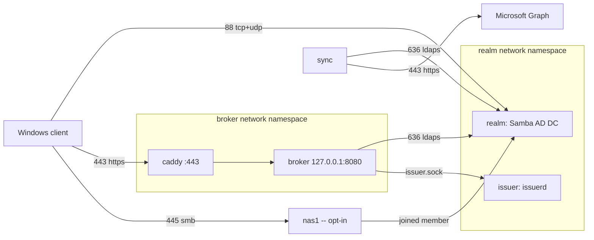
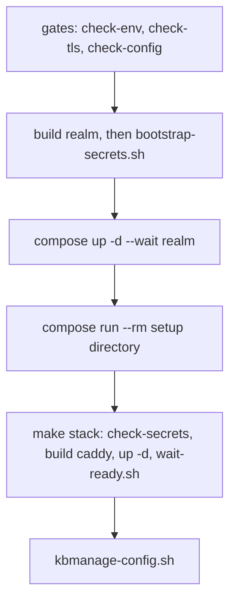

# Deployment

The `kerbridge` Compose project: the realm, the issuer, the broker, Caddy and
sync. This file is the reference behind the deployment procedure —
how the containers are assembled and run, and the traps in each part.

- **Deploying KerBridge** — follow [`../SETUP.md`](../SETUP.md) and its topic
  guides. They are sufficient on their own: nothing here is a step you are
  missing. This file is for leaving that path, for debugging below the level it
  describes, and for changing the stack itself. `DESIGN.md` is authoritative for
  what each service *is*.
- The Entra setup can be generated rather than clicked through:
  [`terraform/entra/`](terraform/entra/) creates the registrations and prints
  the resulting values as the `[provider_config]` block to paste into
  `configs/idp_entra.toml`.

## Topology



All containers are in [`compose.yaml`](compose.yaml). `make up` builds them from
this repository, and every base image is pinned by digest.

| Service | What it does | Published |
|---|---|---|
| `realm` | The domain: Samba AD DC, KDC and Samba DNS. | 88 tcp+udp (KDC, all interfaces), 389 and 445 (a member joins through these), 636 LDAPS and 53 DNS (not published by default) |
| `issuer` | The custom `issuerd`. It is the only component that makes TGTs. It runs from the `realm` image, and it shares that container's volumes and network namespace, because it needs local access to the AD databases. A Debian deployment runs the same two programs as two systemd units. | none |
| `broker` | It validates the Entra token, finds the identity under `OU=Entra,OU=CloudIdP,<base DN>` through LDAPS, and asks `issuerd` for the ticket through a unix socket. It holds no KDC authority. It runs unprivileged, with a read-only rootfs, and it executes nothing. | 443, on behalf of `caddy` |
| `caddy` | The TLS terminator in front of the broker, and the only component that a client connects to. It shares the broker's network namespace, so that their loopback is the one that host networking gives them in production. | — (uses the broker's) |
| `sync` | It reads the users and groups of each configured source from MS Graph, one source after another, over its own LDAP connection. It writes them to the `realm` directory over LDAPS as `svc-kerbridge-sync-entra`. A source stays idle until `secrets/idp/<name>/credential` has content. | none |
| `nas1` | **Optional.** A joined Samba member, so that the full path operates on one machine. It is a fixture, not a product — [`nas1` is not part of this stack](#nas1-is-not-part-of-this-stack). | 445 |

`realm` and `broker` run with `cap_drop: ALL` and `no-new-privileges`. `realm`
gets back only the capabilities that measurements showed necessary. The
permanent state is in three Docker volumes: `samba` (domain SID, KDC keys,
directory, SYSVOL), `etc-samba` and `caddy-data`. All other data is tmpfs, or
the stack can make it again. To back the volumes up, see
[Backup and restore](#backup-and-restore).

## Make targets

`deploy/Makefile` holds every compose target; the root Makefile forwards to it,
so `make up` works from either directory.

| Target | What |
|---|---|
| `build` | `docker compose build` |
| `up` | fresh clone → running stack; the ordered steps below |
| `stack` | the rest of the stack, once the directory is bootstrapped |
| `secrets` | `scripts/compose/bootstrap-secrets.sh` — the host tree, prepared by the shipped helper |
| `directory` | `docker compose run --rm setup directory` |
| `kbmanage-config` | the realm CA and config set a host-run `kbmanage` needs; re-run after a realm rebuild |
| `seed` | `scripts/bench/seed-demo.sh` — bench only |
| `ready` | the readiness report, against whatever is already running |
| `test-notification` | one synthetic `info` event through the configured webhook, past the severity floor and the rate limit |
| `down` | `scripts/compose/teardown.sh` — by project name, so a lost or missing `.env` cannot stand between you and your own stack |
| `clean-report` | what this project has left on the host; removes nothing. `make clean` in the repository root calls it |
| `clean-docker-images` | stops the stack and removes the built images |
| `clean-docker-volumes` | destroys the realm — typed confirmation, or `YES=1` to skip it |
| `check-env`, `check-tls`, `check-config`, `check-secrets` | the gates; each refuses rather than warns, and explains the fix |

`scripts/bench/ci-stack.sh` has no target here — it is `make test-stack` from the
repository root, and it is not a way to run this deployment. It runs a *second*
one: a realm provisioned from an empty volume, a ticket issued against it from a
locally issued token, and a file read over SMB with that ticket, after which it
deletes everything. Safe to run while this stack is up — it works in a gitignored
copy of the tree with its own compose project, container names, subnet and
published port, and never reads or writes your `.env` or `secrets/`.

The test has a shared provisioning script and a stack tier.
`scripts/bench/provision.sh` creates the isolated stack and waits for `/config`.
It does not name an identity source. `ci-stack.sh` selects Entra, provides the
source-specific configuration, and runs the assertions.

`scripts/bench/ci-authentik.sh` is the second stack tier — `make test-authentik`
— and the same shape over the same `provision.sh`. It puts a pinned, live
authentik on the compose network behind this Caddy on `idp.kbci.test`, so the
broker fetches real signing keys over TLS instead of reading a key document off
disk; answering `/config` at all is the proof that fetch succeeded. It then
checks that sync refuses the authentik source by name, because this build carries
authentik's token face and not its directory one. Unlike `test-stack` it pulls
images, so it needs the network.

## `make up`, step by step



Run this rather than `docker compose up`, which on a fresh clone fails with `bind
source path does not exist: .../secrets/generated/realm_admin_password`:
`secrets/` and `state/` are gitignored and Docker refuses a missing bind source
before any container starts — worse, it *creates* a missing one, root-owned, as
an empty directory nothing unprivileged can then remove. So the tree is prepared
first, by `/usr/libexec/kerbridge/prepare-state` in a throwaway root container:
the same helper `kerbridge-config`'s postinst runs on a Debian deployment, which
is why the image it comes from has to be built before this step rather than
after. The steps are idempotent and also runnable by hand:

```sh
docker compose build realm            # carries prepare-state, which the next line runs
scripts/compose/bootstrap-secrets.sh  # directories, and empty files where credentials go
docker compose up -d --wait realm     # DC provisions; --wait, because the next
                                      # step talks to sam.ldb and `up -d` returns
                                      # as soon as the container exists
docker compose run --rm setup directory   # prod-safe: the OUs, the svc-* accounts, delegations
docker compose up -d                  # broker + caddy + sync
```

- `stack` rebuilds the caddy image before starting it, alone and unconditionally.
  Its correctness follows a `.env` value rather than source you edited —
  `TLS_STRATEGY` and `CADDY_DNS_MODULE` are build args — so switching strategy
  otherwise leaves an image that silently does not match and compose does not
  notice. Cached this is ~0.3 s.
- That final `up` needs no secret from you: `sync` idles without one, and the
  service passwords were generated by the step before it.
- The certificate is the exception, so `make up` refuses to start until it is
  settled — see [Certificates](#certificates) for what each strategy needs.

<details>
<summary>Why the certificate is a gate rather than a warning</summary>
Compose binds `secrets/tls` as a *directory*: a missing certificate raises no
bind error the way a missing secret does, so caddy would restart-loop while
`up -d` exited 0. It runs before the realm is provisioned, since provisioning
bakes the realm identity into a durable database.

</details>

### The directory step is split by tier

- **`docker compose run --rm setup directory` is what every deployment runs.**
  It is `kbsetup directory`, the same binary a Debian deployment runs from
  `/usr/sbin`, in a throwaway container that holds `secrets/generated/` and
  nothing else. It creates:
  - `OU=CloudIdP` and `OU=Entra` inside it (which `kerbridge-sync` writes into
    but never creates) and
    `OU=Resources` (deliberately outside it, for the operator's own groups)
  - `svc-kerbridge-broker`, `svc-kerbridge-sync-entra` and `svc-kerbridge-manage`, with freshly generated
    passwords
  - the delegations: a confined `OU=Entra,OU=CloudIdP` write for `svc-kerbridge-sync-entra`; `OU=Resources`
    write plus `OU=CloudIdP` delete-child and nothing else for `svc-kerbridge-manage`
- **`scripts/bench/seed-demo.sh` is bench only.** It hand-provisions the
  admission group, a demo user with its external identity, and the
  resource-group chain, so the broker's end-to-end path can be proven without
  `sync` running. It names the admission and device-grant groups itself --
  `SEED_ADMISSION_GROUP` and `SEED_GRANT_GROUP` override the defaults -- because
  the broker finds a role group by the marker the seed stamps on it, and the
  source file binds by object id and states no name. The accounts come from
  `bench.env`.

## Readiness

`make up` ends with `scripts/compose/wait-ready.sh`. It polls each service until it
settles, prints one line each, and exits non-zero on anything still broken at the
deadline. `endpoint` is the check worth understanding, and it is the one the
script does not answer itself: it runs `kbmanage endpoint https://$BROKER_FQDN`,
the same command a deployment with no Compose around it would run, and reports
what that says.

- one HTTPS request for `/config`, which passes only if TLS terminates, the route
  matches and the broker answers behind it
- a broker serving several sources *legitimately* refuses an unprefixed
  `/config` and answers 404 with the list; a path nothing routed answers 404 with
  an empty body. Both are 404, so the check reads the body — a criterion that
  does not either calls a healthy multi-source deployment broken or passes a
  deployment whose route was never wired
- reaches the port with `--resolve` rather than a name lookup, since
  `BROKER_FQDN` is answered by the site resolver for the clients and need not
  resolve on the host running the stack
- under the acme strategies the certificate is judged against the public roots,
  because that is what issuance was asked for and what a client's own store will
  say. Under `external`, and against an `ACME_CA` staging directory, the verdict
  is reported and not acted on: that certificate is the operator's business

The probe runs in a one-shot container inside the broker's network namespace —
`scripts/lib.sh` @ `kbmanage()` says why, and what that gives up.

`READY_TIMEOUT` — bounds the wait. 180s under `external`, 300s under the acme
strategies, which have to complete an issuance before `:443` will complete a
handshake at all.

ACME DNS-01 is the slow one: it waits out a propagation delay before it even begins a
propagation check, so a first-time issuance that works still takes around 90s,
and Caddy's first retry backoff is another 60s on top. Until then the endpoint is
*pending*, not failed — a certificate-less Caddy listens on `:443` and refuses the
handshake, which is indistinguishable from a broken one except by waiting.

<details>
<summary>Why a readiness check exists at all</summary>

`docker compose up -d` exits 0 once the containers are *created*, and the
interesting failures happen after that:

- caddy under an acme strategy never obtaining a certificate and retrying forever
- the broker starting but failing to reach LDAPS or the issuer socket, so caddy
  answers 502
- a container crash-looping

None of those changes the exit status of `up`, and all of them are invisible
without reading logs you have no reason to suspect.

</details>

## The `sync` credential

`sync` starts with everything else and idles a source until its
`secrets/idp/<name>/credential` has content; writing it is the whole of
enabling that source
([`SETUP.md` step 4](../SETUP.md#4-stand-up-the-broker-host)). There is no switch
to flip, and no restart — the service re-checks the file on a poll.

Why? `secrets/idp` is a directory mount, so an absent or empty credential
file inside it is not a refused bind mount — sync skips that source for the
cycle with a warning, and every other source still mirrors. Only emptiness is
forgiven: a credential that is present but wrong, such as the portal's *Secret
ID* GUID, still fails configuration loudly.

<details>
<summary>Why not a `sync` compose profile</summary>

This replaced a `sync` compose profile, which solved the missing-source problem
but created a worse one: a profiled service is not an orphan either, so a plain
`docker compose down` left `kerbridge-sync` running and holding the `sock` volume
and the network open, and removing either then failed with *resource is still in
use*. Teardown surprising the operator was the higher price.

</details>

## Operator notification

A few conditions are only actionable by a human and are invisible in a log
nobody reads: the sync credential expiring, the admission group deleted or
duplicated, a sync cycle that keeps failing, device grants coming up on their
deadline. Each one is a
`NOTIFY <severity> <event>: <message>` line in the service log **always** — that
part needs no configuration and is what a deployment gets by default. A webhook
URL in `secrets/notify_url`, and a `notify.url_file` pointing at that file, is
what also delivers them somewhere you look. Both are needed: the secret holds
the URL, and the option says to use it.

```sh
printf '%s' 'https://hooks.example.site/services/T000/B000/xxxx' > secrets/notify_url
chmod 0640 secrets/notify_url          # and chgrp 10002 on Linux; see Secrets
```

```toml
# configs/main.toml, in [notify]. It ships commented out.
url_file = "/etc/kerbridge.secrets/notify_url"
```

```sh
docker compose up -d broker sync       # the URL is read at start
make test-notification                 # then look in the channel
```

`make test-notification` sends one synthetic `info` event past both the severity
floor and the rate limit, and reports whether the receiver took it. **Do it.** A
notification channel fails as silently as the conditions it reports, and the
first real event is the wrong moment to find out the URL had a typo in it.

What it will and will not do:

- **One attempt per event, no retry.** A failure is logged and never fails a sync
  cycle or a ticket request. The log line carries no URL — the URL is a
  credential and `reqwest` would otherwise print it in the error.
- **A standing condition repeats every `notify.repeat_interval_hours`** (24 by
  default). An expiry does not: it arrives at 30, 14, 7, 3 and 1 days remaining
  and is silent between those, because a countdown on a repeat interval would
  send you thirty messages.
- **A restart does not re-send everything outstanding.** The record of what has
  been alerted lives in `state/broker/` and `state/sync/`, which
  `scripts/compose/bootstrap-secrets.sh` creates and `backup.sh` collects. Lose it and
  you get one repeat, never a missed event.
- **A condition that clears sends a "recovered", naming how long it lasted.**
  Both halves also carry the current open-problem list, so one message tells you
  what changed and what is still wrong. Sync clears its conditions on a completed
  cycle; the broker clears its one on the next successful login, so that all-clear
  arrives whenever somebody next signs in rather than immediately.
- **A condition that flaps is announced once per repeat interval, not twice per
  flap.** The files still record every transition — only the chat channel is
  calmed down.
- **`https://` only.** The URL is the receiver's only authentication, so a
  plaintext one would publish it to the network. A self-hosted receiver behind a
  private CA sets `notify.ca_file`; a lab that genuinely cannot do either names
  its host in `notify.insecure_host`, which logs a warning for as long as it is
  set and applies to that host alone.

### If you would rather use your own monitoring

You do not need the webhook at all. `state/broker/` and `state/sync/` hold one
`problem-<event>.json` per condition that is **currently true**, written whether
or not a URL is configured and moved out of that class the moment the condition
clears. Counting them is the whole integration:

```sh
ls state/*/problem-*.json 2>/dev/null | wc -l     # 0 means nothing is wrong
```

Each file carries the event, the subject, the severity it was raised at, the
message, and `since` — so a check can alert on count, on age, or on severity. A
Zabbix `UserParameter` wrapping that one-liner, with low-level discovery over the
file names, gets you per-condition items without this project knowing anything
about Zabbix.

Files are written `0640` and the services never set the group, so point them at
whatever group your agent runs as and let the setgid bit carry it:

```sh
chgrp zabbix state/broker state/sync
chmod 2750 state/broker state/sync
```

New files are then group-owned by `zabbix` and readable by it. They are not
world-readable on purpose — subjects carry account names and error text. Nothing
re-permissions these directories afterwards, so this survives restarts and
re-running `scripts/compose/bootstrap-secrets.sh`.

`notify.state_dir` names the *parent*, and each service takes the directory
named after itself under it — `/var/lib/kerbridge/broker`, `/sync`, `/issuerd`.
Here that is invisible, because compose binds `state/broker` and `state/sync`
straight onto them; off Compose it is what keeps the services out of one
directory. A service creates its own if it is absent and never re-permissions
one that is there, so `mkdir` and `chgrp` it first if the agent's group matters
and let the service find it.

`recent-*.json` files are the same records after they have cleared, kept only
until their repeat interval expires. Ignore them unless you want the history.

The body is `notify.template`, empty meaning a default that Slack, Teams,
Mattermost and Rocket.Chat all render. Anything else — a Discord `content`, a
Teams Adaptive Card, your own collector — is a template you write, with
`%EVENT% %SEVERITY% %COMPONENT% %REALM% %TIMESTAMP% %MESSAGE% %DETAIL% %ICON%`
substituted into it. Two rules the services enforce at start rather than at the
first event: an unrecognized `%PLACEHOLDER%` is a configuration error, and the
result has to be JSON. Every substituted value is escaped as a JSON string, so a
placeholder has to sit *inside* one — `{"text":"%MESSAGE%"}`, not
`{"text":%MESSAGE%}`.

`DESIGN.md` § Operator notification lists every event and what raises it.

## Audit trail

Append-only files, written by the services themselves onto bind mounts:

| File | Written by | One line per |
|---|---|---|
| `state/broker-audit/audit.log` | broker | device grant made (`GRANT`) or removed (`REVOKE`) — the account, the grant id `kbmanage device list` shows, and `by=<login>` when someone did it as that account's delegate |
| `state/issuer-audit/audit.log` | `issuerd` | ticket issued (`ISSUE`), and the same two writes from the side that performed them |
| `state/sync-audit/audit.log` | `kerbridge-sync` | cycle that changed the directory: the tally, then one `APPLY <operation> <dn>` per write that landed and one `APPLY-FAIL <dn>: <why>` per write the directory refused. A cycle that changed nothing writes nothing here |

The third is the one whose subject outlives the record. A ticket expires in
hours and a device grant in days, but an account `kerbridge-sync` creates owns
files and is a Kerberos principal until somebody retires it — and nothing else
in the deployment says who was given one. It also records `STALLED` when a
source has discarded three cycles in a row and stopped mirroring, and `RESUMED`
when it starts again, so a stretch during which the directory was not being
updated can be dated afterwards.

Every line is RFC 3339-stamped and is also on the service's console, unchanged —
`docker compose logs broker` still reads as it did. The file exists because that
console copy belongs to a *container instance*: any recreate starts a new one
with an empty log and takes the old one's history with it, and a rebuilt image is
a recreate — `make broker` does one on every iteration. A compose `logging:` block does not help — the json-file driver has no path
option, and no block survives a recreate. The one `compose.yaml` does set bounds
each console log at `10m × 5`, which is rotation and nothing else: the realm
container writes two `Auth:` lines per Kerberos authentication and would
otherwise grow without limit.

The directories are separate on purpose. The broker's mount does not reach
the issuer's file, so a compromised broker cannot unlink the record of what it
asked for, nor sync's record of the accounts it was asking about.

- **Retention is yours.** Nothing here rotates these. Point `logrotate` (or a log
  shipper) at `state/*-audit/*.log`, and pair it with **`create` plus a
  `postrotate` that sends `SIGUSR1`** — every service holds the file open in
  append mode, and reopen the path on that signal. Neither of the alternatives
  keeps the record whole: with `create` alone the service writes on into the
  renamed file, where nobody reads it again, and `copytruncate` loses whatever is
  written between the copy and the truncate. The signal is
  `docker compose kill -s SIGUSR1 broker` for the broker,
  `docker compose kill -s SIGUSR1 sync` for sync, and
  and `docker compose kill -s SIGUSR1 issuer` for the issuer — one form for all
  of them, because each container runs one process and PID 1 is that process. Each
  service says `REOPEN <path>` on its
  console and as the successor file's first line, so a rotation that did not
  reach it is visible.
- **`scripts/compose/backup.sh` includes them**, in both modes, because nothing
  regenerates them.
- **A directory the service cannot write is a startup failure**, not a
  degradation — the deployment asked for a record, and one that is silently
  absent is what the file exists to prevent. `scripts/compose/bootstrap-secrets.sh`
  creates both with the right group, and needs no privilege of yours to do it:
  the container it runs the helper in is the root.
- To turn it off, uncomment `audit_log_file` in the component's TOML file and
  set it to `"none"`. Leaving it commented keeps the default path rather than
  switching it off, and the spelling is deliberate: a record that vanishes
  because a line was deleted is what a written-down `none` prevents. Console
  output is then all there is, which is where this started.

What is **not** here:

- **Refusals.** A denied token, a lookup that found no account, a grant refused
  by the per-user cap — those are diagnosis, and they stay on the console with
  the rest of it.
- **`kbmanage device revoke`**, and every other `kbmanage` write. They go over
  LDAP as that tool's own service account and pass through neither writer, so an
  operator-side revocation leaves the grant's `GRANT` line with no `REVOKE`
  beside it, and `device delegate set` leaves no line at all. The record of those
  actions is wherever you keep your shell history.
- **The KDC's own record of AS exchanges.** Samba writes it to the realm
  container's console (`log level = 1 auth_audit:3`, set at provisioning), and
  nothing yet makes it durable — it rotates out with the console log.

## `nas1` is not part of this stack

`nas1`, and a demo user alongside it, so the whole path is
testable on one machine:

```sh
make up NAS=1                         # adds compose.nas.yaml -- an example, not a product
make seed NAS=1                       # bench only: demo user, groups, share ACL
```

- `NAS=1` puts both compose files in `COMPOSE_FILE`, so the scripts and the
  teardown see the same list. A production deployment joins a real file server
  instead ([`../docs/setup/file-server.md`](../docs/setup/file-server.md)) and
  never creates the container.
- **Running it excludes every other Kerberos service from joining.** SMB clients cannot be pointed
  at a port other than 445, so only one service on this host can publish it —
  and `compose.nas.yaml` takes it from the DC (`ports: !override`) to give it to
  `nas1`. The plain stack publishes the DC's, which is what a file server
  elsewhere joins over. The fixture and a real file server are alternatives,
  never a pair.
- `scripts/bench/seed-demo.sh` checks whether `nas1` is running and prints a note to
  re-run for the share ACL if it is not.

### Adding an overlay of your own

Pass it *after* the target, as a make variable — not in the environment:

```sh
make up COMPOSE_FILE=compose.yaml:compose.nas.yaml:compose.mine.yaml   # takes
COMPOSE_FILE=compose.yaml:compose.mine.yaml make up                    # ignored
```

The Makefile sets `COMPOSE_FILE` with a plain `=`, which beats the environment;
only a command-line variable beats the Makefile. The second form fails quietly
in the worst way — compose builds the stack from the default list, so everything
comes up and only the overlay's contents are missing.

## Restarting the broker

Caddy runs in the broker's network namespace (`network_mode: service:broker`),
which is how the two share a loopback here the way host networking gives them one
in production. A broker restart creates a new namespace and leaves Caddy attached
to the old one, so requests fail with a connection reset until
`docker compose restart caddy`.

- `docker compose up -d` handles the ordering itself; only a targeted restart of
  the broker alone hits this.
- That is a full restart for a namespace change; an externally-renewed
  certificate instead uses the graceful `scripts/compose/reload-caddy.sh` — see
  [Certificates](#certificates).

## `BROKER_LISTEN`

That shared loopback is also why `BROKER_LISTEN` is not in `.env.example`.

- The address is a contract between those two containers and nothing else:
  `listen` in `configs/broker.toml` is what the broker binds and
  `BROKER_UPSTREAM` is what Caddy proxies to, both defaulting to
  `127.0.0.1:8080`, and the port is never published -- so moving it is invisible
  from outside the namespace, and moving it means editing both.
- Getting the address wrong is actively unsafe — the broker serves plain HTTP because
  Caddy terminates TLS, so any non-loopback bind puts the API on the network in
  the clear, and under production host networking that is every interface on the
  box.
- `make up` refuses to start on one; the default (`127.0.0.1:8080`) lives in the
  parser and in `compose.yaml`, and `configs/broker.toml` shows it on the
  commented-out `listen` line.

## Development bench versus production

The Compose file here is the **development shape**, and it is what you get by
default. It differs from a production deployment in two places:

| | as shipped | production |
|---|---|---|
| Networking | bridge network, published ports | host networking |
| Samba state | named volumes | bind mounts under `KERBRIDGE_STATE_DIR` |

Named volumes are not a preference. `/var/lib/samba` must sit on a filesystem
carrying extended attributes, because Samba writes NT ACLs into `security.NTACL`.
A macOS bind mount cannot hold them; a named volume lives inside the Docker VM's
ext4 and can.

Two things a macOS host cannot tell you, worth knowing before trusting a result
from one:

- **Samba's internal DNS goes unexercised.** Where clients resolve the realm from
  a LAN resolver rather than from the DC — the split horizon this deployment
  documents — only the containers ever ask Samba, so the AD DNS record set, SRV
  discovery through Samba and conditional forwarding are all untested by that
  arrangement.
- **Secret file permissions go unexercised.** A compose secret is a bind mount, and
  on Linux the host file's owner and mode reach the container unchanged, so an
  unprivileged service can be denied its own secret. Docker Desktop remaps
  ownership instead, which makes every mode look readable and hides the failure
  completely. Measured 2026-07-24: a `0600 root:root` `svc_kerbridge_broker_password` reads
  fine under Docker Desktop and fails on Linux with `Permission denied (os error
  13)`, taking caddy down with it (`network_mode: service:broker` cannot attach to
  a restarting container). `make check-secrets` enforces the modes on both, but
  only Linux can prove them — and not every Linux host. Where the checkout is a
  virtiofs or FUSE mount of a host directory, which is what a development VM or a
  sandbox gives you, `chgrp` exits 0 and changes nothing and the mount remaps
  ownership into the container exactly as Docker Desktop does. `check-secrets.sh`
  probes the tree for that rather than trusting `uname`, and says so on a run
  where the probe makes it skip the group rule.

### The bench's own fixtures are tracked, in `bench.env`

`bench.env` holds what the bench is *made of* rather than what an operator
decides: the seeded accounts and their object ids, the mock IdP's tenant
id, and the example file server's name and address. Those are identical on every
bench that has ever run, so they are nobody's answer to anything, and `.env` —
gitignored, per-operator, and read top to bottom by someone deploying a real
realm — is the wrong file for them. Tracked, they also reach the CI stack's
disposable tree, which is staged from the tracked files and nothing else.

- The Makefile exports `COMPOSE_ENV_FILES=bench.env,.env` — commas, where
  `COMPOSE_FILE` takes colons. The last file listed wins, so a key in `.env`
  overrides the fixture, and a variable in the environment overrides both. The
  scripts that source these as shell read the pair in the same order.
- Setting that variable at all *replaces* compose's implicit `./.env` rather than
  adding to it, which is why `.env` has to be named; and a file listed but absent
  is a hard error, so a clone with no `.env` gets `.env.example` in that slot.
  Compose interpolates the whole file before it builds anything, and a build must
  not need a deployment's identity — the real one is judged by `check-env.sh`.
- Nothing in it is secret and nothing in it is inert if wrong — a value that
  disagrees with the config set breaks the bench loudly. `SEED_USER_OID` is the
  one a bench against a live tenant must change: it has to be the `oid` the token
  actually carries, or every login is a 403.

### The example-realm gate

`make up` refuses to provision while `.env` still names the documented example
realm — `AD_REALM`, `AD_DNS_DOMAIN`, `AD_NETBIOS_DOMAIN` or `BROKER_FQDN` holding
`example.site` — and nothing is provisioned yet. That is the one group of values a
later edit cannot correct: the first `up` bakes them into the Samba database, and
correcting one afterwards means deleting the realm volume, its domain SID and
every filesystem ACL carrying it.

A development bench *means* `example.site` — this repository's docs, its
certificates and its DNS are all written against that realm — so the gate has one
opt-out:

```sh
KB_ALLOW_EXAMPLE_REALM=1 make up      # or: make up KB_ALLOW_EXAMPLE_REALM=1
```

- It is read from the environment and from `.env` alike (`check-env.sh` sources
  the file), so a standing bench can set it in section 4 of `.env` instead of
  typing it. `.env.example` ships that line commented out, which is what leaves
  the environment form working on a deployment that never edited it.
- **Two gates read it, and they judge different files.** `check-env.sh` runs
  first, on `make up`, and judges `.env` — including `BROKER_FQDN`, which the
  config set has no counterpart for. `kbsetup realm` runs inside the container
  and judges the config set, which is what provisioning actually reads; the
  realm service interpolates the variable into its `--allow-example-realm` flag,
  so a `docker compose up` run around `make` still meets that one.
- **Any non-empty value turns it on**, on both sides — `0` is not special.
  Compose's `${VAR:+…}` has no way to read a `0` as no, and one decision judged
  twice has to mean one thing.
- It prints the values it let through rather than passing quietly — the realm it
  admits is the one that cannot be changed afterwards. Only when it actually
  skipped something: once the realm volume exists the gate is off anyway, so a
  standing `.env` line goes quiet after the first `up`.
- It skips nothing else. `AD_DNS_DOMAIN` against `AD_REALM`, the shape of
  `AD_DC_HOSTNAME`, and the values `.env` and the config set both state —
  `AD_REALM` against `realm.realm`, `AD_NETBIOS_DOMAIN` against
  `realm.netbios_domain`, `BROKER_LISTEN` against `broker.listen` — are all
  still checked. Those are editable later, so refusing them is never a cost.

## Certificates

Two CAs, each with one job. Since the DC and the broker share a name, that name
carries two unrelated certificates on two ports — the realm's own on `:636`, the
public one on `:443`. Nothing consults both, so they never need to agree.

- **LDAPS on the DC** (`:636`) is created by the realm container into
  `/var/lib/samba/private/tls/` on first start. Samba's own autogenerated
  certificate has no `subjectAltName` and rustls rejects it outright, so the
  broker could never connect. Being container-local means it regenerates with
  the realm and no operator has to reissue anything when the domain is rebuilt.
- **`kerbridge.example.site`** (`:443`), which Caddy serves and `kerbridge-client`
  validates, comes from one of the strategies chosen with `TLS_STRATEGY` in
  `.env` — you never edit a Caddyfile. Which to choose:
  [`names-and-decisions.md` § TLS strategy](../docs/setup/names-and-decisions.md#tls-strategy);
  what to supply for it:
  [`compose-deployment.md` § Supply the certificate](../docs/setup/compose-deployment.md#supply-the-certificate).

| `TLS_STRATEGY` | Certificate from | Stored in |
|---|---|---|
| `external` | an operator-supplied pair in `secrets/tls/broker.crt` / `secrets/tls/broker.key`, refreshed out of band (below) | those files |
| `acme` | Let's Encrypt, over an inbound challenge — TLS-ALPN-01 on `:443`, or HTTP-01 if `:80` is published as well. The host then holds the ACME account. | the durable `caddy-data` volume |
| `acme-dns` | Let's Encrypt, over the DNS-01 challenge (below) | the durable `caddy-data` volume |

- Published ports for `acme` go on the `broker` service, which owns the namespace
  Caddy shares and therefore all of its published ports.
- On this bench the `external` pair is signed by the operator's own CA with its
  root installed on the Windows VM.
- The helper refuses plain `http` under all of them.
- The Caddyfiles import one `caddy/routes.caddyfile` and one
  `caddy/timeouts.caddyfile`, so neither what is proxied nor how long a
  connection may hold the listener can drift between them.

### The page at `/`

`GET /` returns `caddy/site/index.html`, bind-mounted read-only. It is for the
user who types the address into a browser — from a dialog, or because the helper
is not working — and it says what the address is for and to open NAS Access
instead. A 404 there reads as an outage, and support calls follow.

- It is a file Caddy serves; it reaches no component and knows no identity, and
  the only path routed to it is exactly `/`. Everything else still 404s.
- Nothing in it is deployment-specific — no realm, no version, no hostname — so
  it says nothing to an unauthenticated visitor that they could use. Rewrite it
  in your own words if you like: `file_server` reads the file per request, so an
  edit is live with no rebuild and no reload.
- It is styled to match the sign-in page `kerbridge-client` serves on loopback
  (`client/kerbridge-client/src/oidc.rs`). They are the only two pages a user ever sees;
  change one and look at the other.
- The mark is the logo path from `docs/kerbridge-logo.svg`, inlined twice (once
  visible, once as the favicon) because that is what keeps the page a single
  request and renders it offline. Redrawing the logo means copying it here.

### What bounds a flood

Nothing here needs a token, so it is worth knowing which limit catches what. In
the order a request meets them:

| Limit | Where | Refuses |
|---|---|---|
| `read_header 10s`, `read_body 30s`, `idle 60s` | `caddy/timeouts.caddyfile` | connections that hold the listener without making a request — Caddy sets none of these itself, and an idle connection would otherwise be kept five minutes |
| `max_size 16KB` | `caddy/routes.caddyfile` | a request body larger than any token |
| `max_inflight` in `configs/broker.toml` (16 by default) | broker | tickets past the cap, with **429** and no directory traffic at all; the helper reads that as "back off and retry" |
| `max_inflight` in `configs/issuerd.toml` (8 by default) | `issuerd` | connections past the cap, before the thread and the forks exist |

The two in-flight caps refuse rather than queue: a queue is the same unbounded
work with a delay in front of it. They are also the only place a *valid* token
holder is bounded — everything above them is spent before authentication, and
everything below is `samba-tool` on the DC.

### External certificate renewal (the `external` strategy)

Whatever renews the cert — an off-host ACME client, a corporate PKI, a central
distributor — writes the new pair to `secrets/tls/broker.crt` /
`secrets/tls/broker.key` and then runs `scripts/compose/reload-caddy.sh`.

- Caddy does not watch the files, so that reload is what swaps the live cert.
- **Copy, never symlink.** `secrets/tls` is bind-mounted as a *directory*, so a
  symlink inside it reaches Caddy unresolved and its target — `/etc/ssl/private/…`
  or wherever the host keeps the real key — is looked up in Caddy's filesystem,
  where it does not exist. Both host-side gates would pass through the link, so
  `make check-tls` refuses a symlinked pair outright rather than let Caddy
  restart-loop on it. (`secrets/idp` is a directory mount and reaches the
  container unresolved too, which is why `check-secrets.sh` refuses a
  symlinked source credential the same way.)
- Graceful: no dropped connections.
- Fails closed: a pair that does not parse, or whose cert and key do not match, is
  rejected and the old cert keeps serving, with a non-zero exit for the renewal
  service to alert on.
- Drives Caddy's admin API over a unix socket internal to the container, so it
  needs docker access on the host but reaches nothing else.
- This is what keeps DNS-altering credentials off the host — the whole reason to
  run `external` rather than `acme` where a host cannot hold them.
- Under either `acme` strategy there is no such step — Caddy renews on its own
  schedule.

### DNS-01 for a broker that is not on the public internet (`acme-dns`)

`acme-dns` proves control of the name by writing a TXT record under it, which
needs no inbound reachability and no public address for the host — only a
publicly delegated zone that this host can edit. The usual split-horizon setup
qualifies: the public zone exists and is delegated to a provider with an API;
the internal view is what clients actually resolve.

These settings in `.env`, then a rebuild:

```sh
TLS_STRATEGY=acme-dns
CADDY_DNS_MODULE=github.com/caddy-dns/cloudflare   # yours, from github.com/caddy-dns
ACME_DNS_PROVIDER=cloudflare {env.CF_API_TOKEN}    # the whole `dns` argument
echo 'CF_API_TOKEN=…' > secrets/acme-dns.env       # the credential, KEY=value
docker compose build caddy && docker compose up -d caddy
```

`CADDY_DNS_MODULE` names a DNS host, not a CA. The module's whole job is to write
the `_acme-challenge` TXT record and delete it afterwards; the certificate still
comes from Let's Encrypt, exactly as under `acme`. Choose it by who is
authoritative for the zone — often not the registrar, and unrelated to whether
anything is proxied.

**The rebuild is not optional and not a formality.** Caddy's DNS providers are Go
plugins linked into the binary, the official image ships none, and there is no
runtime way to add one. `deploy/caddy/Dockerfile` relinks Caddy with
`CADDY_DNS_MODULE` for this strategy only — `external` and `acme` select a stage
that retags the pinned image and never pulls the Go builder. Compose does not
notice build-arg changes on its own, so `docker compose build caddy` after every
edit to either.

`ACME_DNS_PROVIDER` is the entire argument of the `dns` directive rather than
just a provider name, because providers disagree about what follows it. Each
module wraps a `libdns` provider and inherits its config struct:

- one token for Cloudflare or deSEC
- nothing at all for Route 53 — it reads the standard `AWS_*` variables
- a multi-field block for Azure or RFC 2136

Caddyfile environment substitution happens before parsing, so whatever the
module's README shows after `dns` goes here verbatim — including a block, which
`.env` must then quote:

```sh
ACME_DNS_PROVIDER="azure {
	tenant_id {env.AZURE_TENANT_ID}
	client_id {env.AZURE_CLIENT_ID}
	client_secret {env.AZURE_CLIENT_SECRET}
	subscription_id {env.AZURE_SUBSCRIPTION_ID}
	resource_group_name {env.AZURE_RESOURCE_GROUP}
}"
```

Credentials belong in `secrets/acme-dns.env`:

- as many `KEY=value` lines as the provider takes, referenced as `{env.KEY}`,
  which works in any field of any provider block
- it is the one file under `secrets/` that is `KEY=value` rather than a bare
  value, because provider modules read the environment and cannot read a file
- a provider that insists on a credentials *file* instead (Google Cloud DNS wants
  service-account JSON) does not fit this shape and needs its own bind mount into
  the container

Quoting in that file follows Compose's `env_file` rules, not the shell's, and the
two differ in one place that matters:

- surrounding quotes are stripped either way
- `$` is expanded against Compose's own environment and **double quotes do not
  prevent it** — `K=ab$baba` and `K="ab$baba"` both arrive as `ab`, with a
  `variable is not set` warning easily lost in `up` output
- a credential containing `$` must be single-quoted, or written as `$$`
- double quotes also process `\n` and `\t`, so bare is the safest default and
  `'…'` the safe escape

Two things to get right:

- **Scope the token to that zone**, ideally to nothing but its `_acme-challenge`
  records. This host now holds a credential that can alter public DNS, which is
  the whole reason `external` is the default; a token that can rewrite the
  organization's zone is a much larger blast radius than a web server needs. The
  narrowest form is a dedicated zone holding only the challenge, reached by a
  CNAME from the real one — Caddy's `dns_challenge_override_domain`.
- **`ACME_DNS_RESOLVERS` must be public resolvers** (default `1.1.1.1 9.9.9.9`).
  Caddy waits for the TXT record to appear before asking the CA to validate, and
  it asks these resolvers. Point it at the internal resolver that serves the
  split horizon and it queries the internal copy of the zone, which never carries
  the challenge record — so every renewal stalls until the propagation check
  times out, on a host that is otherwise correctly configured.

**`propagation_delay 60s` in `Caddyfile.acme-dns` is necessary, not padding.**
A DNS API returns when it has *accepted* a change, not when its nameservers serve
it — Route 53 takes about 20 s to report INSYNC. Without the delay the first poll
lands seconds after the write, gets NXDOMAIN, and that negative is cached for the
zone's SOA minimum, which on Route 53 is 15 minutes: every subsequent attempt then
fails against a cache the check poisoned itself. The delay is spent before the
validation window opens rather than out of it. Leave it alone.

Route 53 has its own version of that wait, and `.env.example`'s block turns it on:
`wait_for_route53_sync true` makes the module return only once AWS reports the
change `INSYNC` rather than merely accepted. The module's README calls it
redundant because certmagic polls for propagation anyway — true in isolation, and
wrong here, since a poll issued before the record is live is exactly what caches
the `NXDOMAIN` that then blocks the whole attempt. With `propagation_delay` it is
belt and braces, costs the same ~20 s either way, and is the provider's own
signal instead of a guess.

Outbound access is all this needs: the ACME directory (`:443`) and the provider's
API. Renewal is Caddy's own schedule, roughly a third of the certificate's life
remaining, and the certificate and ACME account live in the durable `caddy-data`
volume — losing that volume means re-issuing, and Let's Encrypt rate-limits that.

<details>
<summary>When a challenge fails: DEBUG logging</summary>

`CADDY_LOG_LEVEL=DEBUG` in `.env` is what makes a failure diagnosable — at INFO,
many distinct causes print the same line. It is not a build arg, so no rebuild is
needed:

```sh
CADDY_LOG_LEVEL=DEBUG
docker compose up -d caddy && docker compose logs -f caddy
```

DEBUG prints the zone Caddy resolved, the name it polls, the value it expects and
the nameservers it asks. Check the record from the zone's **authoritative**
nameserver rather than a public resolver: the TXT record is deleted as soon as an
attempt ends, so a `dig` that lands in the gap caches an NXDOMAIN into the next
attempt's window.

</details>

## Secrets

`secrets/` is gitignored in full, and holds one secret per file — the value
alone, no `KEY=value` syntax, no trailing newline that a consumer has to know to
strip. `acme-dns.env` is the exception, and only because Caddy's DNS provider
modules read credentials from the environment and cannot read a file.

**The split is by who produces the file.**

- `secrets/generated/` is machine territory: every file there was generated
  here and none should ever be opened, let alone edited — the value also lives
  in the directory, so editing one desynchronizes a password rather than
  changing it.
- Everything directly under `secrets/` is yours to place, from a portal, a CA or
  a DNS provider.

| File | What | Written by |
|---|---|---|
| `generated/realm_admin_password` | The realm's `Administrator`; also `nas1`'s join credential | `kbsetup realm`, iff absent |
| `generated/svc_kerbridge_broker_password` | The broker's read-only LDAP identity | `kbsetup directory`, with the account |
| `generated/svc_kerbridge_manage_password` | The `kbmanage` CLI's identity | `kbsetup directory`, with the account |
| `generated/idp/<name>/bind_password` | That source's delegated-write LDAP identity (`svc-kerbridge-sync-<name>`) | `kbsetup directory`, with the account |
| `tls/broker.crt` / `tls/broker.key` | Public TLS for `kerbridge.example.site` (the `external` strategy only) | Your CA, or an external renewal flow — see *Certificates* |
| `acme-dns.env` | DNS API credential for the `acme-dns` strategy only, as `KEY=value` lines | You, from the DNS provider |
| `idp/<name>/credential` | That IdP's application credential for `kerbridge-sync` | You, from the portal |
| `notify_url` | The operator-notification webhook URL — see *Operator notification* | You, from the chat receiver. Created empty |

**Modes are access control here, not hygiene.** A compose secret is a bind
mount, so on Linux the host file's owner and mode are what the container gets.

- Every file is `0600` except the ones an unprivileged container reads —
  `generated/svc_kerbridge_broker_password`, each source's
  `generated/idp/<name>/bind_password` and `idp/<name>/credential`, and
  `notify_url` — which are `0640` owned by group
  `10002`. That is the
  same group that gets those containers the issuer socket directory, and it is
  the whole of their access to their own secret.
- **The generated files are root's, and you need no privilege of your own to
  make them so.** `realm`, `nas1` and `caddy` run as root with `cap_drop: ALL` —
  root without `DAC_OVERRIDE`, which can read only what it owns — so a `0600`
  file an unprivileged operator generated would be unreadable to the container it
  exists for, and the realm would exit a second after start saying so. Nothing
  here is generated by you: `prepare-state` creates the empty files as root in a
  throwaway container with default capabilities, and `kbsetup realm` and `kbsetup
  directory` fill them in from containers that are root too, setting the group on
  every run.
- **Two files are still yours to get right**, because they come from outside this
  deployment: `tls/broker.key`, which caddy reads as root and which must
  therefore be root's, and `idp/<name>/credential`, which sync reads through
  group `10002`. Docker Desktop remaps ownership into the container, so a macOS
  bench meets neither rule and cannot warn you about it.
- That is what the scripts *write*; `make check-secrets` gates on the weaker
  rule the mount actually needs — nothing readable by other, nothing writable by
  group — so a file you place `0640` for a system group passes. It judges a
  symlinked secret by its target, never by the link's own `lrwxrwxrwx`, which
  matches what a compose `secrets:` file mount hands the container. (`tls/` is
  the exception, and a symlink there is refused — see *Certificates*.)
- That number is a contract between these places, which is why it is not a `.env`
  setting: both `user:` directives in `compose.yaml`,
  `kbsetup directory`'s `chgrp`, and issuerd's `socket_gid` /
  `broker_uid` in `configs/issuerd.toml`. Every one but issuerd's own reads
  `BROKER_UID` / `BROKER_GID` from `.env` and defaults to `10001` / `10002`. issuerd's own
  defaults are those same two numbers, and `configs/issuerd.toml` shows them on
  two commented-out lines. To change the uid, edit `.env` *and* remove the `#`
  from both lines with the new numbers — worth doing only for a uid collision on
  a production host, where state is bind-mounted and container uids reach the
  filesystem. Let the two drift apart and issuerd refuses the peer, so the
  broker cannot get a ticket.
- The broker and sync share the *group* and not the uid. The group is what lets
  each traverse `/run/kerbridge` (`0710 root:10002`) for the realm CA; issuerd
  admits `broker_uid` and root alone, so sync holding that group still cannot
  ask for a ticket. `SYNC_UID` defaults to `10003` and is read in one place —
  the sync service's `user:` — because nothing durable records it.
- Nothing durable records the uid, so a change costs one re-run of `make
  directory` to re-apply the group.
- Get that one wrong and the broker exits and takes caddy with it. The exit names
  the fix: the file's mode and group, the uid and groups the container actually
  has, and the `chgrp`/`chmod` to run — numbers, not variable names, so a `.env`
  that disagrees with the files on disk shows up as two lines that disagree.
- Docker Desktop remaps ownership and hides all of this, so the macOS bench cannot
  catch it; `make check-secrets` gates on it, and `kbsetup directory` sets it on
  every run, including for directories bootstrapped before this was true.

The passwords are generated when missing and never rotated on `compose up` —
`kbsetup realm` generates `realm_admin_password` only if the file is still empty,
and `kbsetup directory` generates each `svc_*_password` only when it creates the
account. Rotating at start would write to the durable
database on every boot and open a window where the realm and the broker
disagree.

Nothing in `secrets/` should exist anywhere else on disk. If a credential
arrived in a scratch file, delete that copy once it is here; a second copy is a
second thing to leak and the one that will not get rotated. A backup tarball is
the one sanctioned second copy — see below for what that obliges you to do with
it.

## Backup and restore

```sh
scripts/compose/backup.sh  out.tgz [--config-only]
scripts/compose/restore.sh out.tgz [--config-only] [--force] [--yes]
```

Operator-level detail — what it holds and when to run it — is
[`broker-host.md` § Backup](../docs/setup/broker-host.md#backup-before-you-change-anything).
The mechanics behind it:

- **It refuses to run while the stack is up, and does not stop it for you.**
  Samba writes its TDB and LDB files continuously, and a tar taken across them is
  torn in a way nothing notices until the restore. `--config-only` skips the
  volumes and is the one mode that may run live.
- **Volume tars carry `--xattrs`, and that is not decoration.** Samba keeps NT
  ACLs in the `security.NTACL` extended attribute. Measured here: a tar of
  `/var/lib/samba` without the flag stores *zero* xattrs, so SYSVOL would restore
  with its permissions silently gone. Writing them back needs `CAP_SYS_ADMIN`,
  which is why the restore container asks for it.
- `restore.sh` refuses rather than merges: it will not overwrite a config file
  that exists, will not write into a volume that has contents, and will not
  unpack a tarball whose realm disagrees with the `.env` already here. `--force`
  lifts the first two, naming each one before it acts. The realm check has no
  override — two deployments are not something to reconcile file by file.
- Volumes are recreated with the two labels Compose keys on
  (`com.docker.compose.project`, `com.docker.compose.volume`); measured, Compose
  then adopts them silently, where an unlabeled volume of the right name draws a
  *"was not created by Docker Compose"* warning on every `up`.
- Neither script has a `make` target. Every other target here is part of bringing
  the stack up and is safe to run twice; `restore.sh` overwrites live state, and
  that is not something a typo at the end of `make re<tab>` should reach.
- Discovery is by label, so named volumes only. If a deployment ever bind-mounts
  Samba state from `KERBRIDGE_STATE_DIR` (*Development bench versus production*,
  above), `backup.sh` will not find those paths and will not say they are missing.
