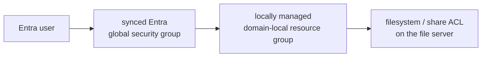
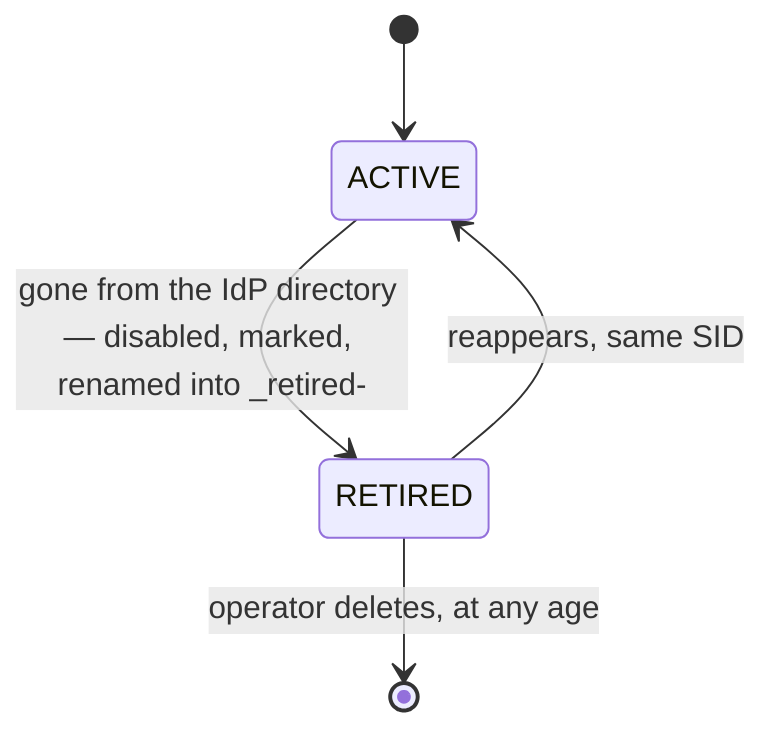

# Design » Identity and directories

What a cloud identity is, how a token becomes one, and who owns which object in
the realm directory. This document uses *IdP directory* for the users and
groups that a cloud IdP exposes. It uses *realm directory* for the Samba AD
data store. [`DESIGN.md`](../../DESIGN.md) is the index.

## External identity model

The canonical cloud identity is provider-neutral. It has two fields, because two
are what each consumer uses:

```text
ExternalIdentity {
    source,     // which configured cloud IdP owns this object
    subject,    // which account within it -- opaque, the adapter's alone
}
```

`source` is a **source name**: the operator's name for one configured cloud IdP.
It is the same string as the IdP-specific OU (`entra`, `google`). It is
deliberately not the issuer URL.

- An issuer is an *authentication input*. The adapter compares a token's `iss`
  against it at each exchange, and at a self-hosted IdP the issuer is usually a
  setting and not a constant.
- A source name is a *storage key*. To use one as the other puts an editable
  external string into permanent storage, where a change to it orphans each
  object.
- A source name is also unique by construction, because the operator assigns one
  per configured source within one realm.

`subject` is **adapter-owned and opaque**. Only the IdP module that made it may
construct or interpret it. `kerbridge-core` checks the field count, the version
tag, the escaping, the length, and that the value is not empty. It checks
nothing else. The Entra adapter uses the bare `oid`. The authentik adapter uses
the user's canonical, lowercase `uuid`.

Both fields are frozen for the life of the deployment. A change to either
rewrites each stored identity. That orphans each synchronized object, and
detaches each file whose owner `idmap_rid` derived from that object's SID. The
damage is silent. Only a realm directory restore recovers from it.

Each provider-specific part lives in `crates/kerbridge-idp`, which **both** the
broker and sync link. This is not tidiness. The broker builds an identity from a
verified token, and sync builds one from IdP directory data, in separate processes
with no channel between them. The value is also the join key of sync's
reconciliation loop. Thus there is one encoder, reached from both sides.

**How sync gets a desired state** is behind a second interface,
`DirectorySource`. It is in the same crate as the encoder. A `sync` feature
enables this interface only for the mirror. The broker compiles no directory
(IdP) reader. The adapter owns its read method. Entra keeps delta cursors and a
shadow. A `400` rejects a stored cursor. A `410` means that a cursor expired.
Both failures cause a full read. authentik has no delta API, so its adapter reads
all user and group pages in each cycle.

An adapter **owns its loop rather than adding a branch to a shared loop**. Sync
calls `advance` one time in each cycle. The adapter advances as far as its IdP
permits. It yields a source snapshot only after a complete enumeration. The
Entra adapter owns its cursors, resynchronization rules, and `Shadow`. The
authentik adapter rejects a torn or incomplete full read. Sync holds none of
this provider-specific state.

**Login names are split across that seam too.** The adapter offers an ordered
list of name candidates and nothing else — no mail address, no UPN, no attribute
of any one IdP reaches the mirror. Which strings are worth trying, and in what
order, rests on that IdP's own schema, and thus it is the adapter's: `sam_source`
in `idp_<source>.toml` is Entra's spelling of the choice. Which of them a name
may actually *be* needs realm-wide state the adapter cannot see — the domain-wide
name scan, the case folding `samldb` enforces, the disambiguation suffix — and
thus it stays in the planner. One rule reduces a candidate to what AD accepts, so
no adapter carries a character set of its own.

How many candidates to offer is itself the adapter's decision, and it is
consequential. A second candidate says "this account may hold that name
instead", so a name another object already holds falls to the second string
rather than to the disambiguation suffix — which renames a live account, and a
login name is a Kerberos principal, so each such rename signs one user out. The
Entra adapter therefore offers exactly one: it resolves its own `sam_source`
fallback order below the seam, where an absent attribute is the only thing that
moves the answer.

- `preferred_username`, `upn`, email, display name and group names are mutable
  attributes. They are never mapping keys.
- The synchronized Samba object stores the canonical external identity in
  `msDS-ExternalDirectoryObjectId`. The attribute is single-valued and indexed,
  and the Samba-shipped schema has it on both user and group objects. The
  encoding is `kb1|<source name>|<subject>`, with `%` and `|` percent-escaped.
  The attribute has `rangeUpper: 256` ([MS-ADA2]), and the encoder applies that
  ceiling at construction. Lookups use an escaped LDAP equality filter
  (research spike `samba-ad-identity-attribute`).
- Role marker: `extensionName = kbrole1|realm-admission` on each source's
  synchronized admission group. It lets sync and the broker recover the
  group's immutable identity from the realm directory after a group rename
  or a loss of adapter state. It is policy metadata, not a second identity
  mapping.
- The broker fails closed if no object matches, or if more than one matches.

Two constraints follow from the selection of the attribute:

- A KerBridge AD must never also be a target of Entra Connect or Entra Cloud
  Sync. Both use `msDS-ExternalDirectoryObjectId` and `adminDescription` as their
  own join keys.
- The attribute is in the Personal-Information property set, and thus SELF is
  permitted to write it by default. Provisioning denies SELF write of it. The
  deny goes on the `user` class `defaultSecurityDescriptor`, and thus lands as an
  explicit ACE on each object that is created afterwards. A one-time sweep covers
  the objects that a pre-existing deployment already has (`kbsetup directory`).

<details>
<summary>Why the deny is a class default and not an ACE on the IdP-specific OU</summary>

This reverses the earlier design, which put an inherited deny on the
IdP-specific OUs. That design was measured **inert** on the pinned baseline.

Each user carries `(OA;;RPWP;77b5b886-…;;PS)` — SELF write of the
Personal-Information set — as an *explicit* ACE from the class default.
Inherited ACEs are ordered after explicit ones, and the access check grants on
the first match. Thus a deny that is inherited from the OU is never reached. The
measurement covered every way: deny by attribute GUID, deny by property set,
object created before the ACE, and object created after it. SELF write succeeded
each time.

An explicit deny that is placed on the object afterwards is refused with
LDAP 50, and only the creator of an object may place one. Thus the choice was
the class default, or to teach sync to write security descriptors. The second
option needs a binary security-descriptor reader and writer in the
security-critical path, to close a defense-in-depth gap.

The cost is that the class default is realm-wide and not OU-scoped, and that a
schema write applies it (a one-shot `dsdb:schema update allowed`, never
persisted). Its blast radius is one attribute: `telephoneNumber` and the rest of
Personal-Information stay writable by SELF, and the delegated
`svc-kerbridge-sync-entra` write is untouched, because the deny names SELF.

What the deny prevents is not identity theft. SELF write only lets an account
give away the identity that it claims, and never take another object's identity.
It prevents a synced user from pointing their object at the *admission group's*
identity value. That lands the admission group's `oid` in the planner's
duplicate set, and the planner then skips the membership reconciliation of the
group completely (`crates/kerbridge-sync/src/planner/mod.rs`): no additions and
no removals. Realm-wide revocation stops, and the stack still reports healthy.

</details>

This boundary permits later IdP changes. A direct provider adapter can emit the
same `ExternalIdentity`, or `/config` can point the helper at a federation
service that issues broker-audience tokens. Neither `issuerd` nor the helper
contract changes.

## Entra validation

The first provider implementation accepts delegated Entra access tokens that
were issued for the KerBridge API. It accepts nothing else.

It validates at least:

- The signature, against the cached issuer JWKS.
- The permitted signing algorithms.
- The exact tenant-specific issuer.
- The exact broker API audience.
- `exp` and `nbf`, with bounded clock skew.
- The configured tenant ID.
- The required delegated scope, initially `access_as_user`.
- The user object ID (`oid`).
- The authorized public client, through `azp` or the token-version-equivalent
  claim.
- The absence of an app-only authentication shape, where a delegated user token
  is necessary.

*Delegated* here has OAuth's sense: a token that carries a user context, as
opposed to an app-only token. This is a different layer from the **delegated
user** of [Delegating the authorization](tickets.md#delegating-the-authorization),
which is the account that a machine acts as.

Rules:

- Issuer metadata and JWKS are cached, with bounded refresh behavior. A token
  never selects an arbitrary issuer or metadata URL. Key acquisition is itself a
  provider fact and lives in the adapter: JWKS is one IdP's answer and not the
  only one, and an adapter whose IdP publishes no keys must get trust in a
  different way.
- Provider-specific validation sits behind the `IdentityProvider` interface in
  `crates/kerbridge-idp`. The mapper and the issuer receive no raw token and no
  Entra-specific claims, and the broker's own configuration names no Entra key.
- **The signature algorithm allowlist is asymmetric-only. It is compiled into
  each adapter, and it is never configuration.** Each symmetric algorithm
  (`HS*`) and `none` are permanently excluded. The RSA families `RS*` and `PS*`
  are permitted today, and ES256 is an expected future addition and not a
  violation: the length of the list is not itself the rule. A JWK that states its
  own `alg` narrows the list to that one algorithm for that one key. Thus the
  list bounds what an IdP may publish, and not what an already-published key may
  be used with.

  There are two reasons, and the second is specific to this design. The IdP
  publishes an RSA public key. A verifier that dispatched on the token's own
  `alg` would let anyone use those published bytes as an HMAC secret, and forge
  a token that asserts any identity. With an asymmetric algorithm, the broker
  holds public key material only, and thus **cannot forge a token even if it is
  fully compromised**. That is the same property that puts KDC authority in
  `issuerd`, behind a peer-uid-authorized socket. A symmetric algorithm would
  make the verification key a signing key, and undo it.

  The guard is structural, and not checked. `alg` is resolved to the primitive
  that will verify with it before any key is loaded, and thus nothing can pass
  the check and then be verified by something else. In addition, no adapter
  contains a symmetric verification routine at all.

  An operator can legitimately arrive with symmetric signing configured, because
  some IdPs offer it as an ordinary option, and the only symptom is a 401. Thus
  each page that documents the setup of an IdP tells the operator to use an
  asymmetric signing key.

The locked contract, live-verified
(research spike `entra-token-validation`):

- v2.0 access tokens. The API app registration must set
  `api.requestedAccessTokenVersion: 2`. It defaults to null, which means v1.
- The stored subject is the bare `oid`. `tid` is pinned to the configured tenant
  on each token, but is not part of the identity: it is recorded once, on the
  IdP-specific OU.
- The JWKS cache is 24 h, with rate-limited refresh on an unknown `kid`.
- The `scp`-presence check and the `idtyp` check are the actual access control,
  and not defense in depth. Entra issues app-only tokens with the broker
  audience to each confidential client in the tenant. No app role, no consent and
  no grant is necessary.

Every claim the verifier reads, what Entra puts in it, and the order of the
checks: [`crates/kerbridge-idp/entra.md`](../../crates/kerbridge-idp/entra.md).

## authentik validation

The authentik adapter accepts access tokens from one configured OAuth2
application. The [application
slug](../../crates/kerbridge-idp/GLOSSARY.md#application-slug) identifies that
application in its issuer, authority, and JWKS URLs. The issuer has this form:
`https://<host>/application/o/<slug>/`. The final slash is part of the issuer.

The adapter validates these values:

- The signature, with the same asymmetric-only algorithm rule as Entra.
- `exp`, and `nbf` when the token contains it, with bounded clock skew.
- The exact issuer and audience.
- `azp`, which must equal the configured client ID. authentik adds this claim
  after scope mappings run, so a mapping cannot replace it.
- `sub`, which must be the canonical lowercase UUID of the user.

authentik must use `sub_mode: user_uuid`. The REST API can filter users by this
UUID. Thus, the token face and the IdP directory face use the same subject.
The default hashed subject cannot provide this property. The adapter does not
normalize a subject. It rejects a noncanonical value.

The adapter does not require `nbf`, because authentik does not emit it. It does
not use an OAuth scope as an authorization decision. Admission comes from the
group closure that sync writes to the realm directory. `kbconfig check
--online` verifies the issuer, asymmetric signing key, and attached
`offline_access` scope mapping. It separately checks that the sync credential
authenticates, can read the IdP directory, and has a usable expiry.

## Realm directory ownership and synchronization

Recommended realm directory layout:

```text
OU=CloudIdP,DC=example,DC=site              the IdP parent OU
    OU=Entra,OU=CloudIdP,DC=example,DC=site     one IdP-specific OU
        synchronized users
        synchronized global security groups

OU=Resources,DC=example,DC=site
    locally managed domain-local resource groups
    other local authorization objects
```

- Sync owns the complete shape of the objects in its IdP-specific OU: the
  external identity attributes, the mutable display attributes, the account
  state, and the IdP-derived direct memberships.
- Sync does not own `OU=Resources`. It must not remove a synchronized group from
  a locally managed group. That membership belongs to the realm directory,
  not to a cloud IdP.

### One realm, several cloud IdPs

A realm can take identities from more than one cloud IdP. Each one is a separate
**source** and has its own:

- source name
- IdP-specific OU, under the shared parent
- `svc-kerbridge-sync-<source>` account
- `configs/idp_<source>.toml`
- `secrets/idp/<name>/`, which holds the sync credential
- `secrets/generated/idp/<name>/`, which holds the LDAP `bind_password`

The processes do not multiply with the sources. One `broker` and one `sync`
serve each configured source. Each one acts on one source at a time and reaches
no other source's objects — the broker because the path segment names the one
source that a request is answered under, and sync because it reconciles one
source per pass, under that source's own bind. `issuerd` and `kbmanage` are
bound against the parent OU, because their question is only whether a DN is
sync-owned. That question has no reason to know which IdP an account came from,
and a ticket is a ticket.

The IdP-specific OU is not filing. These things make it necessary:

- **Role markers resolve by an exactly-one subtree search.** The broker finds
  the admission group by `kbrole1|realm-admission`, under its own search base. If
  two sources share an OU, that base holds two marked groups, and the broker
  fails closed. That freezes each login for *both* sources, and not only for the
  new one. `kbmanage doctor` counts the same marker per OU, for the same reason.
- **The write ACE is the confinement.** `svc-kerbridge-sync-<source>` holds
  `(A;CI;CCDCWP;;;<sid>)` on its own OU and on nothing else. Thus a stolen
  credential for one source cannot rewrite another source's objects. A shared OU
  would trade that boundary away for nothing.
- **Ownership is keyed on the source name.** The operator assigns a name per
  configured source within one realm, and thus the name is unique by
  construction. That is stronger than the pair of issuer and tenant that it
  replaced, whose uniqueness depended on two operator-supplied strings being
  different. Objects that fail the match are reported and never touched, and that
  is what makes a shared OU only wasteful and not destructive.

These things stay single: the `sAMAccountName` namespace, which is domain-wide,
and thus each sync's collision scan already sees each other source's names; the
UPN suffix; and the resource OU, where an operator nests groups from any source
together.

The normal authorization model:



Admission group:

- The Entra group `KerBridge Allowed On-prem Users` is the documented admission
  group. The source file states its immutable Entra object ID, which is the only
  way the group is named: a display name is mutable, so it is not a binding.
- Sync marks the Samba group with the unique `realm-admission`
  role. The immutable ID, the Samba mapping, the role marker and the effective
  broker membership check must survive a group rename and a loss of disposable
  sync cursor state. The configured object ID must agree with Samba.
- If the admission group is deleted or is absent from the read, ticket issuance
  fails closed: freeze and alert, and never recreate the group automatically.
  Only the operator restores it, because a recreated group loses its SID.
- A failed or incomplete IdP directory read never starts a destructive change.

Deletion is conservative, because Samba SIDs can appear in durable ACLs:



- Users: one cycle takes a user who has left the IdP directory to disabled, marks the user
  `kbstate1|retired|<timestamp>`, and renames the user into the `_retired-`
  namespace. Sync itself deletes nothing.
- Groups cannot be disabled as users can. Sync clears their IdP-owned direct
  membership, marks them `kbstate1|quarantined|<timestamp>` and renames them the
  same way. The SID stays. If an object comes back, sync adopts it again with the
  same SID.
- **There is deliberately no retention window.** The marker's timestamp is
  reported (`kbmanage`, `kerbridge_core::state::retention_age_days`), and nothing
  acts on it. A deleted identity that returns comes back to a *new* SID, and to
  unresolvable files, however long it waited. Thus no elapsed time makes deletion
  safe, and a configured threshold would imply that it does. Deletion is one loud
  operator-driven path: `kbmanage cloud delete`, one object at a time, confirmed
  by a typed name.

**Retention holds the SID, and not the name.**

- SIDs appear in durable filesystem ACLs, and each member derives
  `uid = RID + range base` from them. To destroy and recreate an object breaks
  files that are already on disk.
- Nothing durable is keyed to a synchronized object's `sAMAccountName` or
  `userPrincipalName`. But a live object can need them back urgently, and
  `samldb` applies uniqueness to both.
- Sync renames a retired or quarantined object into a `_retired-` namespace at
  the moment that it marks the object. Thus the live name is free in the same
  cycle. An object that comes back takes its name again, through the same
  allocator that gives out new names.
- The leading underscore is structural, and not decoration: name allocation
  cannot produce one, and thus the two namespaces cannot overlap.

<details>
<summary>Why the name is not held too</summary>

Before, sync held the name as well. Then an Entra-side delete-and-recreate
failed on each cycle, until a human intervened.

</details>

The Entra IdP directory behavior was measured in research spike
`entra-directory-sync`:

- Graph access is app-only `User.Read.All` and `Group.Read.All`: a full read
  first, then per-stream delta cursors. Graph accepts a cursor from the wrong
  stream in silence, and thus cursors must be stored per stream. A 400 on a
  malformed cursor is handled separately from a 410 resynchronization. Delta
  entries are sparse patches: merge them, and never replace. Pagination ends only
  on `@odata.deltaLink`, because an empty page is not the last page.
- Group selection is the closure that is reachable from the admission group,
  plus a configurable allowlist.
- The broker admission check is a role-marker lookup (exactly one match), plus a
  per-user base-scoped `memberOf:1.2.840.113556.1.4.1941:=<admissionDN>` query.
  Nested membership is deterministic, and cycles included.  `tokenGroups` was
  measured to produce the same decisions and stays the known-good alternative. It
  is not implemented, because a second evaluation that nobody exercises is a
  second answer that waits to disagree.
- An account exists for a user that **a selected group holds** — the
  admission-group closure plus the allowlist — and for nobody else. Thus the
  admission group is the whole answer to "who exists in the IdP-specific OU", and
  not only to "who may get a ticket". An operator who reads the OU sees the
  admitted set and nothing more. The `_retired-` prefix does the same job for
  accounts that are on their way out. To leave the closure retires the account,
  and does not only drop its memberships. Retention holds the SID, and thus
  filesystem ACLs survive and a user who returns takes their name back.
- Members and guests are both syncable. Another tenant authenticates a guest,
  but admission here is the operator's act of putting the guest in a selected
  group. A home tenant that disables the guest stops them getting a token at all,
  and without a token there is no ticket. Both carry a resource-tenant `oid`, and
  thus the identity that the broker validates is the identity that sync writes.
  An absent or unrecognized `userType` still fails closed. The syncable rule keys
  on `userType`, and never on `#EXT#` in the UPN.
- **No group is excluded.** Any group can be nominated or nested — Microsoft
  365, mail-enabled, distribution list, dynamic. Sync treats an Entra group as a
  *membership list*: it always creates its own `GROUP_TYPE_GLOBAL_SECURITY` group
  in Samba, and copies the syncable user members into it. Thus what the source
  group is *for* in Entra decides nothing here.
- **The walk breaks nesting cycles.** Entra permits `a → b → a`. The closure
  expands each group one time and then stops.
- A live account's login name follows its Entra display name (`sync.toml`'s
  `automatic_sam_renames`, on by default). The `sAMAccountName` is not an
  internal key: Windows shows it as the file owner and in the *Security* tab, and
  thus a person whose name changes must stop seeing the old name on their files.
  It is also their Kerberos principal, and thus the rename invalidates the
  tickets that were issued under the old name, and costs that user one sign-out.
  That user alone carries the cost, one time. To turn the option off freezes each
  live name instead. `kbmanage cloud rename` sets a name by hand and stamps
  `kbstate1|namepinned|`, which sync obeys until `kbmanage cloud unpin` removes
  it.
- Synced users get random undisclosed passwords and UAC 66048.
  `DONT_EXPIRE_PASSWORD` is mandatory, because an expired password breaks
  keytab-based issuance.
- Delegated LDAPS covers each steady-state write. Local realm-admin credentials
  are necessary only for one-time provisioning and for `OU=Resources`.

`svc-kerbridge-sync-entra` ships with one blanket `(A;CI;CCDCWP;;;<sid>)` on its
IdP-specific OU. It does **not** ship with the 16-ACE minimal set. This reverses
the earlier intent, and that is why it is written down.

<details>
<summary>Why the coarse ACE, when the minimal set was measured sufficient</summary>

The 16-ACE set was measured sufficient (research spike `entra-directory-sync`
§2.1). Thus this is not a question of capability, but of what least privilege is
worth here.

Sync's job *is* to create realm identities and to manage the admission group.
Thus a stolen sync credential gives its holder access to each Kerberos-protected
service, under either scheme, and to confine write-property does not touch that
attack. To tighten the ACEs would additionally deny only the attributes that sync
never uses — `servicePrincipalName`, `msDS-KeyCredentialLink` and similar. Those
are escalation primitives *within* a realm directory whose whole population this
credential already owns, and whose only purpose is to have tickets issued from
it.

The cost is real and recurring: the ACEs that carry schema GUIDs, re-derived
each time that sync learns to write another attribute, and each mismatch aborts
`make up`.

The confinement that carries the weight is the scope of the IdP-specific OU
itself. `OU=Resources` and the rest of the realm directory stay unreachable, and that
is what stops a compromised sync from authorizing anything against a share.

</details>

`svc-kerbridge-manage` is delegated create, delete and write on the resource OU,
and **delete-child only** in the IdP parent OU. That is enough to destroy an
object, and not enough to alter one. Thus the operator CLI cannot race the
reconciliation loop. It was measured on the bench (2026-07-28): sufficient for
deletes, and insufficient for writes.

### authentik IdP directory read

authentik has no delta API for this use. The adapter reads all pages of
`/core/users/` and `/core/groups/` in each cycle. It requests `?ordering=pk`:
that key is an increasing integer for users and a UUID ordered lexicographically
for groups. It constructs page URLs from the configured instance URL and does
not follow a server-supplied URL with the sync credential.

The two sort differently, and that is why an insert mid-read is a hazard on one
collection only. The user stream is append-only, so a user created mid-read
lands after everything already returned and disturbs nothing. A group's UUID can
sort anywhere, including before a page the reader has passed, which pushes a
group into a later page and repeats it. The pk-ordering check catches that
repeat; the rising `count` alone does not, because an insert raises it.

The two collections must form one complete enumeration. The adapter rejects a
torn read, a repeated or missing row, and a membership edge that names an
unknown object. A failed read yields no source snapshot. authentik can return a
complete but silently filtered collection for an object-scoped permission. A
global `view_user` and `view_group` grant is mandatory. The setup blueprint
maintains that grant.

The adapter cannot verify the grant, so it checks the outcome instead. The
dangling-id check catches a permissions cut that runs through a visible
membership edge. It cannot catch a closure root the configuration names — an
allowlist entry, or the device-grant group — hidden together with everything it
reaches: what comes back is a smaller IdP directory that is self-consistent and
has no dangling edge. Publishing it would retire every object behind the hidden
root. So a named closure root that is absent from the read yields **no
snapshot**, and the failure names the roots it did not see. The admission group needs no rule
of its own here: the planner already freezes a cycle whose read describes no users
while Samba holds synchronized ones.

The adapter applies the same admission closure, extra-group allowlist, held
narrowing, and planner as Entra. It offers the username, display name and email
address as login-name candidates, in that order. The planner decides which
candidate is safe in the realm directory.

### Sync credential lifetime

- Entra application credentials never renew themselves. A client secret and a
  certificate both carry a fixed `endDateTime`. The portal caps a new secret at
  24 months, and a tenant's application management policy can enforce less, or
  can forbid secrets completely.
- At expiry the client-credentials request fails (`AADSTS7000222`), and *each*
  Graph read stops at once. If nothing handles this, synchronization freezes in
  silence and the realm directory drifts, until somebody notices a stale user.
- Entra mails the application's owners before expiry. That needs an owner
  mailbox in the customer's tenant, which is not a control that this deployment
  owns.
- Workload identity federation would remove the stored credential completely.
  But it needs Entra to fetch an OIDC discovery document from a public HTTPS
  endpoint that belongs to the workload, and nothing must have to reach KerBridge
  from the Internet. ACME defaults to DNS-01 for the same reason. Thus v1 keeps a
  credential file, and makes its expiry a first-class operational input.

authentik uses an API token on a dedicated service account. The token reports
its own expiry to its bearer through a self-scoped API read. The adapter measures
this value in each cycle. A rotated token supplies its new deadline without an
operator setting or a restart. A non-expiring token has no countdown. The setup
guide keeps expiration enabled so that the operator receives advance warning.

**A certificate credential is the intended default, and a client secret is the
degraded fallback.** A certificate is self-describing: sync would read `notAfter`
out of the credential file itself, and thus the reported expiry cannot disagree
with the credential in use. A certificate also avoids the tenants whose policy
forbids secrets. **Not built:** `kerbridge-sync` reads a client secret only, and
the Terraform path and the manual Entra path both deal in secrets, to match.

A client secret carries its expiry in Entra only. Thus a secret-based deployment
can declare `sync_credential_expires` in the `[provider_config]` of
`configs/idp_<source>.toml`. **The key is optional.** If it is not set, sync logs
one time at startup that it can give no advance warning, and then runs normally.

If the key is set, it is an **operator assertion, and not a measurement**. The
dangerous failure is not to omit it. The dangerous failure is to rotate the
secret and leave the old date, after which sync reports months of headroom on a
credential that is already dead. The deployment documentation must say so
plainly.

<details>
<summary>Why optional, and why not read the true expiry from Graph</summary>

Advance warning is a convenience that the deployment offers, and not a
precondition that it imposes. An operator can rely on Entra's owner-email notice,
or track rotation elsewhere. Both are legitimate choices. To refuse to
synchronize because a calendar date is missing would overrule the operator on a
question that is not the tool's to decide.

To read the true expiry from Graph would need `Application.Read.All`. That is
much broader than the read-only `User.Read.All` and `Group.Read.All` grant, and
it is refused for the same least-privilege reason as `Directory.Read.All`.

</details>

- Each cycle reports the days that remain. It gives a warning below a
  configurable threshold (`credential_warn_before_days` in `configs/sync.toml`,
  30 by default), and an error below seven days. It raises the
  `sync-credential-expiring` event that
  [Operator notification](operations.md#operator-notification) describes, which
  delivers the event as a countdown and not on a repeat interval.
- An expired or refused credential is its own categorized failure. It is
  separate from a transient IdP directory read error. The failure never
  starts a destructive reconciliation. For Entra, `AADSTS7000222` from the
  token endpoint is the authoritative signal. The configured date is only an
  early warning. For authentik, `403 "Token invalid/expired"` is the
  authoritative signal.
- **A credential file whose contents are a GUID is refused at startup.** The
  portal shows *Value* and *Secret ID* beside each other. The GUID *Secret ID*
  reads like a credential and stays visible after *Value* is masked, and thus it
  is what an operator copies when they return later. Entra answers
  `AADSTS7000215: Invalid client secret provided`, and never says that it
  received an identifier. The mistake costs hours. A secret *Value* never has the
  shape of a GUID, and thus the check has no false positives and turns a
  debugging session into a startup error that names the actual mistake.
- To rotate the credential, replace the credential file. If an Entra source uses
  a secret, update its expiry date. The adapter reads the replacement on the next
  cycle. authentik also measures the new token's expiry. The adapter state, the
  realm directory mapping, and the quarantine state are not affected. No
  resynchronization is necessary.

The same failure class exists on the Samba side. The delegated sync account and
the broker's LDAP read account are provisioned with non-expiring passwords, for
the same reason as synced users.
