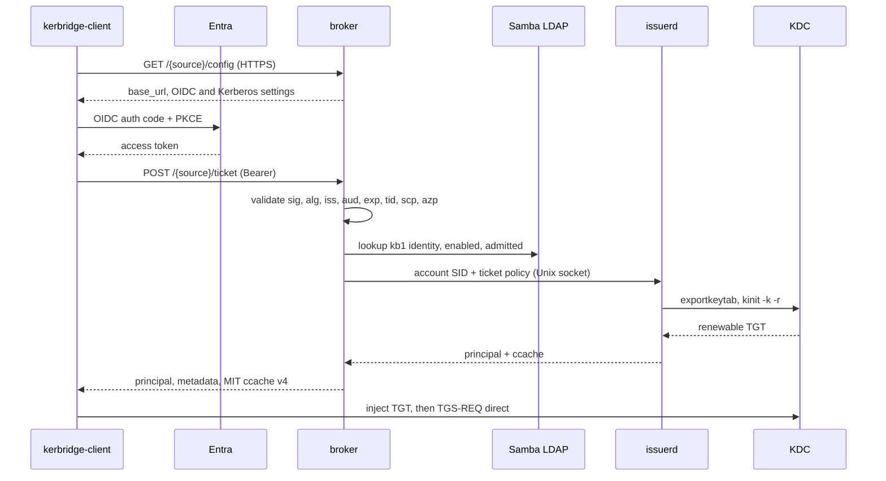

# Design » Tickets

How one sign-in becomes a TGT, who holds KDC authority, what policy bounds a
ticket, what consumes it, and how a machine gets a ticket without a browser.
[`DESIGN.md`](../../DESIGN.md) is the index.

## Authentication and ticket flow



1. `kerbridge-client` gets its configuration from `GET /{source}/config` over
   HTTPS. It can also use the unprefixed `GET /config`, which a broker that
   serves one source answers for it. The client then resolves the `base_url` in
   the reply, to learn the prefix that the rest of this run uses.
2. `kerbridge-client` does an OIDC authorization code exchange with PKCE,
   against the configured authority.
3. `kerbridge-client` sends the access token to `POST /ticket` as a bearer
   token.
4. The broker validates the signature, the algorithm, the exact issuer, the
   audience, the lifetime, the tenant, the delegated scope and the authorized
   client application.
5. The broker normalizes the Entra claims to `(issuer, tenant_id, object_id)`.
6. The broker searches Samba LDAP for the matching synchronized user object.
7. The broker requires exactly one result, an enabled account, and effective
   membership in the synchronized realm-admission group. The directory-sync spike
   selects and proves the exact Samba LDAP membership evaluation.
8. The broker sends the Samba account identity and the requested ticket policy
   to `issuerd`, over its Unix socket.
9. `issuerd` resolves the current Kerberos principal locally, exports the
   existing account key to a request-scoped keytab, gets a renewable TGT,
   validates the ccache, and destroys the temporary material. (The design
   permitted a conditional PKINIT fallback. It was never necessary, and it is not
   built.)
10. The broker returns the principal, the ticket metadata and the MIT ccache v4
    bytes.
11. `kerbridge-client` injects the TGT. Windows then gets its service tickets
    directly from the Samba KDC.

The broker issues a TGT, and not a service ticket.

<details>
<summary>Why not the tighter service-ticket variant</summary>

The tighter variant was built, and it does work. In it, the broker holds only the
`cifs/<nas>` service key, and constructs a ticket for that one service through
S4U2Self.

It has two costs. A bare service ticket is not consumable by the stock Linux
`smbclient`. And it buys one service per exchange. A TGT keeps the client stock
on both platforms, and lets the KDC decide what the identity may reach. The
broker does not make that decision.

</details>

Windows renewal of an injected TGT is **net-ineffective**:

- Windows attempts a renewal at a fixed T−15 minutes before expiry (MS-KILE),
  and the KDC grants it. But Windows never installs the result for a ticket that
  was submitted externally. Thus the ticket expires on its original schedule
  (research spike `windows-tgt-followup-entra-joined`, which corrects the
  unjoined phase-5 mechanism).
- Thus the helper lifecycle is re-injection, keyed to the ticket End Time, at
  approximately 50 % of the lifetime.
- `renew-till` stays meaningful for Linux clients only, because they do renew.

## Ticket issuer

`issuerd` gives a narrow request/response protocol over a Unix domain socket.

- A runtime-only volume carries the socket, and is mounted into the broker
  container and the realm container. There is no TCP issuer listener.
- `issuerd` removes a stale socket at startup, and applies restrictive ownership
  and mode.
- Proven contract (research spike `container-runtime-boundaries`): the socket
  directory is `0710 root:10002` on a named runtime volume, and the socket is
  `0660`. The broker runs as uid 10001, gid 10002, with a read-only mount. The
  contract survives an independent restart of either container, and a recreation
  of the volume.

The framing is a 4-byte big-endian length, then that many bytes of JSON, capped
at 64 KiB. The length is read before anything is allocated. Both directions are
tagged, and thus nothing is dispatched by shape. The one type definition lives in
`kerbridge-core`, which `issuerd` and the broker both link.

The request identifies a Samba directory object by SID. It does not use an
account name that was supplied externally:

```json
{
  "op": "issue",
  "request_id": "opaque audit correlation id",
  "account_sid": "S-1-5-21-...",
  "lifetime_seconds": 36000,
  "renewable_lifetime_seconds": 604800
}
```

The response contains:

```json
{
  "status": "ok",
  "request_id": "opaque audit correlation id",
  "principal": "alice@EXAMPLE.SITE",
  "ticket_format": "mit-ccache-v4",
  "ccache_b64": "...",
  "starts_at": "...",
  "expires_at": "...",
  "renew_until": "..."
}
```

A failure is `{"status": "error", "request_id": …, "error": …}`. The only other
operation is `{"op": "ping"}` → `{"status": "pong", "ok": true}`. The container
healthcheck uses it, and it deliberately touches neither Samba nor the directory.

`issuerd` applies these checks independently:

- The SID resolves to exactly one enabled user in the configured domain. The
  object must be a `user` object that carries no subclass of it, and thus a
  machine account is refused, whatever else the directory says about it.
- The account carries a decodable external identity
  (`msDS-ExternalDirectoryObjectId`). A missing or corrupt one is refused,
  because that is exactly the state in which a ticket could go to the wrong
  person.
- The requested lifetimes do not exceed the realm policy.
- The generated cache contains a TGT for exactly the resolved client.
- The configured realm issued the TGT, and the TGT has the expected flags.
- Keytabs and ccaches are request-scoped, and stay on container tmpfs.
- Commands have a bounded execution time and a bounded output size.
- Errors expose no key material and no sensitive command output to the client.

Samba implementation: export the existing account key to a request-scoped tmpfs
keytab with `samba-tool domain exportkeytab`, then run `kinit -k -r`. This is a
**GO** from research spike `samba-tgt-issuance`, and the conditional PKINIT
fallback was not necessary. Established properties:

- A repeated export changes neither the key nor the kvno.
- An export needs root.
- An exported keytab carries each historical kvno.
- The ccache parser must skip `X-CACHECONF:` entries.
- Accounts are resolved by SID, through the local `ldbsearch`. The SID is the
  stable key, and it survives a rename.
- Arguments are passed as an argv vector, with the `--principal=` equals-form
  and an anchored SID pattern.

## Ticket policy

The ticket lifetime and the renewable lifetime are `configs/realm.toml`'s
`ticket_lifetime_seconds`, `ticket_renewable_seconds` and
`max_renewable_seconds`, on each deployment. `issuerd` and the Samba domain
policy apply hard maximums, even if the broker asks for more.

Defaults, confirmed by the Research spike `windows-tgt-renewal`:

```text
ticket lifetime:           10 hours
renewable lifetime:         7 days
```

Measured behavior that fixes the lifecycle and the revocation window:

- Windows renewal of an injected TGT is net-ineffective. Windows renews at
  T−15m, the KDC grants it, and the result is never installed. Thus the helper
  re-injects at approximately 50 % of the lifetime, keyed to the End Time. The
  renewable window is kept, because it costs nothing and stays meaningful for
  Linux clients.
- The ticket lifetime dominates each revocation window. An open SMB session and
  a cached service ticket both survive an account disable, until the ticket
  expires. On the Entra-joined client, the cached `cifs/` ticket grants *new*
  sessions, with the DC up and reachable the whole time, because the file server
  never asks again. The worst case is approximately one ticket lifetime. The
  revocation semantics do not depend on the lifetime: the lifetime sets the
  masking duration only.
- Revocation levers, ranked by measured speed:
  - Disable the account — this cuts AS and TGS immediately.
  - Remove the global group from the domain-local group — this cuts at the next
    service ticket.
  - Remove the user from the global group — this cuts at the next TGT only.
  - Rotate the user's Samba key — this has **no effect at any layer**. It is not
    a kill-switch, and the operator documentation must say so.
- A shorter lifetime (1 hour, for example) shrinks the worst-case revocation
  window in proportion, at a negligible re-injection cost. It is a supported
  hardening option.

## Joined file servers

File servers are ordinary Samba AD members. KerBridge does not install them and
does not manage them.

- The supported greenfield mapping is `idmap_rid`, with a range that the
  operator selects. Each member that needs consistent numeric IDs uses the same
  domain mapping range.
- KerBridge does not assign `uidNumber` or `gidNumber`, and does not solve
  brownfield file ownership migration.

The Research spike `joined-nas-authorization` demonstrated the nested-group and
ACL chain from end to end:

- Members run smbd only, with `security = ADS`. They run no nmbd, and NetBIOS is
  disabled on members as well.
- Recommended idmap ranges: `*` → tdb 100000-199999, and domain → rid
  1000000-1999999. The ranges must never change after deployment. Independent
  members produce identical numeric IDs.
- Filesystem ACLs must be SID-based. Name-based `valid users` entries break at a
  rename, and SID-based ACLs survive it.
- Revocation on the file-server path: an account disable is refused at AS and
  TGS immediately; a removal from a domain-local group takes effect at the next
  service ticket; a removal from a global group takes effect at the next TGT
  only. The winbind caches on the file server never mask a revocation.
- NTP is mandatory on members and on clients, because the Kerberos skew window
  is 300 s.
- A DC outage does not break SMB for the clients that hold cached service
  tickets, because the file server authenticates them from its own keytab
  indefinitely. Authorization then needs SID-based ACLs, or a warm winbind cache.
  A cold cache together with a DC outage denies users who authenticated
  correctly, under name-based `valid users`. That is a second reason for
  SID-based ACLs.
- Never restart `winbindd` during a DC outage. It comes up permanently degraded,
  and does not heal itself when the DC returns. Restart it only when the DC is
  reachable (research spike `windows-tgt-followup-entra-joined`).

## Device grants

Off by default (`main.toml`'s `device_grant_days` = 0). Operator guide:
[`docs/setup/device-grants.md`](../setup/device-grants.md).

Each ticket costs a browser sign-in. A **device grant** lets a user authorize
*this machine* to keep getting tickets without a browser, for a bounded number of
days, after one normal Entra login. The authorization is a non-exportable ECDSA
P-256 key in the machine's TPM.

The case that made the feature necessary is a build machine that logs in
automatically at boot, is not domain-joined, and publishes artifacts to the file
server over SMB. It has no other way to hold a Kerberos identity without a human
at the keyboard. Ordinary users who prefer not to sign in at each ticket lifetime
are the convenience case. The unattended case is why the design must be sound.

**The Entra login *is* the grant authorization.** No second admission decision is
invented. The tray asks for the grant immediately after a successful sign-in.
At that moment the broker has just validated a delegated token, and has confirmed
that the account is synchronized, enabled, admitted and in the device-grant
group. An existing, already-proven decision is lent to a key, for a bounded
period.

### What is stored, and where

One `extensionName` value per device, on the user's own object:

```text
kbkey1|label=<escaped>|es256=<base64url-sha256>|start=<epoch>|end=<epoch>|seen=<epoch>
```

`extensionName` is used instead of a schema extension, for these reasons. It is
already a prefix-namespaced multi-value store that this project writes
(`kbrole1|`, `kbstate1|`). It is not SELF-writable, because `attributeSecurityGUID`
is absent and thus the attribute sits in no property set. And `kbmanage` already
holds per-attribute `WP` on it, inside the IdP parent OU. A purpose-built
attribute would have meant a permanent schema divergence, because AD attributes
can be made defunct but can never be deleted.

`altSecurityIdentities` is not used. It carries live Windows
certificate-mapping semantics, and to park a thumbprint there risks a real logon
mapping that nobody intended. That is the same hazard class as the Entra Connect
collision on `msDS-ExternalDirectoryObjectId`, which this design already guards
against.

The payload is `key=value`, and thus a field can be added with no version bump,
no migration and no dual-write. The algorithm is the *key name*, and thus a
future `mldsa44=` leaves an older broker with no key material that it recognizes,
and the broker refuses the value. `seen` is deliberately day-granular: it answers
one question, which is whether this device is dead wood. It is written at most
one time per device per day. The encoding and the parsing live in
`kerbridge-core`, beside the identity encoding, for the same reason.

**Single-writer invariant.** Only `issuerd` ever *emits* a `kbkey1|` value. Sync
and `kbmanage` may delete whole values only. One emitter is what makes "unknown
keys are ignored" safe. Do not add a second emitter.

### The two paths

To create a grant: the tray creates the TPM key and sends `POST /devices` with
the Entra token, the public key and a label. The broker validates the token
exactly as it does for `/ticket`, additionally requires membership of the
device-grant group, and asks `issuerd` over the existing Unix socket to record
the thumbprint. **The broker's LDAP identity stays read-only** (see
[Security boundaries](../../DESIGN.md#security-boundaries)). Each write here goes
through `issuerd`, which already has local Samba database access. Thus no row in
that table moves, and no new port, bind credential or ACE appears.

To get a ticket with a grant: the tray takes a nonce from `GET /nonce`, signs an
assertion over it with the TPM key, and presents it to `POST /ticket` as
`Authorization: DeviceGrant …`. The broker resolves the object by the identity
that the client claims, through the already-indexed
`msDS-ExternalDirectoryObjectId`, because `extensionName` is unindexed. The
broker then runs **each** admission check again, and additionally requires that
the presented thumbprint is among *that* object's grants. Thus a claim to another
user's identity fails. From there the path is byte-identical to the browser path.

### Delegating the authorization

An unattended build machine has nobody at the keyboard, and the account that it
must publish as is a service account whose password nobody is meant to know. A
**delegate** closes that gap: a build engineer signs in as themselves at the
machine, and authorizes it to get tickets *as the service account*.

Those service accounts stay ordinary Entra users, and are synchronized into the
IdP-specific OU like everyone else. That is what keeps this small — see
*Nothing else moves*, at the end of this section.

**A bearer token still yields a ticket for its own subject only.** Delegation
authorizes a *key*, and the ticket that this key gets later is the service
account's. A run-as path would carry the same authority with none of the grant's
properties: bounded, revocable, and visible in `device list`. It would also
keep working with `device_grant_days` set to 0. Accepted cost: there is no
interactive way to test a service account's share access, and thus that is
debugged from the granted machine.

The rule, stated as one invariant:

> The **target** is resolved with the device-grant checks. The **caller** is
> resolved with admission alone and, when caller and target differ, must
> additionally be in the target's delegate group.

When the two are the same object, this collapses into exactly today's checks.
Thus the self-service path is the general rule with both identities equal, and
not a case that stands beside it.

Each `/devices` route takes a target, through one authorization
helper. `POST` is machine-local by construction, but `GET` and `DELETE` need only
a token, and thus they are the only operations that can happen away from the
machine. To leave them out would make each delegated grant create-at-the-machine
and revoke-only-from-the-broker-host.

**A delegate must themselves be a realm-admitted user.** The delegate-group check
is additional to admission, and never instead of it. Thus a build captain who
authorizes machines but holds no realm access of their own is not expressible.
That is a deliberate future relaxation, if it is ever wanted, and not something
that is designed in now.

**The delegate link is `managedBy` plus a marker.** A domain-local group in
`OU=Resources` carries `managedBy`, which names the target user, and
`extensionName: kbrole1|delegates`. Engineers reach it when they nest their
synchronized Entra group into it, which is the ordinary authorization model.

`managedBy` alone is deliberately not enough. It has a live conventional meaning
— who owns this group — and organizations set it for their own reasons. Thus
without the marker, an admin who marks some group as managed-by a service account
would silently give each member of that group the right to authorize devices as
that account. This is the same hazard class as `altSecurityIdentities` above, and
it arrives from the other direction.

`managedBy` is single-valued and `managedObjects` is not. Thus one delegate group
names one user, and several groups can name one user. `kbmanage device delegate
set` narrows that to exactly one in practice, because it clears any other group
that points at the same account. The directory maintains both ends of the link
across a rename of either object. This was measured, and not assumed from the
schema. That is what makes a DN acceptable here, where the rest of this design
insists on identities. It must be maintained, because sync moves the **DN**, and
not only the login name, whenever an Entra display name changes.

**No new Entra role group.** The tenant-side consent gate already exists: a
target must be in `device_grant_group` (`configs/idp_<source>.toml`,
`[provider_config]`). On-prem nobody can add to its mirror, because
`svc-kerbridge-manage` holds delete-child only inside the IdP parent OU, and that
is not enough to write `member`.

That gate rests on the ACL, and *not* on reconciliation: sync's keep-set spares
each member whose DN is outside its own OU. Thus a member that anyone with write
access nested there by hand would be permanent and silent. The consequence is
worth stating plainly: where delegation is in use, **everyone in the device-grant
group is a potential delegation target**. To put a person in it for their own
convenience now carries a second meaning.

**Who authorized what lives in the log, and not in the directory.** The stored
`kbkey1|` value gains no `by=` field. The authorization *state* is the grant on
the target. The audit is the broker's `GRANT` line, which names both parties on a
delegated action, and which is durable through the broker's `audit_log_file`. A
second identity in the directory would cost bytes from the grant's 255-byte
budget, and would buy another mapping back to a person, for a job that the log
does better. The client's default label additionally carries the authorizer. That
is machine-supplied and best-effort, enough for "who set these boxes up", and not
a security control.

**Nothing else moves.** `issuerd` gains no capability. `GrantDevice`,
`RevokeGrant` and `TouchGrant` already name one account by SID. Delegation only
changes which SID the broker puts in, and `issuerd` resolves again from that SID
and applies its own checks — one enabled, live, non-retired user inside the IdP
parent OU, with a decodable identity. None of those checks depend on who the
broker thought was asking.

Sync writes no new attribute and no new marker. The assertion format is
unchanged: a delegated machine claims the service account's `kb1|` identity,
which the broker states in the `POST /devices` response, because the caller never
spelled it.

**No row moves in [Security boundaries](../../DESIGN.md#security-boundaries)**.
Each directory write here still goes through `issuerd`, and the delegate link
lives in `OU=Resources`, inside `svc-kerbridge-manage`'s existing blanket write
there. That does mean that this credential could name itself delegate for anyone.
It adds nothing, because the credential can already hand-write a grant outright
(see [Security boundaries](../../DESIGN.md#security-boundaries)).

### Revocation, and what the duration is not

| Lever | Effect | Speed |
|---|---|---|
| Remove the user from the device-grant group in Entra | all that user's devices stop | next ticket exchange, after sync propagates |
| Remove from the admission group / disable the account | all access stops | as [Ticket policy](#ticket-policy) |
| `kbmanage device revoke <id>` | one device stops | next ticket exchange |
| Tray *Give up* on the device grant | that device stops, immediately and locally | instant |
| **Remove someone from a delegate group** | **nothing stops** | — |
| Lower `device_grant_days` | every grant is clamped to `start + days` | next ticket exchange |
| Grant expiry | that device stops | at the stamped time |

Tray sign-out is deliberately no longer in that table. It signs the person out of
Entra and disconnects their network drives. The grant belongs to the target and
the authorizer, and is not the signing-out engineer's to give up. To give it up
is its own action.

The negative row is there because its absence reads as an oversight. Grants live
on the target, and are checked against the *target's* membership. Thus to drop an
engineer from a delegate group stops them authorizing **new** machines, and
touches none of the machines that they already authorized. Those run to their
absolute `device_grant_days` expiry, and any remaining delegate can re-up them.
The machines that an ex-delegate enrolled are found in the audit log, by
`GRANT … by=`, and are revoked by id.

**The grant duration is not the revocation window.** The worst case for each
revocation stays one ticket lifetime, exactly as today, because each check above
is on the exchange path. The duration controls one thing only: how long a device
can go without a human proving the identity to Entra again. It is absolute and
stamped at grant time, and never slides on use. A window that slid would discard
the periodic re-attestation that justified a bound on the grant at all.

To lower the setting clamps the outstanding grants. The effective end is
`min(stored end, start + current_days)`, evaluated at each exchange, and thus a
value of 0 stops each device. `min()` gives the correct asymmetry for free: to
lower the value bites immediately, and to raise it does not retroactively stretch
a grant that the user authorized for less. `kbmanage device list` shows the
*stamped* date, and not the effective one, because it reads the directory and the
setting lives on the broker. A directory client that is given a copy of a
deployment setting drifts from it, and a stale copy there reported live grants as
long expired.

Retirement clears each grant on the object. Retirement is a revocation, and one
that undid itself on re-adoption would not be one. Disable deliberately does not
clear grants: the enabled check already makes a disabled account's grants inert,
and disable and re-enable is an ordinary admin action.

### No attestation, stated honestly

The server cannot tell a TPM key from a software key, and deliberately does not
try. Attestation would need `NCryptCreateClaim` on the client, and, on the
broker, a verification chain rooted in TPM vendor EK certificates. That means
vendor roots to ship and maintain, TPMs whose certificates are missing or
malformed, and vTPMs in VMs. It would also cost the property that the entire
server side is testable with a software key. To record an *unverified* claim is
worth nothing, and thus there is no cheap middle.

The residual risk is not only self-harm:

- With a TPM key, malware that runs as the user can *use* the key while it is
  resident, but cannot take the key anywhere.
- With a software key, malware can copy the key off and use it to get tickets as
  that user, from anywhere, with no browser and no Entra, for the full duration
  of the grant. That widens the exfiltration window from hours to
  `device_grant_days`.

Two things bound the risk: that setting, and the device-grant group. An operator
who cannot accept the window shortens the duration.
