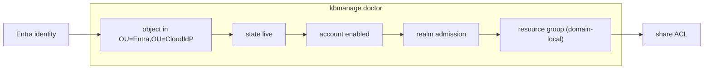

# Managing the KerBridge directory

Day-to-day identity work belongs in **Entra** — that is the whole point of the
project. What is left on-prem is what KerBridge deliberately does not own:

- the resource groups that turn a cloud identity into file access
- the occasional need to look at what sync has actually written

| Tool | Status | Needs |
|---|---|---|
| `kbmanage` | the supported one | a shell on the server host. `make kbmanage`, then `dist/kbmanage`, in a Docker Compose deployment; `apt install kerbridge-manage`, then `kbmanage`, in a Debian one |
| ADUC over RSAT | works too | the workarounds below — getting it working against a realm nobody is joined to is not obvious |

- Deploying KerBridge in the first place — [`../SETUP.md`](../SETUP.md)
- The authorization model these tools manipulate — [`setup/file-server.md`](setup/file-server.md)

---

## With `kbmanage`

The operator CLI: resource groups, their membership, and `doctor`.

```sh
make kbmanage          # dist/kbmanage, built for this host's architecture
dist/kbmanage doctor
dist/kbmanage config   # which file it read, and what it resolved to
```

That is the Docker Compose spelling. In a Debian deployment the
`kerbridge-manage` package puts `kbmanage` on the `PATH`, and every `dist/kbmanage`
below is plain `kbmanage`.

Binds as `svc-kerbridge-manage`, which `kbsetup directory` creates with two
deliberately different grants:

- **resource OU** — write
- **`OU=CloudIdP`** — delete-child, plus write on exactly these attributes
  (`sAMAccountName`, `userPrincipalName`, `extensionName`) for the rename below.
  Nothing else: that OU is `kerbridge-sync`'s, and the per-attribute form
  means this identity cannot reach `msDS-ExternalDirectoryObjectId`, which
  decides *which cloud identity an account is*.

### Fixing a login name

Login names follow the Entra display name on their own
(`automatic_sam_renames` in `configs/sync.toml`). Use these when the derived name is legal but
wrong — a mixed-script display name, or a form the person does not want:

```sh
dist/kbmanage cloud rename jane.smith --to jane.doe   # sets it, and pins it
dist/kbmanage cloud unpin jane.doe                    # sync owns it again
```

The rename refuses a name the realm cannot carry — the same
`kerbridge_core::sam` rule `issuerd` validates against, so it cannot create an
account that synchronizes but can never be issued a ticket — and refuses one
another object already holds. It moves `sAMAccountName` and `userPrincipalName`
together, since the directory enforces uniqueness on both, and leaves the CN to
sync.

The pin is a `kbstate1|namepinned|` marker written in the same modify as the
rename: without it, the next sync cycle would recompute the name and undo the
edit before anyone could add one. **The account's Kerberos principal changes**,
so that user signs out and back in once.

### Device grants

Only if the deployment has them on — see
[`setup/device-grants.md`](setup/device-grants.md), which is where the settings
and the trade-offs are.

```sh
dist/kbmanage device list                # every authorized machine
dist/kbmanage device list alice          # one user's
dist/kbmanage device revoke 1a2b3c4d     # stop one
dist/kbmanage device delegate list       # who may authorize a machine as whom
```

The last column is **"sign-in required by"**, not "expires": that date is when
someone has to be at that machine, in a browser. It is the date stamped in the
directory — `kbmanage` reads the DC and nothing else, and `device_grant_days` is
the broker's. Read it as an upper bound: lowering that setting brings the
enforced date in without changing this column.

Revocation names the eight-character id that `list` prints, never the machine
label. The label is whatever the machine said it was — two can claim the same one
— while the id is derived from the key and cannot be. Like every other lever
here it bites at the device's next ticket exchange, not at the moment you type
it.

This is the second and last thing `kbmanage` writes inside `OU=CloudIdP`, and it
needs no new delegation: `svc-kerbridge-manage` already holds per-attribute `WP` on
`extensionName` there. It only ever *deletes* a whole value; `issuerd` is the
one thing that writes them.

`device delegate set <user> <group>` is the other half — the group whose members
may authorize a machine to obtain tickets *as* that user, for a build box that
should publish as a service account nobody has the password of. It writes only in
the resource OU, so it needs no new delegation either. **Removing someone from a
delegate group revokes nothing**: it stops them authorizing new machines and
leaves the ones they already did running to their deadline. The walkthrough, and
what to do when a delegate leaves, are in
[`setup/device-grants.md`](setup/device-grants.md#machines-that-publish-as-a-service-account).

### The chain `doctor` walks

`doctor` walks from a cloud identity to a share and says which link is broken.



### Configuration

`make up` ends with `make kbmanage-config`, which writes
`deploy/configs/kbmanage.toml` and links `~/.config/kerbridge/configs` to the
deployment's `deploy/configs/` — that link is what the binary finds, from any
directory, with `main.toml` as the set's entry point.

Precedence, highest first:

1. `--config <directory>`
2. `~/.config/kerbridge/configs`, via the link
3. `/etc/kerbridge` — where a package installs

Two fixed locations, no walk up the tree. Each names a *directory*, because the
binary reads the whole set whichever file you would have pointed at.
`kbmanage config` prints which one answered.

- `make kbmanage-config` writes `kbmanage.toml` **only if it is absent**, and
  the link the same way — each says so and leaves the existing one alone,
  because once it exists it is yours to edit. Changed `.env`? Delete
  `kbmanage.toml` and re-run.
- The realm CA it copies out is refreshed on every run either way.
- The config set is TOML. `main.toml` is the entry point; the rest,
  `kbmanage.toml` and `realm.toml` among them, are found beside it under fixed
  names.

<details>
<summary>Why two fixed locations and no search path</summary>

Silently rewriting a hand-pointed DC is how a tool ends up managing the wrong
directory. And a tool that looks in several places answers "why is it talking to
*that* DC" with a list, and you still have to work out which entry won.

</details>

### Connecting

A host-run binary connects to `ldaps://localhost:636` — no `/etc/hosts` entry and
no name resolution at all. The realm's LDAPS certificate `subjectAltName` is
`DNS:<dc>.<domain>, DNS:<dc>, DNS:localhost, IP:127.0.0.1, IP:::1`.

- Only IPv4 loopback is published by default, so `ldaps://[::1]` validates but
  has nothing listening behind it.
- Naming loopback grants nothing extra: reaching it already means being on this
  host.

**A rebuilt realm creates a new CA**, and TLS then fails against the copy in
`secrets/generated/`:

1. `make kbmanage-config` — refreshes the CA in place, at the path
   `kbmanage.toml`'s `ldap_ca_file` already points to, so nothing else has to
   change.
2. `docker compose restart broker sync` — the new CA means the broker and sync
   need the CA republished.
3. Restart Caddy **after** the broker — it shares the broker's network namespace
   and otherwise loses its listener.

Both the CA-read error and the connection error name the file and that command,
so this is diagnosable without this page.

### Getting the binary

Two ways, and the difference matters:

- `make kbmanage` — a static musl Linux binary in `dist/`, built in Docker with
  no Rust toolchain on the host. Follows the **build host's** architecture, like
  the service images do, so on an arm64 server you get an arm64 binary.
  Cross-build for another server with
  `make kbmanage KBMANAGE_PLATFORM=linux/amd64`; that runs emulated and is slow,
  because there is no musl cross-compiler in the image (see
  `deploy/kbmanage/Dockerfile`). Either way the build asserts that what came out
  is the architecture that was asked for, and that it is statically linked.
- `make build-local` — `cargo build --release --workspace`, host-native, needing
  a local Rust toolchain. On a Mac this gives a macOS binary at
  `target/release/kbmanage` that talks to the bench directly. **Development
  only:** it is not a Linux artifact and is never what ships.

---

## From Windows with RSAT

`samba-tool` on the DC is the other supported path. This section is for when you
nonetheless want ADUC — it works, but several separate things are in the way, none
of them obvious.

Where each applies:

- **§§1 and 4** — consequences of the development bench, where the DC runs behind
  a bridge network with published ports. On a host-networked production
  deployment the DC has its own address and its own ports, and they do not apply.
- **§3** — applies everywhere, because it is Windows' elevation model rather than
  anything about KerBridge.

Measurements behind this section:
research spike `aduc-elevation-and-injected-tickets`.

### 1. Publish the ports

The realm service publishes `88`, and `636` bound to loopback (`LDAPS_BIND`).
ADUC runs on another machine, so widen that one and add the rest:

```yaml
      - "389:389/tcp"     # LDAP
      - "389:389/udp"     # CLDAP -- the DC locator's netlogon ping
      - "3268:3268/tcp"   # Global Catalog, for the object pickers
      - "445:445/tcp"     # SAMR/LSARPC over named pipes -- see §4
```

and set `LDAPS_BIND=0.0.0.0` in `.env`.

Some ADUC operations also use RPC (`135` plus the dynamic `49152-65535` range).
Nothing needed it in the session this was worked out in. This is exactly the AD
DC NAT and dynamic RPC complexity that
[`DESIGN.md` § Host networking and DNS](../docs/design/api-and-network.md#host-networking-and-dns)
avoids by using host networking in production.

### 2. Give the client the DC-locator records

The LAN resolver set in [`../SETUP.md`](../SETUP.md#3-publish-the-dns-records)
carries `_ldap._tcp.<domain>` and `_ldap._tcp.dc._msdcs.<domain>`, which is the
minimum ADUC needs. The rest of the locator set a domain member expects is not
there, and some ADUC operations want it. Verify with:

```
nltest /dsgetdc:example.site
```

A healthy answer names the DC and reports `PDC GC DS LDAP KDC ... WRITABLE`.

**Do not solve this by pointing the client at Samba's DNS.** Samba's zone is
complete, but its A records carry the *bridge* addresses the DC registered for
itself, which the client cannot route to. The records have to be added to the LAN
zone by hand.

In dnsmasq, `srv-host=<name>,<target>,<port>,<priority>,<weight>`:

```
srv-host=_ldap._tcp.example.site,kerbridge.example.site,389,0,100          # in SETUP.md
srv-host=_ldap._tcp.dc._msdcs.example.site,kerbridge.example.site,389,0,100  # in SETUP.md
srv-host=_kerberos._tcp.dc._msdcs.example.site,kerbridge.example.site,88,0,100
srv-host=_kpasswd._tcp.example.site,kerbridge.example.site,464,0,100
srv-host=_kpasswd._udp.example.site,kerbridge.example.site,464,0,100
srv-host=_gc._tcp.example.site,kerbridge.example.site,3268,0,100
srv-host=_ldap._tcp.gc._msdcs.example.site,kerbridge.example.site,3268,0,100
```

- The first two are already in the `SETUP.md` set; the rest are **additions** to
  it, not a replacement.
- A full DC-locator set also includes the site-scoped
  `_ldap._tcp.<site>._sites.dc._msdcs` and `_gc._tcp.<site>._sites`, and the
  domain-GUID `_ldap._tcp.<domain-guid>.domains._msdcs`; `nltest` reports both
  the site name and the domain GUID.
- `_ldap._tcp.<domain>` is the one known to matter (see §5).

### 3. Credentials: `cmdkey`, not `runas`

Store the credential and launch ADUC normally from the Start menu, where no
elevation transition occurs:

```
cmdkey /add:kerbridge.example.site /user:Administrator@example.site /pass
cmdkey /add:example.site /user:Administrator@example.site /pass
```

- `/pass` with no value prompts, keeping the password out of the command history.
- Both targets are worth adding: ADUC reaches the DC by host name, but some
  operations reference the domain name.
- `Administrator`'s password is `secrets/generated/realm_admin_password`.

Does **not** work:

- `runas /netonly /user:Administrator@example.site "mmc dsa.msc"` — the obvious
  approach; fails, and fails confusingly.
- Granting the Entra-sourced identity `Administrators` — the failure is
  authentication-side, so authorization is never reached.

Two consequences worth planning around:

- **Note the exposure.** This puts a realm admin password at rest on a Windows
  client — the exact credential KerBridge exists to remove. Acceptable against a
  throwaway bench realm provided §6 actually happens; think harder about it
  anywhere else.
- **Tickets outlive the entry.** Deleting the `cmdkey` credential leaves valid
  tickets cached in the elevated session for the rest of their lifetime, while
  binds fail. `klist purge` *in the elevated session* clears them.

If your admin workstation's interactive user is a **standard** account, MMC
should never elevate and should be able to use the injected ticket with no stored
credential at all. That is untested — it is the open experiment in the result
file above.

<details>
<summary>Why the stored credential is needed at all</summary>

The injected TGT cannot drive ADUC, even though it authenticates LDAP perfectly
well from the same session. `mmc.exe` is manifested `highestAvailable`, and
elevated processes get a separate logon session with a separate view of the
ticket cache — so ADUC runs somewhere the injected ticket does not exist.
Credential Manager is per-*user* rather than per-session, which is why `cmdkey`
reaches across the gap and `runas /netonly` does not.

</details>

### 4. `:445` belongs to nas1

- **Symptom:** ADUC reports **"Access is denied"** after a successful LDAP bind.
  `net view \\kerbridge.example.site` listing `nas1`'s share confirms it.
- **Cause:** ADUC's domain connect makes SAMR/LSARPC calls over SMB named pipes,
  and `445:445/tcp` binds **every** host address. If the DC and a file server
  share a host address — as they do on the bench — those calls reach whichever
  container claimed `445` first, under the *other* one's name.

Scope the publications and both can run at once:

```yaml
  realm:
    ports:
      - "192.0.2.13:445:445/tcp"
  nas1:
    ports:
      - "192.0.2.14:445:445/tcp"
```

Where the two genuinely share one address, the file server has to stand down for
the duration:

```sh
docker compose stop nas1
```

Restart it and drop `445` from the realm service together — leaving the DC
holding `445` breaks SMB share testing in a way that looks unrelated.

### 5. Errors to expect and ignore

Two failures look alike, have different causes, and only one is fixable:

- **At startup: "Naming information cannot be located because: The specified
  domain either does not exist or could not be contacted."** Press OK and carry
  on. This is ADSI *serverless binding* — ADUC resolves "the domain" from the
  client's own domain membership, read from LSA, not from DNS. A workgroup
  machine has no membership to read, so no SRV record fixes it; that lookup never
  reaches DNS at all.
- **Change Domain: "The domain … could not be found because: The server is not
  operational."** This one **is** a DNS gap. It fails while `_ldap._tcp.<domain>`
  is missing; adding that record makes the dialog work.

With the record in place, Change Domain is not needed for ordinary use anyway —
**Change Directory Server** against `kerbridge.example.site` is the more direct
route, and is the supported way to drive ADUC from a machine that is not joined.
The tree then loads and behaves normally.

### 6. Cleanup

```
cmdkey /delete:kerbridge.example.site
cmdkey /delete:example.site
```

and revert the published ports, restarting `nas1`.
