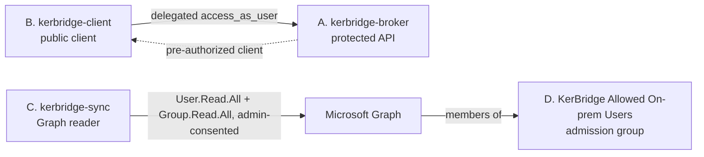

# Entra setup by hand — portal or Azure CLI

This page tells you how to create the three app registrations and the admission
group by hand. The result is identical to the result of
[the Terraform module](entra-terraform.md), except for the three display names:
the portal walk-through below uses `kerbridge-broker`, `kerbridge-client` and
`kerbridge-sync`, and Terraform and the CLI blocks use `KerBridge broker API`,
`KerBridge helper` and `KerBridge sync`. A display name is yours to select. No
config value holds one. [`entra.md`](entra.md) tells you
*what* these objects are, which six `[provider_config]` values they produce, and the four
defaults that Entra sets incorrectly. This page is only the *how*.

Use this path if you cannot run Terraform against your tenant, or if you do not
want to. The page is useful on both paths, because it explains what the
Terraform does.

## Prerequisites

- An identity in the tenant that can **create application registrations** and
  **grant application permissions**. The admin-consent step needs the
  Privileged Role Administrator role or the Global Administrator role.
- A note that you keep during the procedure. You need:
  - the **tenant ID**;
  - the **Application (client) ID** of each of the three registrations;
  - one secret.
- All three registrations are single-tenant ("Accounts in this organizational
  directory only" / `AzureADMyOrg`).

## What you build



---

## The portal walk-through

### A. `kerbridge-broker` — the protected API

1. **New registration.** Set the name to `kerbridge-broker`. Select single
   tenant. **Do not add a redirect URI** — this registration is an API, not a
   client.
2. **Expose an API → Application ID URI → Add.** Accept the default
   `api://{BROKER_APP_ID}`. Save.

   > **CAUTION:** Do not skip this step. The broker tells the helper that its
   > scope is `api://{BROKER_APP_ID}/access_as_user`, thus that URI must
   > resolve to this application. The portal does not let you add a scope
   > before you save this URI. But a tool that drives Graph directly can
   > create the app and the scope with the URI not set. Then every token
   > request fails with `AADSTS500011`, and no value in `configs/idp_entra.toml`
   > looks incorrect.

3. **Expose an API → Add a scope**, then **Add scope**:

   | Field | Value |
   |---|---|
   | Scope name | `access_as_user` |
   | Who can consent | `Admins and users` (the portal default is `Admins only`; each value works, because step 4 pre-authorizes the client) |
   | Admin consent display name | `Access KerBridge as the signed-in user` |
   | Admin consent description | `Allow the KerBridge helper to obtain a Kerberos ticket for the signed-in user.` |
   | User consent display name | `Access KerBridge on your behalf` |
   | User consent description | `Allow the KerBridge helper to obtain a Kerberos ticket for you.` |
   | State | `Enabled` |

   The two user-consent fields appear only when *Who can consent* is `Admins
   and users`. The portal makes them mandatory then. No user sees these four
   strings while step 4 pre-authorizes the client, but Terraform sets the same
   four, so keep them the same.

4. **Expose an API → Authorized client applications → Add a client
   application.** Enter the **`kerbridge-client` application ID from section
   B** and select `api://{BROKER_APP_ID}/access_as_user`. This step removes
   the consent prompt for your users. Register B first, or return to this
   step after you register B.
5. **Manifest.** Set:

   ```json
   "api": { "requestedAccessTokenVersion": 2 }
   ```

   **This step is mandatory.** The default is `null`, which issues v1 tokens
   with a different `aud` and `iss`. The broker rejects every v1 token.

6. **Token configuration → Add optional claim → Access → `idtyp`.** With this
   claim, the broker can know if a token is a user token or an app-only
   token.

> **CAUTION:** The `idtyp` claim is a security control. Entra issues an
> app-only token with `aud = {BROKER_APP_ID}` to **any** confidential client
> in your tenant, with no grant, no consent, and no app role. This is the
> design of Entra, and you cannot turn it off. The presence of `scp` together
> with `idtyp != "app"` is the *only* mark that separates a real user from
> any service principal in your directory. Do not remove this optional claim.

Do **not** add app roles. Nothing needs them.

### B. `kerbridge-client` — the workstation client

1. **New registration.** Set the name to `kerbridge-client`. Select single
   tenant.
2. **Authentication → Add a platform → Mobile and desktop applications.** Add
   the redirect URI `http://127.0.0.1`, with no port.
   - Entra ignores the port when it matches loopback redirects. Thus the
     helper can bind any ephemeral port.
   - Register only this one URI. Do not add variants with ports.
   - Do not use `localhost` — `127.0.0.1` is the host that the helper sends.
3. **Add a second redirect URI on the same platform:**

   ```
   ms-appx-web://microsoft.aad.brokerplugin/{HELPER_APP_ID}
   ```

   Put the application ID of this app in the place of `{HELPER_APP_ID}`.
   **Do not skip this step.** The tray agent prefers Windows sign-in by
   default. Without this URI, that path fails with a redirect-URI mismatch.
4. **Advanced settings → Allow public client flows:** leave this setting
   **off**. PKCE with a registered native redirect URI does not need it.
5. **API permissions → Add a permission → My APIs → `kerbridge-broker` →
   Delegated → `access_as_user`.** Do **not** click *Grant admin consent* if
   you did the pre-authorization in step A4. The pre-authorization makes that
   consent unnecessary.

Do not create a client secret. This is a public client.

### C. `kerbridge-sync` — the Graph reader

1. **New registration.** Set the name to `kerbridge-sync`. Select single
   tenant. Do not add a redirect URI.
2. **API permissions → Add a permission → Microsoft Graph → Application
   permissions** → `User.Read.All` and `Group.Read.All` → **Add permissions** →
   then **Grant admin consent**. Application permissions do nothing until an
   admin consents to them.

   - These permissions are read-only. KerBridge never writes to your tenant.
   - The permission is `Group.Read.All`, not the narrower
     `GroupMember.Read.All`. Sync must see the deleted-groups recycle bin to
     know the difference between a deletion and a permission failure.
3. **Certificates & secrets → New client secret.** See
   [The sync credential](#the-sync-credential) below.

### D. The admission group

Create the security group that you selected in
[step 1 (*Decide the names*) in SETUP.md](../../SETUP.md#1-decide-the-names) —
`KerBridge Allowed On-prem Users`.
Add your pilot users to it. Record its **Object ID**.

Nothing works without this group. If the group does not exist, sync resolves
no admission group and mirrors no users. Then every sign-in fails with a 403.

---

## The same thing with the Azure CLI

- Run the blocks in order **in one shell**.
- Each block captures the generated id into a shell variable, and the last
  block prints the `[provider_config]` lines. Thus this path can supply the
  config directly — it works as the wizard script.
- Two steps use `az rest` against Graph, because the convenience commands of
  the CLI do not cover them. The portal does those two steps more easily.

### 0. Pick the tenant and a scope id

```sh
az login
tenant_id=$(az account show --query tenantId -o tsv)
scope_id=$(uuidgen | tr 'A-Z' 'a-z')
graph=00000003-0000-0000-c000-000000000000     # Microsoft Graph, well-known
```

### 1. Broker API

```sh
broker_api_id=$(az ad app create \
  --display-name "KerBridge broker API" \
  --sign-in-audience AzureADMyOrg \
  --query appId -o tsv)
az ad sp create --id "$broker_api_id" >/dev/null

# The Application ID URI. Without it, api://.../access_as_user resolves to
# nothing, and every token request fails with AADSTS500011.
az ad app update --id "$broker_api_id" --identifier-uris "api://$broker_api_id"
```

### 2. Public client (kerbridge-client)

This block refers to the broker scope by the id that you generated. The scope
does not exist on the API yet. That is not a problem — step 4 creates it
there.

```sh
public_id=$(az ad app create \
  --display-name "KerBridge helper" \
  --sign-in-audience AzureADMyOrg \
  --public-client-redirect-uris http://127.0.0.1 \
  --required-resource-accesses "[{\"resourceAppId\":\"$broker_api_id\",\"resourceAccess\":[{\"id\":\"$scope_id\",\"type\":\"Scope\"}]}]" \
  --query appId -o tsv)
az ad sp create --id "$public_id" >/dev/null

# The WAM redirect embeds this app's own id, thus a second call is necessary.
# Without it, the tray's Windows sign-in path fails with a redirect-URI mismatch.
az ad app update --id "$public_id" \
  --public-client-redirect-uris \
    http://127.0.0.1 \
    "ms-appx-web://microsoft.aad.brokerplugin/$public_id"
```

### 3. Sync app, with admin-consented Graph reads

```sh
sync_id=$(az ad app create \
  --display-name "KerBridge sync" \
  --sign-in-audience AzureADMyOrg \
  --query appId -o tsv)
az ad sp create --id "$sync_id" >/dev/null
# User.Read.All and Group.Read.All, both application (=Role)
az ad app permission add --id "$sync_id" --api "$graph" \
  --api-permissions \
    df021288-bdef-4463-88db-98f22de89214=Role \
    5b567255-7703-4780-807c-7be8301ae99b=Role
az ad app permission admin-consent --id "$sync_id"
```

The two GUIDs are the well-known ids of those permissions.

### 4. Expose the scope, pre-authorize the helper, and ask for `idtyp`

This is one `az rest` PATCH. `PATCH` replaces the full `api` object, thus the
token version, the scope, and the pre-authorization must go in one request.
The `optionalClaims` part puts `idtyp` on the access token.

```sh
az rest --method PATCH \
  --url "https://graph.microsoft.com/v1.0/applications(appId='$broker_api_id')" \
  --headers 'Content-Type=application/json' \
  --body "$(cat <<JSON
{
  "api": {
    "requestedAccessTokenVersion": 2,
    "oauth2PermissionScopes": [{
      "id": "$scope_id",
      "value": "access_as_user",
      "type": "User",
      "isEnabled": true,
      "adminConsentDisplayName": "Access KerBridge as the signed-in user",
      "adminConsentDescription": "Allow the KerBridge helper to obtain a Kerberos ticket for the signed-in user.",
      "userConsentDisplayName": "Access KerBridge on your behalf",
      "userConsentDescription": "Allow the KerBridge helper to obtain a Kerberos ticket for you."
    }],
    "preAuthorizedApplications": [{
      "appId": "$public_id",
      "delegatedPermissionIds": ["$scope_id"]
    }]
  },
  "optionalClaims": {
    "accessToken": [{ "name": "idtyp", "essential": false }]
  }
}
JSON
)"
```

### 5. Admission group

```sh
group_id=$(az ad group create \
  --display-name "KerBridge Allowed On-prem Users" \
  --mail-nickname kerbridge-allowed-onprem-users \
  --query id -o tsv)
```

### 6. The six `[provider_config]` values

```sh
cat <<TOML
[provider_config]
tenant_id = "$tenant_id"
broker_api_client_id = "$broker_api_id"
public_client_id = "$public_id"
scope = "access_as_user"
sync_client_id = "$sync_id"
admission_group_id = "$group_id"   # the id is the binding; no name key beside it
TOML
```

Paste these values into the `[provider_config]` table of
`configs/idp_<source>.toml`. Replace the synthetic fixture values that the
template contains.

---

## The sync credential

- `kerbridge-sync` authenticates to Graph app-only with `sync_client_id`
  and a **client secret**.
- The secret is a file secret at `deploy/secrets/idp/entra/credential`. Put
  one secret in one file, never in a config value (see
  [Secrets (`deploy/README.md`)](../../deploy/README.md#secrets)).
- This step is the same for each path, including Terraform. Terraform does not
  create the secret by default.

The Azure CLI returns the *Value* of the secret directly. This prevents the
Value/Secret-ID error that the portal causes:

```sh
(umask 077; az ad app credential reset --id "$sync_id" \
   --append --years 2 --query password -o tsv \
   > deploy/secrets/idp/entra/credential)
```

> **CAUTION:** In the portal, copy the *Value*, not the *Secret ID*. The two
> columns look like GUIDs, and they are adjacent. The portal masks the *Value*
> when you go to a different page. The *Secret ID* stays visible permanently.
> Thus a person who returns later finds only one string that they can copy,
> and it is the incorrect one. The failure is `AADSTS7000215: Invalid client
> secret provided`, and this message does not identify the cause. A *Secret
> ID* is a 36-character `8-4-4-4-12` GUID; a secret value never has that
> shape. For this reason, the stack refuses a GUID-shaped credential at
> startup.

`sync_credential_expires` in `configs/idp_entra.toml`'s `[provider_config]`
(optional, format `YYYY-MM-DD`) records the expiry date that you selected:

- The value is an operator assertion, not a measurement. A client secret does
  not carry its expiry in a place that the deployment can read.
- There is only one risk: you rotate the secret, but you keep the old date.
- An empty value is a supported choice. Sync then relies on the owner-email
  notice from Entra, and it reports this one time at startup.
- See its note in `idp_entra.toml.example` and
  [Graph credential lifetime (`DESIGN.md`)](../../docs/design/identity-and-directory.md#graph-credential-lifetime).

---

## After Entra

- The Entra values are only a part of the config set. Continue with
  [step 3 (*Publish the DNS records*) in SETUP.md](../../SETUP.md#3-publish-the-dns-records).
- The Entra setup cannot make sure of one thing by itself: the broker matches
  a token against the identity stored on each Samba account. If you change
  `tenant_id` after the directory is seeded, you must run the directory
  bootstrap again. A stale tenant id on the accounts denies every login.
