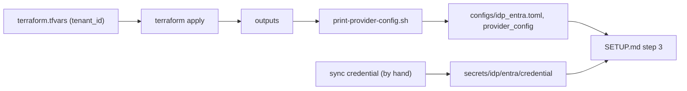

# Entra setup with Terraform

This is the easy way to create the [three app registrations](entra.md) and the
admission group. If you do not want Terraform, see
[the manual path](entra-manual.md). The manual path gives an identical result,
by hand.

This path is better for these reasons:

- Terraform generates the six values that must match between Entra and the
  `[provider_config]` table of `deploy/configs/idp_entra.toml`, and then reads
  them back directly. As a result, you do not copy a value from a portal blade
  by hand.
- The module also sets the four items that have incorrect default values in
  Entra. If these items are absent, the source file looks correct, but each
  login always fails. The four items are:
  - v2 tokens
  - the Application ID URI
  - the WAM redirect URI
  - the `idtyp` claim

Scope: the module is in
[`deploy/terraform/entra/`](../../deploy/terraform/entra/) — one directory per
cloud IdP — and it communicates only with Entra. No on-prem item is in scope: no
realm, DNS, TLS, or ticket policy. The optional
[device-grant group](device-grants.md) is also out of scope. If a deployment
activates that feature later, the operator creates the group by hand.

## Prerequisites

- **Terraform >= 1.5.** `terraform init` gets the `hashicorp/azuread` v3
  provider that is pinned in `versions.tf`.
- **`az login`** as an identity in the target tenant that can do these tasks:
  - **create application registrations**
  - **grant application permissions** — the admin-consent step needs the
    Privileged Role Administrator or the Global Administrator role

  The provider uses the Azure CLI session by default.

  > **Note:** If the Azure CLI cannot sign in to your tenant, use
  > [the manual path](entra-manual.md) instead. The provider has no
  > device-code flow, so there is no alternative to this prerequisite.

<details><summary>Install Terraform and az on Debian/Ubuntu</summary>


```
sudo apt update
sudo apt install azure-cli

sudo apt install extrepo
sudo nano /etc/extrepo/config.yaml
# uncomment/add "non-free" under enabled_policies:
#   enabled_policies:
#     - main
#     - non-free

sudo extrepo enable hashicorp
sudo apt update
sudo apt install terraform
```

Then sign in with `az login`.
</details>

## Run it

```sh
cd deploy/terraform/entra
cp terraform.tfvars.example terraform.tfvars     # set tenant_id
terraform init
terraform plan                                   # a real dry run -- read it
terraform apply
./print-provider-config.sh                                   # print the 6 values to paste
```



`print-provider-config.sh` **writes no file** — it prints, and you paste. It:

- prints exactly the six `[provider_config]` values, as a TOML fragment on
  stdout, and the steps that follow on stderr. Pasting the fragment into
  `deploy/configs/idp_entra.toml` is your step: the script cannot know whether
  that file exists yet or where its table starts.
- touches nothing else — not the rest of that file, not the other config files,
  and not `deploy/.env`.
- is safe to run again after another `apply`: the fragment then carries the new
  outputs.

Then do these steps:

1. Put the sync credential in place (see below).
2. Fill in the rest of the config set and `.env` by hand — realm, DNS, TLS and
   ticket policy. That `[provider_config]` block is the only part this module
   answers.
3. Continue with
   [step 3 (*Publish the DNS records*) in SETUP.md](../../SETUP.md#3-publish-the-dns-records).

## The sync credential

By default, this module does **not** give you the sync app's Graph secret. The
reason: if Terraform creates the secret, Terraform writes a live credential
into `terraform.tfstate`. The state file then becomes a secret.

- **`create_sync_secret = false`** (the supported default) — creates the app
  and its consent, and leaves the credential to you. The procedure is in
  [The sync credential (`entra-manual.md`)](entra-manual.md#the-sync-credential).
  This command shows the client id:

  ```sh
  terraform -chdir=deploy/terraform/entra output -raw entra_sync_client_id
  ```

- **`create_sync_secret = true`** — makes the state file sensitive, but reduces
  the procedure to one command. `print-provider-config.sh` then prints the two commands
  that get the secret and its expiry out of the outputs.

<details>
<summary>Why secrets only — <code>kerbridge-sync</code> has no certificate support yet</summary>

A certificate credential is the intended default in
[Graph credential lifetime (`DESIGN.md`)](../../docs/design/identity-and-directory.md#graph-credential-lifetime).
But `kerbridge-sync` does not support one yet. Thus this module follows the
running code and uses only secrets. When the certificate path is implemented,
the natural design is this: Terraform uploads a *public* certificate that the
operator supplies (`azuread_application_certificate`). This design keeps the
private key out of the state in each configuration.

</details>

## State

`terraform.tfstate` records these items:

- the object ids
- the sync secret — only when `create_sync_secret = true`

The `.gitignore` in that directory keeps the state, the plans, and
`terraform.tfvars` out of the repository. `terraform.tfvars` holds the real
tenant id. If you move the state to a remote backend, use a backend that
encrypts the data at rest.

## Teardown

`terraform destroy` removes the three apps, the group, and the consent.

- **Throwaway test tenant** — you can do this freely.
- **Live tenant** — when you delete the group, its object id is lost. A group
  that you create again gets a new object id. This is also the reason that
  `DESIGN.md` makes the restoration of a lost admission group an operator
  task.

## Inputs and outputs

- The reference table is in
  [`deploy/terraform/entra/README.md`](../../deploy/terraform/entra/README.md).
- `variables.tf` and `outputs.tf` have a description on each entry.
- `tenant_id` is the only variable that you must set.
