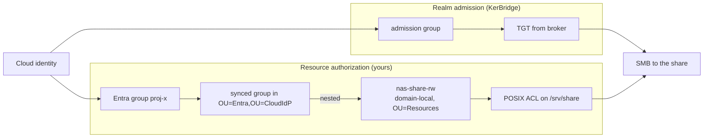
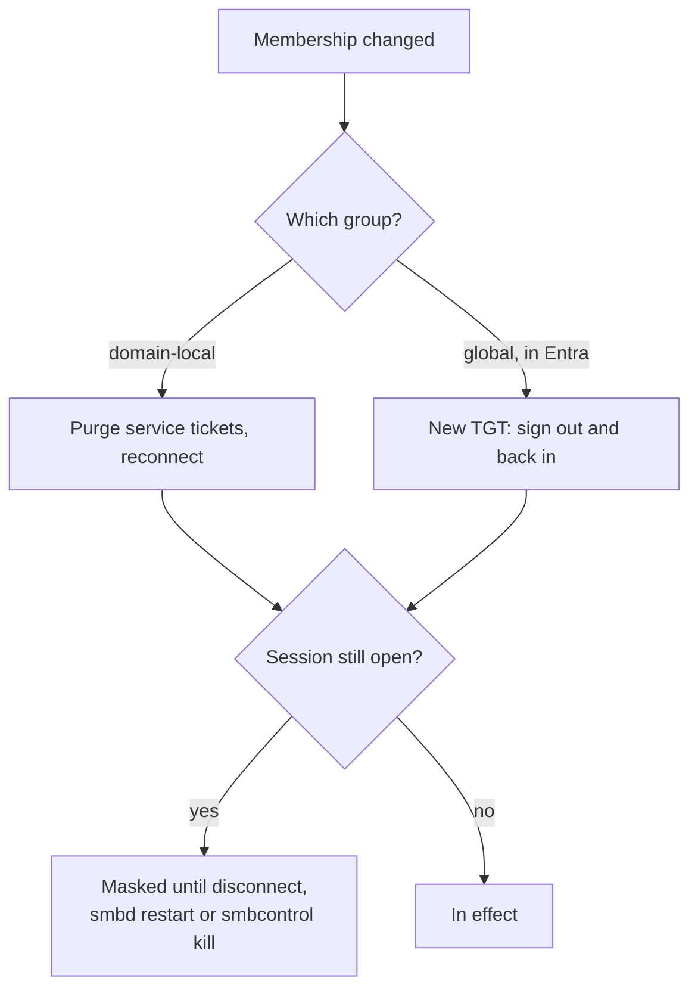

# Joining a file server to a KerBridge realm

This page is [`SETUP.md`](../../SETUP.md) steps
[5 (*Join your file server*)](../../SETUP.md#5-join-your-file-server) and
[6 (*Authorize cloud identities on SMB share*)](../../SETUP.md#6-authorize-cloud-identities-on-smb-share).
It is the full procedure. Follow this page, not the summary there.

In production the file server is a separate host that you own. It runs Samba as
a domain member of the KerBridge realm.

> **Note: This page does not cover consumer NAS appliances.** On Synology, QNAP
> or TrueNAS, the vendor UI regenerates `smb.conf`, and an update can lose your
> edits to `nsswitch.conf`. The join goes through a domain-join wizard, and
> nobody here tested that wizard against a Samba DC. It will **probably** work,
> because a Samba AD DC is an ordinary AD DC to a member that joins. But it was
> not tried.

<details>
<summary>The <code>nas1</code> container is a fixture, not a product</summary>

`nas1` in [`deploy/`](../../deploy/) is a test fixture. It is minimal by
design, so that one `make up` can show the full path: Entra sign-in → injected
TGT → passwordless SMB. Do not run a production file server this way.

**Stop the fixture before you join your own file server.** `make up NAS=1`
gives `nas1` the host's `:445`, and your file server joins the DC through that
port. One host has one SMB port, and you cannot move it. `make up` alone
publishes the port for the DC, and this page assumes that deployment.

`deploy/compose.nas.yaml` also takes three shortcuts that a real member must
not take. It regenerates `smb.conf` from the environment at each start. It
rewrites `nsswitch.conf` with an unguarded `sed`, which is safe only because
the base image is bare. And it joins non-interactively, with the password read
from a file.

</details>

## What is whose

KerBridge owns `OU=CloudIdP` and everything under it. `kerbridge-sync` creates
the users and groups there from the cloud, and it reconciles them. If you edit
that OU by hand, sync reverts your edit or conflicts with it.

KerBridge does **not** own your file server, its shares, its resource groups or
its ACLs.

| Layer | Owner | Lives in |
|---|---|---|
| Cloud users and their group membership | Entra | Your tenant |
| Their on-prem shadow objects | `kerbridge-sync` | `OU=Entra,OU=CloudIdP` |
| Resource groups | You | Anywhere outside `OU=CloudIdP`; `OU=Resources` by default |
| Share definitions and filesystem ACLs | You | The file server |

`nas-share-rw` and `proj-x` below are examples. They match the worked example
in the research spike `joined-nas-authorization`, so that the two documents
agree. Use the names that your site already uses.

## Prerequisites

- **Samba**, any release that is currently maintained.
  - Interoperation is at the AD protocol level, functional level 2008 R2. The
    Samba wiki documents no member-to-DC version matrix.
  - The tests here only ever paired a member and a DC on the same version. If
    you can, run the same distribution package as the DC.
- **DNS through the DC.** The file server must resolve the AD zone's SRV and A
  records from the KerBridge DC. Set `nameserver <DC address>` and
  `search example.site`. This makes `dns_lookup_kdc` work, and it makes the
  join's own A-record registration work. See
  [Give the file server the realm zone
  (`dns-and-firewall.md`)](dns-and-firewall.md#give-the-file-server-the-realm-zone).
- **Time within 300 seconds** of the DC. This is the Kerberos authenticator
  window. Run NTP on the DC, on every member and on every client.
  - With a difference of 10 minutes, SMB session setup fails with
    `NT_STATUS_LOGON_FAILURE`. With a difference of 4 minutes, it succeeds.
  - `kinit` corrects the difference at AS time and shows no error message. So a
    client with a bad clock can hold a valid TGT, and the service can still
    refuse it.
- **A unique host name.**
- **A real POSIX filesystem** with extended attributes and POSIX ACLs that
  operate correctly, for both `/var/lib/samba` and the share path. Overlay
  mounts and macOS-style bind mounts are not suitable.

<details>
<summary>If the file server shares a host with the DC</summary>

A file server is normally a separate machine, and everything on this page
assumes that. A file server on the KerBridge host works, but both want `:445`,
and only one can publish it on `0.0.0.0`.

Give the host a second address and divide the ports: `MEMBER_BIND` binds the
DC's member-facing ports to the first address, and the file server publishes on
the second. The configuration options exist, and the addresses are ordinary
secondary addresses on one NIC. But this combination was not tested here. Treat
it as a possible design, not as a tested procedure.

</details>

## 0. Install software

> **CAUTION: Do not do §0 to §3 on the DC host before `kbsetup realm` has
> finished.** §3 puts `winbind` in `passwd:` and `group:`, and PAM's chain
> reads it at every login, the console included. Winbind has nothing to answer
> with until a realm exists and the DC's AD service runs. On the DC, before
> provisioning finishes, that lookup blocks instead of fails, and it can lock
> every login on the host until you kill the stuck process. For this reason
> `kbsetup realm` takes `winbind` back out of `/etc/nsswitch.conf` before it
> provisions, and says so. It never puts it back: on a host that is
> deliberately both the DC and the file server, do §3 again afterward.

Debian:

```sh
apt install samba krb5-user winbind libnss-winbind libpam-winbind
```

## 1. `/etc/krb5.conf`

```ini
[libdefaults]
    default_realm = EXAMPLE.SITE
    dns_lookup_realm = false
    dns_lookup_kdc = true
```

Do not name a KDC here. The file server finds it through the SRV records that
the DC serves.

## 2. `/etc/samba/smb.conf`

```ini
[global]
    security = ADS
    realm = EXAMPLE.SITE
    workgroup = EXAMPLE

    kerberos method = secrets and keytab

    # Allocating, member-local. Covers BUILTIN and any non-realm SID.
    idmap config * : backend = tdb
    idmap config * : range = 100000-199999
    # Deterministic and stateless: unix_id = RID + range low.
    idmap config EXAMPLE : backend = rid
    idmap config EXAMPLE : range = 1000000-1999999

    template shell = /sbin/nologin
    disable netbios = yes
    smb ports = 445

[share]
    path = /srv/share
    read only = no
    valid users = @"EXAMPLE\nas-share-rw"
```

### The idmap range is a one-way door

`idmap_rid` computes every uid and gid arithmetically from the RID. So the
range is part of every uid and gid that is stored on disk.

- Keep the realm range **byte-identical on every member** that shares files or
  ACLs.
- **Never change the range after deployment.**
- Do not let the ranges overlap each other, and do not let them overlap the
  local system accounts (0–65533).
- The `*` tdb backend is *allocating*, so BUILTIN mappings can differ between
  members. Grant ACLs through realm groups only, never through BUILTIN.

A second member was configured with `2000000-2999999`. It mapped the same user
to a different uid. That orphaned the files that the user wrote, and the new
uid no longer matched the filesystem ACL. The result was
`NT_STATUS_ACCESS_DENIED` for the same user who created the file. To recover
from a changed range, you must also change the owner of every file.

### `valid users` is defense in depth, not the control

- It matches on the group **name**. If you rename the group, the match stops,
  and it shows no error message.
- The filesystem ACL of §6 comes from the SID, and it is the durable control.
- Keep both. The ACL is the control that matters.

## 3. /etc/nsswitch.conf

Without this change, the share ACL cannot resolve a realm group to a gid, and
`id 'EXAMPLE\alice'` returns nothing useful.

Change two lines, `passwd:` and `group:`. Add `winbind` at the **end** of each.
Change nothing else in the file:

```
passwd:         files systemd winbind
group:          files systemd winbind
shadow:         files
gshadow:        files
```

Rules for these two lines:

- **Keep `files` first.** Local system accounts then always resolve locally. A
  directory entry with the same name cannot hide them, and they continue to
  resolve if winbind is down or the DC is unreachable.
- **Put `winbind` last**, after `systemd` if it is there. Keep `systemd`: if
  you remove it, resolution breaks for the dynamic users of services with
  `DynamicUser=`, and for all `systemd-homed` accounts. A host without systemd,
  usually a container, has no `systemd` in these lines.
- **Do not add `winbind` to `shadow:` or `gshadow:`.** Winbind does not serve
  those databases, and there is no password hash to get. Kerberos is the
  authentication path here.
- If the line says `passwd: compat` (Debian before trixie), change `compat` to
  `files` first. `compat` and `winbind` do not combine usefully.

After the join in §4, when `winbindd` runs, check that the group resolves:

```sh
getent group 'EXAMPLE\nas-share-rw'      # must print the group with its gid
```

<details>
<summary>Scripted equivalent, for an unattended install</summary>

```sh
sed -i -E 's/^(passwd:.*files)( .*)?$/\1 winbind/; s/^(group:.*files)( .*)?$/\1 winbind/' /etc/nsswitch.conf
```

`deploy/member/entrypoint.sh` runs this command. It is safe **there**, because
`debian:trixie-slim` ships `passwd: files` with nothing after it. On a systemd
host the command discards `systemd`, because the expression replaces everything
after `files`. If the line says `compat`, the command does nothing and shows no
error message. Edit the file by hand unless you know which form you have.

</details>

## 4. Join

```sh
kinit administrator@EXAMPLE.SITE
net ads join -U Administrator
systemctl enable --now smbd winbindd
```

- `Administrator` is the realm's built-in account. Its password is on the
  broker host, in `deploy/secrets/generated/realm_admin_password` (Docker
  Compose) or `/etc/kerbridge.secrets/generated/realm_admin_password` (Debian).
- You need the account for this one command. From then on the machine account
  in `secrets.tdb` authenticates the file server, so a restart does not join
  again.
- These commands do not start `nmbd`, because NetBIOS is disabled.
- `DNS Update ... ERROR_DNS_UPDATE_FAILED` at the join is a known race
  condition, and it is usually not a problem. Check that the file server's A
  record exists. If it is missing, run `net ads dns register`.

## 5. Verify the join

```sh
net ads testjoin        # "Join is OK"
wbinfo -t               # trust secret through RPC
wbinfo --ping-dc
```

## 6. Authorize a cloud identity

Two chains meet here, and the design keeps them separate:

- **Realm admission** — membership of the admission group (`admission_group_id`,
  marked `extensionName: kbrole1|realm-admission`) is what permits the broker
  to issue a TGT. It grants a ticket and nothing else.
- **Resource authorization** — what that ticket can reach. This part is fully
  yours, and the file server evaluates it.

An identity that is admitted to the realm reaches nothing that you did not
separately authorize.



On the DC, with `kbmanage`. It works over LDAP, and it does not need a domain
administrator:

```sh
kbmanage group new nas-share-rw                # domain-local, in the resource OU
kbmanage group member add nas-share-rw proj-x  # proj-x must already be synced
kbmanage group list
```

`proj-x` is a group that exists in Entra and that sync wrote into
`OU=Entra,OU=CloudIdP`. Do not create it by hand.

On the file server:

```sh
# net cache flush clears the negative lookup that was cached before the group
# existed. Without it, setfacl cannot resolve the name.
net cache flush
install -d -m 0770 -o root -g root /srv/share
setfacl -m  g:'EXAMPLE\nas-share-rw':rwx \
        -m d:g:'EXAMPLE\nas-share-rw':rwx /srv/share
```

`0770 root:root` with a group ACL grants nothing to a principal outside the
group. The default ACL makes new files inherit the group ACL.

<details>
<summary>The same thing with <code>samba-tool</code></summary>

```sh
# On the DC. Outside OU=CloudIdP -- sync must not own this object.
samba-tool ou create "OU=Resources,DC=example,DC=site"
samba-tool group add nas-share-rw --groupou="OU=Resources" \
    --group-scope=Domain --group-type=Security      # "Domain" = domain-local
samba-tool group addmembers nas-share-rw proj-x
```

</details>

### Why the domain-local hop

You can point `valid users` at the Entra group and skip the extra object. But
then you lose usable revocation:

- The KDC evaluates **domain-local groups at TGS issuance**.
- It writes **user and global-group membership into the PAC at AS (TGT)
  issuance**, and that content does not change after issuance.
- So when you remove the global group from the domain-local group, the change
  applies at the holder's next service ticket. When you remove the user from
  the global group, the change does nothing until the user gets a new TGT.

The extra object is your only revocation control that acts faster than the TGT
lifetime.

### Verify the token

```sh
id 'EXAMPLE\alice'
```

This is the most useful test. The output must list the domain-local group. If
it does not, the nesting is not in effect, and no ACL work will help.

## 7. Verify access

From a client that holds an injected TGT:

```sh
smbclient //nas1.example.site/share --use-kerberos=required -c 'ls; put /etc/hostname test.txt'
```

Then check that:

- the user's mapped uid owns the written file;
- the server refuses a realm-admitted identity *outside* the resource group,
  with `tree connect failed: NT_STATUS_ACCESS_DENIED`. Run that negative test
  one time. It shows that authorization works, and that the share is not simply
  open to all.

## 8. When a change takes effect

A membership change is not immediate. The delay is a property of the design,
not propagation lag. Each of these layers can hide a revocation:

| Layer | Masks until |
|---|---|
| Open SMB session | A disconnect, an `smbd` restart, or an operator kill through `smbcontrol`. With the default `deadtime`, an idle session can stay open for days |
| Cached service ticket | The ticket lifetime (10 h). A client-side purge removes it at once. A cache flush **on the file server does nothing** — the client holds the ticket |
| Cached TGT, service tickets purged | A global-group change stays invisible until a new TGT. The KDC evaluates a domain-local change again at the next TGS |
| Fresh TGT and fresh service ticket | Nothing — this is the enforcement point |

When you **grant** access:

- If you added the user to the **domain-local** group, purge the service
  tickets and reconnect. On Windows, run `klist purge` and
  `net use \\nas1 /delete`.
- If you added the user to a **global** group in Entra, the user needs a **new
  TGT**. Sign out, then sign in again through the agent. A reconnect is not
  enough.

When you **revoke** access, do one of these:

- remove the global group from the domain-local group;
- disable the account. Samba's KDC examines the account state again at every
  TGS, so a disable denies both AS and TGS immediately.

Neither action reaches a session that is already open.



## 9. Managing this afterwards

The recurring work — who has access — happens **in Entra**, where the group
membership is stored. When a person joins or leaves a project, nothing changes
on the file server or in the directory.

The on-prem work is per-share, and you do it one time: create a resource group,
nest a synced group into it, and set an ACL.

When a person reaches the server but a folder denies access, run
`kbmanage doctor --user alice` — [troubleshooting.md](troubleshooting.md).

`kbmanage` has two limits:

- It will not write to `OU=CloudIdP`. Those OUs belong to `kerbridge-sync`, and
  a second writer that races the reconciliation loop is exactly the problem
  that this project avoids.
- It *can* delete there, to repair a directory that is in a bad state. It
  states clearly what that costs: it deletes the SID, and every filesystem ACE
  that names the SID then points to nothing. It is not a cleanup tool. Retired
  objects are intended to accumulate.

<details>
<summary>A GUI instead: RSAT's ADUC, and the trade-offs</summary>

RSAT's Active Directory Users and Computers works against Samba AD. It also
works from an unjoined workstation, through
`runas /netonly /user:Administrator@example.site "mmc dsa.msc"` and then
*Change Domain*. Before you adopt it as a routine, know the trade-offs:

- It needs an on-prem administrator password on a Windows client. That is
  exactly the credential that KerBridge exists to remove.
- It cannot see the configuration in `smb.conf`, and it cannot see the
  filesystem ACL.
- It is an acceptable tool for occasional use, but a bad routine.

</details>

## Troubleshooting

| Symptom | Cause |
|---|---|
| The session to the file server succeeds, but the share denies access | The identity is realm-admitted but not in the resource group, or the ACL was never applied. Run `kbmanage doctor --user <user>`, then `id 'EXAMPLE\<user>'` on the file server |
| `id 'EXAMPLE\<user>'` reports no such user, but the join is OK | `winbind` is missing from `passwd:` or `group:` in `/etc/nsswitch.conf`. See §3 |
| `setfacl` cannot resolve the group | Winbind cached the lookup before the group existed. Run `net cache flush` |
| Access is denied only for a user who was recently added | A stale ticket. See §8 — an add to a global group needs a fresh TGT |
| Access is denied for the user who created the file | The idmap range differs between members. See §2 |
| `NT_STATUS_LOGON_FAILURE` with a TGT that looks valid | The clock difference is more than 300 s. `kinit` hides it; the service does not |
| The join reports `ERROR_DNS_UPDATE_FAILED` | Usually not a problem. Check that the A record exists; if it is missing, run `net ads dns register` |
