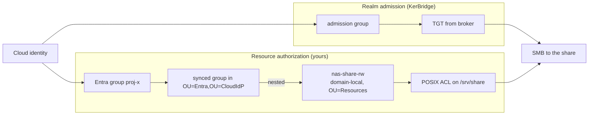
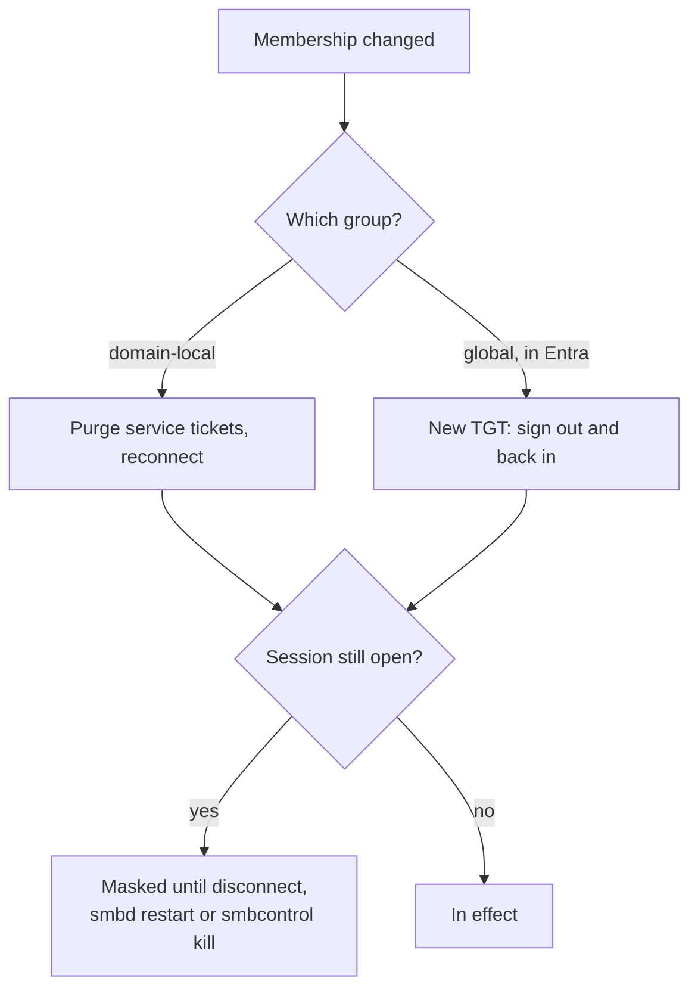

# Joining a file server to a KerBridge realm

This page gives the detail for [`SETUP.md`](../../SETUP.md) steps
[5 (*Join your file server*)](../../SETUP.md#5-join-your-file-server) and
[6 (*Authorize cloud identities on SMB share*)](../../SETUP.md#6-authorize-cloud-identities-on-smb-share). This is the full procedure.
Follow this page, not the summary there.

- The `nas1` container in [`deploy/`](../../deploy/) is a **test fixture**. It
  is minimal by design, so that one `make up` can show the full path (Entra
  sign-in → injected TGT → passwordless SMB). Do not run a production file
  server this way.
- In production, the file server is a separate host that you own. It runs Samba as a
  domain member of the KerBridge realm. This page shows how to join one and how
  to authorize cloud identities on it.
- **Stop the fixture before you join your own file server.** `make up NAS=1`
  gives `nas1` the host's `:445`, and your file server joins the DC through
  that port. One host has one SMB port, and you cannot move it. `make up` alone
  publishes the port for the DC. This page assumes that deployment.

<details>
<summary>Shortcuts in the fixture that a real member must not use</summary>

`deploy/compose.nas.yaml` exists so that you can test the full path on one
machine. It:

- regenerates `smb.conf` from the environment at each start;
- rewrites `nsswitch.conf` with an unguarded `sed`, which is safe only because
  the base image is bare (see §3);
- joins non-interactively, with the password read from a file.

Use it to see the path work. Then build your own member. KerBridge does not
operate file servers.

</details>

> **Note:** This page does not cover consumer NAS appliances. On Synology,
> QNAP, or TrueNAS, the vendor UI regenerates `smb.conf`, and edits to
> `nsswitch.conf` can be lost at an update. The join goes through a domain-join
> wizard, and nobody here tested that wizard against a Samba DC. It will
> **likely work**, because a Samba AD DC is an ordinary AD DC to a member that
> joins. But it was not tried.

## What is whose

- KerBridge owns `OU=CloudIdP` and everything under it. That is, `kerbridge-sync` creates the users and
  groups there from the Entra cloud and reconciles them. If you edit that
  OU by hand, the sync reverts your edits or conflicts with them.
- KerBridge does **not** own your file server, its shares, its resource groups,
  or its ACLs.
- `nas-share-rw` and `proj-x` below are examples. They match the worked example
  in
  research spike `joined-nas-authorization`,
  so the two documents agree. Use the names that your site already uses.

| Layer | Owner | Lives in |
|---|---|---|
| Cloud users and their group membership | Entra | Your tenant |
| Their on-prem shadow objects | `kerbridge-sync` | `OU=Entra,OU=CloudIdP` |
| Resource groups | You | Anywhere outside `OU=CloudIdP`; `OU=Resources` by default |
| Share definitions and filesystem ACLs | You | The file server itself |

## Prerequisites

- **Samba**, any release that is currently maintained.
  - Interoperation is at the AD protocol level (functional level 2008 R2). The
    Samba wiki does not document a member↔DC version matrix.
  - Tests here only ever paired a member and a DC on the same version. If
    possible, run the same distribution package as the DC.
- **DNS through the DC.** The file server must resolve the AD zone's SRV and A
  records from the KerBridge DC.
  - `nameserver <DC address>`, `search example.site`.
  - This makes `dns_lookup_kdc` work, and it makes the join's own A-record
    registration work.
- **Time within 5 minutes** — the Kerberos authenticator window (300 s) is the
  limit that applies.
  - With a skew of 10 minutes, SMB session setup fails with
    `NT_STATUS_LOGON_FAILURE`. With a skew of 4 minutes, it succeeds.
  - `kinit` corrects AS skew with no error message. Thus a skewed client can
    hold a valid TGT, and the service can still refuse it.
  - Run NTP on the DC, every member, and the clients.
- **A unique hostname.**
- **Its own address, if it shares a host with the DC.** A file server is
  normally a separate machine, and everything on this page assumes that. A file
  server on the KerBridge host works, but both want `:445`, and only one can
  publish it on `0.0.0.0`. Give the host a second address and divide the ports:
  `MEMBER_BIND` binds the DC's member-facing ports to the first address, and
  the file server publishes on the second. The configuration options exist, and
  the addresses are ordinary secondary addresses on one NIC. But this
  combination was not tested here. Treat it as a possible design, not as a
  tested procedure.
- **A real POSIX filesystem** with extended attributes and POSIX ACLs that
  work, for both `/var/lib/samba` and the share path. Overlay mounts and
  macOS-style bind mounts are not suitable.
  
## 0. Install software

Debian:
```sh
apt install samba krb5-user winbind libnss-winbind libpam-winbind
```

## 1. `/etc/krb5.conf`

```ini
[libdefaults]
    default_realm = EXAMPLE.SITE
    dns_lookup_realm = false
    dns_lookup_kdc = true
```

Do not hardcode a KDC. The file server finds it through the SRV records that the DC
serves.

## 2. `/etc/samba/smb.conf`

```ini
[global]
    security = ADS
    realm = EXAMPLE.SITE
    workgroup = EXAMPLE

    kerberos method = secrets and keytab

    # Allocating, member-local. Covers BUILTIN and any non-realm SID.
    idmap config * : backend = tdb
    idmap config * : range = 100000-199999
    # Deterministic and stateless: unix_id = RID + range low.
    idmap config EXAMPLE : backend = rid
    idmap config EXAMPLE : range = 1000000-1999999

    template shell = /sbin/nologin
    disable netbios = yes
    smb ports = 445

[share]
    path = /srv/share
    read only = no
    valid users = @"EXAMPLE\nas-share-rw"
```

### The idmap range is a one-way door

`idmap_rid` computes every uid and gid arithmetically from the RID. Thus the
range is part of every uid and gid that is stored on disk.

- The realm range must be **byte-identical on every member** that shares files
  or ACLs. A second member was configured with `2000000-2999999`. It mapped
  the same user to a different uid. That orphaned the files that the user
  wrote, and the new uid no longer matched the filesystem ACL. The result was
  `NT_STATUS_ACCESS_DENIED` for the same user who created the file.
- **Never change the range after deployment.** The same failure occurs, and
  recovery then also needs a migration that changes the owner of every file.
- Ranges must not overlap each other, and they must not overlap the local
  system accounts (0–65533).
- The `*` tdb backend is *allocating*, so BUILTIN mappings can differ between
  members. Grant ACLs only through realm groups, never through BUILTIN.

### `valid users` is defense in depth, not the control

- It matches on the group **name**. If you rename the group, the match stops,
  with no error message.
- The filesystem ACL (§6) is derived from the SID and is the durable control.
- Keep both. The ACL is the control that matters.

## 3. /etc/nsswitch.conf

Without this change, the share ACL cannot resolve a realm group to a gid, and
`id 'EXAMPLE\alice'` returns nothing useful.

Change two lines: `passwd:` and `group:`. Add `winbind` at the **end** of each.
Do not change anything else in the file.

Without systemd (usually a container), the stock lines are:

```
passwd:         files
group:          files
```

and they become:

```
passwd:         files winbind
group:          files winbind
```

On a systemd host — most real NAS machines — the stock lines contain `systemd`,
and it must stay:

```
passwd:         files systemd
group:          files systemd
```

and they become:

```
passwd:         files systemd winbind
group:          files systemd winbind
```

Rules for these lines:

- **Keep `files` first.** Then local system accounts always resolve locally. A
  directory entry with the same name cannot hide them. They also continue to
  resolve if winbind is down or if the DC is not reachable.
- **Put `winbind` last**, after `systemd` if it is present. If you remove
  `systemd`, resolution breaks for the dynamic users that systemd allocates for
  services with `DynamicUser=`, and for all `systemd-homed` accounts.
- **Do not add `winbind` to `shadow:` or `gshadow:`.** Winbind does not serve
  those databases, and there is no password hash to get. Kerberos is the
  authentication path here.
- If the line says `passwd: compat` (Debian before trixie), change it to
  `files` first. `compat` and `winbind` do not combine usefully.

After the join in §4, when `winbindd` runs, make sure that the group resolves:

```sh
getent group 'EXAMPLE\nas-share-rw'      # must print the group with its gid
```

<details>
<summary>The top of the file after the change</summary>

The adjacent lines stay exactly as they were:

```
passwd:         files systemd winbind
group:          files systemd winbind
shadow:         files
gshadow:        files
```

</details>

<details>
<summary>Scripted equivalent, for an unattended install</summary>

```sh
sed -i -E 's/^(passwd:.*files)( .*)?$/\1 winbind/; s/^(group:.*files)( .*)?$/\1 winbind/' /etc/nsswitch.conf
```

`deploy/member/entrypoint.sh` runs this command. The command is safe **there**
because `debian:trixie-slim` ships `passwd: files` with nothing after it. On a
systemd host, the command discards `systemd`, because the expression replaces
everything after `files`. If the line says `compat`, the command does nothing
and shows no error message. Edit the file by hand unless you know which of the
two forms you have.

</details>

## 4. Join

```sh
kinit administrator@EXAMPLE.SITE
net ads join -U Administrator
systemctl enable --now smbd winbindd
```

- `Administrator` is the realm's built-in account. In a realm that `deploy/`
  provisioned, its password is in
  `deploy/secrets/generated/realm_admin_password`.
- The account is necessary for this one command only. From then on, the machine
  account in `secrets.tdb` authenticates the file server, so a restart does not do
  the join again.
- The commands do not start `nmbd`: NetBIOS is disabled.
- `DNS Update ... ERROR_DNS_UPDATE_FAILED` at the join is a known race
  condition, and it is usually not a problem. Make sure that the file server's A
  record exists. If the record is missing, run `net ads dns register`.

## 5. Verify the join

```sh
net ads testjoin        # "Join is OK"
wbinfo -t               # trust secret via RPC
wbinfo --ping-dc
```

## 6. Authorize a cloud identity

Two chains meet here. The purpose of the design is to keep them separate.

- **Realm admission** — membership of the admission group
  (`admission_group`, marked `extensionName: kbrole1|realm-admission`)
  is what permits the broker to issue a TGT. It grants a ticket and nothing
  else.
- **Resource authorization** — what that ticket can reach. This part is fully
  yours, and the file server evaluates it.

An identity that is admitted to the realm reaches nothing that you did not
separately authorize.



```sh
# On the DC. Outside OU=CloudIdP -- sync must not own this object.
samba-tool ou create "OU=Resources,DC=example,DC=site"
samba-tool group add nas-share-rw --groupou="OU=Resources" \
    --group-scope=Domain --group-type=Security      # "Domain" = domain-local

# Nest the Entra-synced group into it. proj-x is a group that exists in
# Entra and that sync wrote into OU=Entra,OU=CloudIdP -- do not create it by hand.
samba-tool group addmembers nas-share-rw proj-x
```

```sh
# On the file server. net cache flush clears the negative lookup that was cached
# before the group existed -- without it, setfacl cannot resolve the name.
net cache flush
install -d -m 0770 -o root -g root /srv/share
setfacl -m  g:'EXAMPLE\nas-share-rw':rwx \
        -m d:g:'EXAMPLE\nas-share-rw':rwx /srv/share
```

`0770 root:root` plus a group ACL grants nothing to a principal outside the
group. The default ACL makes new files inherit the group ACL.

### Why the domain-local hop

You can point `valid users` directly at the Entra group and skip the extra
object. But then you lose usable revocation:

- The KDC evaluates **domain-local groups at TGS issuance**.
- It writes **user and global-group membership into the PAC at AS (TGT)
  issuance**, and that content does not change after issuance.
- Thus, when you remove the global group from the domain-local group, the
  change applies at the holder's next service ticket. When you remove the user
  from the global group, the change does nothing until the user gets a new TGT.
- The extra object is your only revocation control that acts faster than the
  TGT lifetime.

### Verify the token

```sh
id 'EXAMPLE\alice'
```

This is the most useful test. The output must list the domain-local group. If
it does not, the nesting is not in effect, and no ACL work will help.

## 7. Verify access

From a client that holds an injected TGT:

```sh
smbclient //nas1.example.site/share --use-kerberos=required -c 'ls; put /etc/hostname test.txt'
```

Then make sure that:

- the user's mapped uid owns the written file;
- the server refuses a realm-admitted identity *outside* the resource group
  with `tree connect failed: NT_STATUS_ACCESS_DENIED`. Run that negative test
  one time. It shows that authorization works, and that the share is not simply
  open to all.

## 8. When a change takes effect

Membership changes are not immediate, and the delay is a property of the
design, not propagation lag. Each of four layers can hide a revocation:

| Layer | Masks until |
|---|---|
| Open SMB session | A disconnect, an `smbd` restart, or an operator kill through `smbcontrol`. With the default `deadtime`, idle sessions can stay open for days |
| Cached service ticket | The ticket lifetime (10 h). A client-side purge removes it at once. A cache flush **on the file server does nothing** — the client holds the ticket |
| Cached TGT, service tickets purged | Global-group changes stay invisible until a new TGT; the KDC evaluates domain-local changes again at the next TGS |
| Fresh TGT and fresh service ticket | Nothing — this is the enforcement point |

In practice, when you grant access:

- If you added the user to the **domain-local** group: purge the service
  tickets and reconnect. On Windows, run `klist purge` and
  `net use \\nas1 /delete`.
- If you added the user to a **global** group in Entra: the user needs a **new
  TGT**. Sign out and sign in again through the tray. A reconnect is not
  enough.



For fast revocation:

- Remove the global group from the domain-local group, or
- disable the account. Samba's KDC examines the account state again at every
  TGS, so a disable denies both AS and TGS immediately.
- Neither action reaches a session that is already open.

## 9. Managing this afterwards

- The recurring work — who has access — happens **in Entra**, where the group
  membership is stored. When a person joins or leaves a project, nothing
  changes on the file server or in the directory.
- The on-prem work is per-share, and you do it one time: create a resource
  group, nest a synced group into it, and set an ACL. `samba-tool` on the DC,
  as above, is the supported path. The commands are short enough to keep in
  your own runbook.

`kbmanage` does the same work in this vocabulary, not in AD's. It works over LDAP
and does not need a domain administrator:

```sh
kbmanage group new nas-share-rw                # domain-local, in the resource OU
kbmanage group member add nas-share-rw proj-x  # the synced group into it
kbmanage group list
```

When a person reaches the server but a folder denies access, run
 `kbmanage doctor --user alice`. It examines the full
chain — object, external identity, account state, realm admission, synced
groups, nesting, resource-group scope — and names the broken link. At the end,
it prints the one step that it cannot test itself: `id 'EXAMPLE\alice'` on the
file server. Without a user, it examines the full directory for the conditions that
look healthy but are not.

Its limits:

- It will not write to `OU=CloudIdP`. Those OUs belong to `kerbridge-sync`,
  and a second writer that races the reconciliation loop is exactly the problem
  that this project avoids.
- It can *delete* there, to repair a directory that is in a bad state. It
  states clearly what that costs: the SID is deleted, and every filesystem ACE
  that names the SID then points to nothing. It is not a cleanup tool — retired
  objects are intended to accumulate.

<details>
<summary>A GUI instead: RSAT's ADUC, and the trade-offs</summary>

RSAT's Active Directory Users and Computers works against Samba AD. It also
works from a workstation that is not joined, through
`runas /netonly /user:Administrator@example.site "mmc dsa.msc"` followed by
*Change Domain*. Before you adopt it as a routine, know the trade-offs:

- It requires an on-prem administrator password on a Windows client. That is
  exactly the credential that KerBridge exists to remove.
- It cannot see the configuration that is in `smb.conf` or the
  filesystem ACL.
- It is an acceptable tool for occasional use, but a bad routine.

</details>

## Troubleshooting

| Symptom | Cause |
|---|---|
| The session to the file server succeeds, but the share denies access | The identity is realm-admitted but not in the resource group, or the ACL was never applied. Run `kbmanage doctor --user <user>`, then `id 'EXAMPLE\<user>'` on the file server |
| `id 'EXAMPLE\<user>'` reports no such user, but the join is OK | `winbind` is missing from `passwd:`/`group:` in `/etc/nsswitch.conf`. See §3 |
| `setfacl` cannot resolve the group | winbind cached the lookup before the group existed. Run `net cache flush` |
| Access is denied only for a user who was recently added | A stale ticket. See §8 — an add to a global group needs a fresh TGT |
| Access is denied for the user who created the file | The idmap range differs between members. See §2 |
| `NT_STATUS_LOGON_FAILURE` with a TGT that looks valid | Clock skew above 300 s. `kinit` hides the skew; the service does not |
| The join reports `ERROR_DNS_UPDATE_FAILED` | Usually not a problem. Make sure that the A record exists; if it is missing, run `net ads dns register` |
