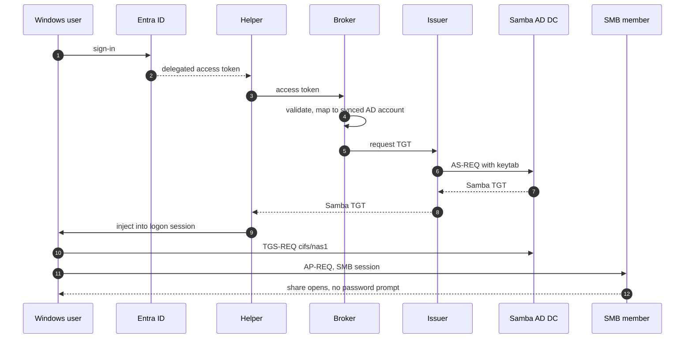
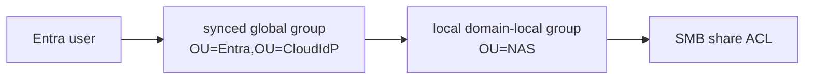
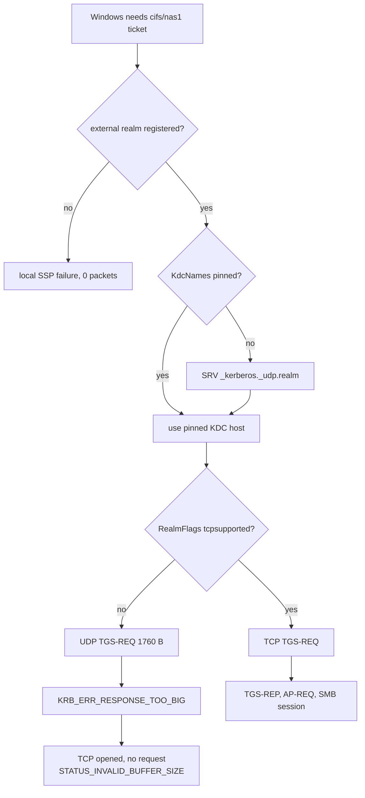
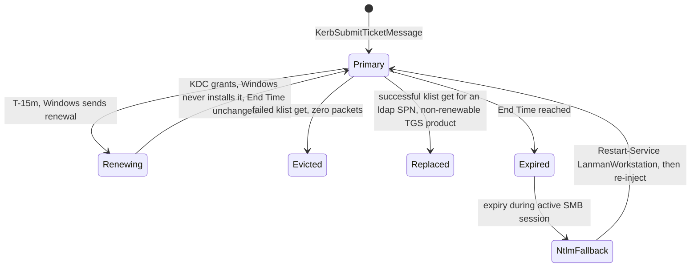
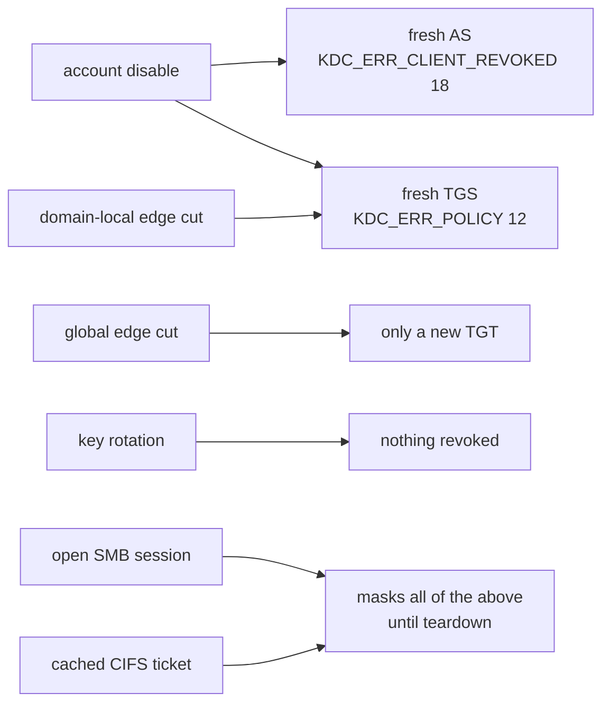

# Experimental findings about Kerberos on non-AD-joined Windows, with Samba and Entra OAUTH2

2026-07-22

Goal: **passwordless authentication to an SMB share from a Windows client that is not joined to on-prem AD.**

The integration pattern under test:



The Samba account is kept current by an Entra→SambaAD synchronization (§2).

Hard questions sit at the boundaries between those systems:

- Does Windows accept an externally issued Kerberos TGT in an Entra logon session?
- How does it select and transport tickets for a non-native Kerberos realm?
- What happens at renewal and failure boundaries?
- How quickly can Entra-side identity changes reach existing SMB access?

Findings are grouped into seven areas:

1. [Entra token validation](#1-entra-token-validation) — what the broker must accept, reject, and reveal.
2. [Directory synchronization: Graph to Samba](#2-directory-synchronization-graph-to-samba) — MS Graph reads, delta hazards, delegated LDAPS writes, object lifecycle.
3. [TGT injection into Windows](#3-tgt-injection-into-windows) — whether it works, from which session, and what the cache looks like.
4. [Realm registration and Kerberos transport](#4-realm-registration-and-kerberos-transport) — making Windows find, reach, and use a foreign KDC.
5. [Ticket lifecycle and failure recovery](#5-ticket-lifecycle-and-failure-recovery) — renewal, outages, the NTLM fallback, purge and sign-out.
6. [Revocation timing and cache layers](#6-revocation-timing-and-cache-layers) — which change takes effect where, and when.
7. [Test methodology](#7-test-methodology) — join state as a variable, and which diagnostics lie.

Then: [consolidated implementation implications](#implementation-implications).

## Evidence status

A report of experiments, **not** a statement of guaranteed Microsoft, Windows, Graph, Kerberos, or Samba behavior.

Except where a **Limits** note says otherwise, conclusions came from live tests, packet captures, Windows cache and event-log observations, Samba audit logs, Graph responses, or controlled LDAP operations — **not** from reading Windows, Samba, or protocol implementation source. Some designs were informed by official documentation; a result here is still version- and environment-specific empirical evidence.

Scope limits:

- Windows: one unjoined Windows 11 24H2 VM; one Entra-joined Windows 11 25H2 workstation (LSA protection on, VBS/HVCI on, Credential Guard off, Entra Cloud Kerberos off).
- The joined workstation belonged to a real tenant, but no production tenant object was changed; its Entra identity and the disposable Samba identity were deliberately unrelated.
- Samba 4.22.10 at functional level 2008 R2, Heimdal KDC, a separate file server (SMB file share), nested entra-global-to-domain-local resource groups.
- Entra/Graph: a small disposable Entra Free tenant. Dynamic groups needed a higher license and could not be tested.
- Results would have to be revalidated after material Windows, Samba, Entra, Graph, network, or security-posture changes.

## Test setup

| Piece | What |
|---|---|
| **Servers** | Disposable Samba AD DC (Kerberos TCP+UDP/88) plus a separate joined Samba member (SMB/445). Broker and ticket issuer ran as separate processes, so delivery and issuance failures could be isolated. |
| **Directory layout** | Users and global groups synchronized from Entra into a managed local OU; locally managed domain-local resource groups in a separate OU. |
| **Windows** | TGT injected via `LsaCallAuthenticationPackage` with `KerbSubmitTicketMessage`. Results correlated across read-only `klist` snapshots, Windows event logs, captures at workstation/DC/member, DC authentication audit, member `smbstatus`, and SMB2 status/session identifiers. The joined workstation reached the servers over a routed, stateful-firewalled multi-VLAN network. |
| **Entra** | Real authorization-code + PKCE sign-in, real delegated and app-only tokens, tenant-specific OIDC/JWKS endpoints, Graph client-credential reads, user and group lifecycle changes, delta queries, a deliberately stale JWKS cache. |
| **Samba sync** | Delegated LDAPS from a separate client, with denied-before-grant controls for each required directory right. Custom sync program in Entra → Samba direction (**not** *Microsoft Entra Connect Sync* nor *Entra Cloud Sync*; they work the other direction). |

Access chain:



Command blocks below are what the spike logs recorded, normalized to `EXAMPLE.SITE` / `alice` / `dc1.example.site` / `nas1.example.site`, with tenant, application and object identifiers replaced by placeholders. Steps no spike log recorded are described, not reconstructed. `stop-dc`, `drop-sessions`, `flush-member-caches` and `disable-user` are the lab harness's own server-side control verbs, not standard tooling.

## 1. Entra token validation

### Which access-token shape was usable as the broker contract?

**Test.** Two single-tenant app registrations through a real authorization-code + PKCE flow: a public native client, and a broker API exposing `access_as_user`. Token decoded and passed through a verifier probe with positive and negative signed fixtures.

**Found.**

- `api.requestedAccessTokenVersion = 2` on the API registration produced a v2 token with:
  - `iss = https://login.microsoftonline.com/{tid}/v2.0`
  - `aud` = the broker API's bare client-ID GUID
  - `azp` = the public client's GUID
  - `scp` containing `access_as_user`
- A fresh API registration has `requestedAccessTokenVersion` unset → wrong version for that contract.
- Stable accepted identity was `(iss, tid, oid)`; mutable names, UPNs and `sub` were unnecessary.
- The broker should accept the **access** token, not an ID token.
- A native-client redirect registered as `http://127.0.0.1` without a port accepted several ephemeral loopback ports across live PKCE runs; no client secret and no fallback public-client flow were needed.

**Limits.** Single-tenant v2 only; multi-tenant acceptance and federation adapters were intentionally excluded.

<details>
<summary>Registrations that produced this token shape</summary>

Portal click-path in the Entra admin center; manifest-level settings applied through Microsoft Graph `PATCH`, equivalent to the portal's manifest editor.

**Broker API** — *New registration*, *Accounts in this organizational directory only*, **no** redirect URI → *Expose an API* → *Application ID URI*, accept the pre-filled `api://{BROKER_APP_ID}` → *Add a scope* `access_as_user` (portal default for *Who can consent* is **Admins only**) → *Add a client application* `{HELPER_APP_ID}`, ticking that scope — this pre-authorization is what suppressed the consent prompt → *Manifest*: `"api": { "requestedAccessTokenVersion": 2 }` → *Token configuration* → optional claim `idtyp` on token type *Access*:

```json
"optionalClaims": {
  "accessToken": [ { "name": "idtyp", "essential": false, "additionalProperties": [] } ],
  "idToken": [], "saml2Token": []
}
```

**Public client** — *New registration* → *Authentication* → *Add a platform* → *Mobile and desktop applications*, redirect URI `http://127.0.0.1` (accepted directly in the portal box, stored as `publicClient.redirectUris`) → *API permissions* → *My APIs* → the broker's `access_as_user`. *Grant admin consent* was deliberately **not** clicked, and *Allow public client flows* stayed **off**.

CLI equivalent, with flags checked against the `az ad app` reference but **not executed in the spike** — the portal path above is what was verified:

```sh
az ad app create --display-name kerbridge-broker \
  --sign-in-audience AzureADMyOrg \
  --requested-access-token-version 2 \
  --optional-claims '{"accessToken":[{"name":"idtyp","essential":false}],"idToken":[],"saml2Token":[]}'
az ad app update --id {BROKER_APP_ID} --identifier-uris "api://{BROKER_APP_ID}"
az ad app update --id {BROKER_APP_ID} --set api.oauth2PermissionScopes='[{"id":"{SCOPE_UUID}","value":"access_as_user","type":"User","isEnabled":true, ...}]'
az ad app update --id {BROKER_APP_ID} --set api.preAuthorizedApplications='[{"appId":"{HELPER_APP_ID}","permissionIds":["{SCOPE_UUID}"]}]'

az ad app create --display-name kerbridge-winhelper \
  --sign-in-audience AzureADMyOrg \
  --public-client-redirect-uris "http://127.0.0.1" \
  --required-resource-accesses '[{"resourceAppId":"{BROKER_APP_ID}","resourceAccess":[{"id":"{SCOPE_UUID}","type":"Scope"}]}]'
```

The client ran authorization-code + PKCE against authority `https://login.microsoftonline.com/{TENANT_ID}`, requesting `api://{BROKER_APP_ID}/access_as_user openid profile offline_access`, and sent the resulting **access** token as the ticket-request bearer.

Post-setup check — decode it and confirm:

- `ver: "2.0"`
- `aud` = the bare `{BROKER_APP_ID}` GUID
- `iss` ending in `/v2.0`
- `azp` = `{HELPER_APP_ID}`
- `scp: "access_as_user"`

An `api://…` audience or `ver: "1.0"` means the manifest step was missed.

</details>

### How can a broker distinguish delegated users from app-only callers?

**Test.** Real delegated and client-credentials tokens for the same broker audience — the app-only one acquired with `scope=api://{BROKER_APP_ID}/.default`. The app role was then removed from the confidential client and acquisition repeated.

**Found.**

- Delegated token: `scp: access_as_user`, no `idtyp: app`.
- App-only token: no `scp`; carried `idtyp: app` when the API requested that optional claim.
- Entra still issued an app-only token for the broker audience **after** the app-role grant was removed → audience validation alone is not authorization.
- Fail-closed rule tested: require the delegated scope, reject `idtyp == "app"`, require the expected `azp`. `roles` never granted ticket access.

**Limits.** One tenant configuration. Establishes the need for positive delegated-user checks, not every possible Entra token shape.

### Which claims reliably identify members and guests?

**Test.** Tokens and Graph objects captured for a guest and for a B2B-origin account whose `userType` had been converted to `Member`.

**Found.**

- Both had resource-tenant `tid` and resource-tenant object `oid` — suitable stable keys.
- Did **not** distinguish guests: `idp`, an `#EXT#` UPN, presence of `email`. The member could also have a foreign `idp` and `#EXT#` name, and `email` was absent.
- Graph `userType` was the working discriminator. The design accepted both at token validation but synchronized only `userType: Member` — directory admission, not token syntax, is the eligibility boundary.

**Limits.** The optional `acct` claim was absent and was not tested as a hard guest-rejection mechanism.

### What signature, key-rollover, and time checks were exercised?

**Test.** Tenant-specific OIDC metadata and JWKS fetched live. Positive and negative fixtures covered wrong issuer, tenant, audience, client, scope, lifetime, algorithm, key ID and malformed claims. A real token was tested against a JWKS with its key removed, then after refresh.

**Found.**

- All observed signing keys were RSA signature keys; live tokens used `RS256`. An algorithm allowlist rejected `none`, HMAC and others before any signature work.
- Unknown `kid` failed with the stale set and succeeded after refresh → one bounded refresh-and-retry path suffices.
- Live metadata and JWKS responses advertised a 24-hour cache lifetime.
- 300 s clock leeway for `exp`, `nbf`, `iat`; missing time claims rejected.

**Limits.** Signing-key rotation was not forced. The stale-cache test exercised the verifier's unknown-key recovery path, not the provider's rollover timing or outage behavior.

<details>
<summary>Endpoints fetched, and the verifier probe</summary>

All fetched unauthenticated, HTTP 200:

```
https://login.microsoftonline.com/{TENANT_ID}/v2.0/.well-known/openid-configuration
https://login.microsoftonline.com/{TENANT_ID}/discovery/v2.0/keys
https://login.microsoftonline.com/{TENANT_ID}/.well-known/openid-configuration   # v1 — confirms the rejected iss form
https://login.microsoftonline.com/common/v2.0/.well-known/openid-configuration
https://login.microsoftonline.com/common/discovery/v2.0/keys
```

Both tenant documents returned `Cache-Control: max-age=86400, private`. Every key in the tenant document was `{"kty":"RSA","use":"sig"}` with an `issuer` property equal to the exact tenant issuer string — no `{tenantid}` templating in a tenant-specific document. The `common` document templates it instead, and pins three keys to the consumer tenant.

The verifier probe ran 17 local fixture shapes (positive plus wrong issuer, tenant, audience, client, scope, lifetime, `alg: none`, HMAC, unknown `kid`, malformed `tid`, missing `oid`, a v1 token, garbage), then was repointed unmodified at the live tenant and live JWKS:

```sh
cd .local-tmp/entra-spike && ./venv/bin/python make_fixtures.py && ./venv/bin/python verify_probe.py
```

</details>

### Should Conditional Access, MFA, auth context, or claims challenges be broker policy?

**Test.** Real delegated tokens inspected for `amr`, `acrs`, `xms_cc` and related claims; the verifier ran without consuming them. No claims challenge or authentication-strength policy was configured in the test tenant.

**Found.**

- None of those fields was necessary to validate the delegated token or map its stable identity.
- Kept outside broker authorization; tenant policy acts when Entra issues the token.
- Broker-enforced authentication context would be a separate feature needing an explicit claim contract and client-side claims-challenge handling — not an incidental extension of token validation.

**Limits.** Conditional Access, Continuous Access Evaluation, MFA-strength enforcement and claims-challenge round trips were not exercised. A deliberate scope boundary, not a finding that those mechanisms are unnecessary in every deployment.

### What should token-validation failures reveal to the Windows client?

**Test.** Negative fixtures covering malformed JWS, signature, algorithm, key ID, issuer, tenant, audience, lifetime, token version, delegated scope, authorized client and user-object failures, all passed through one external error mapping while retaining distinct internal reasons.

**Found.**

| Condition | External response |
|---|---|
| Any authentication failure | one generic HTTP 401 `invalid_token`; detailed causes stay server-side diagnostics |
| Valid token, user outside synchronized admission | 403 |
| Metadata, directory or issuer dependency unavailable | 502/503-class |

Avoids a claim-validation oracle while still separating reauthentication, eligibility and dependency remediation.

**Limits.** A tested API design, not evidence that it is the only safe OAuth error mapping. UX and operational logging still need implementation-specific review.

## 2. Directory synchronization: Graph to Samba

### Which Graph permissions were sufficient?

**Test.** A client-credentials application received exactly `User.Read.All` and `Group.Read.All`, then read users, groups, direct and transitive memberships, both delta streams, and deleted-user and deleted-group collections. A control group write was attempted.

**Found.**

- Every required read succeeded and the write was denied; no Graph write permission was needed.
- `GroupMember.Read.All` was not selected because the deleted-group collection required the broader group read permission in this setup.
- Tested least privilege for this model: application `User.Read.All` + `Group.Read.All`.

**Limits.** Permission behavior can change; check it against the exact endpoints an implementation uses. That `GroupMember.Read.All` alone is insufficient was taken from the documented per-endpoint permission tables, **not measured** — the live run only established that `User.Read.All` + `Group.Read.All` covers every read and grants no write.

<details>
<summary>The reads exercised under that grant, and the control write</summary>

```http
GET   /v1.0/users?$select=id,displayName,userPrincipalName,accountEnabled,userType,onPremisesSyncEnabled
GET   /v1.0/groups?$select=id,displayName,securityEnabled,mailEnabled,groupTypes,membershipRule,membershipRuleProcessingState,onPremisesSyncEnabled
GET   /v1.0/groups/{id}/members
GET   /v1.0/groups/{id}/transitiveMembers
GET   /v1.0/groups/{id}/members/microsoft.graph.servicePrincipal    # the cast that reveals SPs
GET   /v1.0/users/delta?$select=…
GET   /v1.0/groups/delta?$select=…,members
GET   /v1.0/directory/deletedItems/microsoft.graph.user
GET   /v1.0/directory/deletedItems/microsoft.graph.group
PATCH /v1.0/groups/{id}        # control write -> 403 Authorization_RequestDenied
```

`GET /v1.0/users` **without** `$select` returned only `businessPhones, displayName, givenName, id, jobTitle, mail, mobilePhone, officeLocation, preferredLanguage, surname, userPrincipalName` — every eligibility input silently reads as missing.

</details>

### What Graph full-read and delta behaviors can silently corrupt synchronization?

**Test.** Live exercise of user and group full reads, `$select`, pagination, independent user/group delta streams, membership add/remove, object soft-delete/restore, malformed and cross-stream cursors, empty pages, and replayed delta links.

**Found.** Reproduced traps:

- Eligibility fields (`accountEnabled`, `userType`, `onPremisesSyncEnabled`) absent unless explicitly selected.
- Delta entries were sparse patches, not complete selected objects → must be merged into a shadow copy.
- Empty delta pages could still carry `@odata.nextLink`; only `@odata.deltaLink` ended the chain.
- Membership removal appeared in the group's `members@delta`, but deleting the member object did not → user deletions also had to remove that user's group edges.
- Soft-deleted users and groups appeared with `@removed.reason = "changed"`; group restoration returned a normal object with surviving memberships.
- Malformed cursor → HTTP 400 without `Location`. Cursor from the **wrong resource stream** → accepted with HTTP 200. So a 400 required alerting, a new full read and a replacement cursor; cursors had to be keyed by stream because the API did not detect a mix-up.
- Replaying the same delta link returned the same change set → apply-before-advance semantics are safe.

Safe pattern: complete initial read; separately persisted per-stream cursors; a mergeable shadow graph; cursor advancement only after a whole cycle applied; no plan at all from an incomplete read.

<details>
<summary>Cursor establishment and the observed delta shapes</summary>

Cursors were opened after the full read with `$deltatoken=latest` ("sync from now"), then followed from the stored `@odata.deltaLink`:

```http
GET /v1.0/users/delta?$deltatoken=latest
GET /v1.0/groups/delta?$select=…,members&$deltatoken=latest
```

Membership add and removal inside a group's `members@delta`:

```json
{"@odata.type": "#microsoft.graph.user", "id": "…"}
{"@odata.type": "#microsoft.graph.user", "id": "…", "@removed": {"reason": "deleted"}}
```

Soft delete of the object itself, on either stream, is `"@removed": {"reason": "changed"}`.

Paging probed with `$top=1`:

- An initial groups delta returned **18 pages for 6 group objects**, several of them `value: []` *with* an `@odata.nextLink`.
- Malformed cursor — both a garbage `$deltatoken` and a structurally valid but mutated real one — returned `400 BadRequest "Badly formed token."` with **no `Location` header**, so it cannot be handled like the documented `410 Gone`.
- An `@odata.deltaLink` taken from `/groups/delta` and submitted to `/users/delta` was accepted with `200`, an empty `value` and a users-shaped `deltaLink`.

</details>

**Limits.** Not reproduced: a genuine expired-cursor HTTP 410 with `Location`, real throttling, a hard-delete `reason = "deleted"`, the upper bound on property-specific delta lag. One ordinary property update was still absent after **7.5 minutes**, even though membership and account-state updates had appeared much sooner.

### Which Entra objects and groups were suitable to project into Samba?

**Test.** Live tenant plus a constructed object zoo: members, guests, disabled users, assigned security groups, a Microsoft 365 group, a device, a service principal, duplicate names, and cloud-only versus on-premises-synchronized markers.

**Found.**

- **Admitted:** member users; cloud-only security groups. Disabled users retained as disabled Samba accounts.
- **Rejected:** guests (by policy); on-premises-synchronized objects (avoids a management loop); non-security/Microsoft 365 groups; devices; service principals.
- `onPremisesSyncEnabled` was `null` for cloud-only objects and had to be treated as `false`.
- Plain Graph v1 membership endpoints omitted service principals, including from transitive membership; devices appeared normally.
- Selection by immutable object ID was safer than by display name.

**Limits.** Dynamic security groups could not be created in the Entra Free tenant, so their membership and delta behavior remains unverified.

### How should nested Entra group admission be represented in Samba?

> The LDAP bases and LDIF below are transcripts of what the spike actually
> ran, when synchronized objects sat directly in `OU=Entra,<base DN>`. The
> layout has since gained an [IdP parent OU](../GLOSSARY.md) above it, so a
> deployment's real base is `OU=Entra,OU=CloudIdP,<base DN>`. Nothing else
> about the finding changes; the searches are unaffected by the extra level.

**Test.** Direct edges, two-level nesting, membership cycles, edge removal and group rename mirrored into Samba global security groups. Effective membership queried with a base-scoped LDAP matching-rule-in-chain filter and cross-checked with `tokenGroups`.

**Found.**

- Samba 4.22.10 resolved direct, nested and cyclic membership correctly; cycles terminated.
- Removing an intermediate edge revoked admission immediately; renaming an intermediate group preserved links.
- Simplest faithful model: mirror direct Entra edges only and let Samba compute transitive membership, using a two-step broker query — resolve the admission group by its role marker, then check the user against it:

  ```text
  # step 1 (bootstrap / cache refresh / recovery) — require exactly one result
  base:   OU=Entra,DC=example,DC=site
  filter: (&(objectClass=group)(extensionName=kbrole1|realm-admission))
  attrs:  objectSid, msDS-ExternalDirectoryObjectId

  # step 2 (per ticket request) — non-empty means admitted
  base:   <user DN>
  scope:  base
  filter: (memberOf:1.2.840.113556.1.4.1941:=<admission group DN>)
  ```

- 20 sequential per-user checks took **0.19 s** wall including `ldapsearch` process spawns → the admission check is evaluated per request with no cache.
- `tokenGroups` produced the same decisions and remained a viable cross-check or fallback.
- Synchronized group set = the closure reachable from the admission group, plus an explicit immutable-ID allowlist for resource groups outside that closure.

**Limits.** Behavior of the tested Samba release, not of all AD-compatible directories or Samba versions.

### How can the admission group survive rename, cursor loss, deletion, or ambiguity?

**Test.** The admission group was marked with a unique role value in Samba, renamed, and recovered after simulated loss of all Graph cursor state. Duplicate markers and deletion were then introduced, and recreation was tested for SID continuity.

**Found.**

- Looking up exactly one role-marked Samba group recovered its current DN, stable SID and external Entra object ID after rename and cursor loss.
- Zero or multiple marked groups was detectable and had to deny issuance.
- Recreating a deleted admission group generated a **new SID** and would orphan SID-based ACLs → automatic recreation is unsafe.
- Tested policy: freeze admission synchronization, alert, fail the broker closed until an operator restores or deliberately replaces the admission group.

**Limits.** Recovery depends on protecting the external identity and role marker from ambiguous writes.

### Could Samba synchronization run entirely through delegated LDAPS?

**Test.** A separate sync identity attempted each steady-state operation before and after receiving narrowly scoped object-specific rights under the managed OU. Controls attempted writes in the local NAS OU and to an undelegated attribute.

**Found.**

- Delegated LDAPS sufficed for: user and group creation/deletion; random password set and reset; account enable/disable flags; managed display and login-name updates; rename; identity/role/state markers; group membership. Each operation failed before its grant and succeeded after.
- Rename required write rights on **both** `cn` and `name`; object creation did not imply later modify rights.
- Writes to the NAS OU and to undelegated attributes stayed denied. Plain LDAP simple bind was rejected — transport encryption was required.
- Required right categories:
  - create/delete child for user and group classes
  - Reset Password
  - write-property on `userAccountControl`, `member`, the external identity and state-marker attributes, `displayName`, `givenName`, `sn`, `userPrincipalName`, `sAMAccountName`, `cn`, `name`
- Still required realm administration: one-time OU creation, ACL installation, resource-group management.

**Limits.** Object-specific schema GUIDs were read from the live schema and should likewise be resolved, not copied blindly into another directory.

<details>
<summary>What the sync identity writes, and how the delegation was verified</summary>

Objects are created in one LDAP add over LDAPS — password, account flags and external identity included, so no follow-up modify is needed:

```ldif
dn: CN=<displayName[ (oid4)]>,OU=Entra,OU=CloudIdP,DC=example,DC=site
objectClass: user
cn: <same as RDN>
sAMAccountName: <allocated>
userPrincipalName: <sAMAccountName>@example.site
displayName: <Entra displayName>
userAccountControl: 66048            # NORMAL_ACCOUNT | DONT_EXPIRE_PASSWD (66050 if Entra-disabled)
unicodePwd:: <base64 UTF-16LE random password>      # generated, never stored
msDS-ExternalDirectoryObjectId: kb1|<source name>|<oid>
```

```ldif
dn: CN=<displayName>,OU=Entra,OU=CloudIdP,DC=example,DC=site
objectClass: group
groupType: -2147483646               # GLOBAL | SECURITY_ENABLED
msDS-ExternalDirectoryObjectId: kb1|<source name>|<group oid>
extensionName: kbrole1|realm-admission     # admission group only
```

Lifecycle state travels as extra `extensionName` values alongside the role marker: `kbstate1|retired|<iso8601>` for a deleted user in retention, `kbstate1|quarantined|<iso8601>` for a deleted group.

Built one ACE at a time, each proven necessary by performing the operation *before* the grant (LDAP 50) and sufficient by repeating it after; the final set read back with `samba-tool dsacl get`. **16 ACEs:**

- create-child and delete-child for `user` and `group`
- the Reset Password extended right (`00299570-246d-11d0-a768-00aa006e0529`) on users
- write-property on `msDS-ExternalDirectoryObjectId`, `extensionName`, `userAccountControl`, `member`, `displayName`, `givenName`, `sn`, `userPrincipalName`, `sAMAccountName`, `cn`, `name`

Confinement checked with four negatives, all still denied:

- create a user in `OU=NAS`
- write a non-delegated attribute (`description`) on a managed user
- write `member` on an `OU=NAS` group
- write the identity attribute on an `OU=NAS` group

</details>

### How should synchronized Samba names and passwords be managed?

**Test.**

- Colliding UPNs, SAM names and DNs created; users renamed; membership links inspected.
- A one-minute Samba password-age policy applied to accounts with and without `DONT_EXPIRE_PASSWD`. Written straight onto the domain head as `maxPwdAge: -600000000`, because `samba-tool` refuses sub-day values; after 90 s each account tested with `kinit -k`.

**Found.**

- Samba rejected duplicate `sAMAccountName`, UPN and DN atomically → deterministic retry with an object-ID-derived suffix. The three errors are distinct:
  - LDAP **68** `samldb: sAMAccountName '…' already in use!`
  - LDAP **19** `samldb: userPrincipalName '…' is already in use`
  - LDAP **68** `Entry … already exists`
- Renames preserved the SID and automatically updated DN-valued membership links.
- A random-password account **without** `DONT_EXPIRE_PASSWD` failed keytab AS after expiry; `userAccountControl = 66048` (`NORMAL_ACCOUNT | DONT_EXPIRE_PASSWD`) remained usable.
- Delegated password replacement incremented KVNO; a keytab exported per issuance used the new key, and already issued TGTs remained valid.

**Limits.** The naming algorithm itself was a design choice. The experiments establish collision and rename behavior, not a universal naming convention.

### How should deleted or disabled Entra objects be represented in Samba?

**Test.** Planner scenarios and delegated LDAP applies covering disable, soft-delete, restoration, group quarantine, retention expiry, partial desired state, and a synchronized group nested in a resource group.

**Found.**

- Disabling an Entra user mapped cleanly to a disabled Samba account with identity and memberships preserved.
- User deletion safely represented first as disabled + a retention marker; group deletion as cleared synchronized membership + a quarantine marker.
- Keeping the object retained its SID, so restoration reactivated existing resource-group authorization.
- Clearing a quarantined synchronized group's own members made its still-present nesting in a resource group inert without modifying local policy.
- A partial Graph read produced **no plan at all**, including no supposedly harmless writes.
- Eventual object deletion was best kept as a separate operator-gated pass, because it permanently loses the SID.

**Limits.** The 30-day retention period aligned with the tested soft-delete workflow but is a policy choice, not a measured optimum.

## 3. TGT injection into Windows

### Does TGT injection work in an Entra-joined logon session?

**Test.** A Samba TGT submitted through the supported LSA authentication-package call on the Entra-joined Windows 11 25H2 workstation, with LSA running as PPL, VBS/HVCI active and Credential Guard inactive. Packet captures watched for accidental KDC traffic during injection.

**Found.**

- `KerbSubmitTicketMessage` accepted the ticket; injection generated **no port-88 traffic**.
- The TGT appeared in the caller's cache and could later obtain a CIFS service ticket.
- LSA PPL alone did not block this sanctioned call in the tested posture.

**Limits.** Credential Guard was off → nothing established for Credential Guard-enabled endpoints, nor for arbitrary endpoint-protection products or policies.

<details>
<summary>Pre-flight characterization, injection and the read-only observation set</summary>

The security posture was recorded before anything was touched, and the same snapshot was later diffed field by field to prove the workstation had been restored:

```powershell
dsregcmd /status                  # AzureAdJoined, DomainJoined, PRT state
Get-CimInstance -ClassName Win32_DeviceGuard -Namespace root\Microsoft\Windows\DeviceGuard
Get-ItemProperty HKLM:\SYSTEM\CurrentControlSet\Control\Lsa   # RunAsPPL, LsaCfgFlags
klist
klist cloud_debug
```

`SecurityServicesRunning = {2}` is HVCI/memory integrity only — Credential Guard would add value 1 — and this was independently corroborated by `LsaSrv` event 6156 at boot ("Azure AD Joined: 1, Licensed for Credential Guard: 0"). `RunAsPPL = 2` / `RunAsPPLBoot = 2` is LSASS as a Protected Process Light without a UEFI lock, the Windows 11 default.

Injection and observation, all from the non-elevated interactive session:

```powershell
winhelper.exe --token <bearer> --broker http://dc1.example.site:8080   # no --verify, no --renew
klist                                    # flags, PRIMARY, Kdc Called
klist cloud_debug                        # PRT / cloud state (sensitive)
Get-SmbConnection -ServerName nas1.example.site
dir \\nas1.example.site\share            # the real access test
```

- `--verify` avoided: it writes the bearer token into a filename on the share.
- `--renew` avoided: it re-injects a fresh TGT and would mask the behavior under test.
- `klist get` treated as prohibited equipment, not a probe — see the eviction finding below.

</details>

### Which Windows logon session must perform injection?

**Test.** `klist`'s `Current LogonId` line compared between WSL-launched `powershell.exe`, a native non-elevated desktop shell and an elevated shell, before any injection was performed:

| Session | `Current LogonId` |
|---|---|
| WSL interop (`powershell.exe klist`) | `0:0xc337d` |
| Native non-elevated desktop PowerShell | `0:0xc337d` — matches WSL |
| Native elevated PowerShell | `0:0xc3362` — different LUID |

**Found.**

- WSL2 interop and the non-elevated interactive desktop shared a logon ID; elevation used a different one.
- A submitted ticket goes into the caller's logon session → a ticket submitted from the elevated session lands in a cache the normal desktop redirector does not consult.
- Injection and ticket-cache operations must run in the user's non-elevated interactive logon session. Machine-wide configuration (`ksetup`, `pktmon`, registry verification) is LUID-independent and can remain elevated.
- This gate was run first and the split was honored for every subsequent row.

**Limits.** Logon IDs change across boots and must be discovered, never hard-coded. Other launch models should be checked explicitly.

### What cache shape did Windows assign to the injected TGT?

**Test.** Plain `klist` captured before and after injection on both the unjoined and the Entra-joined machine.

**Found.**

- The injected Samba TGT became `PRIMARY`, carried the expected renewable/initial/pre-authentication flags, and had an **empty `Kdc Called`**.
- A service ticket obtained by Windows **populated** `Kdc Called` — a useful distinction between submitted and fetched tickets.
- Plain `klist` was reliable for read-only status. `klist tgt` was unusable on both machines:
  - joined build: crashed, `0xC0000005` access violation, exit `-1073741819`
  - unjoined VM: exited 5 with a truncated record

<details>
<summary>What plain <code>klist</code> showed after injection</summary>

```text
#0> Client: alice @ EXAMPLE.SITE
    Server: krbtgt/EXAMPLE.SITE @ EXAMPLE.SITE
    KerbTicket Encryption Type: AES-256-CTS-HMAC-SHA1-96
    Ticket Flags 0xe10000 -> renewable initial pre_authent name_canonicalize
    Cache Flags: 0x1 -> PRIMARY
    Kdc Called:                        <- empty: injected, not fetched by Windows

#1> Server: cifs/nas1.example.site @ EXAMPLE.SITE
    Ticket Flags 0xa80000 -> renewable pre_authent 0x80000
    Kdc Called: dc1.example.site       <- a real TGS-REQ, not an NTLM fallback
```

Samba's `Flags: RIA` maps to `renewable initial pre_authent`; Windows adds `name_canonicalize`. The TGT is **not** forwardable, which never blocked SMB. Windows-visible lifetimes matched the KDC's issuance record to the second.

</details>

**Limits.** The Entra-joined tenant had Cloud Kerberos disabled, so its Kerberos cache was otherwise empty. Coexistence and ticket selection with a real Entra Cloud TGT and a second realm remain **untested**. The PRT itself lived in CloudAP and remained intact, but that does not close the Cloud Kerberos question.

## 4. Realm registration and Kerberos transport

### Can DNS SRV records replace Windows external-realm registration?

**Test.** First, `_kerberos._tcp` and `_kerberos._udp` SRV records were published while the external realm was absent from the Windows Kerberos `Domains` registry area. Then the realm key and `RealmFlags` were retained while only the pinned `KdcNames` value was removed, followed by reboot and a fresh capture.

**Found.**

- **SRV records alone did not work:** service-ticket retrieval failed locally with **no KDC packet**.
- Realm registered, `RealmFlags` retained, `KdcNames` absent → Windows found the KDC through DNS and completed the TGS exchange. **Realm registration is mandatory; pinning a KDC hostname is not.**
- Windows queried only `_kerberos._udp.<realm>` in this capture, even though it then used TCP: the SRV label selected a KDC, `RealmFlags` selected transport. Publishing both is prudent; publishing only `_kerberos._tcp` would not have satisfied this observed path.

**Limits.** The SRV query choice was observed once on one Windows 11 build. Not evidence that Windows never queries `_kerberos._tcp`.

<details>
<summary>Records published, and how the second run isolated KDC location from realm registration</summary>

Both records were published statically in the site resolver — deliberately not as a forwarder to Samba's own DNS, so that stopping the KDC in the outage rows would not also take out name resolution:

```
_kerberos._tcp.example.site.  SRV 0 100 88 dc1.example.site.
_kerberos._udp.example.site.  SRV 0 100 88 dc1.example.site.
```

```conf
# the same, in the site dnsmasq
srv-host=_kerberos._tcp.example.site,dc1.example.site,88,0,100
srv-host=_kerberos._udp.example.site,dc1.example.site,88,0,100
```

Isolation run: delete the single `KdcNames` value, keep the `Domains\EXAMPLE.SITE` key, `RealmFlags` and the host-to-realm mappings, reboot (`KdcNames` is boot-cached), clear the client DNS cache with `Clear-DnsClientCache`, then inject and run one `dir`. **Exactly one variable changed.** `ksetup /delkdc` was deliberately *not* used: removing the last KDC entry can take the whole `Domains\<REALM>` key with it, destroying `RealmFlags` and changing two variables at once.

Do not mis-read a side effect of the static-SRV choice: `nltest` failed `ERROR_NO_SUCH_DOMAIN` throughout, because `_msdcs` records were never published. It never mattered — the SMB redirector bypasses the DC locator entirely, with no CLDAP, LDAP or DNS to the DC on any successful run. A production forwarder to Samba's DNS would publish `_msdcs` and the symptom would not arise.

The near-miss: had only `_kerberos._tcp` been published — the intuitive choice, since this path *requires* TCP — Windows would have queried `_udp`, found nothing, and the conclusion would have been the clean-looking but wrong "SRV cannot supply KDC location".

</details>

### What made Kerberos transport work reliably for a `ksetup` realm?

**Test.** A full-PAC TGS exchange captured across the routed firewall with these as separate variables: default KDC UDP reply limit, raised UDP reply limit, `MaxPacketSize=1`, and the Windows realm flag `tcpsupported`.

**Found.**

| Variable | Observed |
|---|---|
| baseline | the 1760-byte UDP request fragmented and crossed the real router |
| default KDC reply limit | Samba returned `KRB_ERR_RESPONSE_TOO_BIG`; Windows opened TCP but sent **no request** and logged `STATUS_INVALID_BUFFER_SIZE` |
| raised KDC reply limit | fragmented UDP reply, dropped by the stateful return-path firewall |
| `MaxPacketSize=1` | did **not** force TCP and, after reboot, suppressed the normal retry — worse than the default |
| `tcpsupported` on the realm | Windows sent the TGS over TCP immediately; passwordless SMB succeeded through the normal firewall with the normal KDC reply limit |



- Effect timing: `RealmFlags` took effect **live**; `KdcNames`, host-to-realm mappings and `MaxPacketSize` were **boot-cached** in these tests.
- Practical requirements from this environment: external-realm registration, `tcpsupported`, reachable TCP/88. Raising the UDP reply cap was only a diagnostic and introduced fragmentation and amplification concerns.

**Limits.** The exact `STATUS_INVALID_BUFFER_SIZE` mechanism was observed, not derived from Windows source. `MaxPacketSize` may behave differently for native AD realms or other builds.

<details>
<summary>Realm registration, the transport flag, and full rollback</summary>

Elevated; the mappings need one reboot because LSASS caches them at boot:

```bat
ksetup /addkdc EXAMPLE.SITE dc1.example.site
ksetup /addhosttorealmmap nas1.example.site EXAMPLE.SITE
ksetup /addhosttorealmmap dc1.example.site EXAMPLE.SITE
```

Verify in the **registry**, not from `ksetup` output — it prints a misleading "Machine is not configured to log on to an external KDC. Probably a workgroup member" banner even when the mappings are correct:

```
HKLM\SYSTEM\CurrentControlSet\Control\Lsa\Kerberos\Domains\EXAMPLE.SITE\KdcNames
HKLM\SYSTEM\CurrentControlSet\Control\Lsa\Kerberos\HostToRealm\EXAMPLE.SITE\SpnMappings
```

The transport flag — this is the knob that made passwordless SMB work, and it takes effect **live**, with no reboot:

```bat
ksetup /setrealmflags EXAMPLE.SITE tcpsupported     ::  RealmFlags = 0x2
```

Use `/setrealmflags`, not `/addrealmflags`: the latter fails `0xc0000034` when `RealmFlags` does not exist yet, and `/setrealmflags` creates it.

Rollback, then reboot and diff `dsregcmd /status` and `klist` against the pre-flight snapshot:

```powershell
ksetup /delkdc EXAMPLE.SITE dc1.example.site
ksetup /delhosttorealmmap nas1.example.site EXAMPLE.SITE
ksetup /delhosttorealmmap dc1.example.site EXAMPLE.SITE
Remove-ItemProperty -Path 'HKLM:\SYSTEM\CurrentControlSet\Control\Lsa\Kerberos\Parameters' -Name MaxPacketSize -EA SilentlyContinue
Remove-ItemProperty -Path 'HKLM:\SYSTEM\CurrentControlSet\Control\Lsa\Kerberos\Domains\EXAMPLE.SITE' -Name RealmFlags -EA SilentlyContinue
```

Verify boot-cached keys **after** the reboot, not before: a post-reboot read proves the removal took effect in LSASS's live view rather than only in the registry.

The client-side reason for the abandoned TCP retry came from the Windows System log, `LsaSrv` event **40960**:

```text
authentication error for server cifs/nas1.example.site.
Kerberos failure code: "The size of the buffer is invalid for the specified
operation. (0xc0000206)"        [ = STATUS_INVALID_BUFFER_SIZE ]
```

The server-side half of the UDP-reply question was probed from a Linux client, not the workstation — forcing UDP with `udp_preference_limit = 1000000` in `krb5.conf` and reading transport decisions straight out of the trace:

```sh
KRB5CCNAME=FILE:/tmp/cc KRB5_TRACE=/dev/stdout kvno cifs/nas1.example.site
```

At the Heimdal default the KDC answers `KRB-ERROR 52`. Raising `[kdc] max-kdc-datagram-reply-length` (documented in `kdc(8)`, not `krb5.conf(5)`) to 4096 makes it deliver the full PAC-bearing TGS-REP over UDP in one round trip. Diagnostic only, fully reverted — it is a UDP-amplification exposure, and mutually exclusive with the real fix: without `KRB-ERROR 52` Windows never learns to retry over TCP.

</details>

### Will SPNEGO select the injected realm for passwordless SMB?

**Test.** After realm registration and `tcpsupported`, Explorer and command-line access opened `\\nas1.example.site\share`. Captures verified a TGS request for `cifs/nas1.example.site`, a Kerberos AP-REQ on SMB, successful tree connect, and the authenticated identity in `smbstatus`.

**Found.**

- Windows selected the injected TGT, fetched the CIFS ticket, and established a passwordless **SMB 3.1.1** session as the Samba identity; Explorer browsing and SID-to-name display also worked.
- Host-to-realm inference from the matching DNS suffix made an explicit host map unnecessary in this naming layout — the realm itself still had to be registered.
- `smbstatus` on the file server showed `EXAMPLE\alice  SMB3_11  AES-128-GMAC` — same principal, dialect and encryption as the unjoined run, with identical AP-REQ and tree-connect sizes.
- Explorer's file *Security* tab resolved foreign-realm SIDs to names (`alice (EXAMPLE\alice)`, `nas-share-rw (EXAMPLE\nas-share-rw)`) — seamless, not merely functional. That SID-to-name resolution is an LSA lookup over the 445 session to the **member**, not to the DC.

The complete successful path, as decoded from the captures:

```text
TCP SYN/SYN-ACK/ACK   ws -> dc1:88        (TCP — never UDP)
TGS-REQ  1460+304 = 1764 B
TGS-REP  L4 = 1746 B   cname alice, sname cifs/nas1.example.site
445  NEGOTIATE      73 ->  228
445  SESSION_SETUP  2085 -> 260   SPNEGO ACCEPTED   sid=<id>
445  TREE_CONNECT   126 ->  84    GRANTED
```

**Limits.** Selection was uncontested because Entra Cloud Kerberos was disabled. A cloud-trust tenant with its own Cloud TGT needs a dedicated repeat before this generalizes.

### Which service-ticket types were actually proven from the injected TGT?

**Test.** The Windows SMB redirector requested `cifs/nas1.example.site`; the complete TGS, AP-REQ, SMB session setup and tree connect were captured.

**Found.**

- CIFS service-ticket acquisition and use proven end to end.
- A joined-machine fallback attempted ordinary HTTP/WebDAV after one SMB transport failure, but that did **not** prove successful acquisition or use of an `HTTP/` Kerberos ticket.
- Do not infer protocol-independent Windows service-ticket behavior from the CIFS result alone.

**Limits.** HTTP, LDAP, WinRM and other service principals were not tested.

## 5. Ticket lifecycle and failure recovery

State transitions measured for an injected TGT:



### Does Windows renew a TGT submitted with `KerbSubmitTicketMessage`?

**Test.** A 10-hour TGT and a 30-minute TGT left under passive capture and frequent read-only cache polling through the automatic renewal point and expiry. Polling appended a UTC-stamped `klist` snapshot on a fixed interval — 30 s unjoined, 60 s on the joined workstation plus a targeted read 16 s after the renewal packet — so renewal events were **observed, not inferred**.

**Found.**

- Windows sent a renewal request at a fixed **T-15 minutes** before expiry in both cases, and the KDC returned a renewed ticket — but the cached TGT's end time **never changed**. Windows did not install the granted renewal into the submitted cache entry, so the ticket expired on its original schedule.
- An idle expired TGT could remain visible after expiry; expiry during an active SMB session caused reauthentication and eviction.
- Lifecycle conclusion: **re-inject before `End Time`**; do not rely on renewable lifetime. Ticket presence is not liveness — clients must compare end time against a trustworthy clock.

<details>
<summary>How short lifetimes were forced, to reproduce this in minutes rather than ten hours</summary>

The Samba KDC's own caps are hour- and day-granular, so they were pinned at their smallest useful values and the actual window came from the issuer asking for less — a request below the KDC cap is honored:

```conf
# /etc/samba/policy.conf, included from smb.conf
	kdc:user ticket lifetime = 1
	kdc:service ticket lifetime = 1
	kdc:renewal lifetime = 1
```

with the issuer's own policy file set to `30m 2h` for the renewal re-test (`10m 30m` for the earlier short runs, `10h 7d` for the Samba defaults). Always verify the *issued* lifetime in `klist`, not the request.

</details>

**Limits.** Failure to install was observed for externally submitted tickets, and only on the Entra-joined workstation. The internal Windows reason was not identified; do not generalize to Windows-acquired native TGTs. The unjoined VM never reached this behavior at all — its longest watched ticket was 10 minutes, shorter than the T-15m trigger.

### Do broker and issuer availability affect cached-ticket use?

**Test.** On the joined workstation, broker and issuer were stopped independently — separately killable units, `broker.py` on TCP 8080 and `issuerd.py` behind a Unix socket — and re-injection retried against each state. The cached-TGT half was measured earlier on the unjoined VM: injection with no SMB access, then delivery stopped, forcing a TGS that could not be served from anywhere else.

**Found.**

| State | Client sees |
|---|---|
| Issuer down, broker live | HTTP 503 application error (`issuer unavailable`) |
| Broker down | connection-level refusal (`Connection refused`) |
| Account revoked during issuance | distinct HTTP 500 carrying the KDC credential-revoked failure |

- All three are discriminated by status code **plus body text**, not by reachability — 500 and 503 both come from a live broker.
- Once a TGT is cached, service-ticket acquisition is a direct Windows-to-KDC exchange and does **not** depend on broker or issuer availability.

**Limits.** Error bodies were properties of the experimental broker and should become a deliberate stable API contract rather than being copied accidentally. The joined-machine run deferred re-confirming the cached-TGT half, so that leg rests on the unjoined measurement, where one process served both roles.

### What happens to SMB when the KDC is unavailable?

**Test.** On the joined workstation, an SMB session was removed server-side while a valid cached CIFS ticket remained. The KDC was stopped and the next access captured with the file server's winbind cache first cold, then warm.

**Found.**

- Windows attempted the KDC, received an immediate **TCP reset**, then presented the cached CIFS ticket instead of falling back to NTLM. Kerberos authentication **succeeded with the DC down**, because the file server validated the AP-REQ using its own key.
- **Warm** winbind state → authorization also succeeded.
- **Cold** winbind state → authentication still succeeded, but a name-based `valid users` check failed because the file server could not resolve the group name to a SID. SID-based ACLs avoid that runtime name-resolution dependency.
- The unjoined VM behaved **differently** in its earlier, relay-mediated test: it abandoned a usable ticket and chose NTLM. The joined result is the more relevant evidence for a managed-client deployment, and the difference shows why join state must be tested rather than inferred.

<details>
<summary>The two server-side teardown tools, and how the KDC was stopped</summary>

Confusing them corrupts the result:

- **Drop sessions** — restarts `smbd` only; winbind's caches stay warm.
- **Fuller flush** — additionally runs `net cache flush` and restarts `winbindd`.

The KDC was stopped with `pkill -x samba` inside the DC container, leaving broker and issuer running, verified with `ss -ltnu | grep ':88 '`. With host networking and no publish path, port 88 genuinely stops listening, so the client sees a real RST instead of the unjoined lab's relay-induced silence.

</details>

**Limits.** Restarting winbind during the outage caused a degraded state that did not self-heal until restarted with the DC reachable — a Samba member operational observation, not a Windows guarantee.

### Can Windows get stuck on NTLM after a Kerberos failure?

**Test.** An active SMB session crossed TGT expiry. Subsequent accesses were then attempted up a recovery ladder, with the KDC, broker and issuer healthy throughout so that the outage variable was removed:

| Rung | Cleared the fallback? | Wire |
|---|---|---|
| re-inject TGT → `dir` | **no** | 88 = 0, 445 = NTLMSSP |
| `klist purge` → re-inject → `dir` | **no** | 88 = 0, 445 = NTLMSSP |
| `Restart-Service LanmanWorkstation -Force` → re-inject → `dir` | **yes** | 88 = TGS-REQ, 445 = real AP-REQ, `cifs/nas1` cached |

**Found.**

- The expiry reauthentication fell back to NTLM and the SMB redirector **retained that mechanism choice for that server**: later accesses sent no TGS request despite a valid TGT.
- Neither re-injection nor cache purge cleared the state; restarting `LanmanWorkstation` did.
- Wire signature of the stuck fallback: repeated NTLM negotiate/challenge exchanges with **no authenticate**, **no port-88 traffic**, and **a valid TGT present**. The last clause matters — an empty cache reproduces the first two conditions trivially, because there is no TGT to build a TGS-REQ from.
- Not a generic response to every Kerberos error: a KDC policy refusal caused a clean SMB reset with no NTLM, and a KDC outage with a cached service ticket used Kerberos successfully.
- Redirector restart drops all SMB sessions on the machine → disruptive last resort, gated by a real access failure.

<details>
<summary>What the ten-minute NTLM-fallback storm actually looked like</summary>

```text
09:04:17.849  SESSION_SETUP 475 ->  99            (dying session's Kerberos reauth;
                                                   TGT expired 09:04:14 — the fallback's origin)
09:04:17.957  SESSION_SETUP 145 -> 229  NTLMSSP
then  504 x SESSION_SETUP len=166 NTLMSSP -> 229 B CHALLENGE, ~1/s for ten minutes,
      and NOT ONE AUTHENTICATE.
```

Graded by response status over `09:04:17–09:14:00`:

- **506** `SESSION_SETUP` responses, **every one** `0xc0000016 MORE_PROCESSING_REQUIRED`
- **zero** responses with any final status
- **zero** `TREE_CONNECT` responses of any kind
- **zero** member auth-log entries

The stuck fallback is a purely client-side loop — the file server never got to authenticate anything and never saw a tree connect, so any analysis looking for a server-side rejection to confirm the fallback will find nothing. An earlier draft discriminator that keyed on `SESSION_SETUP` ending in `0xC000006D LOGON_FAILURE` was wrong: that status occurs **zero** times in the whole day's 445 capture, and applied literally it would have scored the real event as "no fallback".

</details>

**Limits.** Whether the stuck fallback self-clears after a longer idle interval was not established.

### Can a failed diagnostic alter the Windows ticket cache?

**Test.** In the same unregistered-realm state, failed service-ticket retrieval was invoked through `klist get cifs/nas1.example.site` and through Explorer, with cache snapshots immediately before and after. Both callers hit the identical local SSP failure:

```text
klist get cifs/nas1.example.site
 -> Error calling API LsaCallAuthenticationPackage (GetTicket substatus): 0x520
 -> klist failed with 0x8009030e/-2146893042: No credentials are available in the security package
```

**Found.**

- `klist get` **evicted a still-valid injected TGT** on both joined-machine repetitions, even though the failure was local and emitted no network packet. Same realm-unregistered state, same SSP error, same zero packets — the cache outcome differed **only by the caller**: Explorer 2/2 survives, `klist get` 2/2 evicts.
- Equivalent pre-registration Explorer failures left the TGT intact. Later fallback-driven local failures also evicted it, while KDC-returned policy errors retained it.
- Read-only `klist` is suitable for status; **`klist get` is not a harmless health probe**. A vanished injected ticket can indicate a local retrieval or NTLM-fallback failure rather than expiry or KDC revocation.

**Limits.** The unjoined VM showed different eviction behavior for an already expired ticket. Caller, validity and join state all matter, and the tests do not expose the internal eviction rule.

### Does a *successful* `klist get` also alter the cache?

Yes, differently — it **replaces** the TGT rather than evicting it. Separate mechanism from the eviction above: that one is a local failure emitting zero packets, this one is a successful acquisition that talks to the KDC.

**Test.** Field observation, 2026-07-25, unjoined Windows client against a live deployment. **Not a spike run and not repeated.** `klist` immediately before and after `klist get ldap/<dc>`, with a `cifs/` ticket already cached from ordinary SMB access.

**Found.**

- The injected TGT was replaced in place:
  - before: `0x40e10000 -> forwardable renewable initial pre_authent name_canonicalize`, renew-till +7 d, `Kdc Called:` empty
  - after: `0x2c0000 -> pre_authent ok_as_delegate`, `Renew Time: 0`, `Kdc Called:` populated, Start Time moved to the moment of the request
  - still `PRIMARY`; End Time unchanged, so nothing expires early
- The missing `initial` flag places the replacement as a **TGS product**, not an AS-REQ — Windows went back to the KDC for a new TGT before it would issue the LDAP service ticket.
- **Service class decides.** The `cifs/` ticket in the same cache was untouched and kept `forwardable renewable` with its renew-till. The unjoined spike's §4 capture shows the same asymmetry: a CIFS fetch leaves the injected TGT intact.
- **Not caused by forwardability.** `issuerd` was temporarily changed to `kinit -k -f -r`; the TGT arrived `forwardable` and the substitution happened identically. The hypothesis — that Windows was reaching for a delegatable TGT because the DC's LDAP service advertises `ok_as_delegate` — is **disproven**, and the change was reverted.
- Product impact is display-only. The tray schedules re-injection from its own injection metadata rather than the cache (`client/kerbridge-client/src/lsa.rs:76-79`) and keys off End Time, which survives. Only the live Kerberos-details flyout would show a non-renewable ticket while the tray's own state still reports renewable.
- **It is the caller, not the service class.** A real LDAP client — `System.DirectoryServices.Protocols`, `AuthType.Kerberos`, default credentials — bound and searched the same DC from a clean cache and left the injected TGT untouched (`0xe10000 renewable initial`, `Kdc Called:` empty), taking a **renewable** `ldap/` service ticket that inherited the TGT's renew-till. Same SPN, same session, opposite outcome — matching the eviction finding above, where Explorer and `klist get` also diverged on caller alone.

**Limits.** Single observation of each arm, not repeated. The substitution is a `klist get` artifact and does not generalize to ordinary LDAP clients — the same conclusion the eviction finding reached by a different route, and the reason `klist get` is prohibited product-side rather than merely discouraged.

### Can an injected TGT authenticate LDAP from a non-joined client?

**Yes — but not through ADSI.** Measured 2026-07-25, one unjoined client, one session, no stored credential present.

- `System.DirectoryServices.Protocols` with `AuthType.Kerberos`, signing and sealing enabled, `Bind()` on default credentials: **succeeds**, and a base search returns the domain DN, authenticated as the Entra-sourced principal from the injected TGT alone.
- ADUC against the same DC in the same session: **fails** with "user name or password is incorrect", and the DC logs nothing whatsoever — no AS-REQ, no `SamLogon`. The failure is local to the client, before any authentication mechanism is selected.

**It is not an API difference.** ADSI was tested as a control and also succeeds: `[ADSI]"LDAP://<dc>/<base>"` returns the DN from the same non-elevated shell. ADUC's failure is not "ADSI cannot use an ambient ticket".

**The cause is the LogonId gate already recorded in this document** (see the drive-model finding above). Confirmed by running the identical S.DS.P bind in both sessions, elevation the only variable:

| Session | `Current LogonId` | Cache holds | `Bind()` |
|---|---|---|---|
| Interactive, non-elevated | `0:0xca14d` | the injected TGT, `PRIMARY` | **succeeds** |
| Elevated | `0:0xca132` | stale `Administrator@REALM` tickets from an earlier `cmdkey` session | **fails**, `A local error occurred` (LDAP_LOCAL_ERROR, no packet) |

`mmc.exe` is manifested `highestAvailable`, so ADUC runs in the elevated LUID while the injected ticket is in the interactive one — exactly what was observed: no credential, no packet, a generic credential error. `cmdkey` works because Credential Manager is per-user rather than per-LUID.

Two details worth keeping:

- **Cached tickets are not a usable credential.** The elevated session still held a valid `Administrator` TGT and `ldap/` service ticket, and the bind failed locally regardless — the `cmdkey` entry that produced them had been deleted. Ticket presence is not credential presence, the same distinction `client/kerbridge-client/src/lsa.rs:76-79` draws for liveness.
- **The SPN form differs by caller.** The elevated, domain-context path requested the three-part `ldap/<dc>/<domain>`; S.DS.P against an explicit server requested the two-part `ldap/<dc>`. Both were issued.

**Consequence:** the barrier is elevation, not the platform and not the API. `highestAvailable` only elevates for members of the local Administrators group, so an admin workstation whose user is a standard account would keep MMC in the interactive LUID, where the injected ticket lives. **Untested**, but the obvious next experiment for anyone wanting ADUC with nothing at rest.

**Consequence worth noting:** passwordless directory administration from a non-joined client is achievable — just not with the stock MMC snap-ins. Anything speaking LDAP through `wldap32` or S.DS.P authenticates from the tray's ticket with no credential at rest.

**Limits.** One client, one DC, read-only. Whether writes and the full range of admin operations behave identically is untested.

### Is ticket purge sufficient for user sign-out?

**Test.** A five-step sequence from a clean slate — exactly one known SMB session, with the server side confirming each step from the file server:

| # | Action | Result | Wire / member |
|---|---|---|---|
| 1 | inject + `dir` | session established | TGS-REP 1746; `SESSION_SETUP` 2085 → 260 SUCCESS; `TREE_CONNECT` GRANTED; exactly one member session |
| 2 | blanket `klist purge` | cache 2 → 0, PRT intact before *and* after | **0 frames on 88, 0 SMB PDUs on 445**. Member still shows the session live, with its original connect time |
| 3 | one `dir`, session still open | **still works**, 19 ms, cache still empty | port 88 = 0; 10 PDUs, all on the original SessionId; **no** `SESSION_SETUP`, **no** `TREE_CONNECT` — pure file I/O |
| 4 | server-side drop of sessions | member sessions 0 (verified with `smbstatus`) | — |
| 5 | one `dir`, same empty cache | **fails** — "The user name or password is incorrect." | port 88 = 0; NTLM negotiate 166 → challenge 229, abandoned; then anonymous → `nobody` → ACCESS_DENIED → LOGOFF → RST |

Steps 3 and 5 are the same command against the same empty ticket cache and differ **only** in whether the SMB session is open — isolating the session as the single layer that keeps a signed-out user working, and it is exactly the layer a purge does not touch.

**Found.**

- Blanket `klist purge` removed the Kerberos tickets but did **not** notify the SMB server or close the authenticated session: file access continued over that session with zero Kerberos traffic, and failed only after the session was dropped. Real sign-out = selective removal of the integration's tickets **plus** closure of its SMB sessions.
- The shipped `klist purge` interface has no realm, server or SPN selector; it deletes the whole logon session's Kerberos cache. Selective removal requires the LSA Kerberos purge API, e.g. `KerbPurgeTicketCacheEx`, rather than shelling out to blanket `klist purge`.
- The PRT survived on the tested machine because CloudAP held it, but a Cloud Kerberos tenant could have a real cloud TGT in the Kerberos cache and must not be blanket-purged.

**Limits.** Cloud Kerberos was disabled, so harm to an actual cloud TGT was not directly exercised.

## 6. Revocation timing and cache layers

What each server-side change actually reaches:



### How quickly does disabling the Samba account revoke access?

**Test.** Account disable measured independently at four layers:

1. an open SMB session
2. a new session using a cached CIFS ticket
3. a fresh TGS using a pre-disable TGT
4. fresh TGT issuance

Driven entirely server-side, one client `dir` per layer, sessions dropped between layers, winbind left warm throughout:

```sh
samba-tool user disable alice          # sync model: UAC 66048 -> 66050
ldbsearch -H /var/lib/samba/private/sam.ldb "(sAMAccountName=alice)" userAccountControl
samba-tool user enable alice           # restore between windows
```

**Found.**

- The open session continued. A cached CIFS ticket also established a **new** session even while the DC was reachable.
- Fresh TGS from the cached TGT → decoded `KDC_ERR_POLICY` (12).
- Fresh AS issuance → decoded `KDC_ERR_CLIENT_REVOKED` (18).
- Disable takes effect immediately at new AS and TGS exchanges but revokes neither existing sessions nor issued service tickets. Effective upper bound = service-ticket lifetime, unless sessions are actively dropped.

<details>
<summary>Why the AS refusal needed a loopback capture</summary>

The AS-side refusal was invisible to the four interface captures, because the issuer talks to the KDC over the host's loopback under host networking; a short `tcpdump -i lo port 88` captured it and let both Kerberos error codes be decoded from the wire rather than inferred from an NT-status mapping.

</details>

**Limits.** Disabling the originating Entra object before and after synchronization was not tested end to end on the joined workstation. Once synchronization has disabled the Samba account, the measured Samba behavior applies.

### When do group removals affect Kerberos authorization?

**Test.** With a controlled user → global → domain-local chain, either the global edge or the domain-local edge was cut:

```sh
samba-tool group removemembers nas-share-rw proj-x   # domain-local edge
samba-tool group removemembers proj-x alice          # global edge
samba-tool group addmembers    …                     # restore
samba-tool group listmembers nas-share-rw            # verify each cut
```

**Found.**

- Removing the global group from the resource group affected the **next service-ticket issuance**, even with an older TGT.
- Removing the user from the global group was **invisible to a pre-change TGT** and took effect only after a new TGT was issued.
- Packet-size ladder, identical across unjoined and joined tests:
  - full membership — **1746 bytes**
  - domain-local SID absent — **1706**
  - both the global entry and resource-group section absent — **1698**
- Both deltas were predicted before the runs and came out exact, confirming the PAC layout model rather than just the totals:
  - **−40** = the whole resource-group section collapsing when the last domain-local group goes (resource domain SID ≈ 24 B + count + one 8 B entry + alignment)
  - **−8** = a single PAC group entry (RID 4 B + attributes 4 B) leaving the logon-info group list
- Kerberos session setup still **succeeded** in denied cases; denial occurred at SMB **tree connect** — authentication succeeded and the file server rejected authorization from the PAC.
- So: domain-local membership is re-evaluated at **TGS** time; global membership is frozen into the TGT at **AS** time. For cloud-driven global-group revocation, the TGT lifetime or re-injection interval is the controlling delay.

<details>
<summary>How the pair was controlled</summary>

Purge, inject a TGT while the chain is intact, do **no** access, cut one edge, then a single `dir` forcing a fresh TGS on a pre-cut TGT — the two runs differing only in which edge was cut.

- Injecting before the cut is what makes the comparison honest: the helper is inject-only and `klist purge` is blanket, so a service ticket cannot be dropped without the TGT.
- `klist get` was refused as a way to force a fresh TGS, having destroyed a valid TGT 2/2 earlier.
- Sessions verified at zero via the file server's `smbstatus` before every run.
- Captures compared TGS-REP and AP-REQ sizes and the exact SMB failure stage.

</details>

**Limits.** Exact byte sizes depend on this PAC and identity shape; the durable results are the transition and where authorization was evaluated.

### Does rotating a synchronized user's Samba key revoke existing tickets?

**Test.** The user's password/key was rotated after TGT issuance — `samba-tool user setpassword alice --newpassword=<random>`, with `msDS-KeyVersionNumber` read before and after — then open-session access, a fresh TGS from the old TGT, and fresh issuance with a newly exported keytab were tested.

**Found.**

- Rotation changed KVNO and invalidated old exported keytabs.
- Affected **neither** the open session **nor** the already issued TGT — the old TGT is encrypted under the realm TGT key and still obtained a service ticket.
- Fresh issuance worked because the issuer exports current key material per request.
- Key rotation is credential hygiene, **not** emergency ticket revocation. The effective controls are account disable, group-edge changes, ticket lifetime and session teardown.

**Limits.** Applies to the tested issuance flow and normal Kerberos ticket semantics as observed through Samba.

### Which cache layers determine revocation and outage behavior?

**Test.** Server-side session teardown, Windows ticket snapshots, fresh TGS/AS exchanges, and warm/cold member identity caches were controlled separately across disable, group-change and outage tests.

**Found.** Four independent layers must be distinguished:

| # | Layer | Needs | Masks |
|---|---|---|---|
| 1 | **Open SMB session** | no ticket, no KDC traffic | all tested changes, until teardown or reauthentication |
| 2 | **Cached CIFS ticket** | no new KDC traffic; builds a new joined-client session | disable, until service-ticket expiry |
| 3 | **Cached TGT** | a KDC exchange → domain-local membership and account disable are visible | global membership, as captured in the TGT PAC |
| 4 | **Fresh TGT** | — | nothing; reflects current account and global-group state |

Separately, a cold member name-resolution cache can deny a correctly authenticated user during a DC outage when ACLs use names.

Any revocation test or operational design that collapses these layers can report the **opposite** of the real behavior.

**Limits.** Session lifetime and reauthentication timing depend on SMB and client activity; no universal wall-clock teardown interval was established.

## 7. Test methodology

### Which findings changed between unjoined and Entra-joined Windows?

**Test.** The core injection, ticket shape, transport, renewal, outage, authorization, purge and recovery scenarios were run first on the unjoined Windows 11 24H2 VM and then on the Entra-joined Windows 11 25H2 workstation.

**Found.**

- **Reproduced on both:** injection; `PRIMARY` ticket shape; passwordless SMB after correct realm transport configuration; the NTLM fallback; renewal being ineffective; purge/session separation; account-disable gates; PAC authorization behavior.
- **Joined-machine differences:**
  - used a cached CIFS ticket during a KDC outage instead of abandoning it for NTLM
  - a valid TGT could be evicted by a locally failed `klist get`
  - the separate elevated versus interactive logon-session caches were exposed
- **Same conclusion, different mechanism — renewal.** Ineffective on both, but the unjoined VM never emitted a renewal packet at all, while the joined workstation renewed at T-15m, got a granted ticket, and failed to install it. The unjoined run only watched a 10-minute ticket, where T-15m falls before the ticket exists — "never renews" was an artifact of the lifetime chosen, and the joined machine is the only evidence for what the renewal path actually does.
- Recovery cost was likewise only isolated on the joined machine, where the KDC stayed healthy throughout; the unjoined runs confounded cause with whether a session had existed.
- The later transport tests replaced the earlier workaround with the `tcpsupported` realm flag and showed that the unjoined lab's request-fragment drop came from its container port-publish path.
- Join state is therefore a material test dimension. Workgroup-VM findings should not be assumed to describe a managed endpoint, especially for cached-ticket selection and recovery.

**Limits.** Not a single-variable comparison: Windows build, CPU architecture, virtualization, network and server topology also differed. Only controlled repetitions within each setup support causal claims.

### Which observations are trustworthy when diagnosing this path?

**Test.** Client output repeatedly cross-checked with packet captures, SMB2 SessionIds, server `smbstatus`, KDC audit, registry state after reboot, and clock status.

**Found.** Misleading diagnostics:

- `Get-SmbConnection` could report no connection while the file server still held and reused a live session; server-side `smbstatus` was authoritative for teardown.
- Windows sometimes opened a benign anonymous NTLM session alongside the successful Kerberos session. It was denied at tree connect, so grepping a capture for `ACCESS_DENIED` or any `NTLMSSP` produced false failure and NTLM-fallback verdicts. Follow the SMB2 SessionId whose Kerberos session setup succeeded.
- Absence of a repeated Windows event did not prove absence of a repeated TGS attempt; that event is deduplicated. The wire was authoritative.
- Packet-capture filters silently failed or omitted non-first IP fragments; capture decoding and endpoint selection had to be verified rather than assumed.
- A reboot left the workstation temporarily unsynchronized while commands still succeeded. `w32tm /query /status`, not process exit status, exposed it.

Minimum useful diagnostic record:

- caller's logon ID
- read-only ticket cache with end times
- KDC traffic and Kerberos error code
- SMB mechanism plus SessionId and status stage
- server-side session identity
- independently checked clock state

**Limits.** These are failure modes of the tested tools and builds — reasons to corroborate evidence, not claims that every version fails identically.

<details>
<summary>The observation apparatus, and how each trap was caught</summary>
**Server-side capture** ran for the whole session on the VM host — with host networking the pcaps do not die with the container and need no export before teardown. `-U` is essential: without packet-buffered writes `tcpdump` holds frames in a stdio buffer, the file reads as 0 bytes, and it cannot be correlated against client timestamps mid-run.

```sh
tcpdump -i ens18 -n -s 0 -U -C 50 -W 20 -Z root -w evidence/dc.pcap \
        'host 10.77.0.2 and (port 88 or port 8080)'
tcpdump -i ens18 -n -s 0 -U -C 50 -W 20 -Z root -w evidence/member.pcap \
        'host 10.77.0.3 and port 445'
tcpdump -i lo port 88            # the issuer's own AS exchange, invisible on ens18
```

**KDC and authentication evidence** came from Samba's audit log (`log level = 1 auth_audit:3` in `smb.conf`), read alongside the container clock and the issuer/broker logs. No `tshark` on the VM, so a purpose-written decoder printed Kerberos message type, error code and principals, plus SMB2 command, NTStatus and **SessionId/TreeId** — the SessionId column is what stops `ACCESS_DENIED` from inverting a verdict. Validated by blind-replaying an already-banked run and independently reproducing it.

**Client-side capture** used `pktmon`, which contributed two traps:

- Filters silently did not apply on this build — every packet logged `Filter 0`, so `pktmon filter add` did not constrain `pktmon start --capture`, yielding a 130 MB capture of all traffic. Grep the decode rather than trusting the filter, and note the decode is UTF-16, so a naive grep finds nothing.
- Nearly worse: a filter drafted against the *site* resolver's address, when the workstation's configured resolver is a different one that forwards to it. That filter would have logged zero DNS frames — and "zero DNS packets" was precisely the observable earmarked for concluding "LSASS never consulted DNS". The error was proving a fact about the **server** and applying it to the **client**.

**Server-side teardown** must be verified from the file server, not the client. `Get-SmbConnection` returning 0 is not authoritative: the Windows client tears down its own view while the TCP connection and the server's session survive and get reused. `smbstatus` on the file server is the reliable check, and sessions must be dropped server-side before any fresh-Kerberos measurement. This recurred five times and nearly corrupted the KDC-outage row.

**Clock** was checked after every reboot with `w32tm /query /status`, reading the status fields rather than the exit code — a ~1 s step is completely silent. The box came up `Leap Indicator: 3 (NOT SYNCHRONIZED)`, `Stratum: 0`, `Source: Local CMOS Clock` after both reboots: stock lazy-sync behavior the reboots exposed, not spike damage. `w32tm /resync /force` fixed it immediately and reproducibly. The excursion was ≥ +1.23 s against a 300 s Kerberos window, so nothing was affected — caught only because the standing rule was to cross-check announced timestamps against the wire.

**DNS removal** was graded on the status code — `NXDOMAIN`, not `dig +short` returning empty, since an empty short answer is also what "name exists, no SRV records" produces.

</details>

## Implementation implications

Subject to the scope limits above:

- Validate one exact delegated v2 Entra token contract and map only `(iss, tid, oid)` across the provider boundary.
- Synchronize through read-only Graph application permissions and delegated LDAPS; treat delta as sparse, paginated, per-stream state and refuse to plan from incomplete input.
- Mirror direct group edges, evaluate transitive admission in Samba, retain SIDs through deletion quarantine, and keep resource groups outside the sync service's authority.
- Inject only from the user's non-elevated interactive logon session.
- Register the external realm, set `tcpsupported`, and make TCP/88 reachable. DNS SRV can locate the KDC but cannot replace realm registration.
- Re-inject before TGT end time; do not depend on Windows installing renewal of a submitted TGT.
- Never use `klist get` as a health check or blanket `klist purge` as sign-out.
- Treat sign-out as selective ticket purge plus SMB-session teardown; treat redirector restart as a disruptive last-resort recovery for a confirmed stuck NTLM fallback.
- Model revocation by layer: disable blocks new AS/TGS exchanges, domain-local changes affect the next TGS, global changes affect the next TGT, and existing service tickets and SMB sessions survive until their own boundaries.
- Diagnose from correlated client, wire and server evidence; identify the successful Kerberos SMB SessionId before interpreting an adjacent NTLM exchange or `ACCESS_DENIED`.

Highest-priority follow-up is the untested configuration most likely to change ticket selection and purge safety: **an Entra-joined Windows client in a tenant with Entra Cloud Kerberos enabled.** Also open:

- Credential Guard-enabled injection
- licensed dynamic-group delta
- genuine expired Graph cursors
- real Graph throttling
- property-specific delta propagation bounds
