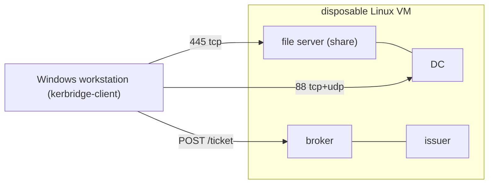

# Windows Kerberos test bench

How to safely run Kerberos experiments against a Windows client and a disposable
Samba realm. Distilled from the phase-5 and phase-5b spike setups so the bench
can be rebuilt without re-reading the retired work orders.

- **Needed again for** the open research items (Entra Cloud Kerberos tenants, a
  sync-connected tenant) and for developing the systray helper.
- **Findings this bench produced:**
  [`windows-kerberos-findings.md`](windows-kerberos-findings.md).



## Server side (disposable Linux VM)

1. **Disposable DC plus one file server**, on the pinned baseline, realm
   `EXAMPLE.SITE`. Directory state faithful to the sync model:
   - `kb1|` identity value
   - UAC 66048
   - user → global group → domain-local group chain
   - admission-group role marker

   ACL the share **only** through the domain-local group, so the nesting chain is
   actually under test.
2. **Host networking on the Linux VM; published ports are acceptable for local
   iteration.**
   - bind `88/tcp+udp`, `445/tcp` and the delivery/board ports directly
   - confirm with `ss -ltnu` that the DC owns 88 and the *member* owns 445

   <details>
   <summary>Why the publish path is no longer a suspect</summary>

   Docker Desktop's publish path was blamed for a wrong transport conclusion in
   phase 5, but 5b identified the real cause: a PAC-bearing TGS-REP simply
   exceeds the UDP reply limit, and `tcpsupported` is mandatory on any network.
   With the KDC reached over TCP the publish path can no longer mislead, so
   `deploy/`'s bridge-plus-published-ports shape is a legitimate development
   bench.

   </details>

3. **Run the broker and the issuer as two separately stoppable units.** A single
   shim that does both cannot distinguish "broker down" from "issuer down",
   which is a real client-visible distinction (503 vs connection-refused vs 500).
4. **Ticket delivery speaks the helper wire format** — `POST /ticket` →
   `{"principal","ccache_b64"}` — so `kerbridge-client` runs unmodified. Use a
   spike-only static token; never commit it.
5. **Switchable ticket policy**:
   - SHORT — ~10 min TGT / ~30 min renewable, to observe lifecycle transitions
     inside a session
   - DEFAULT — 10 h / 7 d, for confirmation runs

   The KDC's own caps are hour-granular (`kdc:user ticket lifetime`,
   `kdc:renewal lifetime`); a sub-hour window only comes from the *issuer*
   requesting `-l 10m -r 30m`.
6. **One-shot action scripts** for every state change under test, all timestamped
   in UTC:
   - disable and enable the user
   - rotate the password
   - remove and restore each membership layer
   - stop and start the DC, broker, and issuer
   - flush member caches
   - switch the ticket policy
   - dump the KDC log
7. **Auth audit on the DC** (`log level = 1 auth_audit:3`) — the only server-side
   record of AS exchanges.
8. **Packet capture from the start**, on both the DC (`port 88`) and the file
   server (`445`), rotating, for the whole session. Captures answered questions the
   client could not see; an ad-hoc capture window missed one. **Export the pcaps
   before teardown** — they die with the container.
9. **Clock**: NTP on the VM, verified well inside the 300 s Kerberos skew window
   before starting.
10. **Firewall**: allow the bench ports from the workstation address only. An
    exposed AS endpoint lets an attacker lock out the account, which also breaks
    issuance.

## Windows side, when the workstation is not disposable

A managed, Entra-joined workstation someone depends on is a valid and valuable
test target — 5b proved the client model on one — but:

- every step must be reversible
- **the rollback must be tested before the matrix starts, not after**

### Pre-flight, before changing anything

Record, and keep the output:

```
dsregcmd /status                  # AzureAdJoined, DomainJoined, PRT state
Get-CimInstance -ClassName Win32_DeviceGuard -Namespace root\Microsoft\Windows\DeviceGuard
Get-ItemProperty HKLM:\SYSTEM\CurrentControlSet\Control\Lsa   # RunAsPPL, LsaCfgFlags
klist                             # the user's EXISTING tickets - capture this
klist cloud_debug
winver
```

**Credential Guard and LSA protection are the primary risk.**

- If Credential Guard is running or `RunAsPPL` is set, `KerbSubmitTicketMessage`
  may be refused outright.
- If injection fails, that is **the headline result** — report it with the exact
  failure status.
- Do not disable those protections on a managed machine.
- 5b measured injection working under `RunAsPPL=2` + VBS with Credential Guard
  off.

### Configuration — batch it, it needs one reboot

```
ksetup /addkdc EXAMPLE.SITE dc1.example.site
ksetup /addhosttorealmmap dc1.example.site EXAMPLE.SITE
ksetup /addhosttorealmmap nas1.example.site EXAMPLE.SITE
ksetup /addrealmflags EXAMPLE.SITE tcpsupported     # applies live, mandatory
```

- Prefer real DNS, including `_kerberos._udp.<realm>` SRV, over `hosts` entries.
- Verify in the registry, not from `ksetup` output, which prints a misleading
  banner:
  - `HKLM\SYSTEM\CurrentControlSet\Control\Lsa\Kerberos\Domains\EXAMPLE.SITE`
  - `…\Kerberos\HostToRealm\EXAMPLE.SITE\SpnMappings`

Rollback — test it first, run it at the end:

```
ksetup /delkdc EXAMPLE.SITE dc1.example.site
ksetup /delhosttorealmmap dc1.example.site EXAMPLE.SITE
ksetup /delhosttorealmmap nas1.example.site EXAMPLE.SITE
# remove any hosts entries; reboot; re-run dsregcmd /status and klist
```

**`ksetup /delkdc` is not a safe probe.** Run against a realm that was never
added, it *creates* the realm key while failing to delete the host — it prints
`Failed /DelKdc : 0xc0000001 No match for <host>`, exits 0, and leaves a
`Kerberos\Domains\<REALM>` key behind (measured 2026-08-03 on Windows 11 25H2,
by using it as a dry run and finding the leftover realm afterwards). So it
cannot be used to check whether rollback is clean; it dirties what it is asked
about. Prefer `kerbridge --unenroll`, and if you do use `/delkdc`, check the
`Domains` list afterwards and delete any realm key it invented.

**`kerbridge --unenroll` is clean** — measured 2026-08-04 on Windows 11 25H2, by
reading the `Domains` list either side of it on a box that also held an
unrelated realm:

```
before   Domains = { OTHER.EXAMPLE, EXAMPLE.SITE }
         removed …\Kerberos\Domains\EXAMPLE.SITE
         removed …\Kerberos\HostToRealm\EXAMPLE.SITE
         "reboot required: Windows caches realm state at boot."   exit 0
after    Domains = { OTHER.EXAMPLE }, HostToRealm empty
```

It removed both of its own keys, left the unrelated realm untouched, and said
the reboot was needed rather than leaving the caller to discover it. Read the
`Domains` list either side rather than trusting the exit code — that is the only
check that would have caught the `/delkdc` bug above.

**With UAC disabled, `ShellExecuteEx "runas"` cannot elevate — and does not say
so.** The verb is serviced by the UAC elevation broker, and `EnableLUA=0` leaves
that broker inert: the call still succeeds, still returns a process handle, and
the process it returns is running on the caller's own unprivileged token. A
successful `ShellExecuteExW` is therefore not evidence that elevation happened.
Measured 2026-08-04, where it turned a self-relaunching one-shot into a fork bomb
(#11, fixed). Two consequences for anyone testing here:

- a bench machine with UAC off cannot exercise the elevation path at all, so it
  can neither reproduce a normal machine's behavior nor verify a fix for it;
- on such a machine, elevation comes only from an explicitly elevated shell
  (`runas /user:<admin> …`), which is a different mechanism and still works.

### Prohibited on a machine someone depends on

- **Blanket `klist purge`** — it has no realm filter and will delete the user's
  own Entra tickets. Use `KerbPurgeTicketCacheEx` scoped to the realm.
- **`klist get` / `KerbRetrieveTicket`** — a failed acquisition *destroys* the
  injected TGT (measured 2/2). A *successful* one is not safe either: fetching an
  `ldap/` ticket replaced a renewable injected TGT with a non-renewable one
  (2026-07-25) — while a real LDAP client doing the same bind left it untouched,
  and a `cifs/` fetch never provoked it. The damage tracks the caller, not the
  service. Two mechanisms, one rule — never use it as a probe.
- **`Restart-Service LanmanWorkstation` without warning the operator** — it drops
  every SMB session on the machine, including their own work. It is also the
  only known recovery from the stuck NTLM fallback, so it stays in the toolkit, gated on
  consent.

### Reading results

- `ACCESS_DENIED` is meaningless without the logon-session id — an elevated
  shell is a different LUID with a different ticket cache.
- An open SMB session masks Kerberos state; close sessions before testing
  authentication.
- Distinguish a live broker's 4xx (identity/authorization) from its 5xx
  (server-side outage) from a transport error (unreachable) — they are different
  client states.

### TLS failures

The client prints the certificate the host presented — subject, the names it
covers, issuer, validity — under any error where validation refused one, and
writes the same block to `%APPDATA%\KerBridge\kerbridge.log`. The OS supplies the
first line, and its wording is nothing like macOS'. Measured 2026-08-04 on
Windows 11 Pro 25H2 (26200.8875), SChannel through `schannel` 0.1.29:

| Fault | SChannel wording | os error |
|---|---|---|
| Untrusted root | A certificate chain processed, but terminated in a root certificate which is not trusted by the trust provider. | -2146762487 |
| Name mismatch | The certificate's CN name does not match the passed value. | -2146762481 |
| Expired | A required certificate is not within its validity period when verifying against the current system clock or the timestamp in the signed file. | -2146762495 |

**Addressing an HTTPS host by IP is not a trust-failure test.** An IP literal
sends no SNI, and what happens next belongs to the *listener*, not to the
address: one holding a single certificate serves it regardless, while one with no
default aborts the handshake *before* a certificate exists — `SEC_E_INTERNAL_ERROR`,
os error -2146893052, nothing to report and nothing wrong with any certificate.
Both were observed on the same bench host the same day, on different ports, so
the outcome is not something addressing by IP lets you choose. The abort looks
exactly like the client failing to read a certificate it should have. To get a
real name mismatch, keep a name in the URL and point that name at the address
(resolve `wrong.example.site` to `192.0.2.10`) rather than putting the address in
the URL.
